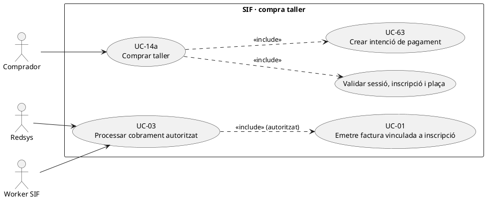
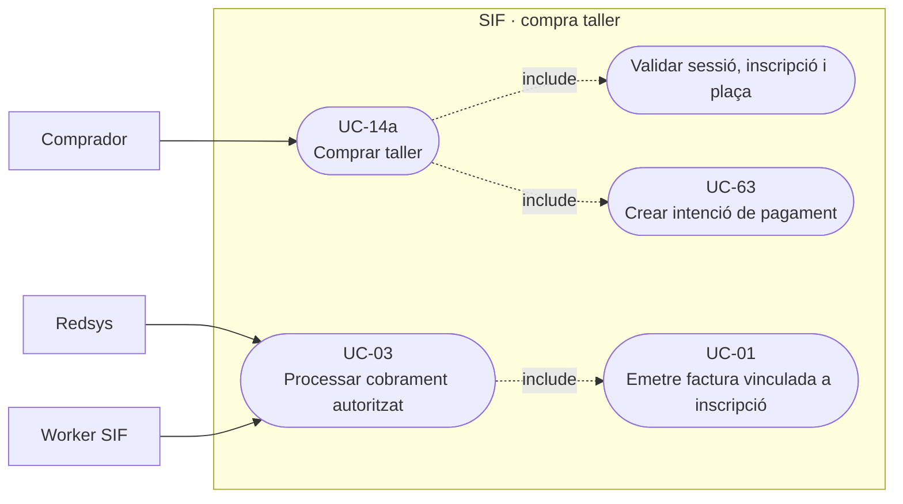
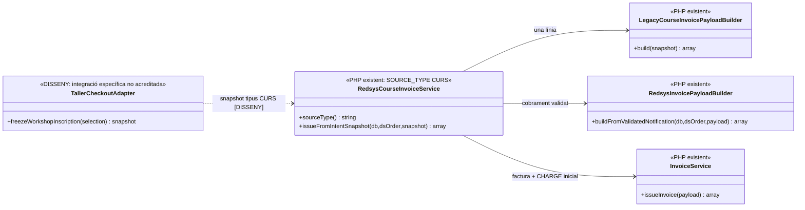
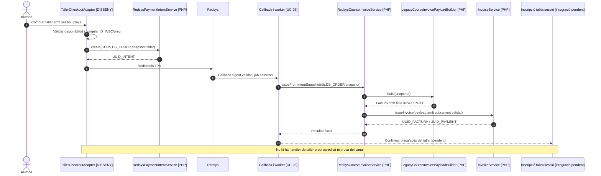

# UC-14a · Comprar un taller

**Àmbit:** compra d'una inscripció a un **taller**, identificada al catàleg com a variant de la compra de curs UC-14, amb **prova específica pendent**. El document de fluxos especifica literalment «**1 línia = 1 curs / taller / jornada**», `SOURCE_TYPE=INSCRIPCIO` i `SOURCE_ID=inscripcions.ID`. No consta als serveis PHP inspeccionats un handler `TALLER` diferenciat: `RedsysCourseInvoiceService::sourceType()` retorna `CURS`. **Només pot documentar-se com a implementada la ruta compartida quan el canal aporta correctament el taller al snapshot de curs; no es presumeix integració específica del taller.**

## 1. Fitxa funcional específica

| Camp | Dades i criteri |
| --- | --- |
| Actors | Alumne/comprador a l'ecommerce; Redsys; worker de callback. El receptor fiscal pot diferir del participant quan es classifiqui una compra per empresa. |
| Producte | Inscripció `inscripcions.ID`, identificador `ANY`, `MES`, `CURS` de l'activitat llegada i `NOM_CURS`, `DATAI`, `DATAF`, `HORES` a `curs`. **El codi consultat no conté un `ID_TALLER` fiscal separat** i no permet deduir que tots els tallers estiguin a la mateixa taula. |
| Validacions comercials de taller | Comprovar taller seleccionat, edició/sessió real i, quan hi hagi límits, disponibilitat/places **en el canal corresponent**. Les regles de sessió, capacitat, política de baixa i accés específiques de taller **no consten en el builder fiscal**: són decisions/integradors pendents. |
| Import | El snapshot congela import real del TPV, preu base i descompte explícit quan n'hi ha. Un taller no pot reclassificar-se automàticament com a pack o grup per l'aparença del títol. |
| Factura | `LegacyCourseInvoicePayloadBuilder::build()` crea factura de curs amb **una línia per inscripció**, `source_type=INSCRIPCIO` i `source_id=ID`, detall de convocatòria i `fact_rels` de l'inscrit. El concepte és «Curs ...» si el codi `CURS` només conté lletres, en cas contrari és el títol: **no està garantida una etiqueta «Taller» a la factura**. |
| Pagament real | UC-63 crea intenció `SOURCE_TYPE=CURS` en la ruta compartida que existeix; UC-03 valida callback i el worker invoca `RedsysCourseInvoiceService`, que incorpora el cobrament validat al payload i emet la factura per `InvoiceService`. La idoneïtat del routing per cada taller necessita prova de canal. |
| Traça per inscripció | Una compra de taller amb un `CHARGE` real només s'atribueix a la seva inscripció; un descompte no és sortida de diners. El ledger individual objectiu continua pendent d'implementar. |

### 1.1. Flux principal i frontera d'implementació

1. El comprador selecciona **el taller i la sessió/edició real**, i aporta dades d'inscripció i receptor fiscal; el canal valida la plaça i congela `ID_INSC`, `ANY`, `MES`, `CURS`, títol, import i descompte. **No s'ha verificat el codi de reserva/validació de tallers del frontend actual.**
2. El canal crea una intenció UC-63 del tipus `CURS` **només si aquest és l'adaptador comercial validat per al taller**; crear una intenció no emet factura ni implica cobrament.
3. Redsys comunica la resposta signada; UC-03 valida `DS_ORDER`/import/terminal/divisa, conserva notificació i encua job si el cobrament és autoritzat.
4. `RedsysCourseInvoiceService::issueFromIntentSnapshot()` pren el snapshot de l'operació, delega a `LegacyCourseInvoicePayloadBuilder`, incorpora la notificació validada amb `RedsysInvoicePayloadBuilder` i crida `InvoiceService::issueInvoice()`. El codi no discrimina taller vs curs en aquest mètode.
5. Un cop confirmats factura i `UUID_PAYMENT`, el canal acadèmic confirma **la inscripció de taller/sessió** i en conserva la correlació. **Aquesta sincronització i concessió d'accés a un taller no estan acreditades pel builder.**
6. El ledger objectiu atribueix l'import real del `UUID_PAYMENT` a `ID_INSC`; el treballador asíncron/idempotència no ha de concedir dues places o crear dos moviments monetaris per un callback repetit.

### 1.2. Alternatives pròpies del taller pendents de validar

| Situació | Tractament |
| --- | --- |
| Taller amb sessió/plaça esgotada quan arriba callback tardà | No concedir plaça fictícia; cal contracte de reserva i incidència/reprogramació/retorn, **no implementat en el servei fiscal**. |
| Taller amb més d'una sessió | Definir si una inscripció representa totes les sessions o una sessió concreta; `CURS`/`DATAI` per si sols no acrediten aquesta regla. |
| Taller comprat junt amb altres activitats | El catàleg preveu 1 línia per activitat; la construcció d'una factura de diverses inscripcions s'ha de classificar per UC-88, no atribuir-la automàticament al builder de curs d'una línia. |
| Descompte del taller | Congelar origen, regla, import i text visible; no reconstruir un percentatge a partir d'una nova oferta després del TPV. |
| Canvi o anul·lació del taller | UC-71/72 classifica inscripció, valor atribuït i rectificació/retorn, mantenint factura original immutable. |
| Codificació `CURS` que dona concepte «Curs» per un taller | Revisar títol/concepte abans de l'emissió, **sense modificar el document després**: és un risc concret del builder compartit. |

**Proves pendents:** routing real taller→`CURS`, identificador/edició/sessió, quota/places, títol fiscal exacte, un sol cobrament i atribució per `ID_INSC`, duplicat de callback, canvi/baixa i document per al receptor.

## 2. UML de casos d'ús

### Vista de casos d’ús per a GitHub (Mermaid)

## 3. Classes de la ruta compartida existent i reserva pendent

## 4. Seqüència de compra (canal de taller OBJECTIU, nucli SIF existent)

## 5. Traçabilitat

[UC-14a original](../06-fitxes-funcionals/uc-014a.md) · [UC-14 curs](uc-014-comprar-curs-redsys.md) · [UC-63 intenció](uc-063-crear-intencio-redsys.md) · [UC-71 canvi](uc-071-registrar-canvi-curs-complet.md) · [Fluxos «1 línia = 1 curs/taller/jornada»](../03-canvis-pendents/04-fluxos-facturacio.md) · [RedsysCourseInvoiceService](../../sif/src/Service/RedsysCourseInvoiceService.php) · [LegacyCourseInvoicePayloadBuilder](../../sif/src/Service/LegacyCourseInvoicePayloadBuilder.php) · [Model de fons](00-revisio-moviments-inscripcions.md).
