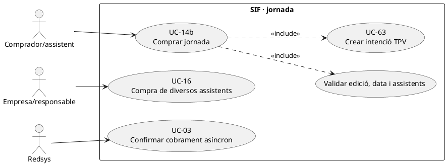
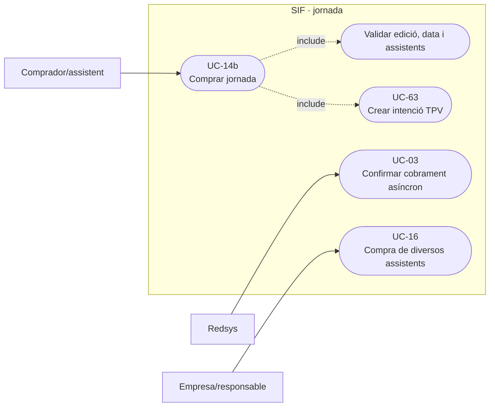
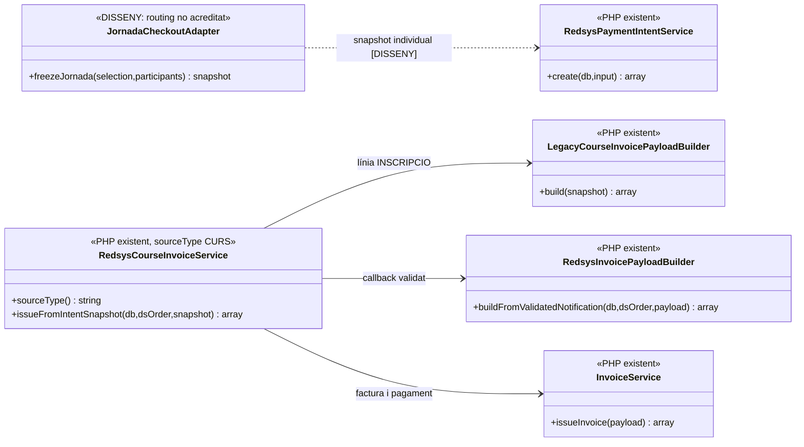
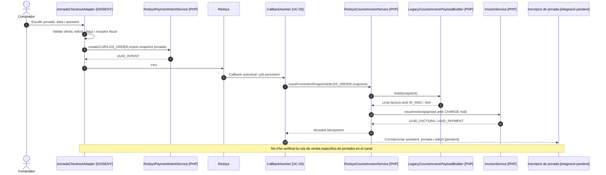

# UC-14b · Comprar una jornada

**Objectiu del catàleg:** venda i facturació de la inscripció a una **jornada**, documentada com a variant de UC-14 amb **prova específica pendent**. El document de fluxos estableix «**1 línia = 1 curs / taller / jornada**» i que la línia ha de vincular-se a `inscripcions.ID`. **Estat contrastat:** hi ha `RedsysCourseInvoiceService` per `SOURCE_TYPE=CURS` i `LegacyCourseInvoicePayloadBuilder` per un snapshot amb curs, edició i inscripció. **No consta en les peces inspeccionades un handler SIF amb `SOURCE_TYPE=JORNADA` ni el routing comercial de la jornada**, de manera que el flux actual és compartit només si el canal l'ha integrat expressament.

## 1. Fitxa de la jornada

| Aspecte | Regla |
| --- | --- |
| Actors | Participant/comprador de la jornada, Redsys, worker asíncron i, si paga un centre per diverses persones, responsable del grup amb tractament UC-16. |
| Unitat de servei | Una inscripció `ID_INSC` a una edició concreta de jornada; el snapshot del constructor de curs usa `ANY`, `MES`, `CURS` de la inscripció i `NOM_CURS`, `DATAI`, `DATAF`, `HORES` de `curs`. La documentació **no fixa** si les jornades estan codificades totes amb aquest esquema o també en un catàleg específic. |
| Abans de pagar | Verificar identitat de jornada, data/edició i eventual aforament/assistents, dades fiscals, preu i descomptes. La venda de **múltiples participants o activitats en un sol pagament** s'ha de tractar com a grup/multiconcepte, no es pot representar automàticament amb una sola línia de curs. |
| Factura | Per una inscripció simple, el constructor compartit crea una línia `INSCRIPCIO` amb títol/concepte, detall de convocatòria, preu unitari, base/descompte/total congelats i `fact_rels` a `ID_INSC`. Si `CURS` només conté lletres el concepte pren el prefix literal «Curs »: **aquest text pot ser inadequat per a una jornada** i s'ha de revisar abans d'emetre. |
| Pagament | Una intenció de compra no equival a cobrament; UC-03 processa una notificació signada, el worker invoca el handler `CURS` quan l'adaptador de jornada ho ha configurat i `InvoiceService` crea/reutilitza factura i pagament real. |
| Resultat acadèmic | El registre fiscal no demostra assistència, reserva de plaça, inscripció d'acompanyants, certificats o dret d'accés. **No s'ha acreditat el pas final del canal jornada cap al llegat**. |
| Import atribuït | Un `UUID_PAYMENT` real per pagament bancari; si inclou una sola inscripció, l'import cobrat li correspon; si inclou N assistents, fan falta imports individuals per `ID_INSC` i cap cobrament extern duplicat. |

### 1.1. Flux principal objectiu amb nucli PHP verificat

1. El comprador tria **jornada i edició/data**, indica qui hi assistirà i qui n'és receptor fiscal. El canal comprova que la jornada encara admet la compra i congela el seu identificador d'inscripció i el preu acceptat. Les regles particulars d'aforament i inscripció de jornades **no han aparegut al constructor fiscal**.
2. Per a **una inscripció individual** que el canal representa com a curs, prepara `redsys_payment_intent.SOURCE_TYPE=CURS` (UC-63) amb `DS_ORDER`, total i snapshot de la jornada; si el producte real exigeix una estructura distinta, el routing s'ha de classificar abans de codificar-lo.
3. Redsys comunica callback; UC-03 comprova intenció i import i el worker reclama un job. Una compra denegada no genera factura ni `CHARGE`.
4. `RedsysCourseInvoiceService::issueFromIntentSnapshot()` invoca `LegacyCourseInvoicePayloadBuilder::build()`, incorpora el cobrament notificat amb `RedsysInvoicePayloadBuilder` i emet/reutilitza per `InvoiceService`.
5. La factura conserva **una línia amb `SOURCE_TYPE=INSCRIPCIO`** i identifica el servei sense tornar a llegir preus comercials canviants. Cal revisar el concepte fiscal «Curs ...» si el producte real és una jornada abans que s'emeti, no corregir text fiscal original amb UPDATE posterior.
6. El canal confirma la inscripció a la jornada/edició, registra correlació amb el pagament i el ledger individual objectiu, i notifica les dades d'accés només quan l'alta acadèmica és efectiva. **Aquests passos acadèmics finals no estan acreditats per `InvoiceService`.**

### 1.2. Variants i proves diferents d'una compra de curs genèrica

| Cas | Regla |
| --- | --- |
| Jornada d'un dia amb codi de curs alfabètic | El builder fiscal prefixa «Curs» al concepte: comprovar la denominació real del servei/edició abans d'emetre. |
| Jornada amb diverses sessions en dies diferents | Identificar si és una sola inscripció/servei o diferents activitats; `DATAI`/`DATAF` no determinen per si soles la política d'inscripció. |
| Una empresa paga la jornada de diversos docents | UC-16 grup: factura a receptor autoritzat, N línies/inscripcions i una entrada bancària real; no usar a cegues el handler de curs d'una línia. |
| Una persona compra diversos tallers/jornades | UC-88 multiconcepte ha de decidir línies i relacions; no forçar un `ID_INSC` inventat que amagui la resta d'activitats. |
| Callback tardà després de tancar inscripcions a jornada | Encaminament a incidència/comprovació de plaça; el handler fiscal **no** comprova per si mateix l'aforament abans d'emetre. |
| Cancel·lació de jornada o substitució d'edició | UC-71/72 valora servei, data, import atribuït i eventual rectificació/retorn; no editar la factura inicial. |

**Proves pendents:** identificar el canal i esquema de la jornada, document de factura amb concepte exacte, compra individual i d'empresa, dies/sessions, aforament, callback repetit/tardà i saldo per inscripció. Cap prova de jornada específica s'ha executat en aquesta revisió.

## 2. Diagrama UML de casos d'ús

### Vista de casos d’ús per a GitHub (Mermaid)

## 3. Classes del nucli existent i encaminament pendent

## 4. Seqüència — jornada individual per ruta compartida

## 5. Traçabilitat

[UC-14b original](../06-fitxes-funcionals/uc-014b.md) · [UC-14a taller](uc-014a-comprar-taller.md) · [UC-14 curs](uc-014-comprar-curs-redsys.md) · [UC-16 grup](uc-016-facturar-grup.md) · [UC-88 multiconcepte original](../06-fitxes-funcionals/uc-088.md) · [Flux de facturació de jornada](../03-canvis-pendents/04-fluxos-facturacio.md) · [RedsysCourseInvoiceService](../../sif/src/Service/RedsysCourseInvoiceService.php) · [LegacyCourseInvoicePayloadBuilder](../../sif/src/Service/LegacyCourseInvoicePayloadBuilder.php) · [Traça de fons per inscripció](00-revisio-moviments-inscripcions.md).
