# UC-015 · Activitats per pàgina i apartat ACTUAL / FINAL

**Data d'auditoria:** 2026-09-29  
**Objectiu:** cobrir RM-037 per a les pantalles i processos implicats en la compra d'un pack.

## Inventari

| ID | Pantalla / procés | ACTUAL | FINAL |
|---|---|---|---|
| PK-A01 | Llistat de packs | codi legacy | conservar catàleg, sense efecte fiscal |
| PK-A02 | Fitxa de pack | codi legacy | oferta versionada |
| PK-A03 | Formulari inscripció | codi legacy | backend autoritatiu |
| PK-A04 | Alta N inscripcions | codi legacy | operació comercial + snapshot |
| PK-A05 | Creació URL/intenció | URL legacy | intenció SIF |
| PK-A06 | Callback Redsys | callback legacy | callback SIF |
| PK-A07 | Factura pack | factura legacy | InvoiceService |
| PK-A08 | Distribució per inscripció | UPDATE camps legacy | ledger |
| PK-A09 | Confirmació/correu | enviament directe | outbox |
| PK-A10 | Variant fraccionada | exposada al web | només circuit autoritzat |

## PK-A01 · Llistat de packs

### ACTUAL
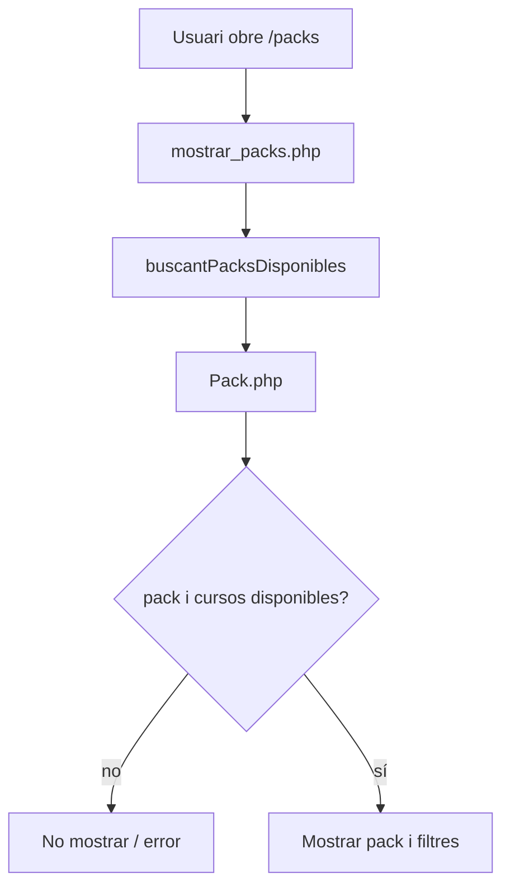
```mermaid
flowchart TD
A[Usuari obre /packs] --> B[mostrar_packs.php]
B --> C[buscantPacksDisponibles]
C --> D[Pack.php]
D --> E{pack i cursos disponibles?}
E -- no --> F[No mostrar / error]
E -- sí --> G[Mostrar pack i filtres]
```

### FINAL
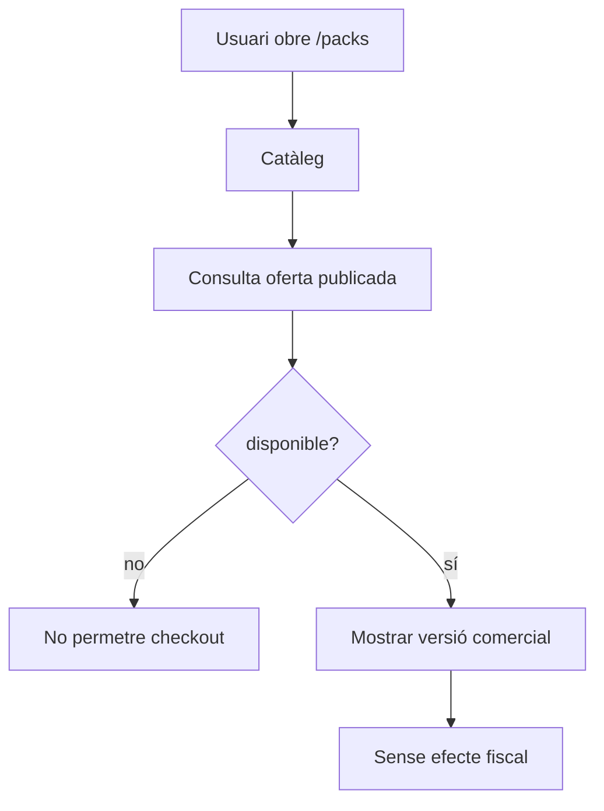
```mermaid
flowchart TD
A[Usuari obre /packs] --> B[Catàleg]
B --> C[Consulta oferta publicada]
C --> D{disponible?}
D -- no --> E[No permetre checkout]
D -- sí --> F[Mostrar versió comercial]
F --> G[Sense efecte fiscal]
```

## PK-A02 · Fitxa del pack

### ACTUAL
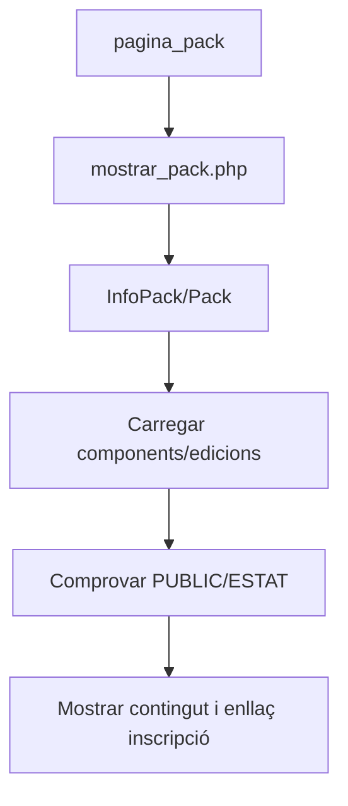
```mermaid
flowchart TD
A[pagina_pack] --> B[mostrar_pack.php]
B --> C[InfoPack/Pack]
C --> D[Carregar components/edicions]
D --> E[Comprovar PUBLIC/ESTAT]
E --> F[Mostrar contingut i enllaç inscripció]
```

### FINAL
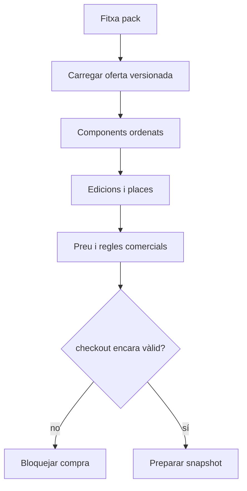
```mermaid
flowchart TD
A[Fitxa pack] --> B[Carregar oferta versionada]
B --> C[Components ordenats]
C --> D[Edicions i places]
D --> E[Preu i regles comercials]
E --> F{checkout encara vàlid?}
F -- no --> G[Bloquejar compra]
F -- sí --> H[Preparar snapshot]
```

## PK-A03 · Formulari d'inscripció

### ACTUAL
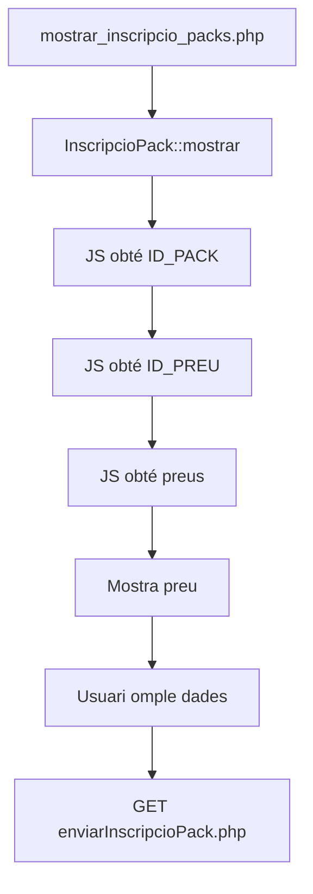
```mermaid
flowchart TD
A[mostrar_inscripcio_packs.php] --> B[InscripcioPack::mostrar]
B --> C[JS obté ID_PACK]
C --> D[JS obté ID_PREU]
D --> E[JS obté preus]
E --> F[Mostra preu]
F --> G[Usuari omple dades]
G --> H[GET enviarInscripcioPack.php]
```

### FINAL
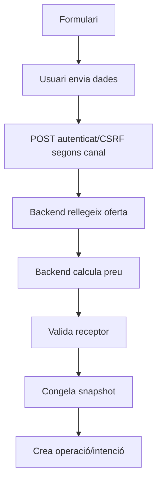
```mermaid
flowchart TD
A[Formulari] --> B[Usuari envia dades]
B --> C[POST autenticat/CSRF segons canal]
C --> D[Backend rellegeix oferta]
D --> E[Backend calcula preu]
E --> F[Valida receptor]
F --> G[Congela snapshot]
G --> H[Crea operació/intenció]
```

## PK-A04 · Alta de components

### ACTUAL
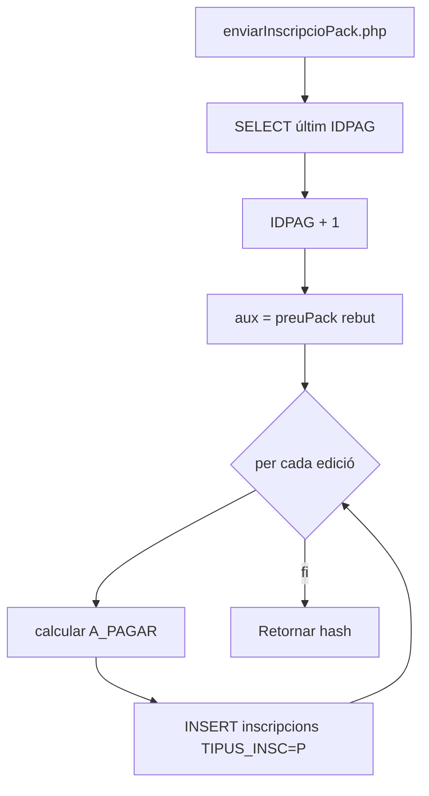
```mermaid
flowchart TD
A[enviarInscripcioPack.php] --> B[SELECT últim IDPAG]
B --> C[IDPAG + 1]
C --> D[aux = preuPack rebut]
D --> E{per cada edició}
E --> F[calcular A_PAGAR]
F --> G[INSERT inscripcions TIPUS_INSC=P]
G --> E
E -->|fi| H[Retornar hash]
```

### FINAL
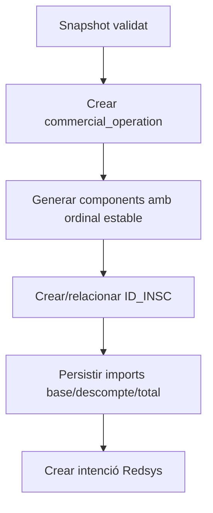
```mermaid
flowchart TD
A[Snapshot validat] --> B[Crear commercial_operation]
B --> C[Generar components amb ordinal estable]
C --> D[Crear/relacionar ID_INSC]
D --> E[Persistir imports base/descompte/total]
E --> F[Crear intenció Redsys]
```

## PK-A05 · Intenció de pagament

### ACTUAL
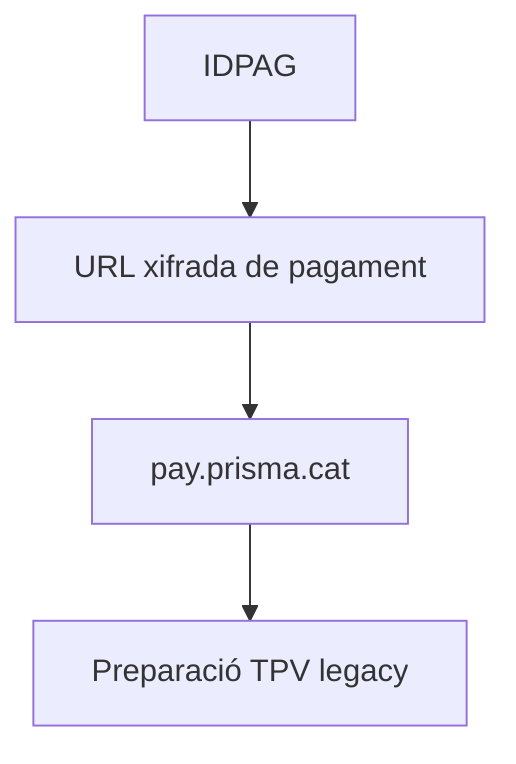
```mermaid
flowchart TD
A[IDPAG] --> B[URL xifrada de pagament]
B --> C[pay.prisma.cat]
C --> D[Preparació TPV legacy]
```

### FINAL
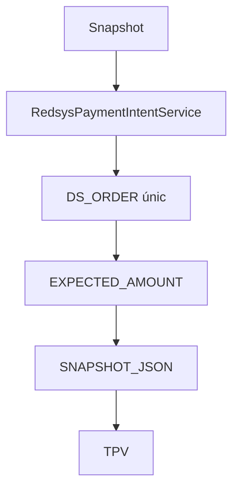
```mermaid
flowchart TD
A[Snapshot] --> B[RedsysPaymentIntentService]
B --> C[DS_ORDER únic]
C --> D[EXPECTED_AMOUNT]
D --> E[SNAPSHOT_JSON]
E --> F[TPV]
```

## PK-A06 · Callback

### ACTUAL
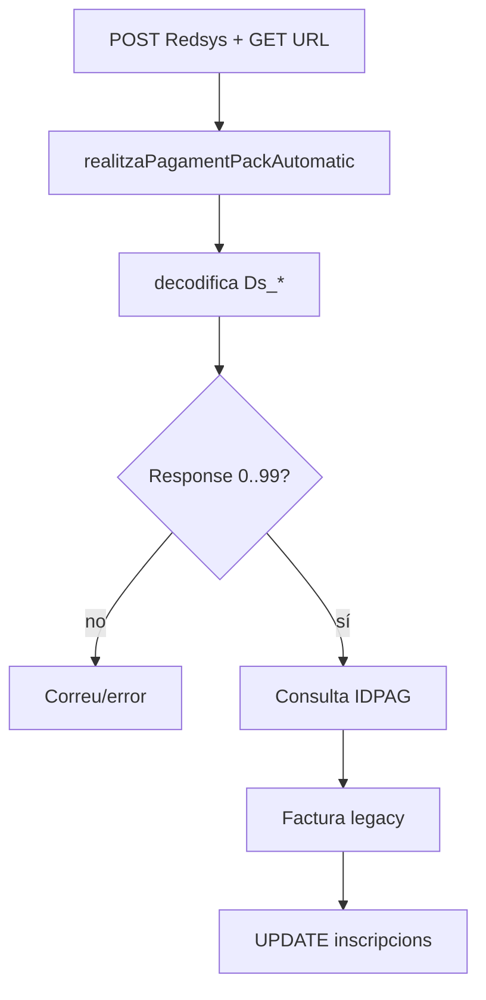
```mermaid
flowchart TD
A[POST Redsys + GET URL] --> B[realitzaPagamentPackAutomatic]
B --> C[decodifica Ds_*]
C --> D{Response 0..99?}
D -- no --> E[Correu/error]
D -- sí --> F[Consulta IDPAG]
F --> G[Factura legacy]
G --> H[UPDATE inscripcions]
```

### FINAL
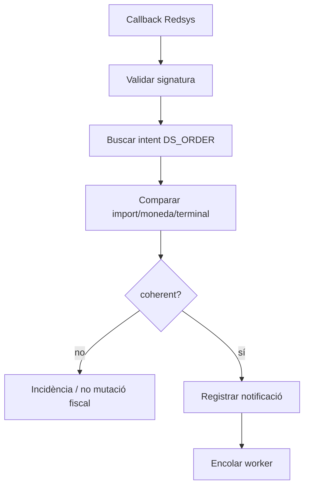
```mermaid
flowchart TD
A[Callback Redsys] --> B[Validar signatura]
B --> C[Buscar intent DS_ORDER]
C --> D[Comparar import/moneda/terminal]
D --> E{coherent?}
E -- no --> F[Incidència / no mutació fiscal]
E -- sí --> G[Registrar notificació]
G --> H[Encolar worker]
```

## PK-A07 · Emissió factura

### ACTUAL
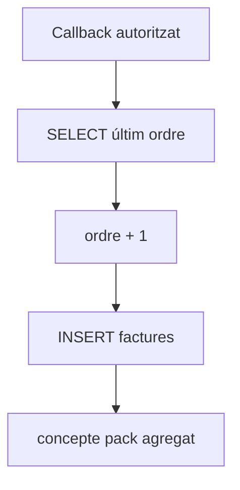
```mermaid
flowchart TD
A[Callback autoritzat] --> B[SELECT últim ordre]
B --> C[ordre + 1]
C --> D[INSERT factures]
D --> E[concepte pack agregat]
```

### FINAL
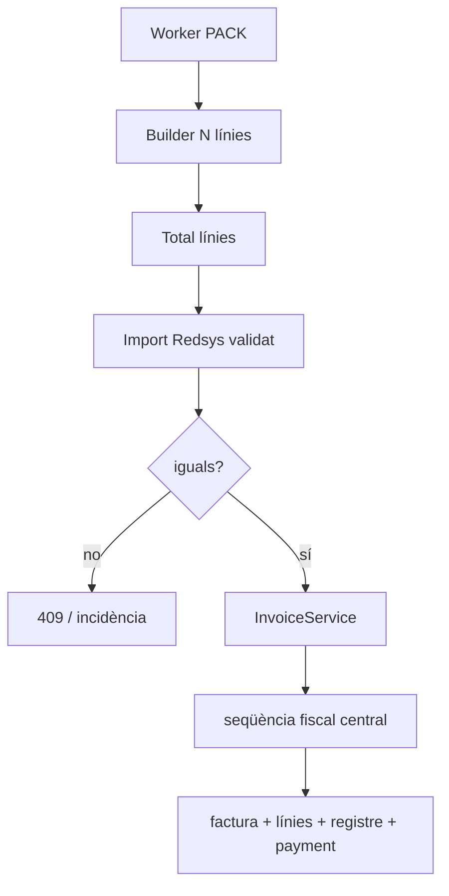
```mermaid
flowchart TD
A[Worker PACK] --> B[Builder N línies]
B --> C[Total línies]
C --> D[Import Redsys validat]
D --> E{iguals?}
E -- no --> F[409 / incidència]
E -- sí --> G[InvoiceService]
G --> H[seqüència fiscal central]
H --> I[factura + línies + registre + payment]
```

## PK-A08 · Distribució monetària

### ACTUAL
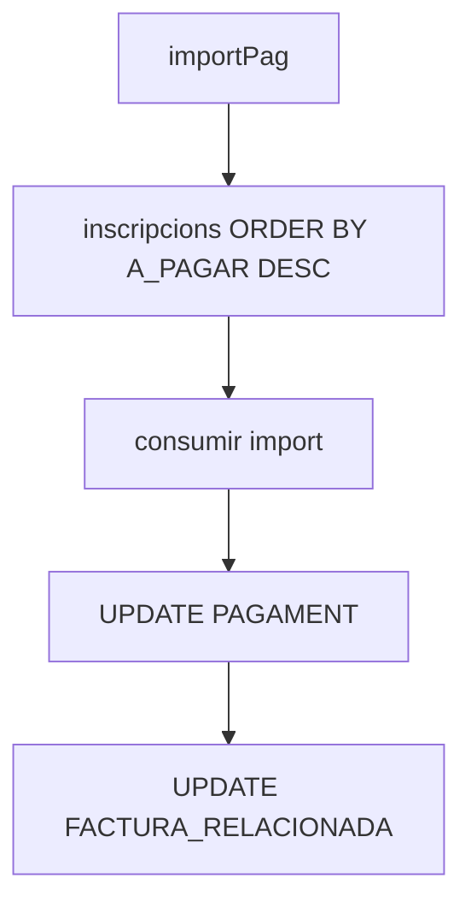
```mermaid
flowchart TD
A[importPag] --> B[inscripcions ORDER BY A_PAGAR DESC]
B --> C[consumir import]
C --> D[UPDATE PAGAMENT]
D --> E[UPDATE FACTURA_RELACIONADA]
```

### FINAL
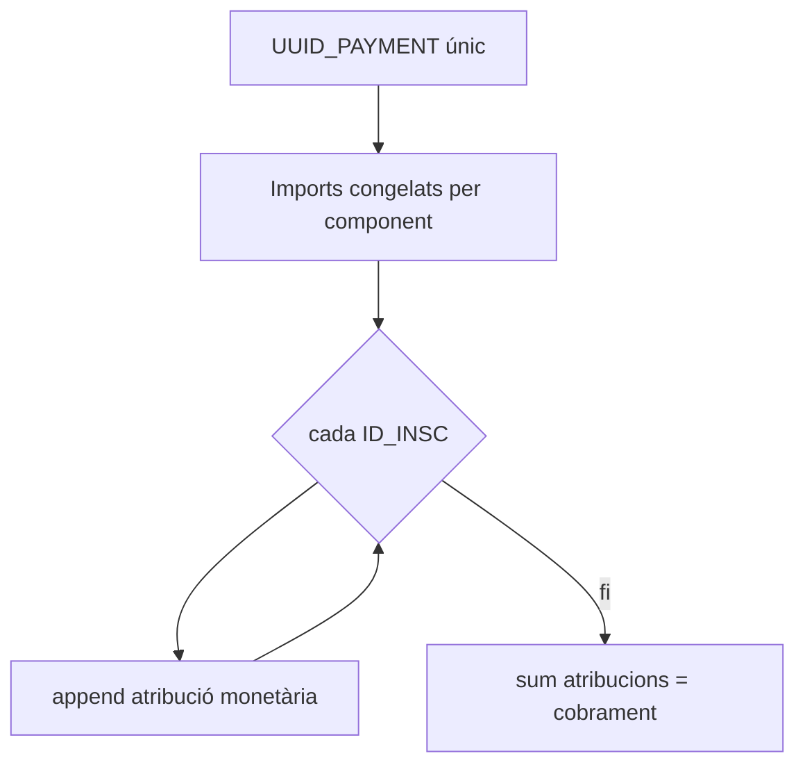
```mermaid
flowchart TD
A[UUID_PAYMENT únic] --> B[Imports congelats per component]
B --> C{cada ID_INSC}
C --> D[append atribució monetària]
D --> C
C -->|fi| E[sum atribucions = cobrament]
```

## PK-A09 · Notificacions

### ACTUAL
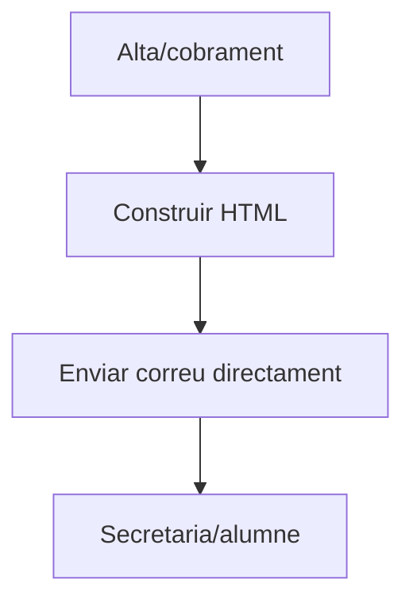
```mermaid
flowchart TD
A[Alta/cobrament] --> B[Construir HTML]
B --> C[Enviar correu directament]
C --> D[Secretaria/alumne]
```

### FINAL
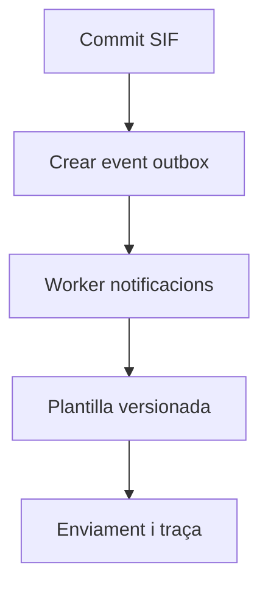
```mermaid
flowchart TD
A[Commit SIF] --> B[Crear event outbox]
B --> C[Worker notificacions]
C --> D[Plantilla versionada]
D --> E[Enviament i traça]
```

## PK-A10 · Fraccionament

### ACTUAL
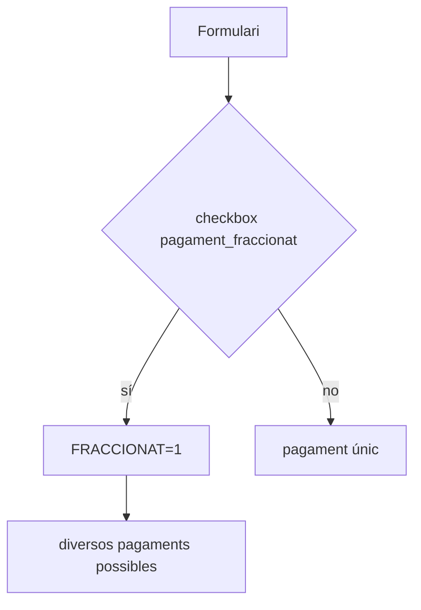
```mermaid
flowchart TD
A[Formulari] --> B{checkbox pagament_fraccionat}
B -- sí --> C[FRACCIONAT=1]
C --> D[diversos pagaments possibles]
B -- no --> E[pagament únic]
```

### FINAL
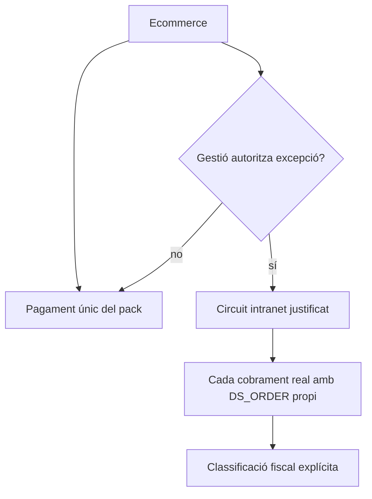
```mermaid
flowchart TD
A[Ecommerce] --> B[Pagament únic del pack]
A --> C{Gestió autoritza excepció?}
C -- no --> B
C -- sí --> D[Circuit intranet justificat]
D --> E[Cada cobrament real amb DS_ORDER propi]
E --> F[Classificació fiscal explícita]
```

## Criteri de tancament RM-037 per UC-015

No declarar UC-015 tancat fins que:
1. els deu blocs anteriors tinguin correspondència codi → UC → prova;
2. el checkout web utilitzi snapshot backend;
3. el callback legacy deixi d'emetre factura;
4. el ledger per ID_INSC estigui implementat o hi hagi decisió formal alternativa;
5. les proves PK-01..PK-11 s'hagin executat amb evidència.
