# UC-015 · Activitats per pàgina i apartat ACTUAL / FINAL

**Data d'auditoria:** 2026-09-29 · **Revalidació final:** 2026-10-02  
**Objectiu:** cobrir RM-037 per a les pantalles i processos implicats en la compra d'un pack.

## Inventari

| ID | Pantalla / procés | ACTUAL | FINAL |
|---|---|---|---|
| PK-A01 | Llistat de packs | filtre d'edició + tots els components oberts | conservar catàleg, sense efecte fiscal |
| PK-A02 | Fitxa de pack | valida totes les edicions obertes | oferta versionada |
| PK-A03 | Formulari inscripció | **POST + `PublicWebMutationAuthorization` (`WEB_ALLOWED_ORIGINS`, X-Requested-With) + Sec-Fetch-Site + REQUEST_ID + revalidació de totes les edicions** | acceptació E2E/replay navegador-preproducció |
| PK-A04 | Alta N inscripcions | snapshot + transacció atòmica + suma exacta + replay idempotent + ordre v1 `DATAI, ID_CURS` implementats | evolució a posició manual/versionada només si negoci ho demana |
| PK-A05 | Creació URL/intenció | **intenció SIF implementada per PACK** | verificador CLI preparat; falta DS_ORDER real |
| PK-A06 | Callback Redsys | **callback SIF únic autoritatiu; callbacks productius legacy eliminats** | preflight/preview/process/verifier preparats; falta execució real |
| PK-A07 | Factura pack | **InvoiceService al flux SIF; callbacks productius d'emissió PACK legacy eliminats** | evidència runtime |
| PK-A08 | Distribució per inscripció | **ledger implementat** | evidència runtime |
| PK-A09 | Confirmació/correu | **enqueue de confirmació a outbox SIF implementat; correu inicial d'alta encara directe al web legacy** | lliurament/retries de l'outbox = UC-58; migració del correu inicial és millora separada |
| PK-A10 | Variant fraccionada | ecommerce PACK força pagament complet | excepció només intranet/reconciliació |

## PK-A01 · Llistat de packs

### ACTUAL
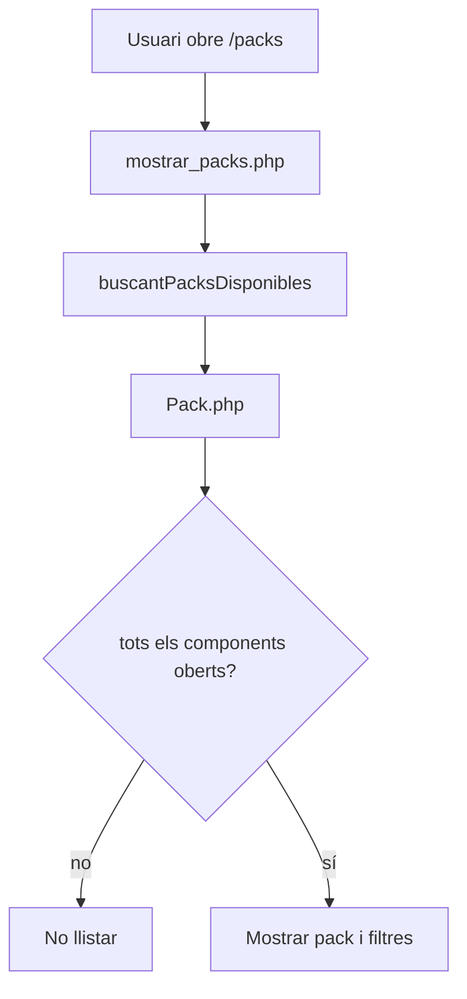
```mermaid
flowchart TD
A[Usuari obre /packs] --> B[mostrar_packs.php]
B --> C[buscantPacksDisponibles]
C --> D[Pack.php]
D --> E{tots els components oberts?}
E -- no --> F[No llistar]
E -- sí --> G[Mostrar pack i filtres]
```

### FINAL
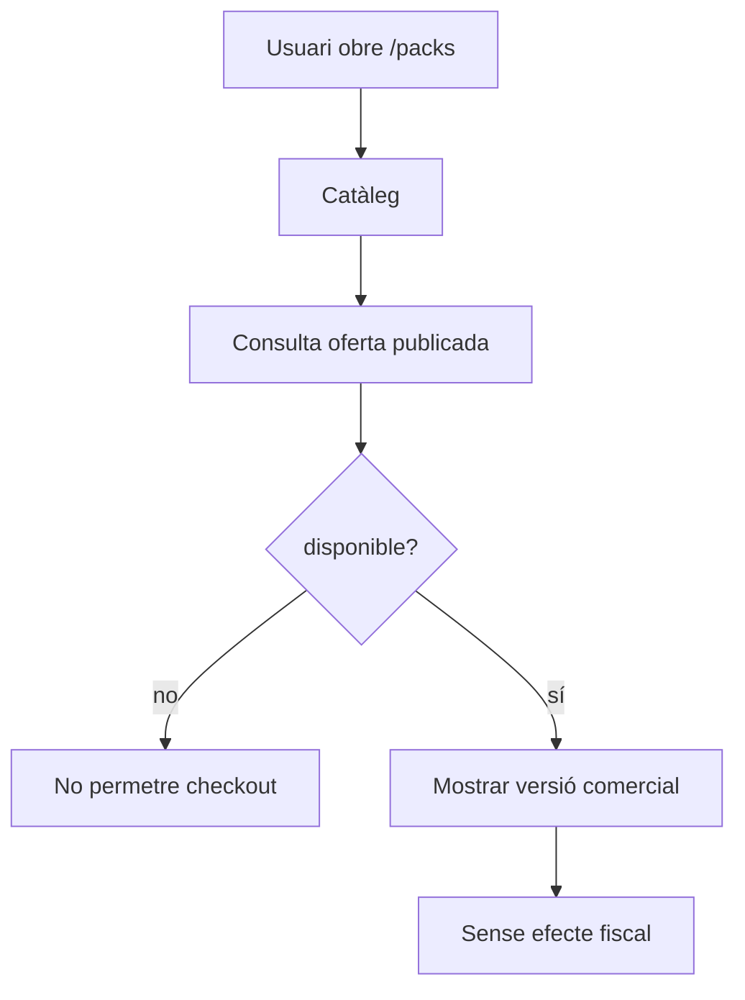
```mermaid
flowchart TD
A[Usuari obre /packs] --> B[Catàleg]
B --> C[Consulta oferta publicada]
C --> D{disponible?}
D -- no --> E[No permetre checkout]
D -- sí --> F[Mostrar versió comercial]
F --> G[Sense efecte fiscal]
```

## PK-A02 · Fitxa del pack

### ACTUAL
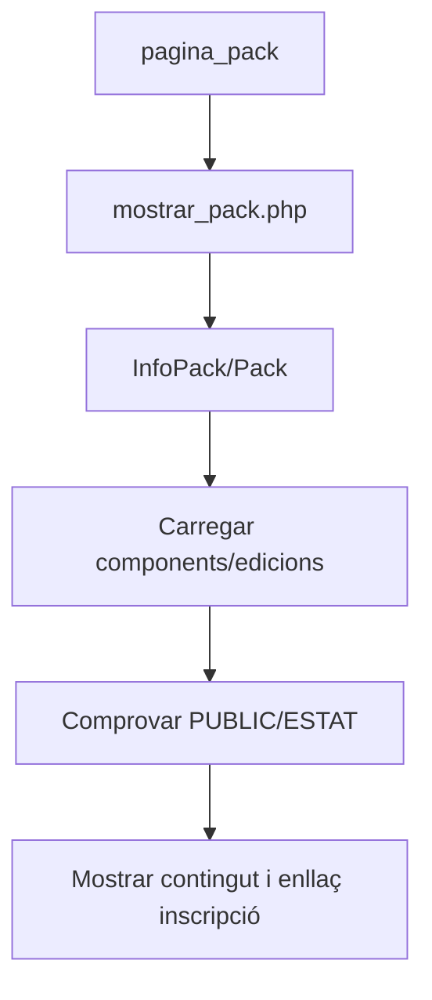
```mermaid
flowchart TD
A[pagina_pack] --> B[mostrar_pack.php]
B --> C[InfoPack/Pack]
C --> D[Carregar components/edicions]
D --> E[Comprovar PUBLIC/ESTAT]
E --> F[Mostrar contingut i enllaç inscripció]
```

### FINAL
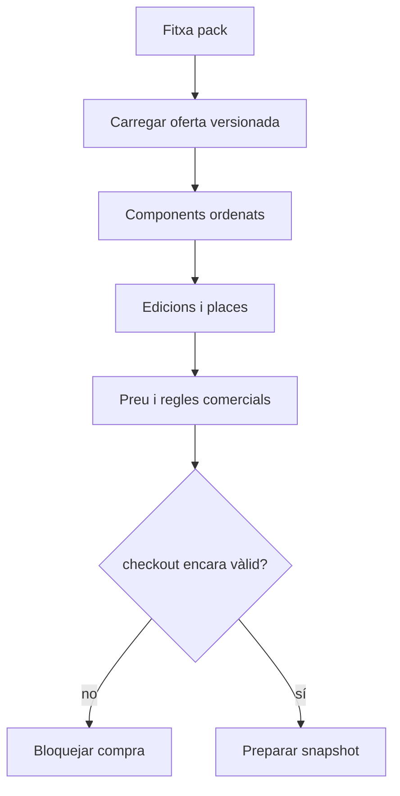
```mermaid
flowchart TD
A[Fitxa pack] --> B[Carregar oferta versionada]
B --> C[Components ordenats]
C --> D[Edicions i places]
D --> E[Preu i regles comercials]
E --> F{checkout encara vàlid?}
F -- no --> G[Bloquejar compra]
F -- sí --> H[Preparar snapshot]
```

## PK-A03 · Formulari d'inscripció

### ACTUAL
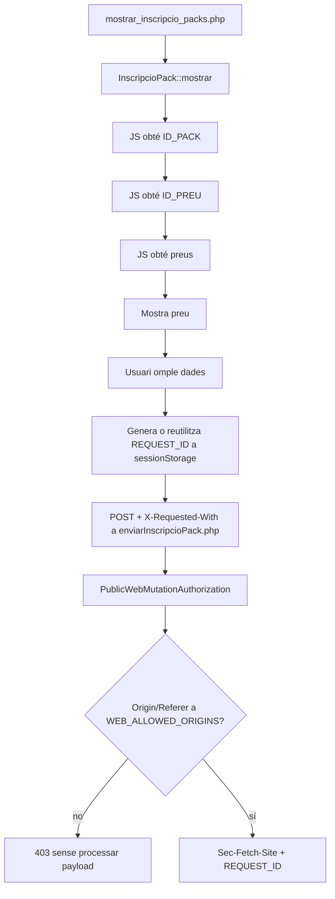
```mermaid
flowchart TD
A[mostrar_inscripcio_packs.php] --> B[InscripcioPack::mostrar]
B --> C[JS obté ID_PACK]
C --> D[JS obté ID_PREU]
D --> E[JS obté preus]
E --> F[Mostra preu]
F --> G[Usuari omple dades]
G --> H[Genera o reutilitza REQUEST_ID a sessionStorage]
H --> I[POST + X-Requested-With a enviarInscripcioPack.php]
I --> J[PublicWebMutationAuthorization]
J --> K{Origin/Referer a WEB_ALLOWED_ORIGINS?}
K -- no --> L[403 sense processar payload]
K -- sí --> M[Sec-Fetch-Site + REQUEST_ID]
```

### FINAL
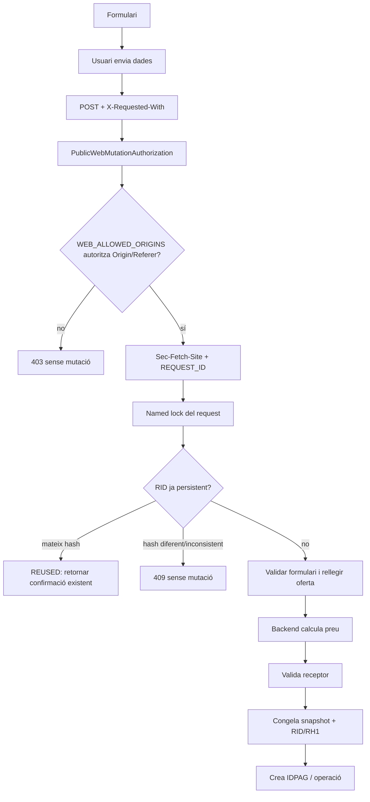
```mermaid
flowchart TD
A[Formulari] --> B[Usuari envia dades]
B --> C[POST + X-Requested-With]
C --> D[PublicWebMutationAuthorization]
D --> E{WEB_ALLOWED_ORIGINS autoritza Origin/Referer?}
E -- no --> F[403 sense mutació]
E -- sí --> G[Sec-Fetch-Site + REQUEST_ID]
G --> H[Named lock del request]
H --> I{RID ja persistent?}
I -- mateix hash --> J[REUSED: retornar confirmació existent]
I -- hash diferent/inconsistent --> K[409 sense mutació]
I -- no --> L[Validar formulari i rellegir oferta]
L --> M[Backend calcula preu]
M --> N[Valida receptor]
N --> O[Congela snapshot + RID/RH1]
O --> P[Crea IDPAG / operació]
```

**Correcció aplicada 02/10:** `mostrarInscripcioPack.min.js` envia POST + `X-Requested-With` + `REQUEST_ID`. Abans de processar el payload, `PublicWebMutationAuthorization` exigeix Origin/Referer dins `WEB_ALLOWED_ORIGINS`; l'endpoint conserva `Sec-Fetch-Site`. Després resol `RID/RH1` i, només per una alta nova, revalida que totes les edicions segueixin obertes abans de preus o `IDPAG`. Mateix request+hash reutilitza l'alta; mateixa clau amb payload diferent retorna 409.

## PK-A04 · Alta de components

### ACTUAL
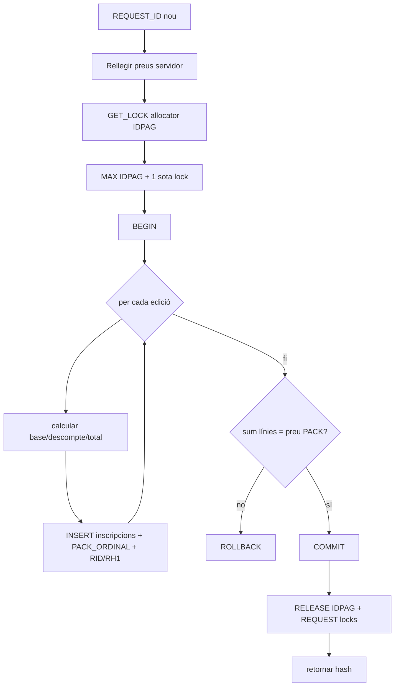
```mermaid
flowchart TD
A[REQUEST_ID nou] --> B[Rellegir preus servidor]
B --> C[GET_LOCK allocator IDPAG]
C --> D[MAX IDPAG + 1 sota lock]
D --> E[BEGIN]
E --> F{per cada edició}
F --> G[calcular base/descompte/total]
G --> H[INSERT inscripcions + PACK_ORDINAL + RID/RH1]
H --> F
F -->|fi| I{sum línies = preu PACK?}
I -- no --> J[ROLLBACK]
I -- sí --> K[COMMIT]
K --> L[RELEASE IDPAG + REQUEST locks]
L --> M[retornar hash]
```

### FINAL
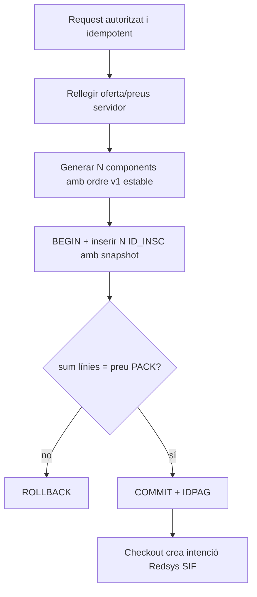
```mermaid
flowchart TD
A[Request autoritzat i idempotent] --> B[Rellegir oferta/preus servidor]
B --> C[Generar N components amb ordre v1 estable]
C --> D[BEGIN + inserir N ID_INSC amb snapshot]
D --> E{sum línies = preu PACK?}
E -- no --> F[ROLLBACK]
E -- sí --> G[COMMIT + IDPAG]
G --> H[Checkout crea intenció Redsys SIF]
```

**Revalidació 02/10:** les N insercions es fan dins una única transacció legacy. Una fallada intermèdia provoca rollback; abans del commit s'exigeix `suma(A_PAGAR)=preu PACK` i restant zero en cèntims. El `REQUEST_ID` queda congelat com `RID/RH1`, de manera que un reintent equivalent no entra en aquest bloc sinó que retorna el resultat existent. `PackEnrollmentAtomicityBoundaryTest` i `PackEnrollmentIdempotencyBoundaryTest` blinden els dos contractes.

## PK-A05 · Intenció de pagament

### ACTUAL
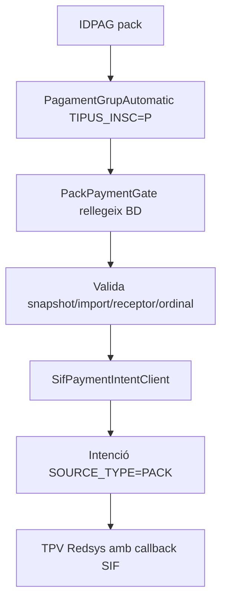
```mermaid
flowchart TD
A[IDPAG pack] --> B[PagamentGrupAutomatic TIPUS_INSC=P]
B --> C[PackPaymentGate rellegeix BD]
C --> D[Valida snapshot/import/receptor/ordinal]
D --> E[SifPaymentIntentClient]
E --> F[Intenció SOURCE_TYPE=PACK]
F --> G[TPV Redsys amb callback SIF]
```

### FINAL
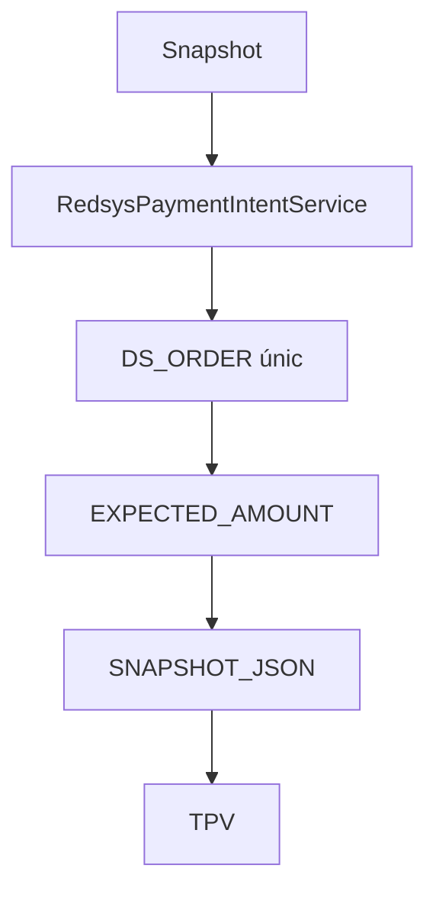
```mermaid
flowchart TD
A[Snapshot] --> B[RedsysPaymentIntentService]
B --> C[DS_ORDER únic]
C --> D[EXPECTED_AMOUNT]
D --> E[SNAPSHOT_JSON]
E --> F[TPV]
```

## PK-A06 · Callback

### ACTUAL
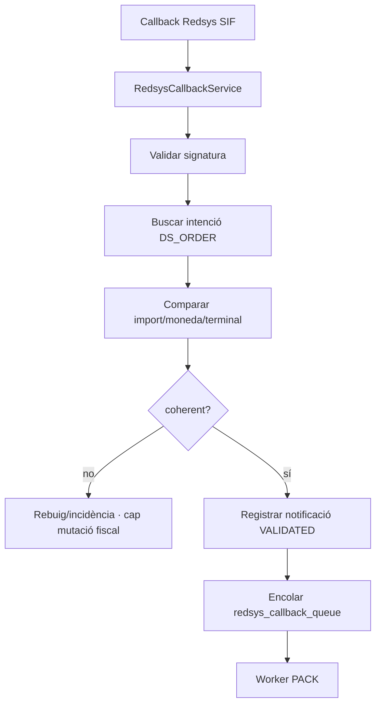
```mermaid
flowchart TD
A[Callback Redsys SIF] --> B[RedsysCallbackService]
B --> C[Validar signatura]
C --> D[Buscar intenció DS_ORDER]
D --> E[Comparar import/moneda/terminal]
E --> F{coherent?}
F -- no --> G[Rebuig/incidència · cap mutació fiscal]
F -- sí --> H[Registrar notificació VALIDATED]
H --> I[Encolar redsys_callback_queue]
I --> J[Worker PACK]
```

> Els dos callbacks productius `realitzaPagamentPackAutomatic.php` s'han eliminat físicament. El fitxer `realitzaPagamentPackAutomaticProva.php` és només un harness de test/preproducció fail-closed.

### FINAL
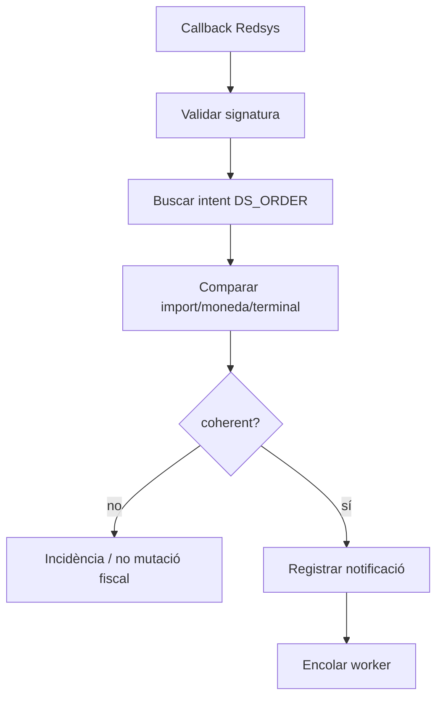
```mermaid
flowchart TD
A[Callback Redsys] --> B[Validar signatura]
B --> C[Buscar intent DS_ORDER]
C --> D[Comparar import/moneda/terminal]
D --> E{coherent?}
E -- no --> F[Incidència / no mutació fiscal]
E -- sí --> G[Registrar notificació]
G --> H[Encolar worker]
```

## PK-A07 · Emissió factura

### ACTUAL
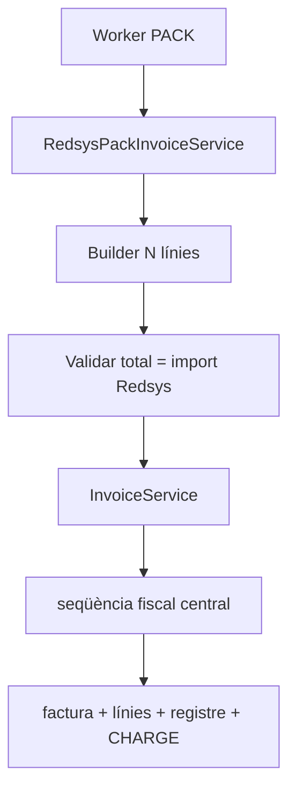
```mermaid
flowchart TD
A[Worker PACK] --> B[RedsysPackInvoiceService]
B --> C[Builder N línies]
C --> D[Validar total = import Redsys]
D --> E[InvoiceService]
E --> F[seqüència fiscal central]
F --> G[factura + línies + registre + CHARGE]
```

### FINAL
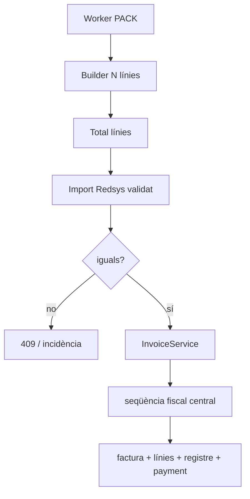
```mermaid
flowchart TD
A[Worker PACK] --> B[Builder N línies]
B --> C[Total línies]
C --> D[Import Redsys validat]
D --> E{iguals?}
E -- no --> F[409 / incidència]
E -- sí --> G[InvoiceService]
G --> H[seqüència fiscal central]
H --> I[factura + línies + registre + payment]
```

## PK-A08 · Distribució monetària

### ACTUAL
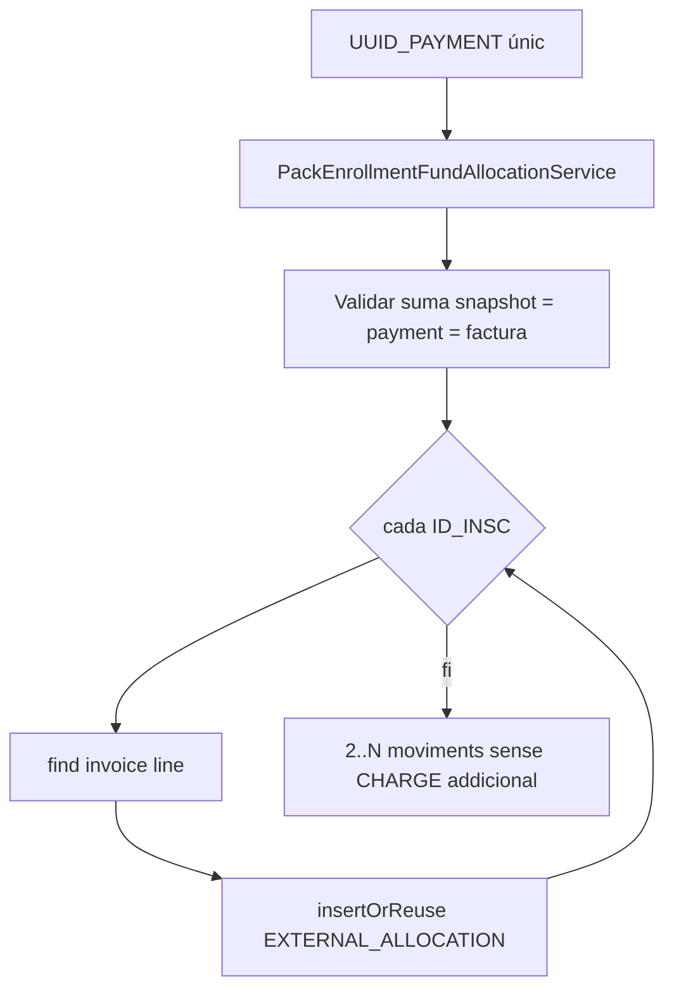
```mermaid
flowchart TD
A[UUID_PAYMENT únic] --> B[PackEnrollmentFundAllocationService]
B --> C[Validar suma snapshot = payment = factura]
C --> D{cada ID_INSC}
D --> E[find invoice line]
E --> F[insertOrReuse EXTERNAL_ALLOCATION]
F --> D
D -->|fi| G[2..N moviments sense CHARGE addicional]
```

### FINAL
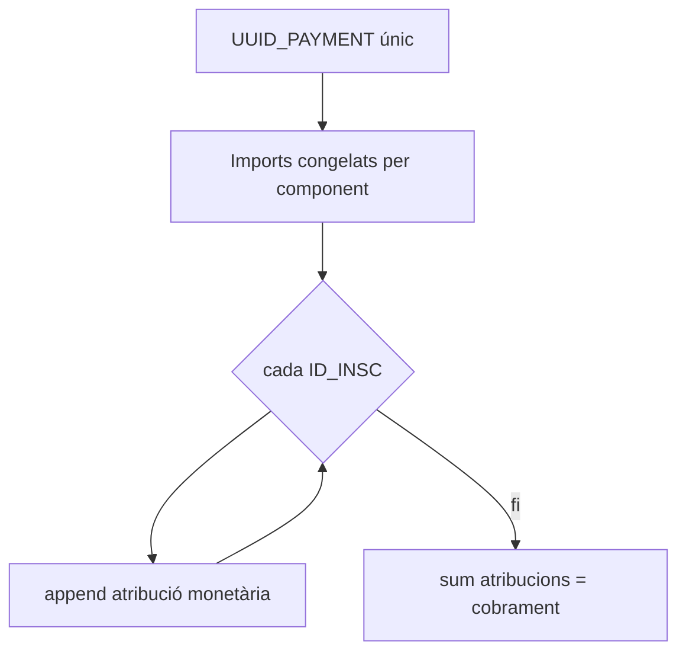
```mermaid
flowchart TD
A[UUID_PAYMENT únic] --> B[Imports congelats per component]
B --> C{cada ID_INSC}
C --> D[append atribució monetària]
D --> C
C -->|fi| E[sum atribucions = cobrament]
```

## PK-A09 · Notificacions

### ACTUAL
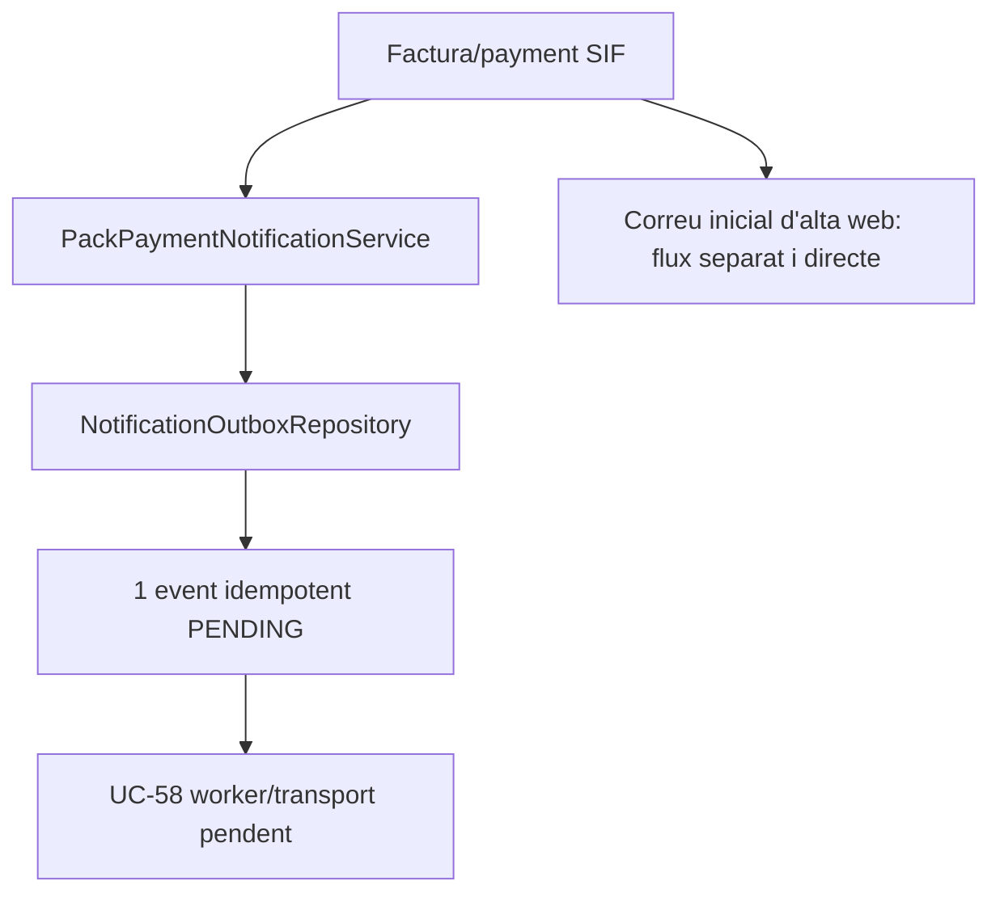
```mermaid
flowchart TD
A[Factura/payment SIF] --> B[PackPaymentNotificationService]
B --> C[NotificationOutboxRepository]
C --> D[1 event idempotent PENDING]
D --> E[UC-58 worker/transport pendent]
A --> F[Correu inicial d'alta web: flux separat i directe]
```

### FINAL
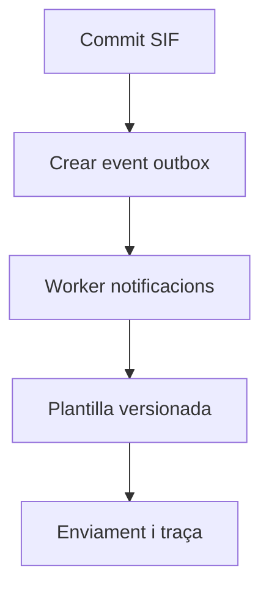
```mermaid
flowchart TD
A[Commit SIF] --> B[Crear event outbox]
B --> C[Worker notificacions]
C --> D[Plantilla versionada]
D --> E[Enviament i traça]
```

## PK-A10 · Fraccionament

### ACTUAL
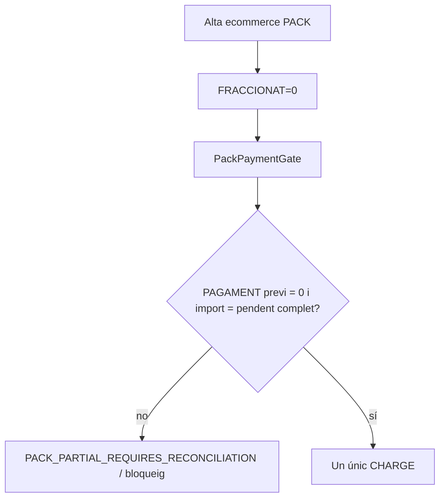
```mermaid
flowchart TD
A[Alta ecommerce PACK] --> B[FRACCIONAT=0]
B --> C[PackPaymentGate]
C --> D{PAGAMENT previ = 0 i import = pendent complet?}
D -- no --> E[PACK_PARTIAL_REQUIRES_RECONCILIATION / bloqueig]
D -- sí --> F[Un únic CHARGE]
```

### FINAL
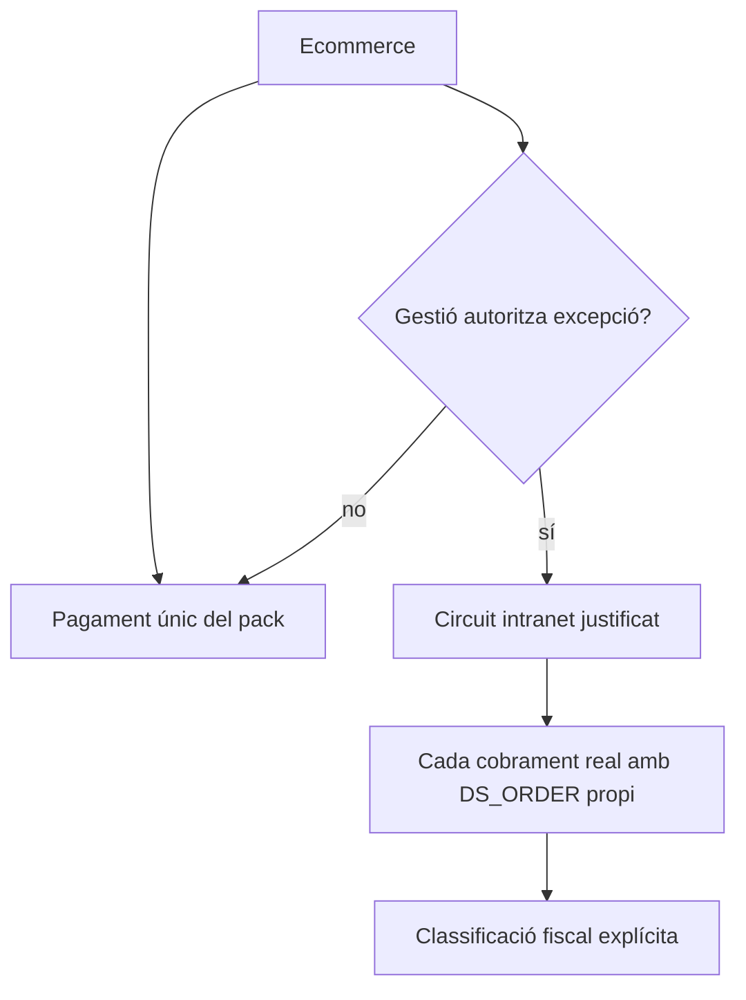
```mermaid
flowchart TD
A[Ecommerce] --> B[Pagament únic del pack]
A --> C{Gestió autoritza excepció?}
C -- no --> B
C -- sí --> D[Circuit intranet justificat]
D --> E[Cada cobrament real amb DS_ORDER propi]
E --> F[Classificació fiscal explícita]
```

## Criteri de tancament RM-037 per UC-015

### Codi/documentació — complert
- els deu blocs tenen correspondència codi → UC → prova;
- alta POST + frontera `PublicWebMutationAuthorization` + `REQUEST_ID` + replay/conflicte estan implementats;
- disponibilitat de tots els components i ordre v1 `DATAI, ID_CURS` estan congelats;
- callbacks productius legacy eliminats;
- verificador canònic PACK de preproducció implementat.

### Acceptació runtime — pendent
1. executar `verify-redsys-pack-preproduction.php` amb un `DS_ORDER` real i conservar factura/payment + N moviments + outbox + sync legacy quan correspongui;
2. executar PK-01..PK-11 de navegador/preproducció, incloent GET/cross-site, doble clic, replay `REQUEST_ID` i component fora de finestra;
3. mantenir CI verda al HEAD final.

El transport/retry/lliurament de notificacions queda a UC-58 i no reobre el codi UC-015.

## Evidència de proves automatitzades

El 2026-09-30 la suite SIF ha finalitzat amb **706 passed / 0 failed** al commit `c961f193...`. Aquesta evidència cobreix el contracte de checkout, snapshot, factura, conciliació, ledger i outbox del UC-015. Resta la validació visual/navegador i Redsys de preproducció.

**Revalidació 02/10:** el paquet UC-015 final es va fusionar a `41d6968...` i el workflow `SIF PHP MySQL tests` d'aquell commit també va acabar en **success** (run `36741186555`). La revisió de codi del PR a `0b32fa2...` va passar els quatre workflows, inclòs `SIF PHP MySQL tests` (run `36943484891`). El criteri de merge continua sent que el HEAD final del PR mantingui la CI verda després de qualsevol resincronització amb `main`.
