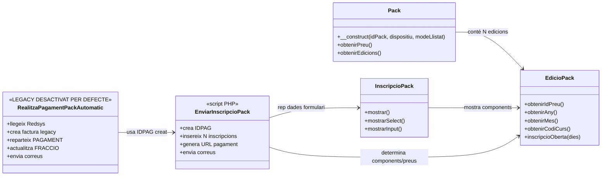
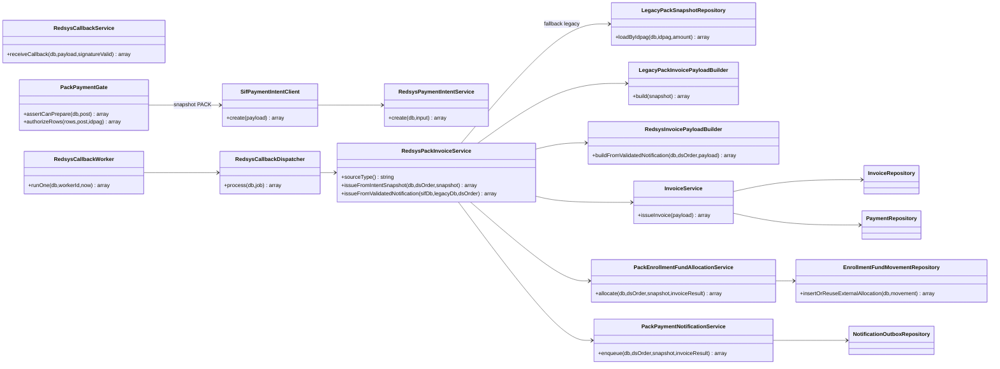
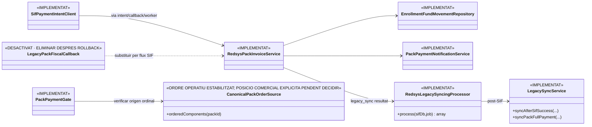

# UC-015 · Classes ACTUAL / FINAL — Comprar pack

**Data d'auditoria:** 2026-09-29 · **Revalidació main:** 2026-09-30  
**Abast:** ecommerce PrisMa, pay.prisma.cat, Redsys i SIF.  
**Criteri:** separar estrictament classes i responsabilitats observades al codi actual de les responsabilitats objectiu.

## 1. Classes ACTUAL — web i llegat

### Responsabilitats observades

- `Pack.php`: carrega la definició del pack, components, disponibilitat i metadades.
- `EdicioPack.php`: resol edició, curs, dates, preu i obertura.
- `InscripcioPack.php`: genera el formulari.
- `enviarInscripcioPack.php`: rep dades de navegador, calcula/rep imports, genera `IDPAG` i crea N files `inscripcions`.
- `realitzaPagamentPackAutomatic.php`: conserva el codi històric, però està bloquejat per defecte amb HTTP 410 abans de qualsevol mutació.

## 2. Classes ACTUAL — SIF ja implementat

### Implementat i verificat per inspecció

- `RedsysPaymentIntentService` accepta `SOURCE_TYPE=PACK` i conserva `SNAPSHOT_JSON`.
- `RedsysCallbackService` exigeix signatura vàlida i concilia import, moneda i terminal amb la intenció.
- `RedsysPackInvoiceService` emet des del snapshot de la intenció.
- A partir de l'auditoria del 2026-09-29 el servei també bloqueja si **total factura != import Redsys validat**.
- `InvoiceService` centralitza numeració i idempotència fiscal.
- `PackPaymentGate` reconstrueix el checkout exclusivament des de BD i exigeix snapshot comercial complet.
- `SifPaymentIntentClient` envia una petició HMAC autenticada a la intenció SIF abans del TPV.
- `PackEnrollmentFundAllocationService` reparteix un únic `UUID_PAYMENT` a N `ID_INSC` amb moviments idempotents.
- `PackPaymentNotificationService` registra notificació a outbox al flux asíncron principal.

## 3. Classes FINAL / objectiu residual

La major part del disseny FINAL previst ja existeix a `main`. El diagrama següent mostra només les responsabilitats encara pendents de consolidar o retirar.

## 4. Diferències bloquejants ACTUAL → FINAL

| Responsabilitat | ACTUAL | FINAL |
|---|---|---|
| Preu definitiu | **Backend autoritatiu implementat** | Mantenir snapshot versionat i provar runtime |
| Identitat operació | `MAX(IDPAG)+1` sota `GET_LOCK` | Seqüència pròpia si es decideix eliminar deute legacy |
| Ordinal components | `PACK_ORDINAL` congelat i consumit | Ordre actual `DATAI, ID_CURS`; decidir si cal posició comercial explícita |
| Receptor fiscal | **Validació fail-closed entre tots els components** | Mantenir receptor explícit al snapshot |
| Callback | Legacy desactivat per defecte; SIF autoritatiu | Eliminar codi històric després de rollback |
| Numeració | Taula legacy | Seqüència fiscal SIF |
| Distribució monetària | **Ledger `enrollment_fund_movement` implementat** | Proves runtime/preproducció |
| Notificacions | **Outbox implementat al flux SIF; PHP legacy encara existeix** | Retirar dependència del correu directe legacy |

## 5. Estat

- **Documentat:** sí.
- **Implementat:** flux fiscal/econòmic principal sí; resten només dependències residuals d'entorn/retirada/UC-58.
- **Verificat per inspecció:** sí.
- **Pendent:** eliminar el callback fiscal legacy després de la finestra de rollback, decidir si `PACK_ORDINAL` ha de provenir d'una posició comercial explícita independent de `DATAI` i obtenir evidència runtime/preproducció. La sincronització legacy post-SIF ja està implementada amb `RedsysLegacySyncingProcessor` + `LegacySyncService`.
