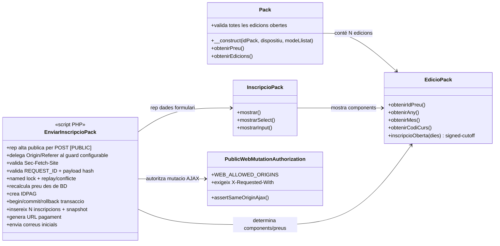
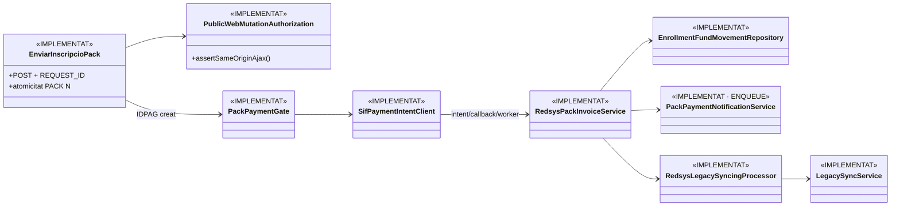

# UC-015 · Classes ACTUAL / FINAL — Comprar pack

**Data d'auditoria:** 2026-09-29 · **Revalidació final:** 2026-10-02  
**Abast:** ecommerce PrisMa, pay.prisma.cat, Redsys i SIF.  
**Criteri:** separar estrictament classes i responsabilitats observades al codi actual de les responsabilitats objectiu.

## 1. Classes ACTUAL — web i llegat

### Responsabilitats observades

- `Pack.php`: carrega la definició del pack, components i metadades; en vista completa exigeix que totes les edicions tinguin una finestra d'inscripció oberta segons les regles per hores.
- `EdicioPack.php`: resol edició, curs, dates, preu i obertura; `inscripcioOberta()` usa ara una data límit amb signe (`data_inici + dies`) i comparació real contra avui.
- `InscripcioPack.php`: genera el formulari.
- `PublicWebMutationAuthorization.php`: és l'única autoritat per `Origin`/`Referer` de la mutació pública; llegeix `WEB_ALLOWED_ORIGINS`, exigeix `X-Requested-With: XMLHttpRequest` i falla amb 403 fora de l'allowlist.
- `enviarInscripcioPack.php`: rep dades per **POST**, delega `Origin`/`Referer` al guard configurable i conserva `Sec-Fetch-Site` com a defensa addicional; valida `REQUEST_ID` UUID v4 i fingerprint SHA-256, serialitza reintents amb named lock i resol `REUSED/409` abans dels validators legacy i de rellegir el pack actual. Per una alta nova exigeix que **totes les edicions** continuïn obertes, recalcula imports des de BD, genera `IDPAG` i crea N files `inscripcions` amb snapshot comercial + `RID/RH1` dins una transacció única. En error fa rollback i garanteix l'alliberament dels locks.
- Els dos `realitzaPagamentPackAutomatic.php` productius han estat **eliminats físicament**. Només resta l'arnès `realitzaPagamentPackAutomaticProva.php`, restringit a test/preproducció i fail-closed.

## 2. Classes ACTUAL — SIF ja implementat

### Implementat i verificat per inspecció

- `RedsysPaymentIntentService` accepta `SOURCE_TYPE=PACK` i conserva `SNAPSHOT_JSON`.
- `RedsysCallbackService` exigeix signatura vàlida i concilia import, moneda i terminal amb la intenció.
- `RedsysPackInvoiceService` emet des del snapshot de la intenció.
- A partir de l'auditoria del 2026-09-29 el servei també bloqueja si **total factura != import Redsys validat**.
- `InvoiceService` centralitza numeració i idempotència fiscal.
- `PackPaymentGate` reconstrueix el checkout exclusivament des de BD i exigeix snapshot comercial complet.
- `SifPaymentIntentClient` envia una petició HMAC autenticada a la intenció SIF abans del TPV.
- `PackEnrollmentFundAllocationService` reparteix un únic `UUID_PAYMENT` a N `ID_INSC` amb moviments idempotents.
- `PackPaymentNotificationService` registra notificació a outbox al flux asíncron principal.

## 3. Classes FINAL / contracte tancat

El disseny FINAL propi d'UC-015 ja no té una classe de negoci pendent de crear. Les peces que defineixen el contracte executable són les mateixes que consten a l'ACTUAL endurit; el que resta és **acceptació d'entorn** i la dependència UC-58, no programació UC-015.

- **Ordre comercial v1 tancat:** `ORDER BY c.DATAI, p.ID_CURS` i snapshot `PACK_ORDINAL`; una futura posició manual seria una evolució de model, no un gap d'aquest UC.
- **Callback fiscal legacy productiu:** eliminat físicament; no forma part del FINAL.
- **Notificació:** UC-015 garanteix l'enqueue idempotent; transport/retry/lliurament és UC-58.
- **Acceptació runtime:** verificador i plantilla preparats; cal executar-los amb un `DS_ORDER` real a preproducció.

## 4. Diferències bloquejants ACTUAL → FINAL

| Responsabilitat | ACTUAL | FINAL |
|---|---|---|
| Preu definitiu | **Backend autoritatiu implementat** | Mantenir snapshot versionat i provar runtime |
| Transport/eligibilitat alta pública | **POST-only + `PublicWebMutationAuthorization` (`WEB_ALLOWED_ORIGINS` + X-Requested-With) + Sec-Fetch-Site + REQUEST_ID + tots els components oberts** | Acceptació navegador/preproducció |
| Identitat operació | `REQUEST_ID` persistent (`RID/RH1`) + `IDPAG`; named lock per request i `GET_LOCK` per allocator; N inserts transaccionals | Migració futura a identificador/taula dedicada si es vol retirar el deute legacy |
| Ordinal components | `PACK_ORDINAL` congelat des de `DATAI, ID_CURS` | Contracte v1 tancat; futura posició manual només com a evolució versionada |
| Receptor fiscal | **Validació fail-closed entre tots els components** | Mantenir receptor explícit al snapshot |
| Callback | SIF autoritatiu; callbacks PACK legacy productius eliminats | Mantenir únicament harness de test/preproducció fail-closed |
| Numeració | Taula legacy | Seqüència fiscal SIF |
| Distribució monetària | **Ledger `enrollment_fund_movement` implementat** | Proves runtime/preproducció |
| Notificacions | **Outbox de confirmació de pagament implementat; correu inicial d'alta continua al web legacy** | Lliurament/retries de l'outbox = UC-58; migració del correu inicial és millora separada |

## 5. Estat

- **Documentat:** sí.
- **Implementat:** sí, inclosa frontera pública configurable, ordre comercial v1, retirada del callback productiu, fiscal/econòmic, ledger, outbox enqueue i sync legacy.
- **Verificat per inspecció/proves automatitzades escrites:** sí; la CI del HEAD final és la porta de merge.
- **Pendent d'acceptació operativa:** evidència navegador/Redsys sobre preproducció. **Dependència externa:** lliurament/retries de notificacions sota UC-58.

## 6. Revalidació 2026-10-02

- No falta el diagrama de classes ACTUAL/FINAL: aquest fitxer existeix i cobreix web legacy, SIF i responsabilitats residuals.
- El flux fiscal/econòmic PACK no ha canviat des de la fusió específica `41d6968...`; els canvis posteriors de `RedsysPaymentIntentService` afecten la validació de `CURS`, i el canvi del worker afegeix notificació de curs sense alterar la injecció PACK.
- La classe/servei `AcademicEnrollmentSyncService` **no forma part** del UC-015 executable. La sincronització correcta és `RedsysLegacySyncingProcessor` → `LegacySyncService`.
- L'alta pública ha quedat endurida a POST-only amb `PublicWebMutationAuthorization`, `WEB_ALLOWED_ORIGINS`, `X-Requested-With`, `Sec-Fetch-Site` i idempotència server-side `REQUEST_ID` + payload hash. Continua sent un formulari anònim; l'E2E/preproducció és acceptació d'entorn, no un gap de codi.
