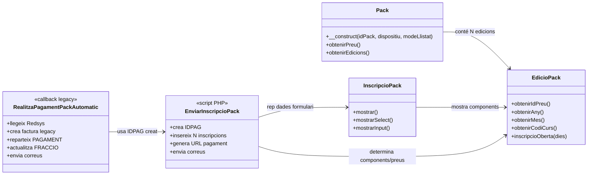
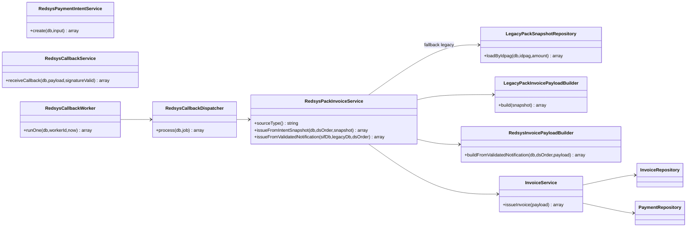
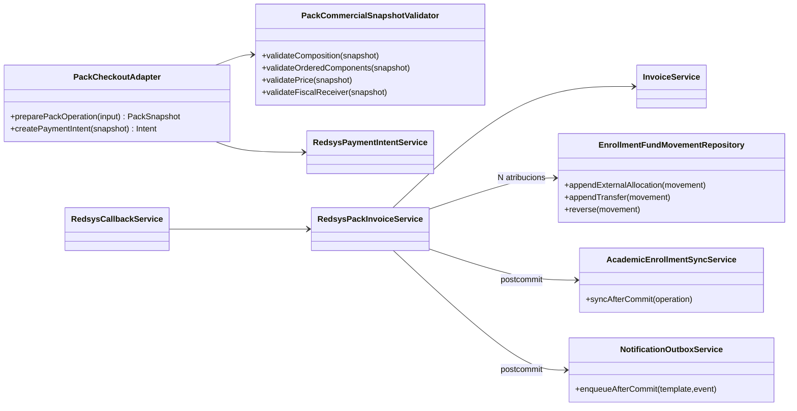

# UC-015 · Classes ACTUAL / FINAL — Comprar pack

**Data d'auditoria:** 2026-09-29  
**Abast:** ecommerce PrisMa, pay.prisma.cat, Redsys i SIF.  
**Criteri:** separar estrictament classes i responsabilitats observades al codi actual de les responsabilitats objectiu.

## 1. Classes ACTUAL — web i llegat

### Responsabilitats observades

- `Pack.php`: carrega la definició del pack, components, disponibilitat i metadades.
- `EdicioPack.php`: resol edició, curs, dates, preu i obertura.
- `InscripcioPack.php`: genera el formulari.
- `enviarInscripcioPack.php`: rep dades de navegador, calcula/rep imports, genera `IDPAG` i crea N files `inscripcions`.
- `realitzaPagamentPackAutomatic.php`: processa el resultat Redsys al llegat i escriu directament `factures` i `inscripcions`.

## 2. Classes ACTUAL — SIF ja implementat

### Implementat i verificat per inspecció

- `RedsysPaymentIntentService` accepta `SOURCE_TYPE=PACK` i conserva `SNAPSHOT_JSON`.
- `RedsysCallbackService` exigeix signatura vàlida i concilia import, moneda i terminal amb la intenció.
- `RedsysPackInvoiceService` emet des del snapshot de la intenció.
- A partir de l'auditoria del 2026-09-29 el servei també bloqueja si **total factura != import Redsys validat**.
- `InvoiceService` centralitza numeració i idempotència fiscal.

## 3. Classes FINAL

## 4. Diferències bloquejants ACTUAL → FINAL

| Responsabilitat | ACTUAL | FINAL |
|---|---|---|
| Preu definitiu | Part del valor arriba del navegador | Backend autoritatiu + snapshot |
| Identitat operació | `MAX(IDPAG)+1` | Identitat central/idempotent |
| Ordinal components | Derivat de files/ordre SQL | Ordinal comercial congelat |
| Receptor fiscal | Pot provenir del primer item | Receptor confirmat al snapshot |
| Callback | Script legacy amb escriptures directes | Callback SIF + cua + worker |
| Numeració | Taula legacy | Seqüència fiscal SIF |
| Distribució monetària | Camps `PAGAMENT/A_PAGAR` | Ledger quantitatiu per ID_INSC |
| Notificacions | PHP directe | Outbox postcommit |

## 5. Estat

- **Documentat:** sí.
- **Implementat parcial:** sí.
- **Verificat per inspecció:** sí.
- **Pendent:** adaptador ecommerce, snapshot comercial complet, ledger per inscripció, sincronització acadèmica i retirada del callback fiscal llegat.
