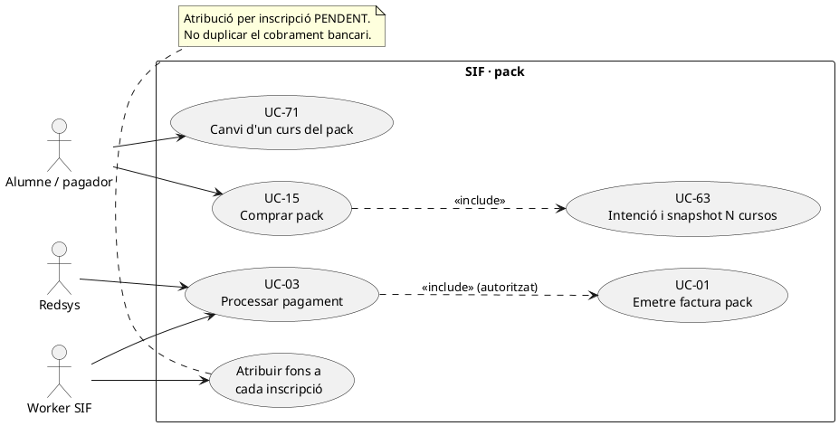
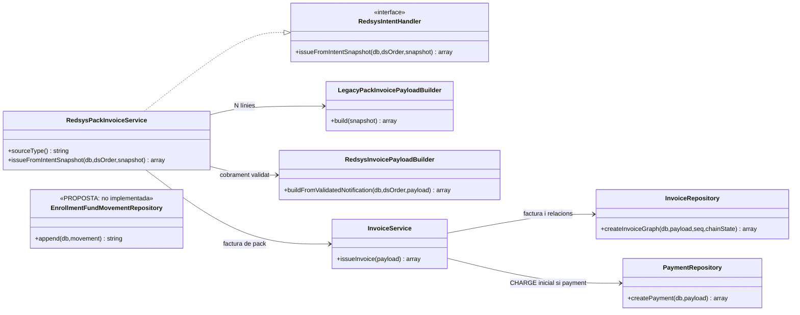
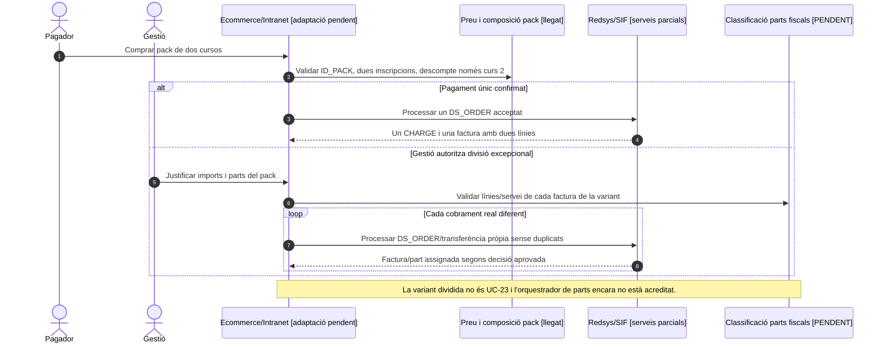

# UC-15 · Comprar un pack — fitxa i UML integrats

**Objectiu:** facturar i cobrar una **operació de pack** amb múltiples inscripcions, cadascuna amb curs, edició, import i descompte que li correspon. Un pagament del pack no és N cobraments bancaris independents, i la factura global no significa que es pugui perdre el detall de quantitat atribuïda a cada inscripció.

**Codi consultat:** `RedsysPackInvoiceService`, `LegacyPackInvoicePayloadBuilder`, `RedsysInvoicePayloadBuilder`, `InvoiceService` i la infraestructura UC-63/03. El builder actual **requereix almenys dues línies** i associa `PACK` i cada `INSCRIPCIO` a la factura. Les comprovacions de la composició comercial del pack i l'accés/inscripció final dels cursos continuen pendents d'acreditar al canal.

## 1. Fitxa del cas d'ús

| Element | Comportament |
| --- | --- |
| Actors | Alumne/pagador via ecommerce, Redsys i worker SIF. |
| Entrada de producte | `pack.ID_PACK` positiu, títol de pack i `items` amb almenys dues entrades, cadascuna amb `inscription` i `course`; cada inscripció té identificador propi. |
| Identitat de l'operació | `IDPAG` de l'operació global; clau base `LEGACY|PACK|IDPAG:<IDPAG>`, substituïda en el flux Redsys per clau d'origen/IDPAG/DS_ORDER. |
| Factura | Una factura de pack amb **una línia per inscripció**, `source_type=INSCRIPCIO`, `source_id=ID`; relació principal `PACK` i relacions de cadascuna de les inscripcions; `visible_alumne=1` al constructor revisat. |
| Descompte de pack al builder actual | Amb base/descompte explícits, es conserva informació aportada i es valida que el descompte no sigui negatiu. Sense base explícita, la primera línia queda al total, mentre que les línies posteriors reconstrueixen base i descompte prenent **25 % per defecte**. **Això és una regla implementada al builder actual, no validació de la política comercial vigent de tots els packs**. |
| Pagament | Una notificació Redsys `VALIDATED` aporta el **cobrament únic** del pack i l'assignació a factura, amb import total real de `DS_ORDER`. |
| Assignació a inscripcions | **Pendent:** el mateix `UUID_PAYMENT` ha d'enllaçar amb una atribució per inscripció/línia per la seva quantitat real. No dividir automàticament a parts iguals. |

### 1.1. Flux principal asíncron

1. L'ecommerce valida disponibilitat i composició del pack, preu/descomptes i dades fiscals; crea una intenció UC-63 amb tipus `PACK`, `DS_ORDER`, import total i snapshot amb totes les inscripcions. No s'emet factura per una intenció sense cobrament.
2. Redsys comunica resultat signat; el callback UC-03 valida ordre i import, desa notificació i encua job només si autoritzat.
3. El worker selecciona `RedsysPackInvoiceService` mitjançant `SOURCE_TYPE=PACK` i li lliura `SNAPSHOT_JSON`.
4. `LegacyPackInvoicePayloadBuilder::build()` valida l'ID del pack i les inscripcions, genera les línies i totals, relacions `PACK` i `INSCRIPCIO` i congela els descomptes.
5. `RedsysInvoicePayloadBuilder::buildFromValidatedNotification()` incorpora el bloc `payment` de la notificació `VALIDATED`, amb `DS_ORDER`/`IDPAG` a les relacions.
6. `InvoiceService::issueInvoice()` crea/reutilitza una factura fiscal i un pagament inicial; el worker desa `UUID_FACTURA`/`UUID_PAYMENT` i estat `PROCESSED`.
7. **Model econòmic objectiu pendent:** registrar N atribucions `EXTERNAL → INSCRIPCIÓ` segons imports específics de línies/participants, vinculades al mateix `UUID_PAYMENT`; la suma atribuïda no ha de superar l'import real cobrat.
8. El servei acadèmic concedeix l'accés a cada curs/edició per l'inscrit que correspongui. Aquesta sincronització de l'ecommerce amb el llegat no queda demostrada per `InvoiceService`.

### 1.2. Alternatives i controls necessaris

| Cas | Regla |
| --- | --- |
| Pack amb menys de dues inscripcions al snapshot | El builder rebutja `items` amb menys de dues entrades. |
| Identificador de pack o inscripció invàlid | Error abans d'emetre factura. |
| Una inscripció canvia de curs després del cobrament | UC-71 registra traspàs dels seus fons i valoració fiscal; les altres línies i atribucions del pack original no es reescriuen. |
| Cancel·lació d'un curs del pack | UC-72/27 i eventual UC-28/29/05 sobre la part identificada, conservant descompte de pack i política de retorn per validar. |
| Diferència entre suma de línies congelades i import Redsys | Control bloquejant de conciliació per establir abans de l'emissió efectiva; signatura de Redsys no prova el repartiment per inscripció. |
| Duplicat de callback o worker | Reutilitzar factura, pagament i atribucions N, no registrar pagaments addicionals. |
| Descompte del 25 % del builder | Verificar contra la política real i l'snapshot comercial: no reconstruir un descompte diferent si s'aporta explicitament, ni generalitzar el 25 % a tots els tipus d'oferta. |
| Una sola persona fa totes les inscripcions del pack | La factura pot ser una, però els `ID_INSC` de cada curs/edició continuen independents per permetre canvis, baixes i consulta. |

**Proves localitzades, no executades:** `RedsysPackInvoiceServiceTest` i proves de payload del pack/flux asíncron. Les proves de factura no acrediten els moviments individuals de fons proposats.

### 1.3. Regles comercials reals i divisió excepcional del pack — contrast amb el xat original

**Composició habitual (no universal):** PrisMa descriu packs de **dos cursos**, amb **dues inscripcions independents** relacionades pel mateix `IDPAG`, i preu total provinent de la taula de preus vinculada a packs. El descompte comercial de pack del 25 % es posa en **el segon curs**, no es reparteix per defecte entre les dues inscripcions. Abans d'emetre, cal validar el snapshot del pack real (ID_PACK, preu, dues inscripcions, imports base, descompte del segon curs i suma final) contra la lògica comercial corresponent; un builder fiscal no substitueix aquesta comprovació.

**P-DESCOMPTE — matís del codi actual:** LegacyPackInvoicePayloadBuilder pot reconstruir descompte del 25 % en línies posteriors quan la base no és explícita. Això no acredita el requisit real «només el segon curs» per packs de més de dues línies ni per combinacions amb altres descomptes. L'adaptador ha de proporcionar imports/descomptes explícits i una regla validada per línia, sense inventar un 25 % per a cada línia posterior o recalcular el preu del pack a partir de preus vius després de confirmar la compra.

**P-EXCEPCIÓ — divisió de pagament només per intranet:** el xat original confirma que el client no escull fraccionar el pack a ecommerce; excepcionalment la gestió pot acceptar diversos pagaments reals i històricament hi pot haver **més d'una factura**. La documentació del flux final també preveu, en aquesta variant excepcional, **una factura per cada pagament real amb línies/imports aprovats**, i exigeix no dividir un mateix DS_ORDER en factures diferents. Aquest circuit no és el mateix que UC-23 (diversos pagaments sobre **una factura ja emesa**). Abans de desenvolupar-lo s'ha de decidir i documentar quina part del pack es factura en cada pas, com es reflecteix el descompte del segon curs, i com es relacionen les factures/inscripcions originals, sense facturar dues vegades el mateix servei. La fitxa no dona aquesta variant per executada ni n'estableix automàticament la qualificació fiscal.

**P-COBRAMENT — diferenciar IDPAG, DS_ORDER i fons:** IDPAG vincula les dues inscripcions i la intenció comercial del pack; cada DS_ORDER identifica un intent Redsys i pot correspondre a una fracció real diferent. No deduplicar tots els cobraments del pack únicament per IDPAG. Si es cobra un sol DS_ORDER, el resultat objectiu és una factura amb una línia per curs i un únic CHARGE. Si s'aplica un canvi/baixa a només un curs, no retornar l'import del pack complet ni recalcular silenciosament el descompte de l'altre: cal preservar la part atribuïda i classificar els efectes comercials i fiscals (UC-71/72).

### 1.4. Proves de negoci específiques del pack (no executades)

| ID | Escenari | Resultat exigible |
| --- | --- | --- |
| PK-01 | Pack habitual de dos cursos, un DS_ORDER acceptat | Dues inscripcions amb mateix IDPAG, una factura amb dues línies i un CHARGE. |
| PK-02 | Descompte pack del segon curs | Línia 2 amb base/descompte explícits coherents amb preu del pack; no descompte automàtic a línia 1. |
| PK-03 | Pack amb més de dues línies o descomptes diferents | Requereix regla comercial/snapshot per línia, no 25 % generalitzat a totes les posteriors. |
| PK-04 | Compra ecommerce intenta triar fraccionament excepcional | No oferir ni aplicar l'opció sense autorització de gestió/intranet. |
| PK-05 | Intranet accepta dos pagaments reals en variant dividida | Parts i línies aprovades, dues operacions/factures només segons contracte excepcional; mai dividir un sol DS_ORDER. |
| PK-06 | Mateix IDPAG amb dos DS_ORDER diferents validats | No fusionar dos cobraments legítims ni repetir la mateixa factura/part de servei. |
| PK-07 | Baixa d'un únic curs del pack | Analitzar descompte/part atribuïda al curs i factura afectada; altres inscripcions intactes. |
### 1.5. Comprovació bloquejant de l'ordre del pack abans d'emetre

**La consulta llegida no conserva l'ordinal comercial.** `LegacyPackSnapshotRepository::findPackInscriptionsByIdpag()` selecciona `TIPUS_INSC='P'` i ordena per `A_PAGAR DESC, ID`. `LegacyPackInvoicePayloadBuilder` assigna **per índex** el descompte: primera línia sense descompte si no consta base explícita, i 25 % reconstruït a les línies següents. La regla del pack habitual parla, en canvi, de **primer i segon curs de l'oferta acceptada**. Si els preus originals són diferents, hi ha fraccions/ajustos o canvia el pendent, ordenar per `A_PAGAR` pot permutar els cursos i situar el descompte en la línia equivocada. El builder també extreu **el receptor fiscal de la primera inscripció recuperada**, de manera que la permutació pot tenir efectes de receptor quan hi hagi dades personals divergents.

**Contracte del canal comercial pendent.** Abans de `issueInvoice()`, el checkout ha de proporcionar una llista **ordenada i versionada** de components amb `ID_INSC`, curs/edició, ordinal de l'oferta, import base, regla/descompte efectiu i total, i una identitat fiscal **confirmada** independent del resultat del `ORDER BY`. La composició s'ha de contrastar amb la font comercial del pack i l'import cobrat per Redsys; si només es disposa de saldos `A_PAGAR` o no és possible establir l'ordinal original, l'operació resta en incidència abans d'emetre, no es reconstrueix per conjectura. Una correcció posterior de component o una nova oferta es tracta per UC-122/71, **no** reordenant les línies de la factura ja emesa.

### 1.6. Proves de regressió de l'ordinal (no executades)

| ID | Escenari | Resultat exigible |
| --- | --- | --- |
| PK-08 | Primer curs pactat 80 €, segon curs 120 € abans de descompte | Descompte al segon curs comercial, no necessàriament al component que la consulta col·loca segon per `A_PAGAR`. |
| PK-09 | Un pagament parcial canvia `A_PAGAR` i inverteix `ORDER BY` | Snapshot original manté ordinal, imports i receptor; no nova factura amb preu/deute reconstruït. |
| PK-10 | Dues inscripcions del mateix `IDPAG` porten dades de receptor diferents | Receptor fiscal seleccionat/confirmat per operació, no arbitràriament la primera fila recuperada. |
| PK-11 | No es coneix la base comercial d'un component | Incidència i comprovació de preu real; no divisió automàtica per `0.75` sobre un saldo incert. |

## 2. Diagrama UML de casos d'ús



## 3. Subdiagrama de classes



`EnrollmentFundMovementRepository` es mostra com a model pendent, **sense una dependència fictícia dibuixada des de `InvoiceService`**.

## 4. Diagrama de seqüència — pack pagat, factura i distribució

```mermaid
sequenceDiagram
autonumber
actor A as Alumne/pagador
participant Web as Ecommerce [adaptador pendent]
participant Intent as RedsysPaymentIntentService
participant Bank as Redsys
participant Callback as RedsysCallbackService
participant Q as Cua callback
participant W as RedsysCallbackWorker
participant H as RedsysPackInvoiceService
participant B as LegacyPackInvoicePayloadBuilder
participant R as RedsysInvoicePayloadBuilder
participant I as InvoiceService
participant L as EnrollmentFundMovementRepository [PROPOSTA]
A->>Web: Comprar pack amb N inscripcions
Web->>Intent: create(PACK, DS_ORDER, import, snapshot N línies)
Intent-->>Web: UUID_INTENT
Web->>Bank: TPV
Bank->>Callback: Notificació signada
Callback->>Q: Encolar job autoritzat
W->>Q: Reclamar job PACK
W->>H: issueFromIntentSnapshot(db,dsOrder,snapshot)
H->>B: build(snapshot)
loop Cada inscripció del pack
 B->>B: Línia, descompte i relació INSCRIPCIO
end
B-->>H: Totals i relacions PACK + N inscripcions
H->>R: buildFromValidatedNotification()
R-->>H: Payload amb un CHARGE real
H->>I: issueInvoice(payload)
I-->>H: UUID_FACTURA i UUID_PAYMENT
H-->>W: Resultat
W->>Q: PROCESSED i UUIDs
opt Desglossament monetari per inscripció [DISSENY]
 loop Per cada inscripció i import validat
  W->>L: append(EXTERNAL→ID_INSC, import_i, UUID_PAYMENT)
 end
end
Note over W,L: Un pagament bancari; N atribucions internes. Integració del ledger no implementada.
```

### 4.1. Seqüència — pagament únic i alternativa excepcional d'intranet (OBJECTIU)


## 5. Traçabilitat

[Fitxa UC-15 original](../06-fitxes-funcionals/uc-015.md) · [UC-03](uc-003-processar-cobrament-redsys-asincron.md) · [UC-63](uc-063-crear-intencio-redsys.md) · [UC-71](uc-071-registrar-canvi-curs-complet.md) · [Revisió de fons](00-revisio-moviments-inscripcions.md) · [RedsysPackInvoiceService](../../sif/src/Service/RedsysPackInvoiceService.php) · [LegacyPackInvoicePayloadBuilder](../../sif/src/Service/LegacyPackInvoicePayloadBuilder.php) · [RedsysPackInvoiceServiceTest](../../sif/tests/Integration/RedsysPackInvoiceServiceTest.php).
