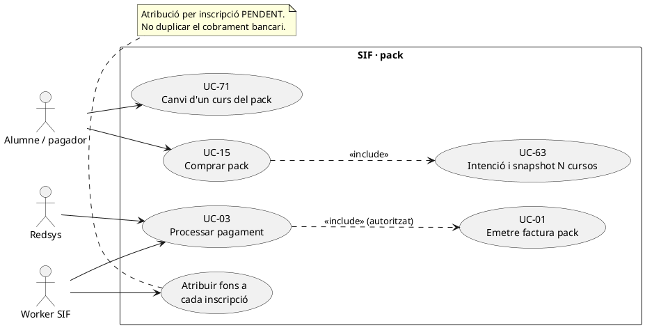

# UC-15 · Comprar un pack — fitxa i UML integrats

**Objectiu:** facturar i cobrar una **operació de pack** amb múltiples inscripcions, cadascuna amb curs, edició, import i descompte que li correspon. Un pagament del pack no és N cobraments bancaris independents, i la factura global no significa que es pugui perdre el detall de quantitat atribuïda a cada inscripció.

**Codi consultat:** `RedsysPackInvoiceService`, `LegacyPackInvoicePayloadBuilder`, `RedsysInvoicePayloadBuilder`, `InvoiceService` i la infraestructura UC-63/03. El builder actual **requereix almenys dues línies** i associa `PACK` i cada `INSCRIPCIO` a la factura. Les comprovacions de la composició comercial del pack i l'accés/inscripció final dels cursos continuen pendents d'acreditar al canal.

## 1. Fitxa del cas d'ús

| Element | Comportament |
| --- | --- |
| Actors | Alumne/pagador via ecommerce, Redsys i worker SIF. |
| Entrada de producte | `pack.ID_PACK` positiu, títol de pack i `items` amb almenys dues entrades, cadascuna amb `inscription` i `course`; cada inscripció té identificador propi. |
| Identitat de l'operació | `IDPAG` de l'operació global; clau base `LEGACY|PACK|IDPAG:<IDPAG>`, substituïda en el flux Redsys per clau d'origen/IDPAG/DS_ORDER. |
| Factura | Una factura de pack amb **una línia per inscripció**, `source_type=INSCRIPCIO`, `source_id=ID`; relació principal `PACK` i relacions de cadascuna de les inscripcions; `visible_alumne=1` al constructor revisat. |
| Descompte de pack al builder actual | Amb base/descompte explícits, es conserva informació aportada i es valida que el descompte no sigui negatiu. Sense base explícita, la primera línia queda al total, mentre que les línies posteriors reconstrueixen base i descompte prenent **25 % per defecte**. **Això és una regla implementada al builder actual, no validació de la política comercial vigent de tots els packs**. |
| Pagament | Una notificació Redsys `VALIDATED` aporta el **cobrament únic** del pack i l'assignació a factura, amb import total real de `DS_ORDER`. |
| Assignació a inscripcions | **Pendent:** el mateix `UUID_PAYMENT` ha d'enllaçar amb una atribució per inscripció/línia per la seva quantitat real. No dividir automàticament a parts iguals. |

### 1.1. Flux principal asíncron

1. L'ecommerce valida disponibilitat i composició del pack, preu/descomptes i dades fiscals; crea una intenció UC-63 amb tipus `PACK`, `DS_ORDER`, import total i snapshot amb totes les inscripcions. No s'emet factura per una intenció sense cobrament.
2. Redsys comunica resultat signat; el callback UC-03 valida ordre i import, desa notificació i encua job només si autoritzat.
3. El worker selecciona `RedsysPackInvoiceService` mitjançant `SOURCE_TYPE=PACK` i li lliura `SNAPSHOT_JSON`.
4. `LegacyPackInvoicePayloadBuilder::build()` valida l'ID del pack i les inscripcions, genera les línies i totals, relacions `PACK` i `INSCRIPCIO` i congela els descomptes.
5. `RedsysInvoicePayloadBuilder::buildFromValidatedNotification()` incorpora el bloc `payment` de la notificació `VALIDATED`, amb `DS_ORDER`/`IDPAG` a les relacions.
6. `InvoiceService::issueInvoice()` crea/reutilitza una factura fiscal i un pagament inicial; el worker desa `UUID_FACTURA`/`UUID_PAYMENT` i estat `PROCESSED`.
7. **Model econòmic objectiu pendent:** registrar N atribucions `EXTERNAL → INSCRIPCIÓ` segons imports específics de línies/participants, vinculades al mateix `UUID_PAYMENT`; la suma atribuïda no ha de superar l'import real cobrat.
8. El servei acadèmic concedeix l'accés a cada curs/edició per l'inscrit que correspongui. Aquesta sincronització de l'ecommerce amb el llegat no queda demostrada per `InvoiceService`.

### 1.2. Alternatives i controls necessaris

| Cas | Regla |
| --- | --- |
| Pack amb menys de dues inscripcions al snapshot | El builder rebutja `items` amb menys de dues entrades. |
| Identificador de pack o inscripció invàlid | Error abans d'emetre factura. |
| Una inscripció canvia de curs després del cobrament | UC-71 registra traspàs dels seus fons i valoració fiscal; les altres línies i atribucions del pack original no es reescriuen. |
| Cancel·lació d'un curs del pack | UC-72/27 i eventual UC-28/29/05 sobre la part identificada, conservant descompte de pack i política de retorn per validar. |
| Diferència entre suma de línies congelades i import Redsys | Control bloquejant de conciliació per establir abans de l'emissió efectiva; signatura de Redsys no prova el repartiment per inscripció. |
| Duplicat de callback o worker | Reutilitzar factura, pagament i atribucions N, no registrar pagaments addicionals. |
| Descompte del 25 % del builder | Verificar contra la política real i l'snapshot comercial: no reconstruir un descompte diferent si s'aporta explicitament, ni generalitzar el 25 % a tots els tipus d'oferta. |
| Una sola persona fa totes les inscripcions del pack | La factura pot ser una, però els `ID_INSC` de cada curs/edició continuen independents per permetre canvis, baixes i consulta. |

**Proves localitzades, no executades:** `RedsysPackInvoiceServiceTest` i proves de payload del pack/flux asíncron. Les proves de factura no acrediten els moviments individuals de fons proposats.

## 2. Diagrama UML de casos d'ús



## 3. Subdiagrama de classes


`EnrollmentFundMovementRepository` es mostra com a model pendent, **sense una dependència fictícia dibuixada des de `InvoiceService`**.

## 4. Diagrama de seqüència — pack pagat, factura i distribució

```mermaid
sequenceDiagram
autonumber
actor A as Alumne/pagador
participant Web as Ecommerce [adaptador pendent]
participant Intent as RedsysPaymentIntentService
participant Bank as Redsys
participant Callback as RedsysCallbackService
participant Q as Cua callback
participant W as RedsysCallbackWorker
participant H as RedsysPackInvoiceService
participant B as LegacyPackInvoicePayloadBuilder
participant R as RedsysInvoicePayloadBuilder
participant I as InvoiceService
participant L as EnrollmentFundMovementRepository [PROPOSTA]
A->>Web: Comprar pack amb N inscripcions
Web->>Intent: create(PACK, DS_ORDER, import, snapshot N línies)
Intent-->>Web: UUID_INTENT
Web->>Bank: TPV
Bank->>Callback: Notificació signada
Callback->>Q: Encolar job autoritzat
W->>Q: Reclamar job PACK
W->>H: issueFromIntentSnapshot(db,dsOrder,snapshot)
H->>B: build(snapshot)
loop Cada inscripció del pack
 B->>B: Línia, descompte i relació INSCRIPCIO
end
B-->>H: Totals i relacions PACK + N inscripcions
H->>R: buildFromValidatedNotification()
R-->>H: Payload amb un CHARGE real
H->>I: issueInvoice(payload)
I-->>H: UUID_FACTURA i UUID_PAYMENT
H-->>W: Resultat
W->>Q: PROCESSED i UUIDs
opt Desglossament monetari per inscripció [DISSENY]
 loop Per cada inscripció i import validat
  W->>L: append(EXTERNAL→ID_INSC, import_i, UUID_PAYMENT)
 end
end
Note over W,L: Un pagament bancari; N atribucions internes. Integració del ledger no implementada.
```

## 5. Traçabilitat

[Fitxa UC-15 original](../06-fitxes-funcionals/uc-015.md) · [UC-03](uc-003-processar-cobrament-redsys-asincron.md) · [UC-63](uc-063-crear-intencio-redsys.md) · [UC-71](uc-071-registrar-canvi-curs-complet.md) · [Revisió de fons](00-revisio-moviments-inscripcions.md) · [RedsysPackInvoiceService](../../sif/src/Service/RedsysPackInvoiceService.php) · [LegacyPackInvoicePayloadBuilder](../../sif/src/Service/LegacyPackInvoicePayloadBuilder.php) · [RedsysPackInvoiceServiceTest](../../sif/tests/Integration/RedsysPackInvoiceServiceTest.php).
