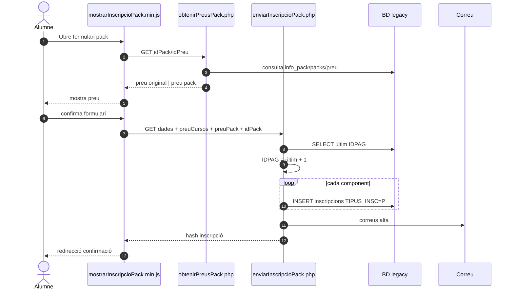
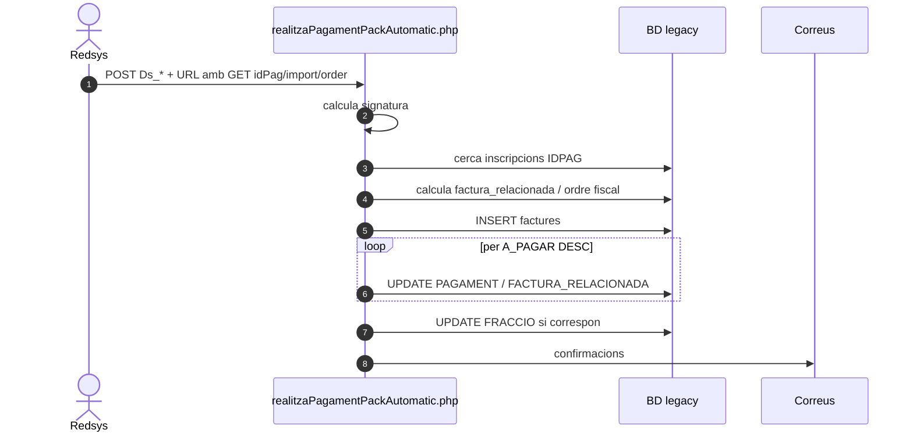
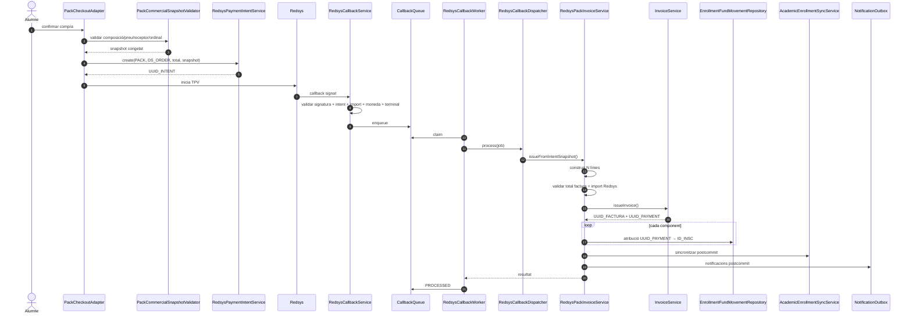
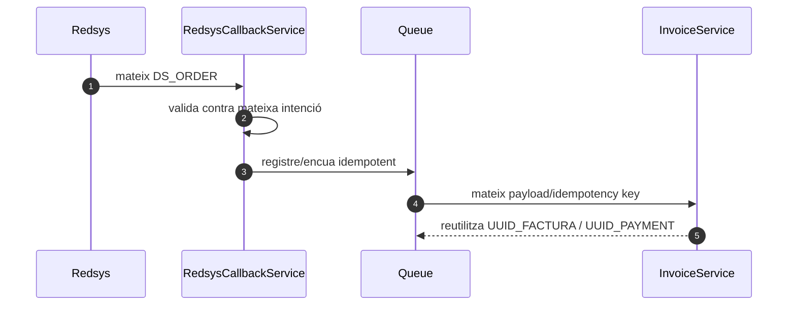
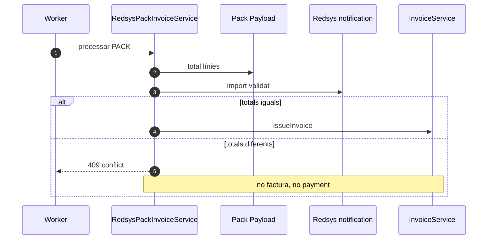

# UC-015 · Seqüències ACTUAL / FINAL — Comprar pack

**Data d'auditoria:** 2026-09-29

## 1. ACTUAL — alta del pack al web

### Riscos ACTUAL

- import del pack provinent del client;
- generació concurrent de `IDPAG`;
- no hi ha snapshot comercial versionat;
- no es conserva ordinal comercial explícit.

## 2. ACTUAL — cobrament pack al callback llegat

**Observació d'auditoria:** el fitxer llegit calcula la signatura però no s'ha acreditat una comparació bloquejant amb `Ds_Signature` abans de les escriptures.

## 3. FINAL — intenció, callback i emissió SIF

## 4. FINAL — callback duplicat

## 5. FINAL — mismatch bloquejant

## 6. Estat

- Seqüència ACTUAL web: documentada.
- Seqüència ACTUAL callback: documentada.
- Seqüència FINAL: documentada.
- Control total factura/import Redsys: implementat el 2026-09-29.
- Ledger per inscripció: pendent.
