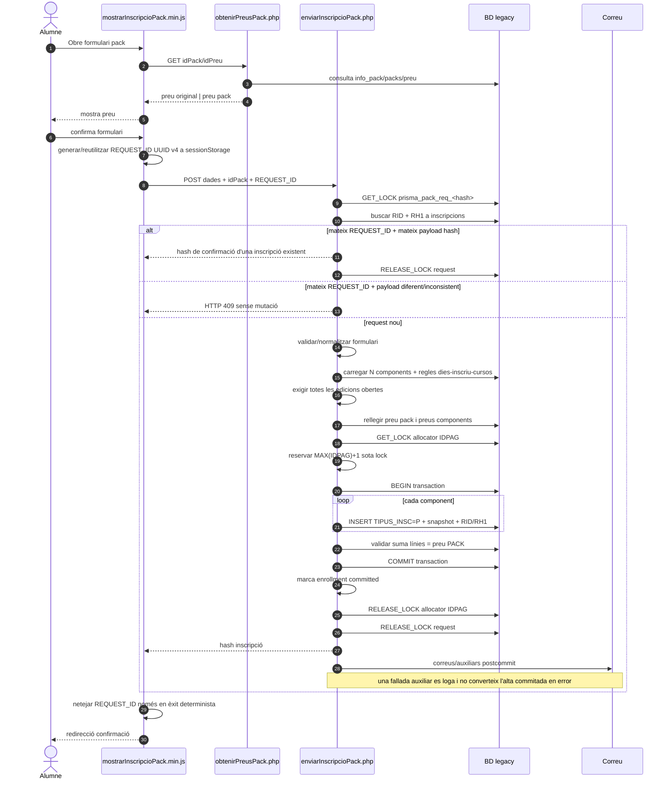
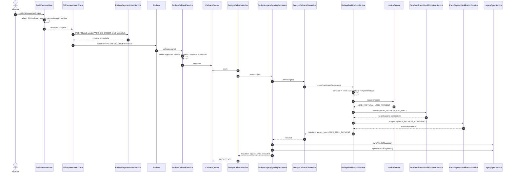
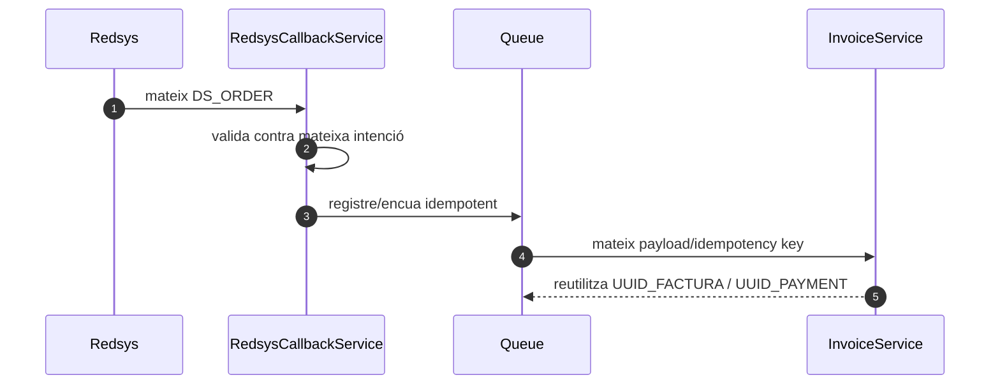
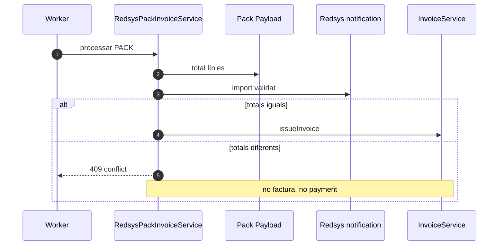

# UC-015 · Seqüències ACTUAL / FINAL — Comprar pack

**Data d'auditoria:** 2026-09-29 · **Revalidació main:** 2026-09-30

## 1. ACTUAL — alta del pack al web

### Riscos ACTUAL residuals

- les N inscripcions ja es persisteixen atòmicament; en excepció es fa rollback i el lock `IDPAG` s'allibera per `finally`;
- l'alta pública és POST-only amb comprovació same-site/origin i idempotència server-side `REQUEST_ID`+payload hash; una alta nova exigeix totes les edicions obertes i un reintent equivalent reutilitza l'alta abans de rellegir disponibilitat/pack actual; resta E2E navegador/preproducció i valorar controls anti-abús addicionals;
- l'allocator `IDPAG` continua sent MAX+1, tot i estar serialitzat amb lock;
- `PACK_ORDINAL` queda determinat pel mateix ordre estable de presentació `DATAI, ID_CURS`; resta decidir si negoci requereix una posició explícita separada;
- els callbacks fiscals legacy productius han estat eliminats físicament; només queda un harness de prova fail-closed i no autoritatiu.

## 2. HISTÒRIC — callback PACK legacy retirat

Les dues còpies productives de `realitzaPagamentPackAutomatic.php` han estat **eliminades físicament** el 02/10. No existeix ja una seqüència ACTUAL de cobrament PACK al callback legacy.

El flux històric del 29–30/09 es conserva únicament a l'historial Git/documentació d'auditoria. `LegacyPackCallbackBoundaryTest` comprova ara que aquests endpoints productius no existeixin. El fitxer `realitzaPagamentPackAutomaticProva.php` és un harness de test/preproducció explícit i no forma part del flux productiu.

## 3. FINAL — intenció, callback i emissió SIF

**Revalidació 02/10:** el wrapper real del worker és `RedsysLegacySyncingProcessor`; no existeix cap `AcademicEnrollmentSyncService` en aquest flux. La sincronització legacy s'executa només després que el handler PACK hagi retornat una emissió SIF correcta.

## 4. FINAL — callback duplicat

## 5. FINAL — mismatch bloquejant

## 6. Estat

- Seqüència ACTUAL web: documentada.
- Seqüència callback legacy: **retirada del sistema productiu**; l'històric queda preservat a Git/auditoria.
- Seqüència FINAL: **majoritàriament implementada** al flux PACK asíncron.
- Control total factura/import Redsys: implementat.
- Checkout → intenció SIF: implementat.
- Ledger per inscripció: implementat i cablejat al worker.
- Outbox: implementat i cablejat al worker.
- Codi/doc intern UC-015: tancat. Pendent d'acceptació: executar el verificador/PK-01..PK-11 en preproducció i mantenir la CI final verda; UC-58 cobreix el lliurament efectiu de notificacions.
