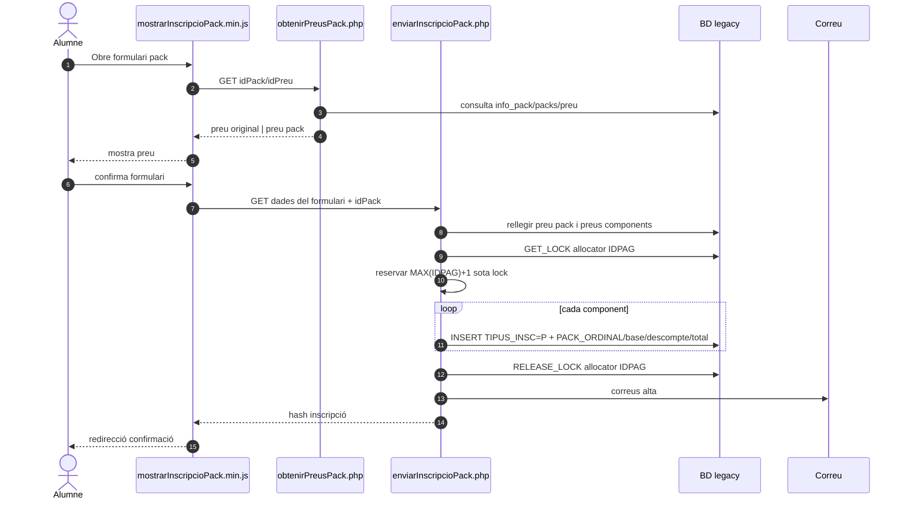
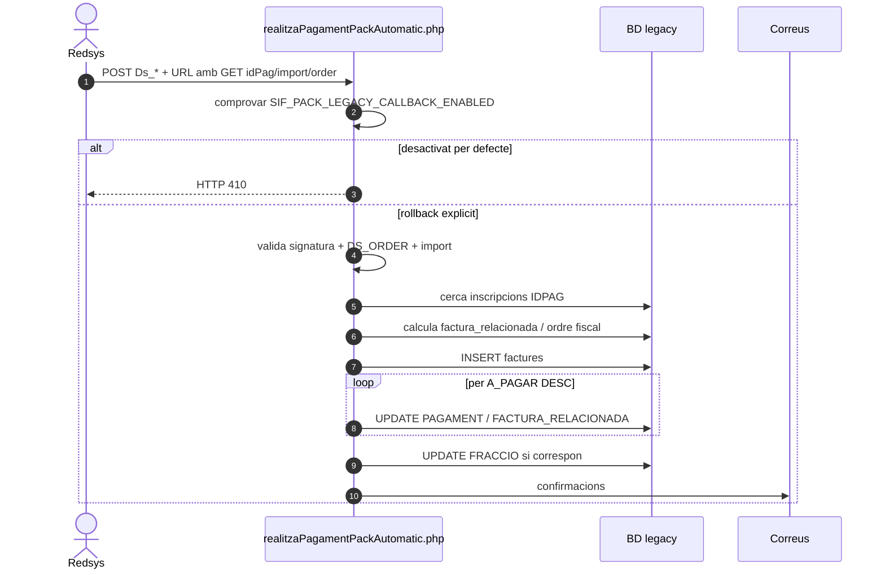
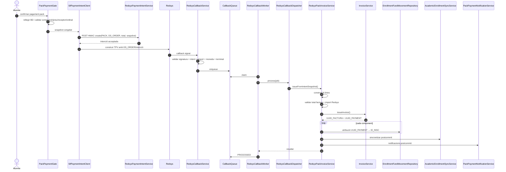
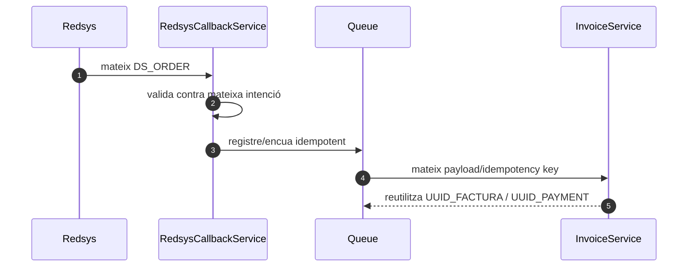
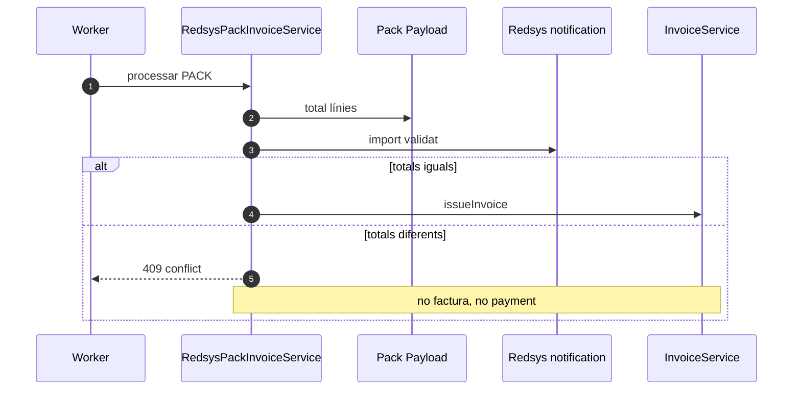

# UC-015 · Seqüències ACTUAL / FINAL — Comprar pack

**Data d'auditoria:** 2026-09-29 · **Revalidació main:** 2026-09-30

## 1. ACTUAL — alta del pack al web

### Riscos ACTUAL residuals

- l'allocator `IDPAG` continua sent MAX+1, tot i estar serialitzat amb lock;
- cal acreditar que `PACK_ORDINAL` representa l'ordre comercial canònic;
- el callback fiscal legacy conserva codi històric però està desactivat per defecte.

## 2. ACTUAL — cobrament pack al callback llegat

**Revalidació 30/09:** el callback legacy queda desactivat per defecte amb HTTP 410 abans de qualsevol escriptura. El codi intern només queda disponible per rollback explícit.

## 3. FINAL — intenció, callback i emissió SIF

## 4. FINAL — callback duplicat

## 5. FINAL — mismatch bloquejant

## 6. Estat

- Seqüència ACTUAL web: documentada.
- Seqüència ACTUAL callback: documentada.
- Seqüència FINAL: **majoritàriament implementada** al flux PACK asíncron.
- Control total factura/import Redsys: implementat.
- Checkout → intenció SIF: implementat.
- Ledger per inscripció: implementat i cablejat al worker.
- Outbox: implementat i cablejat al worker.
- Pendent: eliminar el codi legacy després del rollback, acreditar l'origen comercial de l'ordinal i executar proves d'entorn.
