# UC-016 · Activitats per pàgina — ACTUAL / FINAL

**Objectiu d'aquest document:** completar la cobertura d'activitats de l'UC-016 sobre les superfícies que participen en el pagament i l'emissió de factura de grup. La preparació del grup abans del pagament ja està desglossada a [UC-118 activitats](uc-118-activitats-pagines-grup-actual-final.md).

## P01 · Pàgina de pagament de grup — `PagamentGrupAutomatic.php`

### ACTUAL

La pàgina carrega el grup per `IDPAG`, agrega `A_PAGAR` i `PAGAMENT`, obté dades de `respGrups` i presenta opcions de targeta o transferència. La UI envia `idPag` i imports al pas següent.

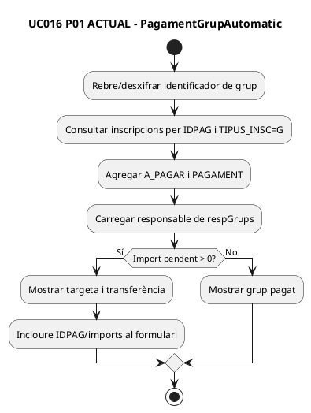

### FINAL

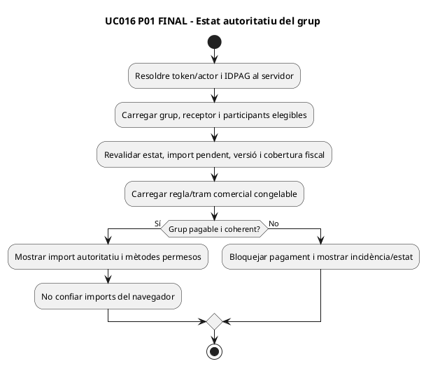

**Estat:** ACTUAL implementat llegat; FINAL pendent de gate de grup i autorització completa.

## P02 · JS de la pàgina de pagament — `mostrarPagamentGrupAutomatic.min.js`

### ACTUAL

El JS carrega la vista per AJAX, valida camps al navegador i acaba enviant el formulari. Aquesta validació és UX, no autoritat de preu.

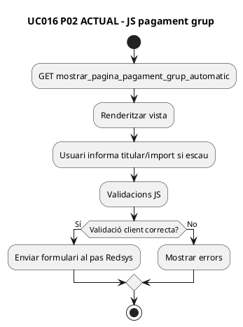

### FINAL

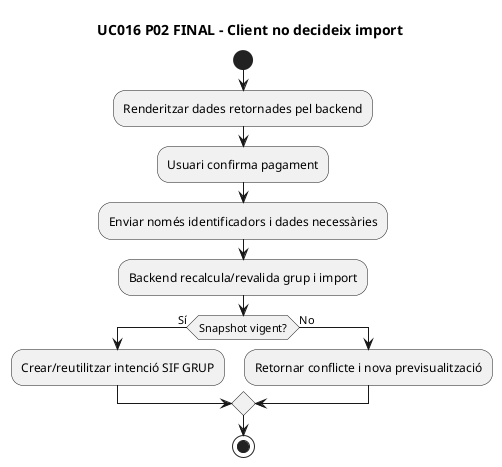

**Estat:** JS ACTUAL localitzat; cal eliminar qualsevol dependència fiscal del valor hidden/client.

## P03 · Preparació Redsys — `pagina_efectuar_pagament_grup_automatic.php`

### ACTUAL

La pàgina conté integració nova per `PACK`: `PackPaymentGate` + `SifPaymentIntentClient`. Per `GRUP` no hi ha un gate equivalent; si no hi ha checkout PACK validat, conserva la URL del callback llegat.

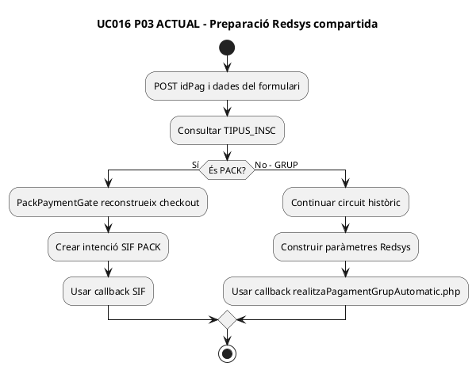

### FINAL

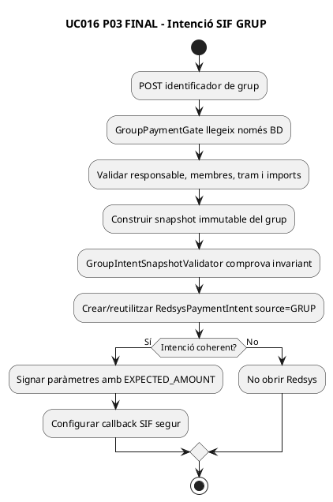

**Estat:** `GroupIntentSnapshotValidator` implementat en la branca d'auditoria; `GroupPaymentGate` i connexió de la pàgina encara pendents.

## P04 · Confirmació al navegador — `mostrarEfectuarPagamentGrupAutomatic.min.js`

### ACTUAL

El botó de confirmació executa `$('#frm').submit()`; no hi ha lògica fiscal pròpia al JS.

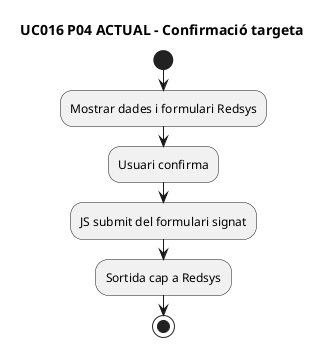

### FINAL

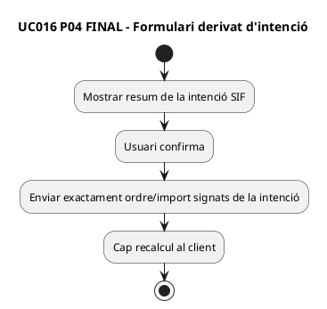

**Estat:** gairebé compatible estructuralment; depèn que P03 sigui autoritatiu.

## P05 · Callback de grup — `realitzaPagamentGrupAutomatic.php`

### ACTUAL

El callback llegat processa resposta Redsys i, en cas autoritzat, consulta el grup, calcula numeració, insereix a `factures` i actualitza pagaments/factura relacionada de les inscripcions.

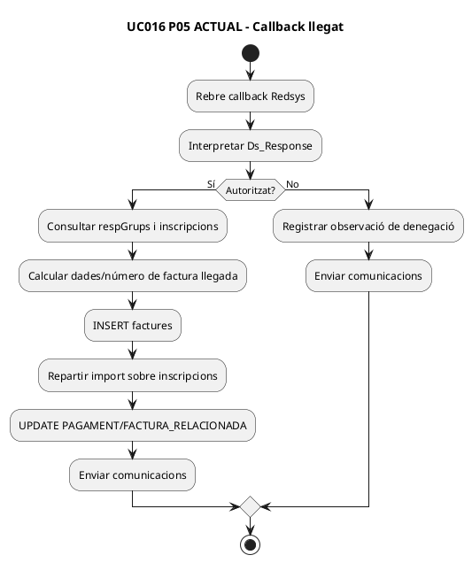

### FINAL

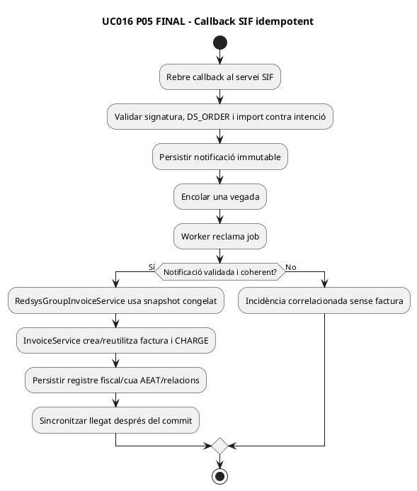

**Estat:** SIF de grup existeix; substitució del callback llegat al canal web pendent.

## P06 · Nucli d'emissió — `RedsysGroupInvoiceService` + builders

### ACTUAL / IMPLEMENTAT SIF

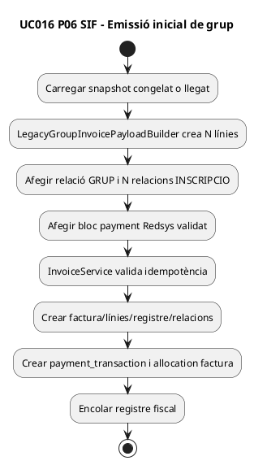

**Verificat al repositori:** tests existents comproven N línies, relacions, `VISIBLE_ALUMNE=0`, idempotència i un únic pagament. La branca afegeix comprovació aritmètica per línia.

### FINAL addicional

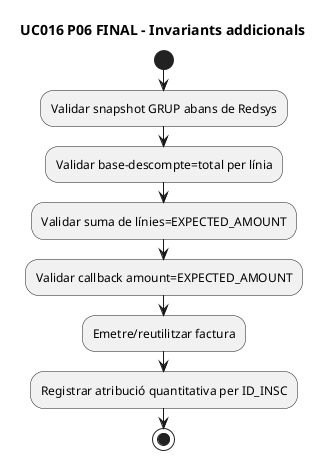

**Pendent:** atribució monetària individual i evidència callback↔intent↔import.

## P07 · Transferència/manual — `ManualGroupInvoiceService`

### ACTUAL SIF

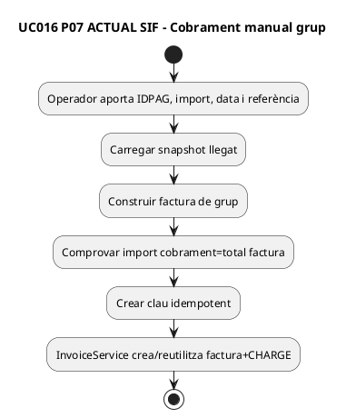

### FINAL

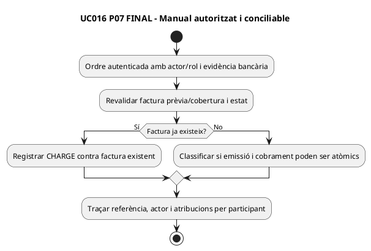

**Estat:** servei SIF implementat/provat en fixtures; integració operativa i permisos finals pendents.

## P08 · Afegir participant després d'emetre — UC-016A

### ACTUAL

No s'ha localitzat un endpoint/coordinador executable específic. Hi ha serveis genèrics d'emissió/rectificació i documentació UML.

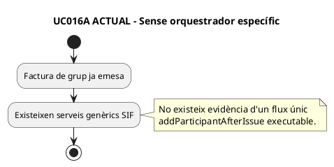

### FINAL

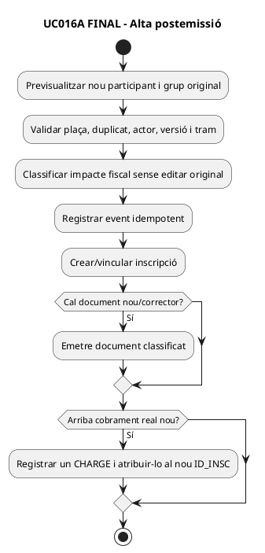

## P09 · Treure participant després d'emetre — UC-016B

### ACTUAL

No s'ha localitzat un coordinador executable de baixa individual de grup facturat.

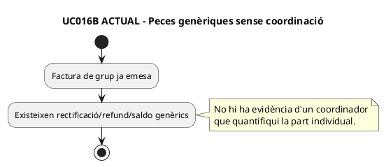

### FINAL

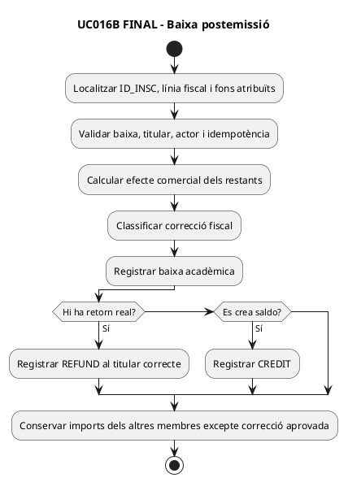

## Matriu final de pàgines/superfícies

| Superfície | ACTUAL | FINAL | Estat |
| --- | --- | --- | --- |
| P01 pagament grup | Llegat, dades agregades | estat autoritatiu | parcial |
| P02 JS pagament | validació client + submit | client no decideix preu | parcial |
| P03 preparar Redsys | SIF només PACK; GRUP llegat | gate + intent GRUP | pendent |
| P04 confirmació | submit Redsys | compatible si intenció és autoritativa | parcial |
| P05 callback | factura/updates llegats | callback+cua+worker SIF | pendent |
| P06 emissió SIF | implementada | completar invariants/ledger | parcial avançat |
| P07 manual | servei implementat | permisos/conciliació/evidència | parcial |
| P08 UC-016A | disseny | coordinador executable | pendent |
| P09 UC-016B | disseny | coordinador executable | pendent |

## Traçabilitat

[UC-016 fitxa](../06-fitxes-funcionals/uc-016.md) · [UC-016 UML](uc-016-facturar-grup.md) · [UC-016A](uc-016a-afegir-participant-grup-emes.md) · [UC-016B](uc-016b-treure-participant-grup-emes.md) · [UC-118 activitats](uc-118-activitats-pagines-grup-actual-final.md) · [UC-091 trams](uc-091-descompte-grup-per-trams.md) · [auditoria](../../00-control/auditoria-uc-016-2026-10-03.md).
