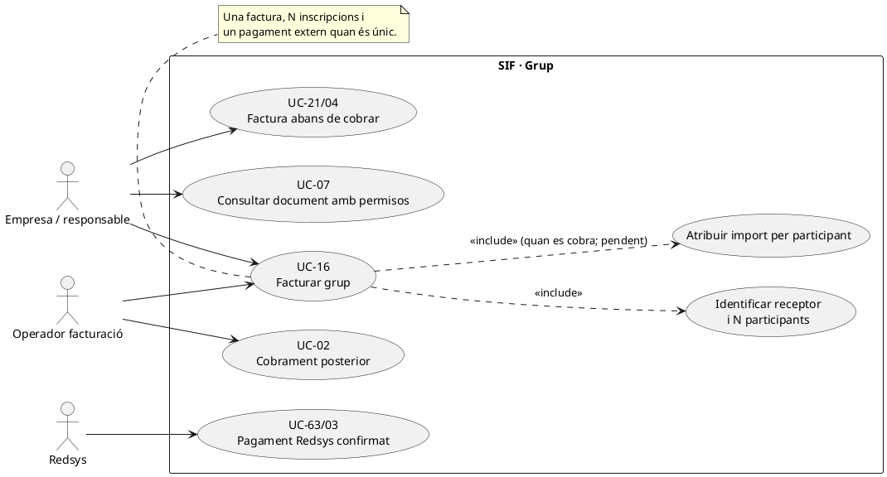
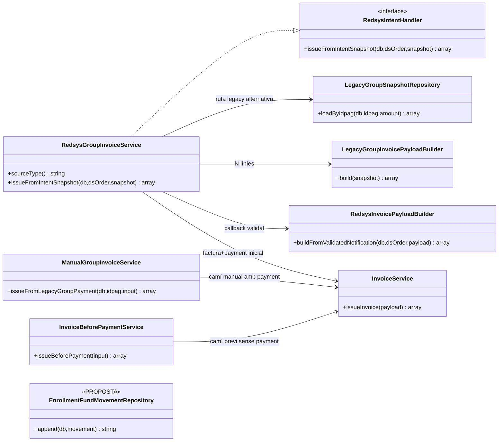
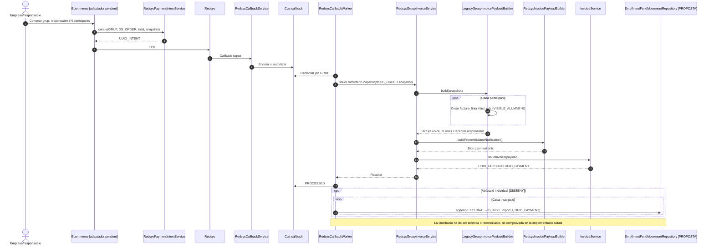
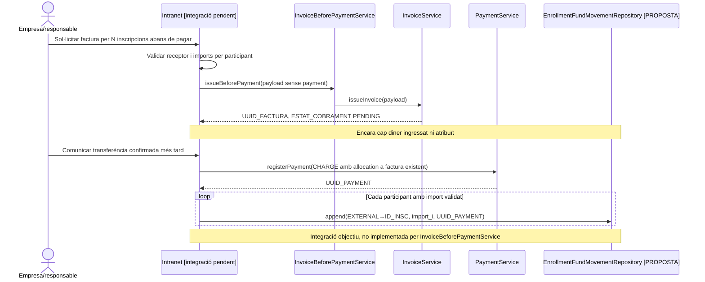

# UC-16 · Facturar un grup — fitxa i UML integrats

**Objectiu:** emetre una factura de grup amb N participants/inscripcions i receptor econòmic-fiscal explícit, sense confondre la identitat del pagador amb els alumnes ni exposar els seus detalls en accés individual. **Dues variants diferenciades:** grup pagat per Redsys en el mateix flux (`RedsysGroupInvoiceService`) i factura de grup abans de cobrar (UC-21/04); la ruta manual de grup que incorpora `payment` inicial **no és** UC-04 sense cobrament.

**Codi revisat:** `RedsysGroupInvoiceService`, `LegacyGroupInvoicePayloadBuilder`, `LegacyGroupSnapshotRepository`, `ManualGroupInvoiceService`, `InvoiceService` i infraestructura UC-63/03. El builder del grup exigeix `responsible` i `items` no buits, amb `inscription`/`course` i `ID` de cada inscrit.

## 1. Fitxa específica

| Element | Regla |
| --- | --- |
| Actors | Empresa, centre o persona responsable que paga; operador, Redsys i worker segons canal. Els participants són subjectes de dades i prestació, no necessàriament receptors de la factura. |
| Entrada de grup | `IDPAG` de l'operació, `responsible` fiscalment identificat i conjunt `items` de participants; cada `inscription.ID`, curs/edició i quantitat individual. |
| Document del builder | `LEGACY|GRUP|IDPAG:<IDPAG>` base, sèrie A/tipus F1, una línia per participant: concepte de grup + curs + persona, `source_type=INSCRIPCIO`, import base/descompte/total propi. |
| Visibilitat | `LegacyGroupInvoicePayloadBuilder` crea relació principal `GRUP` i relacions a inscripcions amb `VISIBLE_ALUMNE=0`. **Aquest indicador al payload no equival a control d'accés efectiu:** UC-07 ha de validar permisos al servidor. |
| Import del pagament | Si es cobra al TPV, una notificació `VALIDATED` origina **un** `payment_transaction CHARGE` per l'import de l'operació i una factura de grup amb N línies. |
| Factura abans de pagar | Si el centre necessita factura abans de fer transferència, UC-21/04 emeten **sense** bloc `payment`, i UC-22/02 registren el cobrament posterior; no cridar la ruta manual de grup amb pagament inicial com si fos aquest flux. |
| Traça per participant | Cal registrar l'import atribuït a cada `ID_INSC` en el ledger proposat, vinculat a un únic `UUID_PAYMENT` real si el grup s'ha cobrat conjuntament. |

### 1.1. Flux principal — grup pagat per Redsys

1. El responsable defineix participants, cursos/edicions, imports/descomptes i dades fiscals. L'adaptador web comprova plaça, coherència del grup, titular, consentiments i visibilitat; **aquestes comprovacions no estan acreditades pel builder fiscal**.
2. UC-63 desa `redsys_payment_intent` amb `SOURCE_TYPE=GRUP`, `DS_ORDER`, import i snapshot congelat de responsable i N participants.
3. Redsys envia callback; UC-03 valida i encua. El worker selecciona `RedsysGroupInvoiceService` amb `SOURCE_TYPE=GRUP`.
4. `LegacyGroupInvoicePayloadBuilder::build()` valida que hi hagi almenys un participant, obté `IDPAG` i receptor del bloc `responsible`, crea una línia i relació `INSCRIPCIO` per persona i calcula totals sumant les línies.
5. `RedsysInvoicePayloadBuilder` incorpora un `payment` inicial amb notificació validada i clau idempotent derivada de `DS_ORDER`; `InvoiceService` crea/reutilitza la factura, registre fiscal, relacions i cobrament inicial.
6. El worker marca `PROCESSED`, conserva UUIDs i deixa pendent la sincronització d'inscripcions/accés si no queda acreditada. El pagament global no s'ha de distribuir per «nombre de participants» sinó pels imports de cada línia.
7. **Requisit addicional pendent:** N atribucions quantitatives `EXTERNAL → INSCRIPCIÓ` referenciant el mateix `UUID_PAYMENT` i, quan sigui possible, `factura_linia` i `payment_allocation`; suma exacta de quantitats efectivament cobrades.
8. L'accés a factura i documents complets queda restringit al receptor/actor autoritzat; no es fa visible a cada alumne la factura amb dades dels altres.

### 1.2. Variants, errors i dades a protegir

| Cas | Comportament |
| --- | --- |
| Grup sense participants o `inscription.ID` invàlid | El builder rebutja la factura de grup. |
| Centre/escola vs grup particular | El receptor fiscal s'identifica segons el responsable real, no es força sempre una entitat. |
| Pagament abans de factura o factura abans de cobrament | Dos circuits diferenciats; la factura sense pagament no crea ni `CHARGE` ni atribucions fins que es confirma l'ingrés. |
| Un participant es dona de baixa | UC-72/16b: identificar la seva línia i la seva part atribuïda, sense retornar o modificar el pagament dels altres participants; UC-05 si correspon. |
| S'afegeix un participant després d'emetre | UC-16a: nova operació amb factura fiscal complementària/rectificació segons classificació, sense modificar la factura anterior. |
| Callback duplicat o de diferent import | UC-03/51; cap duplicació de factura, `CHARGE` o N atribucions. |
| Compartició del document amb tots els alumnes | `VISIBLE_ALUMNE=0` al constructor i restricció efectiva UC-07; un URL filtrat només al front no és suficient. |
| Transferència única per diverses inscripcions | Una entrada bancària, factura/assignació fiscal pertinent i N moviments d'atribució; no crear N transferències externes artificials. |
| Dret a saldo d'una baixa d'alumne pagat per centre | Cal validar el titular real abans d'emetre `REFUND` o saldo; el fet que una inscripció tingui nom d'alumne no prova que sigui creditor. |

**Proves localitzades, no executades:** `RedsysGroupInvoiceServiceTest`, `ManualGroupInvoiceServiceTest`, `ManualGroupInvoicePayloadBuilderTest`. Falta acreditar el control d'accés final i el repartiment dels imports per participant.

## 2. Diagrama UML de casos d'ús

## 3. Subdiagrama de classes

## 4. Seqüència A — grup Redsys

## 5. Seqüència B — factura d'empresa abans del cobrament

## 6. Traçabilitat

[Fitxa base UC-16](../06-fitxes-funcionals/uc-016.md) · [UC-21 factura a responsable](uc-021-empresa-responsable-paga-inscripcions.md) · [UC-07 consulta](uc-007-consultar-factura-estat-document.md) · [Revisió de fons](00-revisio-moviments-inscripcions.md) · [RedsysGroupInvoiceService](../../sif/src/Service/RedsysGroupInvoiceService.php) · [LegacyGroupInvoicePayloadBuilder](../../sif/src/Service/LegacyGroupInvoicePayloadBuilder.php) · [ManualGroupInvoiceService](../../sif/src/Service/ManualGroupInvoiceService.php) · [RedsysGroupInvoiceServiceTest](../../sif/tests/Integration/RedsysGroupInvoiceServiceTest.php).
