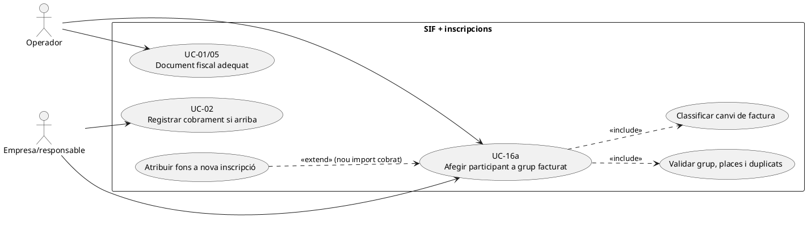
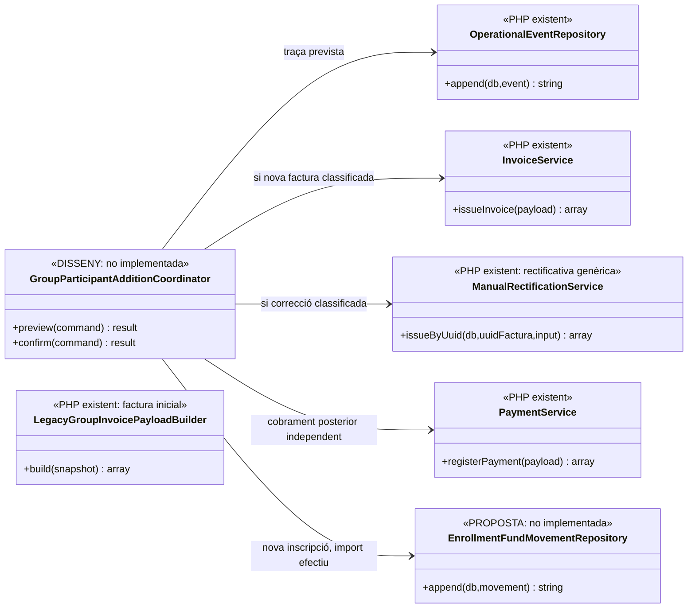

# UC-16a · Afegir un participant després d'emetre la factura de grup

**Funció:** incorporar una nova inscripció a un grup quan la factura original ja existeix. El catàleg indica «**Complementària o rectificativa, mai edició directa**»; la via fiscal concreta, la política de grup i els imports són **decisions pendents**, no un resultat calculat pel servei actual. **Estat:** l'emissió inicial del grup existeix (`RedsysGroupInvoiceService`, `ManualGroupInvoiceService`, `LegacyGroupInvoicePayloadBuilder`); **no s'ha acreditat** un orquestrador executable `addParticipantAfterIssue`.

## 1. Fitxa específica

| Aspecte | Regla |
| --- | --- |
| Actors | Operador de gestió; empresa/responsable pagador quan cal acceptar ampliació de places o import. El participant nou no es converteix automàticament en receptor de la factura de l'empresa. |
| Entrada | `UUID_FACTURA_GRUP`, `ID_INSC_NOVA`, curs/edició/places, import i descompte de la nova persona, receptor i pagador, identificador de la petició, motiu i snapshot abans/després. |
| Condicions | Factura inicial immutable i relacions `fact_rels` existents; `ID_INSC_NOVA` no és una línia ja facturada; curs/edició i preu vigents validats; comprovar si el grup està tancat, aforament i autorització de l'entitat. |
| Efecte acadèmic | Vincular la nova inscripció al grup sense modificar silenciosament les dades fiscals dels participants anteriors. La integració final amb la BD llegada és **pendent**. |
| Efecte fiscal | Classificar si cal factura nova/complementària, rectificativa UC-05 o una altra actuació justificada; **mai** `UPDATE factura_linia` de la factura inicial per fer-hi aparèixer la persona nova. La forma del document depèn de la decisió fiscal del cas real. |
| Efecte econòmic | Si hi ha un nou cobrament efectiu, crear **un** `CHARGE` amb imputació a la factura corresponent i atribució individual a `ID_INSC_NOVA`. Si l'empresa només ha compromès pagar o la factura és anterior al cobrament, **no** crear `CHARGE` ni moviment d'atribució. |
| Sortida i auditoria | `UUID_OPERATIONAL_EVENT`, identificació de factura original i document de correcció/ampliació si s'emet, relació individual amb la nova inscripció i estats separats de pagament i AEAT. |

### 1.1. Flux objectiu

1. L'operador obre la factura de grup i consulta **totes** les línies i relacions existents, els cobraments reals i la titularitat de l'empresa/responsable.
2. Previsualitza la nova persona amb curs/edició, plaça, import, descompte individual, factura i pagador previstos; compara els imports abans/després **sense reconstruir o alterar** les línies antigues.
3. Revalida permisos, no-duplicació de `ID_INSC_NOVA`, capacitat i versió de l'operació. Comandes concurrents o repetides han de retornar conflicte/resultat anterior, no dues places o dues línies fiscals.
4. `OperationalEventRepository::append()` existeix per desar un event amb actor, motiu i snapshots, però **la crida des d'aquest cas no és implementada**. L'orquestrador objectiu registra un expedient d'ampliació i coordina la inscripció llegada.
5. Es determina **quina via fiscal correspon**: el nucli `InvoiceService` pot emetre una factura nova, i `ManualRectificationService` pot crear una rectificativa R; cap dels dos decideix per si sol com ha de tractar-se fiscalment aquesta ampliació d'un grup.
6. Si l'import addicional queda pendent, registrar deute sense cobrament fictici. Si hi ha cobrament nou, UC-02 registra l'ingrés real **una sola vegada** i el ledger proposat l'atribueix a la inscripció nova, no als N participants anteriors.
7. Es mostra estat de cada fase: alta acadèmica, factura nova o rectificativa, pagament i eventual remissió AEAT. Un error en la sincronització llegada no justifica emetre una segona factura.

### 1.2. Variants i riscos

| Escenari | Control |
| --- | --- |
| Factura inicial encara pendent de cobrar | El nou compromís econòmic no es converteix en pagament; classificar si es factura la nova part abans de pagar. |
| Factura inicial ja pagada íntegrament | Conservar l'import atribuït a les persones anteriors; ingressar/atribuir **només** l'import nou que realment es cobra. |
| Un pagament bancari de l'empresa cobreix diversos participants nous | Un `payment_transaction` real amb assignació a factura/factures; diverses atribucions **internes** individualitzades, sense multiplicar ingressos. |
| Participant ja inclòs a la factura | Bloquejar duplicació de línia i plaça; comprovar `fact_rels` i inscripció llegada abans de confirmar. |
| Descompte de pack/grup redeterminat per augmentar persones | Previsualitzar regla i conseqüència fiscal; no recalcular retrospectivament les línies originals sense la correcció formal pertinent. |
| Documentació o receptor de la factura original incorrectes | Derivar a classificació UC-05/30/31 segons problema real, no aprofitar l'alta de la persona nova per editar la factura antiga. |

**Límit del codi existent:** `LegacyGroupInvoicePayloadBuilder::build()` construeix el **grup complet al moment de l'emissió inicial**, no un delta segur després d'emetre. `ManualRectificationPayloadBuilder::forOriginalInvoice()` crea una rectificativa genèrica d'**una sola línia**, no un constructor verificat de «nova persona de grup». La integració específica i les proves resten pendents.

### 1.3. Afegit a factura prèvia i preu per trams — contrast amb el xat original

El xat confirma que, **després de generar una factura real abans de pagar**, una empresa pot afegir finalment un participant. La factura original ja existeix encara que el seu cobrament sigui `PENDING`; no afegir una línia en lloc, no suprimir la factura ni emetre una altra factura global com si el grup inicial no existís. Localitzar `UUID_FACTURA`, `FACTURA_RELACIONADA` llegada, `IDPAG`, les relacions de participants i els enllaços individuals abans de determinar la nova operació fiscal. L'event d'alta es vincula a la factura original i al pagador efectiu.

El preu per participant s'obté segons `descomptes_grup` i el tram comercial **pot canviar** amb el nou nombre de persones. La previsualització ha de separar **l'import de la persona nova** de l'eventual canvi de preu que afecti les persones ja facturades; la correcció d'aquestes últimes requereix classificació independent, no un import únic indistingible ni un recàlcul de `A_PAGAR` que modifiqui silenciosament la factura original. La tarifa/tram concret i el SQL efectiu del producte s'han de confirmar al canal de gestió, no deduir del builder de factura.

Si l'empresa encara no ha pagat la factura anterior, afegir una persona crea una **obligació pendent**, no un `CHARGE` nou. Cal determinar si l'import de la persona nova s'incorpora en factura posterior o mitjançant una altra correcció fiscal formalment classificada; cap via es tria automàticament pel simple fet que la factura original estigui pendent. Si l'empresa fa **un sol ingrés real** per dues factures de grup existents, UC-22/105 ha de fer un sol moviment bancari amb assignacions explícites a ambdues, sense duplicar factura o pagament.

Quan una nova inscripció queda coberta per la factura del responsable, evitar que pugui pagar-la també pel seu enllaç individual. La revocació s'ha de fer al servidor i coordinada amb intencions Redsys pendents (UC-33/50), no només desactivar el botó a la intranet de l'alumne. Un callback individual ja iniciat requereix conciliació abans d'atribuir els fons al grup.

### 1.4. Proves d'afegit de participant (no executades)

| ID | Cas | Resultat exigible |
| --- | --- | --- |
| GA-01 | Factura prèvia PENDING, nou participant | Original i número intactes; nova part fiscal classificada i sense CHARGE fictici. |
| GA-02 | Afegit que canvia tram de `descomptes_grup` | Import persona nova i variació de participants antics diferenciats; correcció formal si correspon. |
| GA-03 | Participant nou amb pagament individual Redsys en procés | Cobertura suspesa o conciliada; sense doble cobrament ni factura duplicada. |
| GA-04 | Empresa paga amb una transferència dues factures relacionades | Un ingrés real i dues assignacions a UUID_FACTURA; cap pagament global duplicat. |
| GA-05 | Reintent de la mateixa alta | Un únic ID_INSC nou i un sol event/efecte fiscal idempotent. |
## 2. Diagrama UML de casos d'ús



## 3. Diagrama de classes — peces reals i orquestració pendent



## 4. Seqüència objectiu — alta d'una persona, fiscalitat i diners separats

```mermaid
sequenceDiagram
autonumber
actor O as Operador
participant UI as Intranet grup [pendent]
participant C as GroupParticipantAdditionCoordinator [DISSENY]
participant G as BD d'inscripcions llegada
participant E as OperationalEventRepository [PHP]
participant F as Classificació fiscal [pendent]
participant I as InvoiceService / ManualRectificationService [PHP]
participant P as PaymentService [PHP]
participant L as Ledger per inscripció [PROPOSTA]
O->>UI: Afegir inscripció B a grup amb factura F original
UI->>C: preview(F,B,import,descompte,actor)
C->>G: Consultar grup, B, places i participants facturats
C->>F: Comparar document original i ampliació
F-->>C: Via fiscal per decidir, import addicional i receptor
C-->>UI: Previsualització i advertiments
O->>UI: Confirmar petició idempotent
UI->>C: confirm(command)
C->>C: Revalidar permisos, versió i no-duplicació
C->>E: append(event ampliació amb abans/després)
C->>G: Crear/vincular participant B amb traça
opt Document fiscal de nova part/correcció classificada
 C->>I: Emetre nova factura o rectificativa del cas
 I-->>C: UUID del document emès
end
alt Import compromès però encara no cobrat
 C-->>UI: Inscripció/documents i deute pendent; cap CHARGE
else Nou pagament extern confirmat
 C->>P: registerPayment(CHARGE real, factura que pertoqui)
 P-->>C: UUID_PAYMENT nou
 C->>L: append(EXTERNAL→B, import cobrat, UUID_PAYMENT)
 C-->>UI: Estat de fases i fons de B
end
Note over C,G: Orquestració i registre de fons NO implementats; no modificar factura F original.
```

## 5. Traçabilitat

[Fitxa UC-16a original](../06-fitxes-funcionals/uc-016a.md) · [UC-16 grup](uc-016-facturar-grup.md) · [UC-05 rectificació](uc-005-rectificar-factura.md) · [UC-02 cobrament](uc-002-registrar-cobrament-factura.md) · [UC-71 canvi](uc-071-registrar-canvi-curs-complet.md) · [Revisió fons per inscripció](00-revisio-moviments-inscripcions.md) · [LegacyGroupInvoicePayloadBuilder](../../sif/src/Service/LegacyGroupInvoicePayloadBuilder.php) · [ManualRectificationService](../../sif/src/Service/ManualRectificationService.php) · [OperationalEventRepository](../../sif/src/Repository/OperationalEventRepository.php).

**Sense proves executades.** Bloquejants de tancament: política d'ampliació, classificació fiscal, autorització empresa/responsable, ledger individual, transacció amb llegat i prova d'idempotència.
