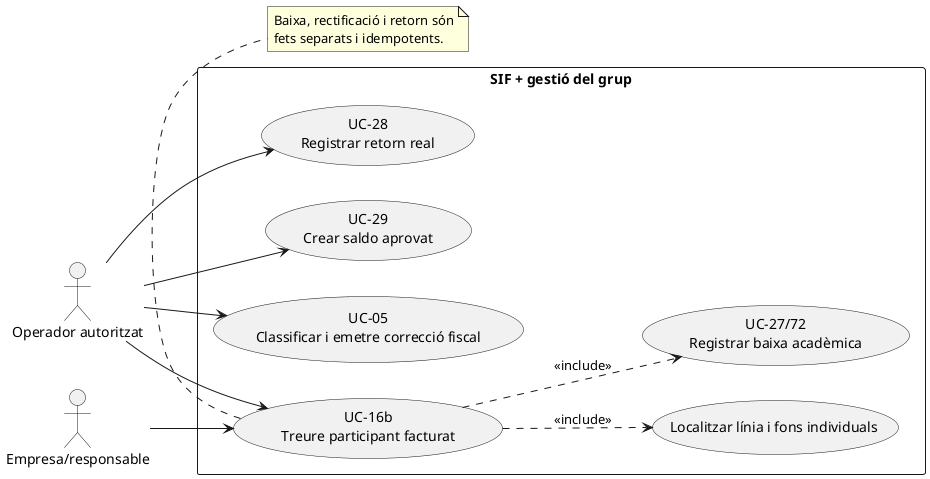
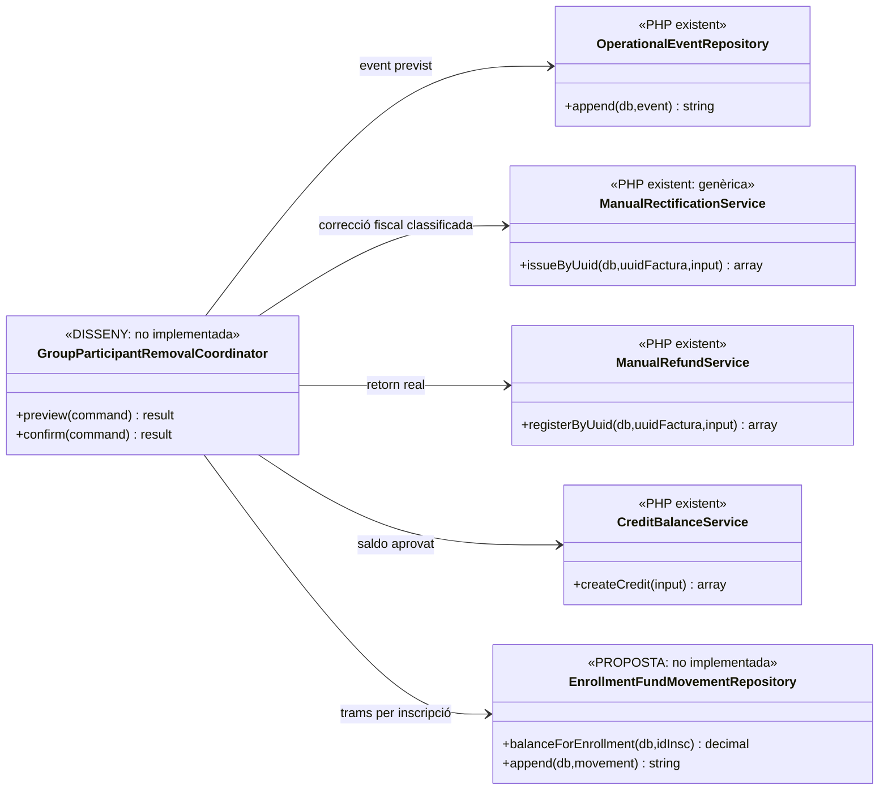

# UC-16b · Treure un participant després d'emetre la factura de grup

**Funció específica:** retirar **una inscripció concreta** d'un grup amb factura ja emesa, conservant la història del grup, el receptor fiscal i la part dels altres participants. El catàleg exigeix **rectificativa i possible devolució/saldo**, no la reescriptura de la factura. **Estat del codi:** existeixen `ManualRectificationService`, `ManualRefundService`, `CreditBalanceService`, `OperationalEventRepository` i el builder de factura **inicial** de grup, però **no s'ha acreditat** un orquestrador PHP que executi la baixa individual, classifiqui la rectificació del document conjunt i decideixi el destí monetari individual.

## 1. Fitxa funcional específica

| Element | Regla |
| --- | --- |
| Actors | Operador autoritzat i empresa/responsable titular econòmic, si correspon. L'alumne de baixa pot no ser qui va ingressar els diners. |
| Entrada | `UUID_FACTURA` de grup, `ID_INSC` a retirar, línia/relació de factura corresponent, `IDPAG` o referència de cobrament, curs/edició, motiu, data, estat acadèmic i regla de devolució aplicable. |
| Precondicions | Participant efectivament inclòs a aquest grup i a la factura original; la inscripció no ha estat donada de baixa abans; factura emesa immutable; autorització i import **atribuït realment a la persona concreta**. |
| Efecte acadèmic | UC-27/72 registra la baixa de la inscripció i l'event amb abans/després; **no** dona de baixa altres membres del grup per error. |
| Efecte fiscal | Corregir la factura de grup pel procediment que correspon, conservant l'original i creant la rectificativa quan pertoqui (UC-05). La línia del participant retirat i el descompte del grup són dades per calcular la correcció; **no editar directament `factura_linia` original**. |
| Efecte econòmic | Distingir quantitat realment cobrada i atribuïda a l'inscrit, import no retornable justificat, devolució real al titular, import convertit en saldo i possibles diferències de preu sobre els altres participants. **Cada tram executat requereix traça per inscripció i titular.** |
| Resultat | Event de baixa amb UUID/correlació, decisió econòmica per tram, factura/rectificativa i `UUID_PAYMENT` de devolució **només si el retorn ha tingut lloc**; altres participants amb la mateixa atribució que abans, llevat de correcció expressament aprovada. |

### 1.1. Flux objectiu de la baixa parcial

1. L'operador localitza el participant i la **seva** `factura_linia.SOURCE_ID` i/o relació `fact_rels`; consulta el grup original, receptor, preu, descomptes i pagaments. **Una relació a factura no diu per si sola l'import cobrat atribuït a l'inscrit**: cal la traça quantitativa proposta.
2. La previsualització separa `IMPORT_FACTURAT_PARTICIPANT`, `FONS_ATRIBUITS`, `IMPORT_PENDENT`, `RETORNABLE`, `NO_RETORNABLE`, `SALDO` i efecte sobre el preu/descompte dels altres membres. Cap import es pren automàticament de la quota global del grup.
3. Es comproven actor/titular, condicions de baixa, conflicte de concurrència, que la inscripció encara és activa i que no s'ha fet ja el retorn o la baixa per una petició equivalent.
4. El contracte objectiu registra l'event de baixa amb snapshots i enllaç a inscripció/línia. `OperationalEventRepository::append()` existeix, però **no s'ha trobat el coordinador que l'executi amb la BD llegada**.
5. Es modifica únicament l'estat acadèmic del participant, amb històric i reconciliació; la factura original manté els N participants tal com van quedar emesos. La classificació fiscal decideix el document corrector i l'import corresponent.
6. **`ManualRectificationPayloadBuilder::forOriginalInvoice()` és un constructor genèric de rectificativa d'una línia amb import indicat, no un càlcul de línia de grup ni de descomptes postbaixa**: cal validar import i camp fiscal abans de cridar-lo.
7. Si hi ha diners cobrats atribuïts a l'inscrit i es retornen **de debò**, UC-28 registra `payment_transaction REFUND`; el ledger proposat registra `INSCRIPCIÓ → EXTERNAL` vinculant `UUID_PAYMENT` del retorn i el titular. Si es concedeix saldo de diner cobrat, UC-29 i moviment `INSCRIPCIÓ → CREDIT`; una baixa sense devolució no genera cap sortida fictícia.
8. Si el pagament global era d'empresa, es preserven els imports atribuïts a les altres inscripcions i no es retorna l'import a l'alumne per defecte. Si canvia l'economia de tot el grup per un descompte, es classifica **una altra correcció** expressa i es reassignen imports mitjançant moviments interns justificats.
9. Es mostra el resultat separat: inscripció de baixa, document fiscal corregit, devolució efectuada o pendent, saldo i conciliació entre sistemes. No afirmar «complet» si falta una fase de retorn/acreditació.

### 1.2. Variants i errors

| Variant | Efecte |
| --- | --- |
| Factura de grup emesa abans de cobrar, import participant encara no cobrat | Baixa i correcció fiscal quan pertoqui; **cap `REFUND`** de diners inexistents. |
| Pagament global de 500 € per cinc persones, una baixa de 100 € | Una entrada original de 500 €, quatre atribucions de 100 € no afectades, i una sortida de 100 € de l'inscripció de baixa **només si es retorna realment**; no cinc devolucions ni un segon `CHARGE`. Exemple il·lustratiu, no preus reals de PrisMa. |
| Retorn de 40 € i saldo de 60 € d'una quota de 100 € ja cobrada | Dos moviments independents per la mateixa inscripció: `REFUND_EXIT` 40 € i `CREDIT_CREATE` 60 €, correlacionats a l'event; no retornar 100 € addicionals. |
| Canvi de descompte de grup en quedar quatre persones | Revisar contracte comercial i facturació de **tots** els membres afectats; no alterar les seves línies fiscals existents ni els seus pagaments originals. |
| Participant de baixa però empresa no accepta devolució | Desar decisió/titular i condicions, sense sortir diners fins que es tramita un retorn real; efecte fiscal separat. |
| Retry de baixa, rectificativa o retorn | Cadascuna d'aquestes operacions exigeix clau pròpia idempotent i traça, amb recuperació del resultat anterior. |
| Falla la baixa llegada després de confirmar el document fiscal | Incidència amb correlació i conciliació; el segon intent no pot tornar a generar un altre document ni un altre retorn bancari. |

**Falta implementar:** càlcul fiscal específic de retirada del grup, orquestració entre BD acadèmica i fiscal, idempotència global, permisos, ledger d'atribució individual i proves d'import per participant. La fitxa original no acredita aquesta execució.

## 2. Diagrama UML de casos d'ús



## 3. Subdiagrama de classes: existent i orquestració pendent



## 4. Seqüència objectiu — baixa individual d'un grup facturat

```mermaid
sequenceDiagram
autonumber
actor O as Operador
participant UI as Intranet [pendent]
participant C as GroupParticipantRemovalCoordinator [DISSENY]
participant Legacy as Grup i inscripcions llegades
participant L as Ledger per inscripció [PROPOSTA]
participant Ev as OperationalEventRepository [PHP]
participant F as Classificació fiscal [pendent]
participant Rect as ManualRectificationService [PHP]
participant R as ManualRefundService [PHP]
participant Cr as CreditBalanceService [PHP]
O->>UI: Retirar inscrit A de factura de grup F
UI->>C: preview(F,A,motiu)
C->>Legacy: Comprovar A i altres participants
C->>L: Saldo cobrat atribuït exclusivament a A
L-->>C: Origen del pagament i import disponible
C->>F: Import/servei del grup abans/després
F-->>C: Criteri de correcció pendent de validar
C-->>UI: Previsualització baixa, rectificativa i retorn/saldo
O->>UI: Confirmar amb actor, titular i idempotència
UI->>C: confirm(command)
C->>Ev: append(event baixa A, snapshots)
C->>Legacy: Donar de baixa només A amb històric
opt Correcció fiscal classificada
 C->>Rect: issueByUuid(F, input validat)
 Rect-->>C: UUID_FACTURA_RECTIFICATIVA
end
alt Sense diners cobrats/retorn aprovat
 C-->>UI: Baixa, document i deute, sense REFUND
else Retorn real executat
 C->>R: registrar REFUND amb import d'A
 R-->>C: UUID_PAYMENT_REFUND
 C->>L: append(A→EXTERNAL,import retornat,UUID_PAYMENT_REFUND)
else Import d'A transformat en saldo
 C->>Cr: createCredit(titular,import)
 Cr-->>C: UUID_CREDIT
 C->>L: append(A→CREDIT,import,UUID_CREDIT)
end
C-->>UI: Fases executades i pendents
Note over C,L: No alterar les atribucions dels altres participants ni cobrar una segona vegada
```

## 5. Traçabilitat

[UC-16b original](../06-fitxes-funcionals/uc-016b.md) · [UC-16 grup](uc-016-facturar-grup.md) · [UC-27 baixa](uc-027-donar-de-baixa.md) · [UC-72 expedient](uc-072-registrar-baixa-decisio-economica.md) · [UC-05 correcció](uc-005-rectificar-factura.md) · [UC-28 retorn](uc-028-registrar-devolucio.md) · [UC-29 saldo](uc-029-crear-saldo.md) · [Revisió fons individual](00-revisio-moviments-inscripcions.md) · [ManualRectificationService](../../sif/src/Service/ManualRectificationService.php) · [OperationalEventRepository](../../sif/src/Repository/OperationalEventRepository.php).

**No s'han executat proves PHP ni s'ha acreditat la classificació fiscal d'aquest cas a un entorn real.**
