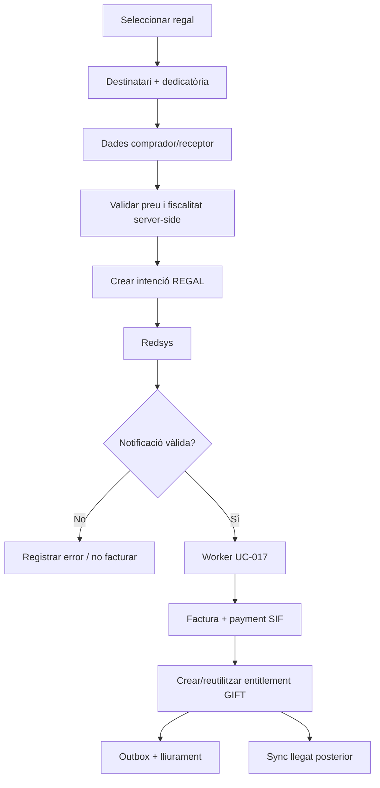

# UC-017 · Activitats per pàgina i apartat ACTUAL / FINAL

## Pàgina 1 · Catàleg de regals
**ACTUAL:** `pagina_regal.php` + `mostrar_pagina_regal.php` + `mostrar_cursos_regal.php`.

**FINAL:** mateixa UX possible, però les dades de producte/preu han de provenir d'un snapshot server-side versionat.

## Pàgina 2 · Destinatari i dedicatòria
**ACTUAL original:** el JS conservava `desti`, `origen`, `dedicatoria` i els enviava per GET junt amb preu/hores/percentatge per construir el formulari.

**FINAL candidat:** l'endpoint del formulari només accepta POST+CSRF i rep el `codiCurs`; preu/hores/descompte es recalculen al servidor i els camps personals es repoblen localment al DOM. Són dades comercials del regal, no receptor fiscal ni identitat del futur alumne.

## Pàgina 3 · Previsualització
**ACTUAL original:** `previsualitza_regal.php` rebia contingut per GET i mostrava/creava el codi a la UX.

**FINAL candidat:** POST+CSRF de sessió, `Cache-Control: private, no-store`, codi generat server-side, estil validat contra configuració i contingut personal escapat abans d'entrar a HTML. La previsualització no permet fabricar/forçar un codi arbitrari.

## Pàgina 4 · Dades comprador/receptor fiscal
**ACTUAL:** formulari de comprador dins del wizard JS.

**FINAL:** validació server-side, snapshot fiscal immutable abans de cobrar.

## Pàgina de pagament
**ACTUAL:** `pagina_efectuar_pagament_regal_automatic.php`.
- genera `DS_ORDER=time()`;
- usa import rebut del flux web;
- conté configuració Redsys al PHP;
- callback inclou dades per GET.

**FINAL:** crear intenció SIF idempotent i construir Redsys exclusivament des del snapshot persistent.

## Callback
**ACTUAL:** `realitzaPagamentRegalAutomatic.php`.
- factura al llegat;
- actualitza `regal.FACT_REL`;
- envia correus.

**FINAL:** callback mínim, autenticació criptogràfica, persistència notificació i encolat. Sense factura ni correu dins HTTP.

## Confirmació
**ACTUAL:** `respostaOkPagamentRegal.php` informa que el pagament s'ha registrat.

**FINAL:** la UI només pot afirmar estats confirmats pel SIF; si la factura/dret encara és asíncron, mostrar estat de processament i oferir recuperació segura.

## Activitat global FINAL

## Estat candidat per pantalla — 2026-10-03

| Pantalla/entrada | Candidat |
| --- | --- |
| wizard de regal | es manté; dades econòmiques deixen de ser autoritat |
| pàgina de pagament | integrada amb `SifRedsysGiftIntentClient` |
| MerchantURL | commutable a callback SIF amb flags |
| callback llegat | validat i fail-closed; 410 després del cutover |
| URL OK | consulta estat SIF; no afirma èxit pel retorn del navegador |
| URL KO | consulta estat SIF; distingeix denegat/pending/review |
| correu confirmació | substituït en camí final per outbox idempotent |

Falta demostrar aquestes pantalles/entrades en el domini desplegat de preproducció.

## Revalidació de pàgines i desplegament — 2026-10-04

### Pàgina de pagament ACTUAL real
`pagina_pagament_regal_automatic.php`
-> `mostrarPagamentRegal.min.js`
-> `ajax/mostrar_pagina_pagament_regal_automatic.php`
-> `web-actual/PagamentRegalAutomatic.php`.

### Pàgina de pagament FINAL candidata
El pas FINAL ha d'acabar a l'overlay `pay-prisma-cat-canvis-verifactu`, on:
1. la identitat del regal arriba en `giftToken` HMAC;
2. el pay verifica el token;
3. crea/reutilitza una intenció REGAL al SIF;
4. Redsys rep import/ordre autoritatius;
5. MerchantURL deriva al callback SIF quan el cutover està activat.

**Gate de desplegament:** conservar les dues còpies al repositori no prova quin codi
executa el domini. Cal evidència del DocumentRoot/routing de test i preproducció.
