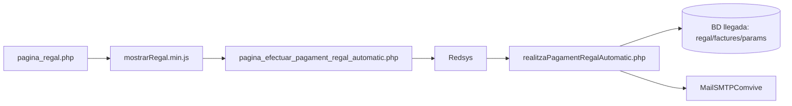
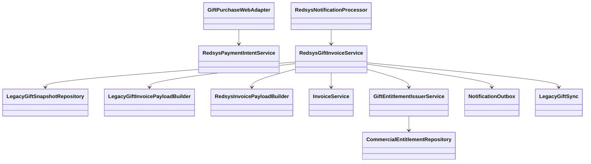
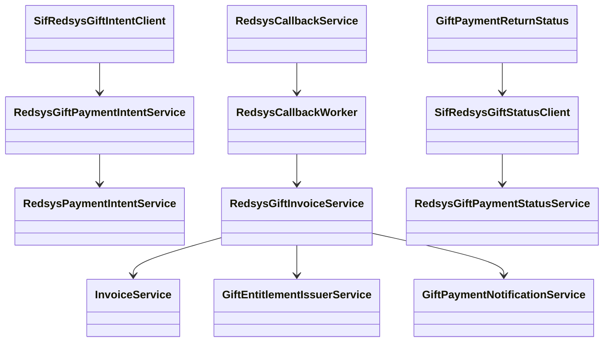

# UC-017 · Classes i components ACTUAL / FINAL

## ACTUAL

### Responsabilitats observades
- UI/JS: selecció, destinatari, dedicatòria, dades comprador, previsualització.
- PHP pagament: crea `DS_ORDER`, import i paràmetres Redsys.
- Callback llegat: interpreta resposta, factura, actualitza regal i envia correu.
- BD llegada: continua sent font de numeració i escriptura fiscal en aquest circuit.

## FINAL

## Estat per component

| Component | Estat |
| --- | --- |
| Wizard web regal | ACTUAL llegat + hardening candidat de reserva/preview |
| Adapter web/pay-prisma -> SIF | IMPLEMENTAT EN CANDIDATA |
| Intenció Redsys REGAL | IMPLEMENTADA EN CANDIDATA |
| `RedsysGiftInvoiceService` | IMPLEMENTAT |
| `LegacyGiftSnapshotRepository` | IMPLEMENTAT |
| `LegacyGiftInvoicePayloadBuilder` | IMPLEMENTAT + AEAT fail-closed |
| `GiftEntitlementIssuerService` | IMPLEMENTAT |
| Outbox compra regal | IMPLEMENTAT EN CAMÍ SIF |
| Sync posterior llegat | IMPLEMENTAT POST-SIF |
| Callback llegat | ACTIU NOMÉS A CÒPIA/ROLLBACK; 410 DESPRÉS CUTOVER+DRAIN |
| Preproducció | PENDENT D'EXECUCIÓ/EVIDÈNCIA |

## Implementació FINAL reconciliada — 2026-10-03

El diagrama FINAL deixa de ser exclusivament objectiu per als components següents,
que ja existeixen a la branca candidata:

La seva existència al repositori no prova desplegament productiu.
