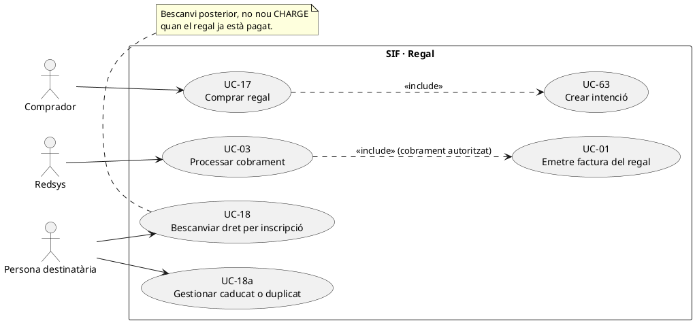
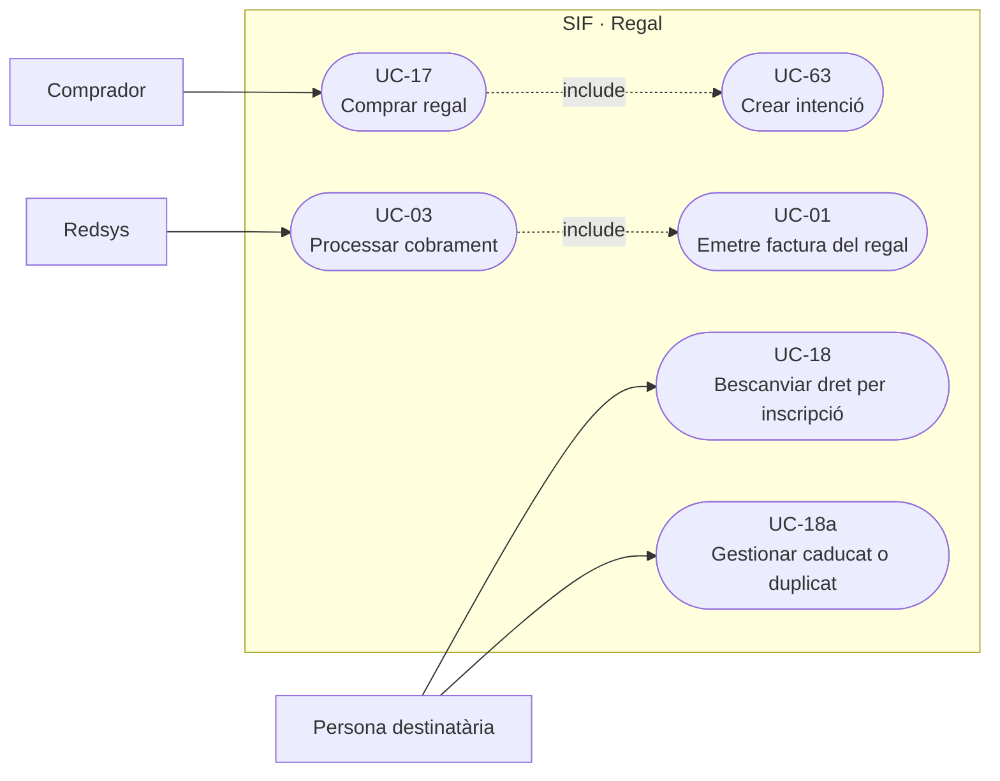
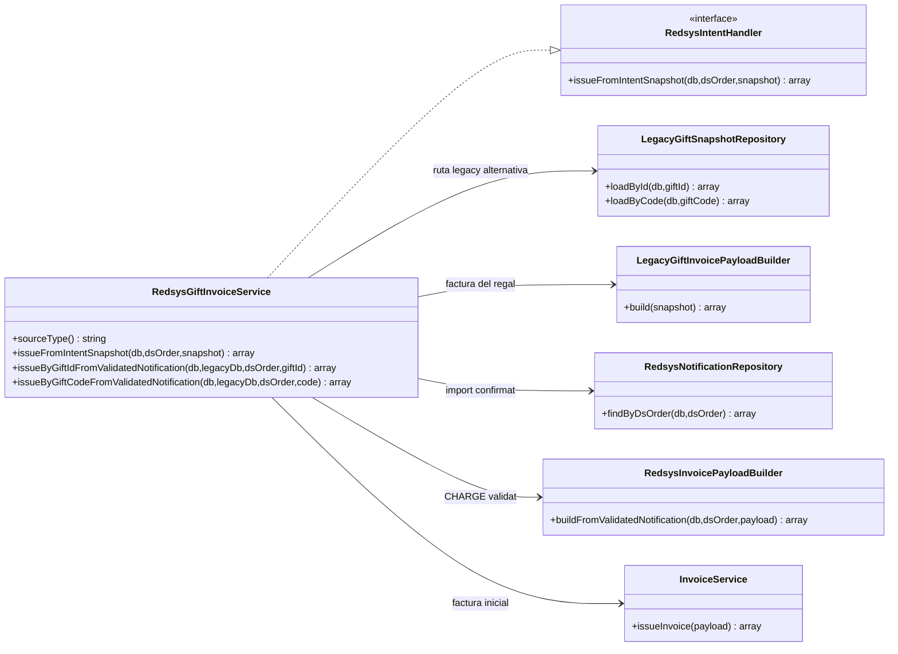
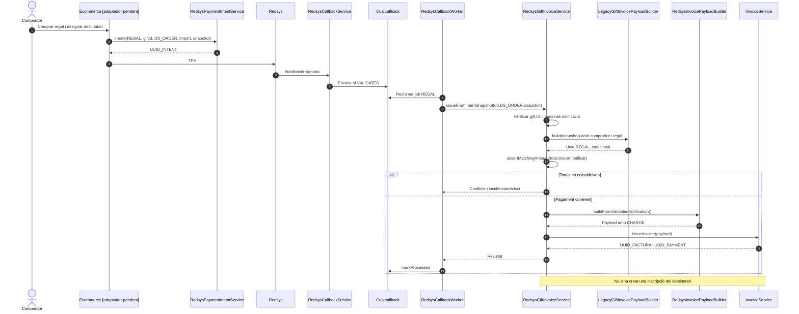
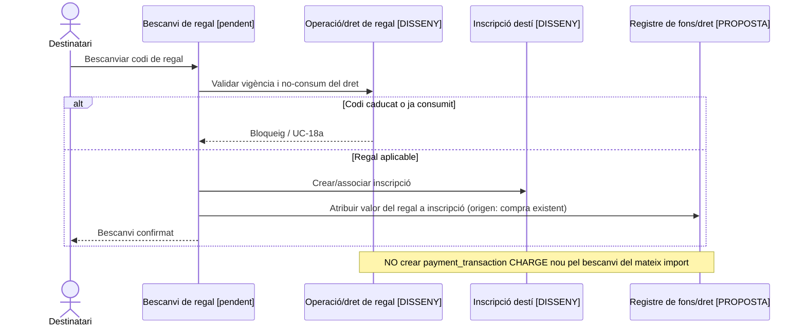
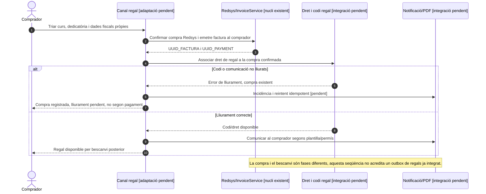

# UC-17 · Comprar un regal — fitxa i UML integrats

**Objectiu:** registrar la **compra pagada d'un regal** i la seva factura fiscal a nom del comprador/receptor que correspongui; el bescanvi posterior del codi i la inscripció de la persona destinatària són **UC-18** i no s'han de deduir automàticament de l'emissió del regal.

**Codi consultat:** `RedsysGiftInvoiceService`, `LegacyGiftSnapshotRepository`, `LegacyGiftInvoicePayloadBuilder`, `RedsysInvoicePayloadBuilder`, `InvoiceService` i infraestructura UC-63/03. A diferència d'un curs ordinari, el constructor crea línia `source_type=REGAL`, relació `REGAL` amb `VISIBLE_ALUMNE=0` i dades del comprador, destinatari, codi i origen del regal.

## 1. Fitxa del cas

| Camp | Dades específiques |
| --- | --- |
| Actors | Comprador/pagador, Redsys, worker SIF. La persona destinatària participa posteriorment a UC-18; no és necessàriament qui paga o qui rep la factura. |
| Identitat del regal | `gift.ID` positiu o identificació per codi a la ruta llegat, `gift.IMPORT` positiu, `gift.CODI`, curs associat i dades del comprador/receptor fiscal. |
| Clau de factura | Base `LEGACY|REGAL|ID:<ID>`, substituïda en la ruta Redsys per una clau amb origen/IDPAG/DS_ORDER; bloc `payment` del `CHARGE` validat. |
| Factura | Línia `Curs regal <títol>`, detall amb el codi del regal en el payload del builder, relació `REGAL` i `visible_alumne=0`. |
| Pagament | Una compra Redsys confirmada equival a un `CHARGE` real; la factura i el cobrament neixen a través d'UC-01 des del worker, no en generar intenció UC-63. |
| Bescanvi posterior | UC-18 ha d'associar el dret del regal a una inscripció concreta, conservant el codi i la identitat de la compra; **no crear un segon `CHARGE` per un bescanvi gratuït d'un regal ja cobrat**. |

### 1.1. Flux principal de compra

1. El comprador selecciona regal i curs, indica dades del destinatari i del comprador/receptor fiscal, i confirma el preu; l'adaptador de compra crea `redsys_payment_intent` amb `SOURCE_TYPE=REGAL`, identificador numèric del regal, `DS_ORDER`, import i snapshot.
2. Redsys notifica resultat signat; UC-03 valida ordre, import, divisa i terminal i encua feina de confirmació sense emetre factura en HTTP.
3. El worker selecciona `RedsysGiftInvoiceService::issueFromIntentSnapshot()`. Aquest mètode valida l'ID del regal dins del snapshot i comprova que la notificació sigui `VALIDATED`.
4. `LegacyGiftInvoicePayloadBuilder::build()` valida import, codi, títol de curs i dades del comprador i prepara factura amb línia/relació de `REGAL`. `RedsysGiftInvoiceService::assertMatchingAmount()` verifica que l'import de factura coincideixi amb la notificació real.
5. `RedsysInvoicePayloadBuilder` adjunta el cobrament inicial i identificadors Redsys; `InvoiceService::issueInvoice()` crea/reutilitza factura i moviment de pagament, registre fiscal, cadena, cua i relació al regal.
6. El worker conserva els identificadors i marca el job com a processat. El codi o dret del regal s'ha de custodiar amb accés/estatus propi, sense donar per executat el bescanvi ni crear encara inscripció del destinatari.
7. **En el model d'atribució monetària proposat, l'import del regal encara no s'atribueix a una inscripció de destí inexistent:** ha de vincular-se primer al **dret/operació de regal** i registrar-se la seva aplicació a una inscripció concreta a UC-18, sense comptar de nou un cobrament extern.

### 1.2. Alternatives, errors i decisions pendents

| Cas | Comportament |
| --- | --- |
| Snapshot sense ID de regal vàlid | El handler rebutja l'emissió; no ha de consumir un altre regal arbitràriament. |
| Import del regal diferent del confirmat per Redsys | `assertMatchingAmount()` retorna conflicte; no facturar per una xifra reconstruïda que no coincideix amb el pagament. |
| Compra denegada o intenció abandonada | No hi ha `CHARGE` ni factura de compra per aquest intent. |
| Callback duplicat/worker repetit | Reutilitzar pagament, factura i dret de regal; no crear nous fons/inscripcions. |
| Destinatari diferent del comprador | No donar accés al PDF complet del comprador al destinatari; `visible_alumne=0` al builder, subjecte a UC-07 en servidor. |
| Regal sense bescanviar, caducat o bescanviat dues vegades | UC-18/18a: control de vigència, consum únic, historial, possible devolució/saldo; **no** modificar la factura original silenciosament. |
| Regal bescanviat per curs de preu diferent | UC-18 ha de classificar diferencial, descompte, beneficiari i possible pagament nou, amb atribució monetària separada; `RedsysGiftInvoiceService` no resol aquesta regla. |
| Informació sensible del codi al PDF/URL | La custòdia del codi i els permisos han de revisar-se per evitar exposició indeguda. |
| Origen dels diners al bescanvi | Conservar `UUID_PAYMENT` de la compra i l'operació `REGAL`; no atribuir ingrés extern nou a la inscripció beneficiària. |

**Proves localitzades, no executades:** `RedsysGiftInvoiceServiceTest`, `RedsysGiftPreflightScriptTest`, `RedsysGiftPreproductionScriptTest`. No demostren UC-18 ni el registre de saldo/atribució del dret de regal a la inscripció final.

### 1.3. Dades de comprador, destinatari i lliurament del regal — contrast amb el xat original

**Circuit narrat per PrisMa:** la persona compradora entra a «Regalar un curs», escull el curs o tipus de curs, pot escriure una **dedicatòria** i facilita les **seves dades fiscals**. Un cop pagat, rep un **codi per bescanviar**. La persona destinatària encara **no ha aportat totes les seves dades d'alumne ni disposa necessàriament d'una inscripció definitiva** en el moment de la compra; omple les dades d'inscripció més endavant, quan bescanvia el codi (UC-18). No exigir l'ID_INSC final del destinatari com a precondició d'UC-17 ni utilitzar-lo fictíciament per justificar la factura inicial.

**Identitats i accés:** el comprador, la persona a qui es dedica el regal i el participant que finalment es matricula poden ser subjectes diferents. La factura es genera a nom del **comprador/receptor fiscal validat**, no del beneficiari pel fet de bescanviar. El codi i la dedicatòria pertanyen al circuit de lliurament/entitlement, no són substituts de les dades fiscals. El builder actual registra codi en el detall de la línia; abans de custodiar/servir el PDF s'ha de revisar si això exposa un codi de bescanvi utilitzable a tercers i decidir una presentació segura, amb control d'accés real al document (UC-07). L'estat `visible_alumne=0` del payload no garanteix autorització efectiva del servidor.

**Comunicacions i recuperació:** distingir el missatge de confirmació de compra/factura al comprador del lliurament del codi de regal, i del correu de bescanvi/inscripció que pot arribar després al beneficiari. No adjuntar factura amb dades del comprador en una comunicació a la persona destinatària. Si Redsys ha confirmat el cobrament però falla la generació/lliurament del codi o del PDF, mantenir factura i CHARGE reals, registrar incidència/reintentar lliurament idempotent i no fer pagar de nou per recuperar el regal. El xat confirma que hi ha diversos correus/plantilles, però els destinataris, assumptes i ordre exacte de cada plantilla s'han de validar contra el codi real abans d'afirmar-los com a implementats.

### 1.4. Proves específiques de compra de regal (no executades)

| ID | Escenari | Resultat exigible |
| --- | --- | --- |
| RG-01 | Comprador compra amb dedicatòria i beneficiari encara no inscrit | Factura a comprador, dret/codi vinculat a compra i cap matrícula fictícia. |
| RG-02 | Beneficiari diferent del comprador | Accés al codi segons titularitat, sense visibilitat de factura/dades fiscals del comprador. |
| RG-03 | Callback duplicat després de compra correcta | Mateixa factura, CHARGE i dret/codi; cap doble regal. |
| RG-04 | Pagament validat i lliurament del codi fallit | Factura i moviment conservats, incidència i reintent sense nova compra. |
| RG-05 | Factura/PDF inclou codi de bescanvi | Revisar exposició del secret i permisos; cap lliurament públic per URL deduïble. |
| RG-06 | S'envia correu de compra i correu de bescanvi en moments diferents | Destinataris/plantilles segregats i cap duplicació de factura al bescanvi. |
## 2. Diagrama UML de casos d'ús

### Vista de casos d’ús per a GitHub (Mermaid)

## 3. Subdiagrama de classes de compra (no del bescanvi)

**No es dibuixa una classe `RedeemGiftService` com a executable sense haver-ne identificat el codi.** La relació monetària del dret de regal amb una futura inscripció és **disseny a contrastar** contra UC-18 i el model de fons.

## 4. Seqüència A — compra del regal

## 5. Seqüència B — bescanvi ulterior (DISSENY, enllaç a UC-18)

### 5.1. Seqüència — compra correcta però lliurament fallit (OBJECTIU)

## 6. Traçabilitat

[UC-17 original](../06-fitxes-funcionals/uc-017.md) · [UC-18 bescanvi original](../06-fitxes-funcionals/uc-018.md) · [UC-18a excepcional](../06-fitxes-funcionals/uc-018a.md) · [UC-03 Redsys](uc-003-processar-cobrament-redsys-asincron.md) · [UC-63 intenció](uc-063-crear-intencio-redsys.md) · [RedsysGiftInvoiceService](../../sif/src/Service/RedsysGiftInvoiceService.php) · [LegacyGiftInvoicePayloadBuilder](../../sif/src/Service/LegacyGiftInvoicePayloadBuilder.php) · [RedsysGiftInvoiceServiceTest](../../sif/tests/Integration/RedsysGiftInvoiceServiceTest.php).
