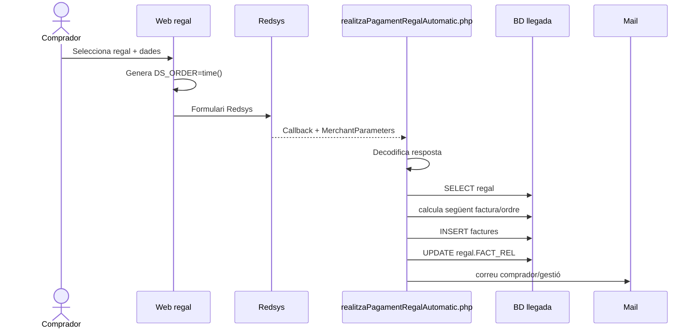
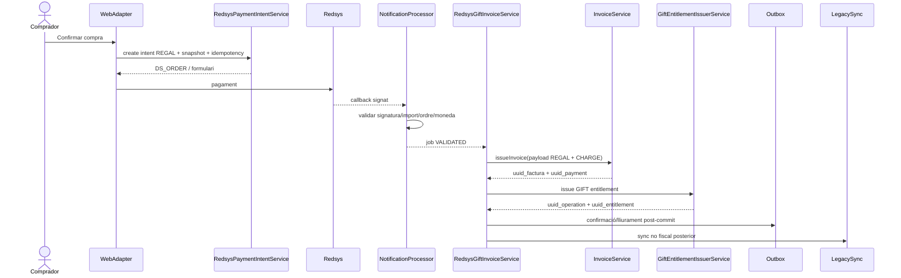
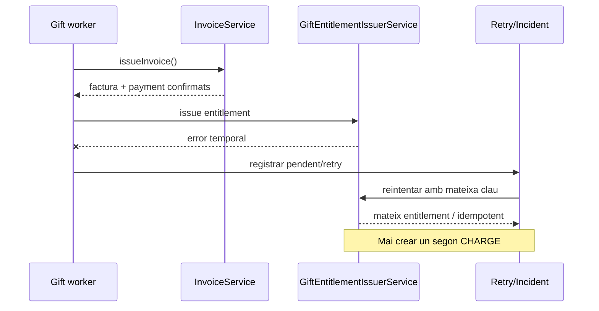

# UC-017 · Seqüències ACTUAL / FINAL

## 1. ACTUAL — compra i callback llegat

### Riscos de la seqüència ACTUAL
- no queda demostrada la comparació criptogràfica;
- confia en query params;
- numeració fiscal fora del SIF;
- correu dins del callback;
- escriptura fiscal directa al llegat.

## 2. FINAL — cobrament + factura + dret

## 3. FINAL — recuperació si falla el dret després de facturar

