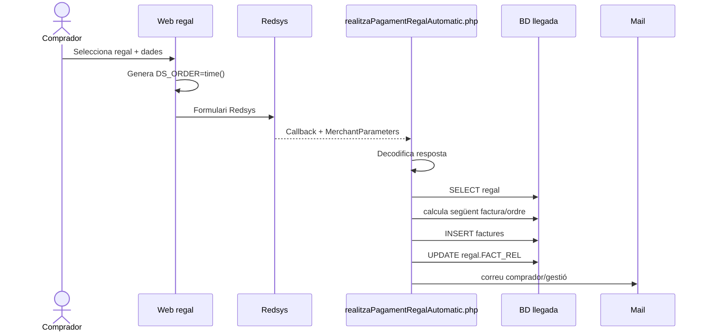
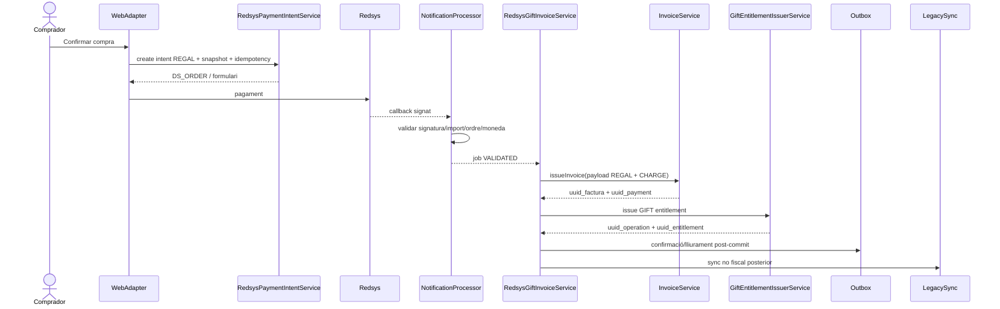
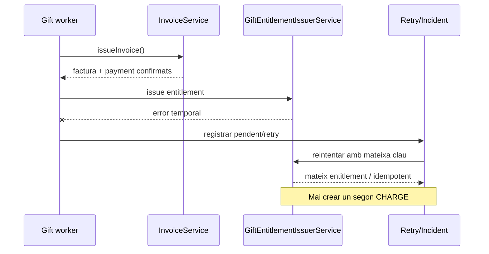
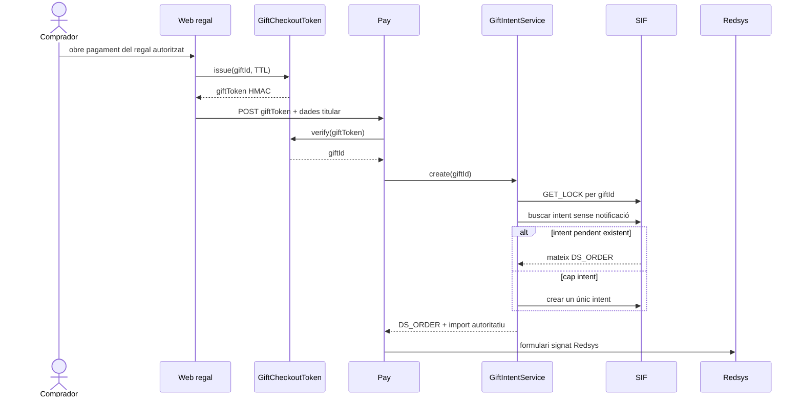

# UC-017 · Seqüències ACTUAL / FINAL

## 1. ACTUAL — compra i callback llegat



### Riscos de la seqüència ACTUAL
- no queda demostrada la comparació criptogràfica;
- confia en query params;
- numeració fiscal fora del SIF;
- correu dins del callback;
- escriptura fiscal directa al llegat.

## 2. FINAL — cobrament + factura + dret



## 3. FINAL — recuperació si falla el dret després de facturar




## 4. Estat d'implementació de la seqüència FINAL

A la branca candidata ja hi ha implementació directa dels passos:

```text
checkout
-> gift-intent signat
-> redsys_payment_intent
-> callback SIF validat
-> redsys_callback_queue
-> worker REGAL
-> factura/payment
-> entitlement
-> notification_outbox
-> gift-status
-> retorn navegador autoritatiu
```

El punt encara no acreditat és el **desplegament i execució E2E en preproducció**,
no l'absència dels components.

## 5. FINAL revalidat — token + fencing d'intents



La factura REGAL conserva `LEGACY|REGAL|ID:<giftId>`; per tant una notificació
validada amb un segon `DS_ORDER` no pot materialitzar una segona factura/CHARGE SIF.
