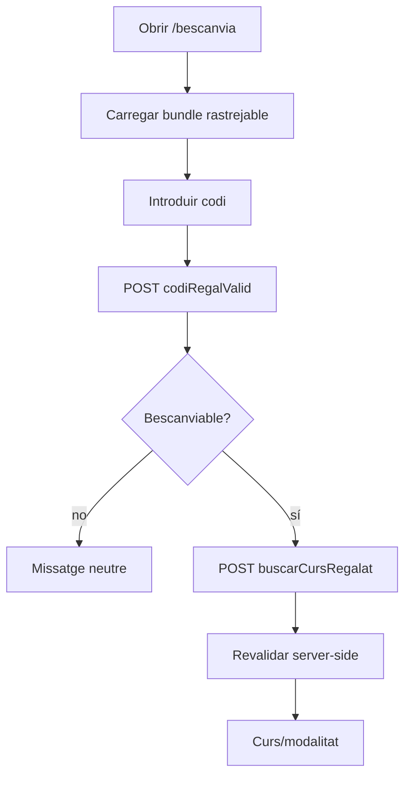
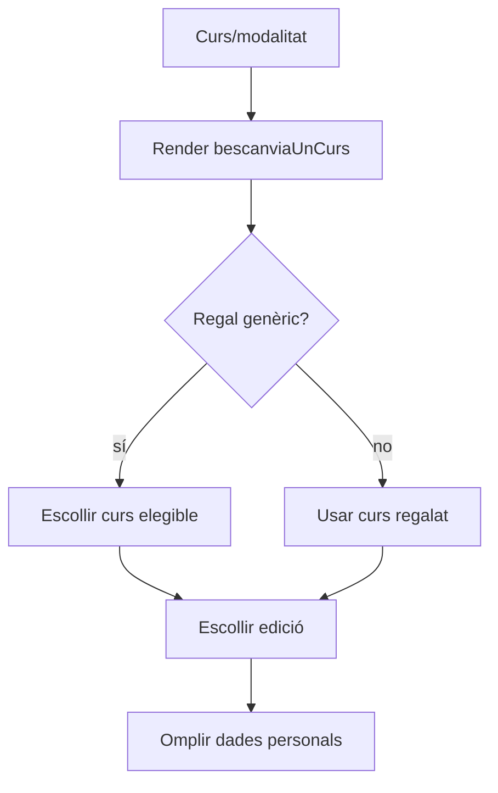
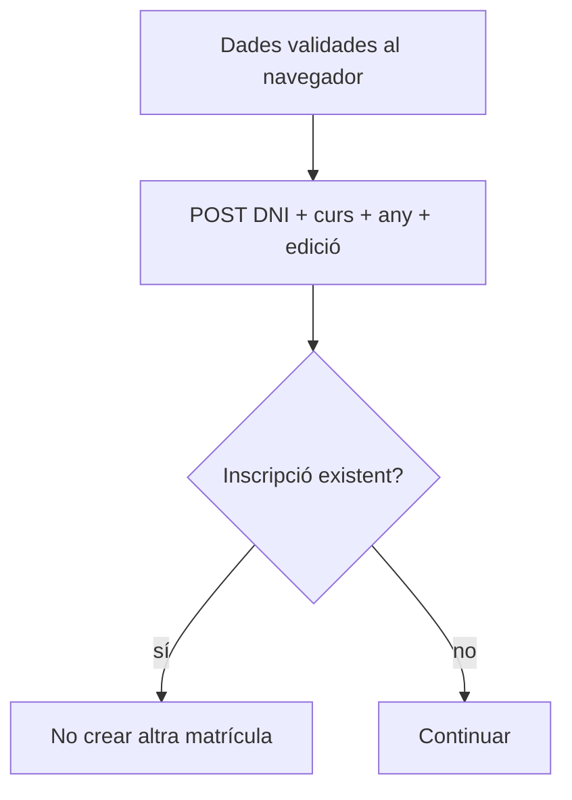
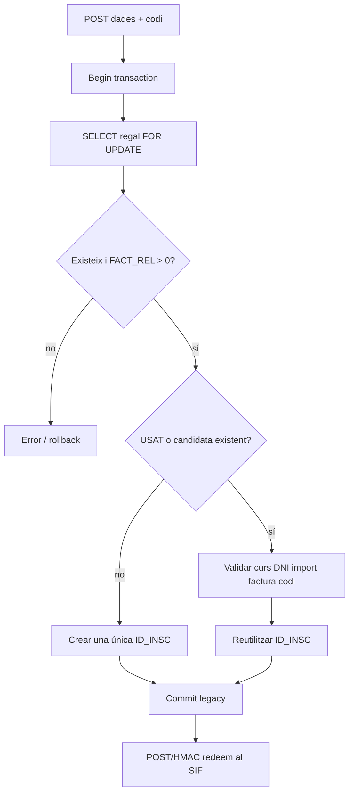
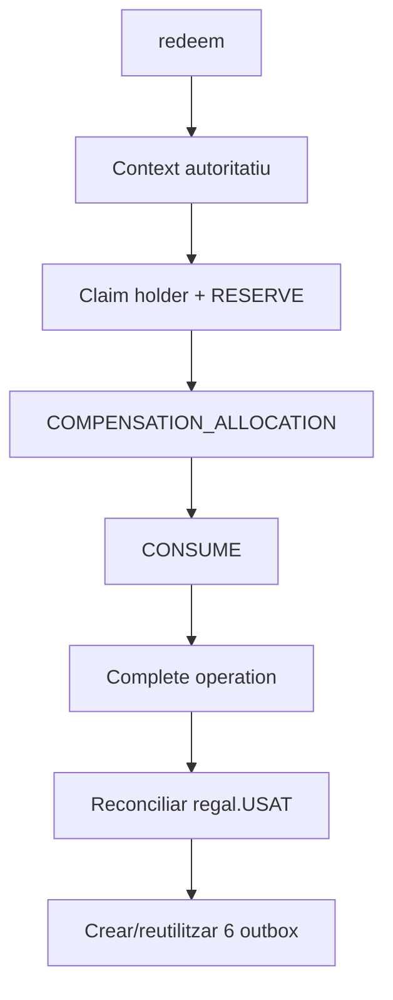
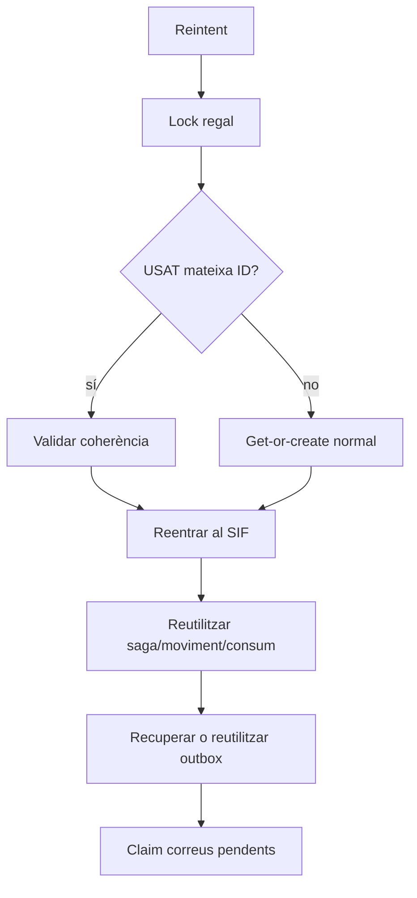
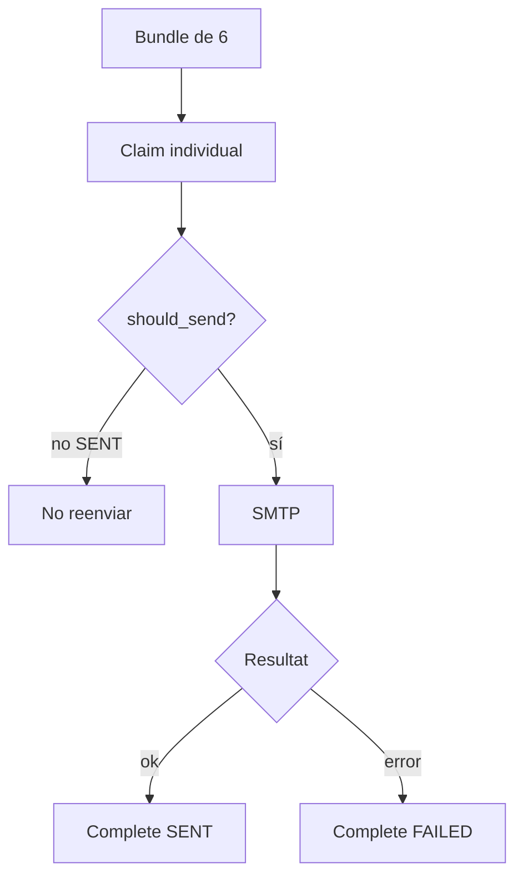
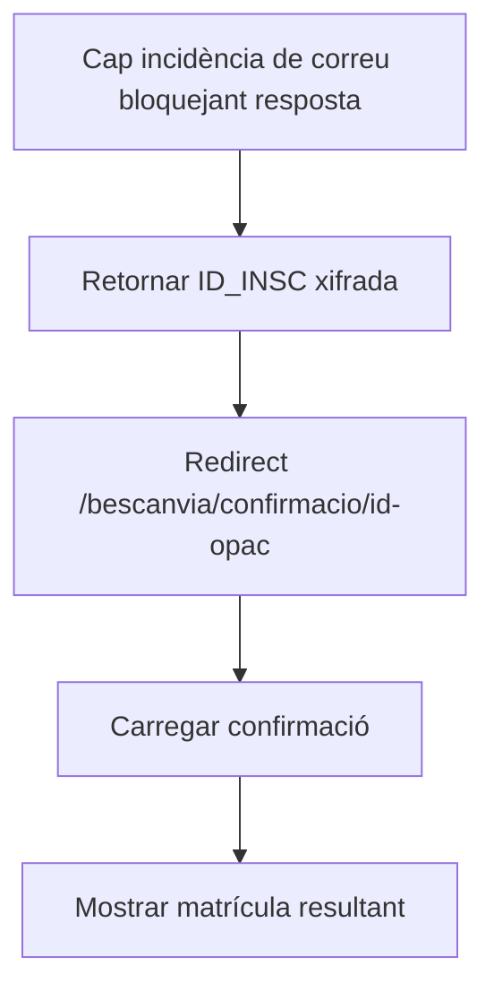

# UC-018 · Activitats ACTUAL/FINAL per pàgina i apartat

## 1. Superfícies executables auditades — 2026-10-03

| Superfície | ACTUAL | FINAL |
| --- | --- | --- |
| `pagina_bescanvia.php` | carrega `mostrarBescanvia.min.js?ver=6.0` | Igual |
| `mostrarBescanvia.min.js` | controlador client; 4 peticions sensibles POST | Igual |
| `mostrar_pagina_bescanvia.php` | render formulari codi | Igual |
| `codiRegalValid.php` | POST-only; resposta neutra | Igual |
| `buscarCursRegalat.php` | POST-only + revalidació server-side | Igual |
| `bescanviaUnCurs.php` | render curs/edició | Igual |
| `inscripcioDuplicada.php` | POST en UC-018 perquè DNI no vagi a URL | Igual |
| `enviarInscripcioBescanvia.php` | POST-only; lock, FACT_REL>0, get-or-create, SIF, correus | Igual |
| `SifGiftRedemptionClient` | POST/HMAC redeem + notificacions | Igual |
| `redeem.php` | endpoint intern autoritatiu | Igual |
| `notifications.php` | claim/complete at-most-once | Igual |
| `pagina_confirmacio_bescanvia.php` + JS + AJAX | confirmació amb ID opaca | Igual |
| preflight/verificador | codi implementat | execució [ENV] |

## 2. Activitat P-BES-01 · Introduir i validar codi

## 3. Activitat P-BES-02 · Seleccionar curs i edició

La política de canvi de curs posterior pertany a UC-26/71; UC-018 només ha de consumir una vegada el dret.

## 4. Activitat P-BES-03 · Comprovar duplicat

## 5. Activitat P-BES-04 · Writer legacy

## 6. Activitat P-BES-05 · Saga SIF

## 7. Activitat P-BES-06 · Replay/recovery

**No** hi ha retorn prematur abans del SIF.

## 8. Activitat P-BES-07 · Notificacions

`SENDING` ambigu no es reclama automàticament.

## 9. Activitat P-BES-08 · Confirmació

## 10. Estat per apartat

| Apartat | Documentat | Implementat | Verificat |
| --- | --- | --- | --- |
| Bundle/pàgina | Sí | Sí, patch 03/10 | CI pendent |
| Transport codi/PII | Sí | POST, patch 03/10 | Boundary afegit; CI pendent |
| No enumeració | Sí | Sí, patch 03/10 | Boundary afegit; CI pendent |
| Alta/reutilització | Sí | Sí | Core CI 02/10 |
| Context autoritatiu | Sí | Sí | Core CI 02/10 |
| Bescanvi/consum | Sí | Sí | Core CI 02/10 |
| Aplicació econòmica | Sí | Sí | Core CI 02/10 |
| Reconciliació legacy | Sí | Sí | Core CI 02/10 |
| Replay/outbox recovery | Sí | Sí | Core CI 02/10 |
| Concurrència | Sí | Sí | Core CI 02/10 |
| Correus idempotents | Sí | Sí | Core CI 02/10 |
| Preproducció real | Sí | Scripts sí | [ENV] |
| Diferències de preu | Sí | Fail-closed | [POLICY] |
