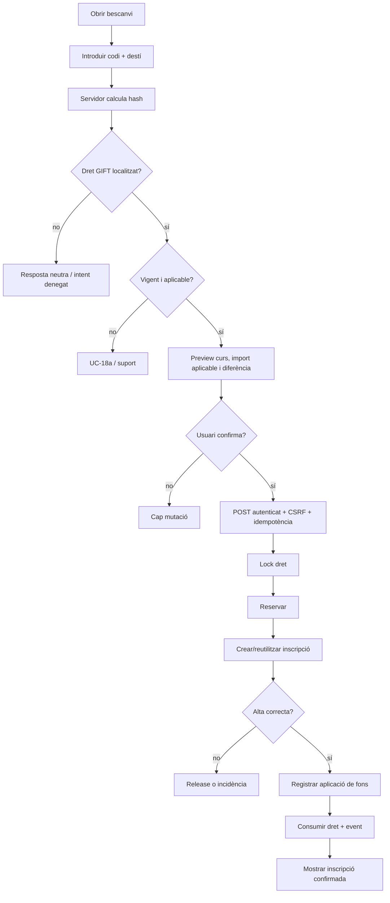
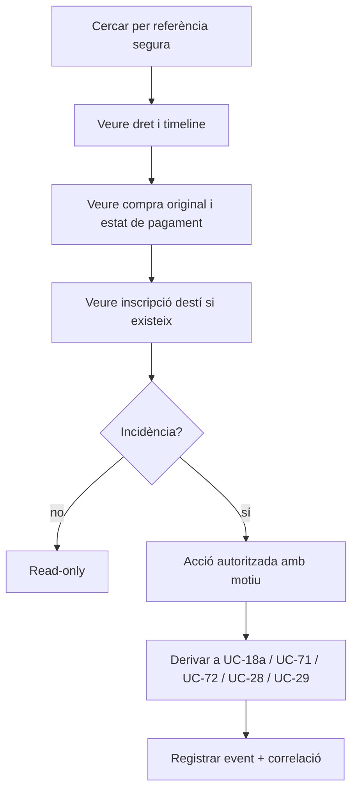

# UC-018 · Activitats ACTUAL/FINAL per pàgina i apartat

## 1. Inventari de superfícies

### ACTUAL

No s'ha acreditat cap pàgina, endpoint o mòdul JS específic de **bescanvi de regal UC-018**.

Sí existeixen peces adjacents:

- compra de regal UC-017;
- callback/worker Redsys;
- factura i relació `REGAL`;
- taules `commercial_entitlement` i `commercial_entitlement_event`;
- infraestructura genèrica d'incidències;
- implementació específica d'entitlement per UC-111.

Per tant, **una pantalla de compra no és una pantalla de bescanvi** i no s'ha de presentar com a UC-018.

## 2. FINAL — Portal/web de bescanvi



### Apartats mínims de UI

1. **Identificació del regal**: codi en input sensible; mai en query string.
2. **Dades del beneficiari**: només les necessàries per a la matrícula.
3. **Curs/edició**: selecció validada al servidor.
4. **Previsualització**: valor aplicable, diferència, estat de plaça, efecte final.
5. **Confirmació**: POST + CSRF + clau idempotent.
6. **Resultat**: `SUCCESS`, `REUSED`, `REJECTED`, `PENDING_RECONCILIATION` o `ERROR`.
7. **Accés documental**: no oferir la factura del comprador excepte autorització independent.

## 3. FINAL — Intranet / suport



La intranet no ha de permetre:

- editar manualment `STATUS` del dret;
- canviar `CONSUMED_UUID_OPERATION` amb un update lliure;
- crear un pagament per “quadrar” un bescanvi;
- reactivar un regal caducat sense una decisió tipificada;
- mostrar el codi en clar a operadors que no el necessiten.

## 4. FINAL — API

Contracte mínim proposat:

```text
POST /api/gifts/redemption/preview
POST /api/gifts/redemption/redeem
GET  /api/gifts/redemption/{correlation-or-operation}   [autoritzat]
```

El nom final de ruta és una decisió d'implementació; el contracte funcional obligatori és separar **preview** i **confirmació**.

## 5. Traçabilitat per apartat

| Superfície/apartat | Documentat | Implementat | Verificat | Pendent |
| --- | --- | --- | --- | --- |
| Compra regal | UC-017 | Sí | Sí parcial/CI | Fora UC-018 |
| Formulari codi | Sí FINAL | No | No | Sí |
| Preview | Sí FINAL | No | No | Sí |
| Confirmació | Sí FINAL | No | No | Sí |
| Idempotència | Sí FINAL | No | No | Sí |
| Inscripció beneficiari | Sí FINAL | No | No | Sí |
| Aplicació valor regal | Sí FINAL | No | No | Sí |
| Vista suport | Sí FINAL | No | No | Sí |
| Caducat/duplicat | UC-18a | No específic | No | Sí |
| Accés factura comprador | Regla documentada | Controls genèrics adjacents | No UC-018 | Sí |

## 6. Criteri de “FINAL”

Els diagrames FINAL descriuen el contracte necessari, **no l'estat desplegat**. Fins que no existeixin aquestes superfícies i proves, la fitxa ha de continuar amb estat d'implementació bloquejat/pendent.
