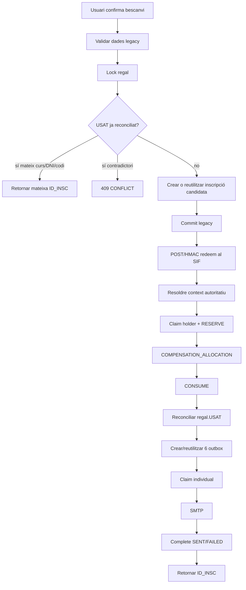
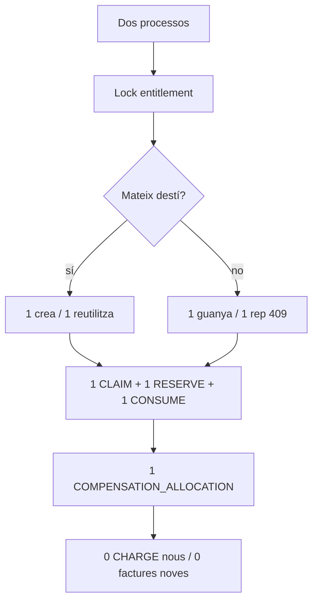

# UC-018 · Activitats ACTUAL/FINAL per pàgina i apartat

## 1. Superfícies executables auditades

| Superfície | ACTUAL | FINAL auditat |
| --- | --- | --- |
| Formulari web de bescanvi | Legacy existent | Captura dades; l'autoritat queda al servidor |
| `enviarInscripcioBescanvia.php` | Writer legacy | Replay primer, lock, get-or-create i cap `UPDATE regal.USAT` directe |
| `SifGiftRedemptionClient` | Client intern | Redeem + claim/complete de notificacions via POST/HMAC |
| `/api/gifts/redemption/redeem.php` | Executable | Orquestració autoritativa |
| `/api/gifts/redemption/notifications.php` | PR de tancament | Claim/complete at-most-once |
| `preflight-gift-redemption.php` | PR de tancament | Read-only i fail-closed |
| `verify-gift-redemption-preproduction.php` | PR de tancament | Dry-run per defecte; `--execute` explícit |

## 2. ACTUAL/FINAL — flux web

## 3. Concurrència i recovery

## 4. Seguretat de superfície

- El codi regal no va a query string.
- El caller no controla holder ni snapshot econòmic.
- Les rutes internes usen HMAC i anti-replay.
- Preflight/verificador no exposen secrets.
- L'execució de preproducció pren el codi de variable d'entorn, no de CLI.
- Els correus només s'autoritzen després de reconciliació SIF.

## 5. Estat per apartat

| Apartat | Documentat | Implementat | Verificació |
| --- | --- | --- | --- |
| Emissió GIFT | Sí | Sí | CI/integració |
| Alta/reutilització inscripció | Sí | Sí | Integració + recovery |
| Context autoritatiu | Sí | Sí | Integració |
| Bescanvi/consum | Sí | Sí | Integració |
| Aplicació econòmica | Sí | Sí | Integració |
| Reconciliació legacy | Sí | Sí | Integració |
| Concurrència real | Sí | Sí | Test multiprocés al PR de tancament |
| Correus idempotents | Sí | Sí | Bundle + boundary al PR de tancament |
| Preflight | Sí | Sí | Boundary automatitzat + gate d'entorn |
| Diferències de preu | Sí | Bloquejades | Fora abast fins decisió funcional |