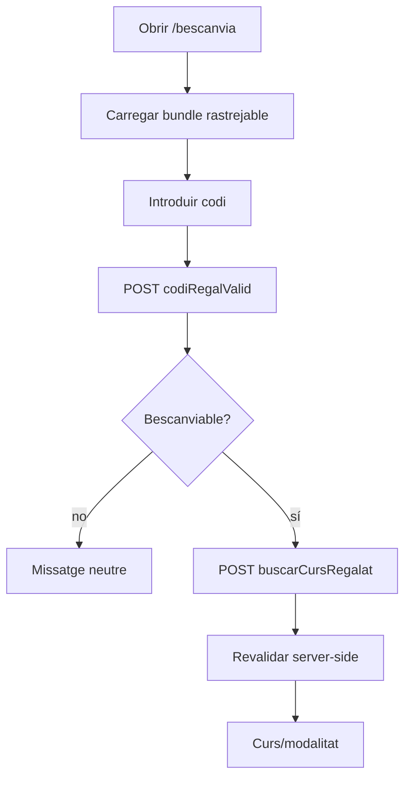
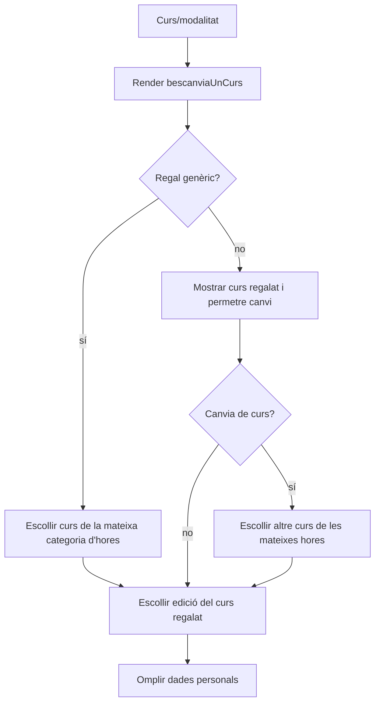
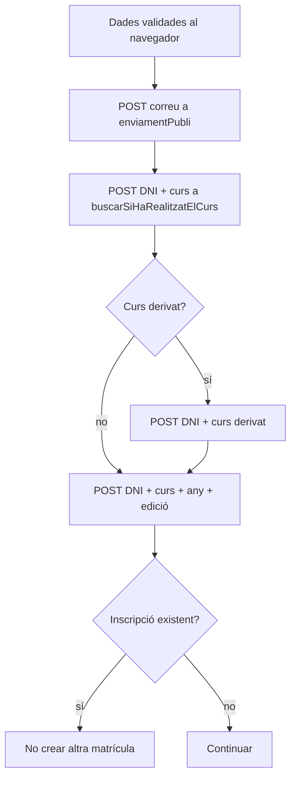
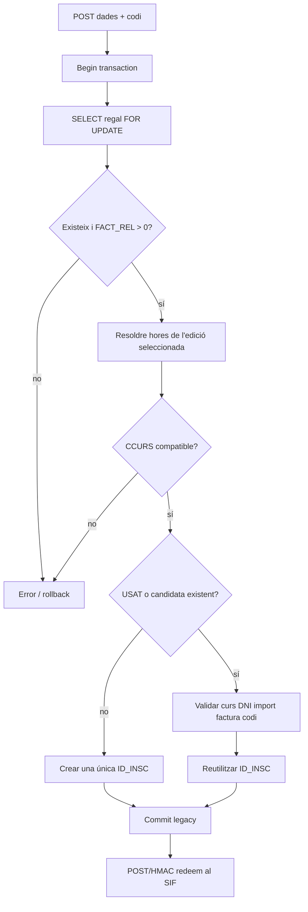
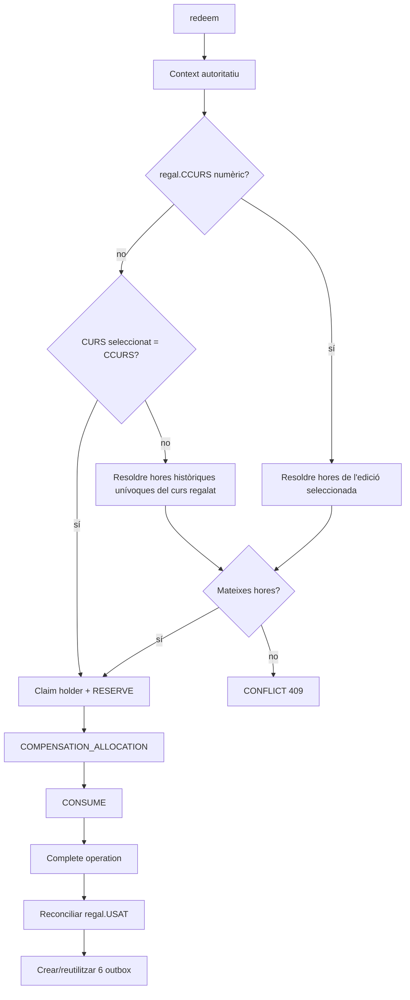
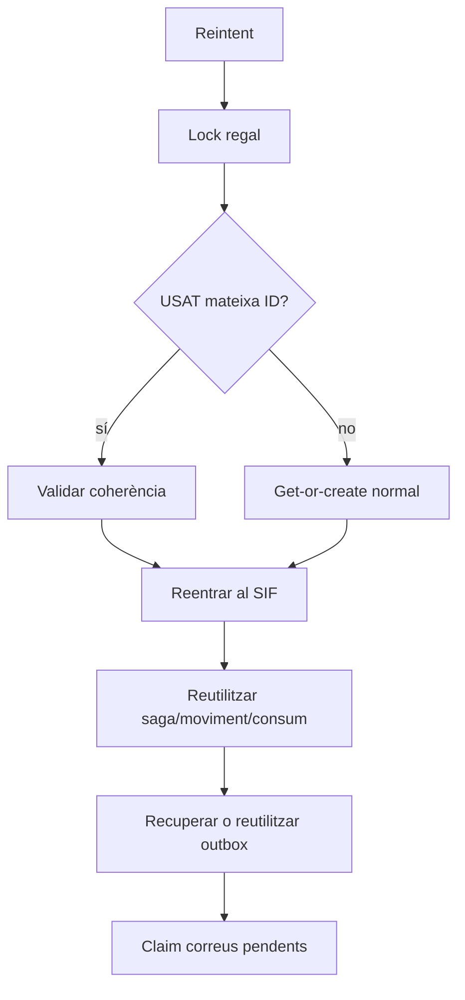
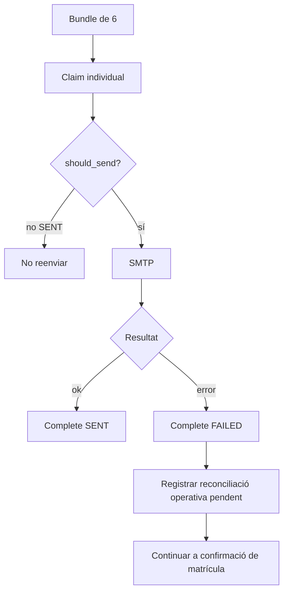
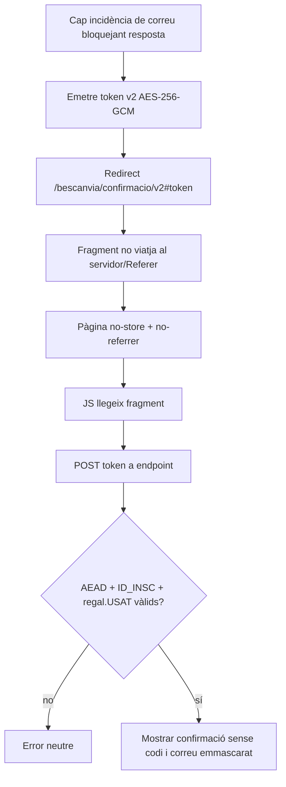

# UC-018 · Activitats ACTUAL/FINAL per pàgina i apartat

## 1. Superfícies executables auditades — revalidació 2026-10-04

| Superfície | ACTUAL | FINAL |
| --- | --- | --- |
| `.htaccess` | `/bescanvia-regal` → `pagina_bescanvia.php`; elimina dependència de fitxer prova absent | Igual |
| `pagina_bescanvia.php` | carrega `mostrarBescanvia.min.js?ver=6.0` | Igual |
| `mostrarBescanvia.min.js` | controlador client; totes les peticions amb codi/DNI/correu van per POST | Igual |
| `mostrar_pagina_bescanvia.php` | render formulari codi | Igual |
| `codiRegalValid.php` | POST-only; resposta neutra | Igual |
| `buscarCursRegalat.php` | POST-only + revalidació server-side | Igual |
| `bescanviaUnCurs.php` | render curs/edició | Igual |
| `inscripcioDuplicada.php` | compartit; POST en UC-018 perquè DNI no vagi a URL | Igual |
| `buscarSiHaRealitzatElCurs.php` | compartit; POST en UC-018 perquè DNI/curs no vagin a URL | Igual |
| `enviamentPubli.php` | compartit; POST en UC-018 perquè correu no vagi a URL | Igual |
| `enviarInscripcioBescanvia.php` | POST-only; lock, FACT_REL>0, guard de curs/hores abans del commit, get-or-create, SIF, correus | Igual |
| `SifGiftRedemptionClient` | POST/HMAC redeem + notificacions | Igual |
| `redeem.php` | endpoint intern autoritatiu | Igual |
| `notifications.php` | claim/complete at-most-once | Igual |
| `GiftRedemptionConfirmationToken.php` + pàgina/JS/AJAX | token AES-256-GCM al fragment; POST-only; no-store/no-referrer; correu emmascarat | Igual |
| preflight/verificador | codi implementat | execució [ENV] |

## 2. Activitat P-BES-01 · Introduir i validar codi

## 3. Activitat P-BES-02 · Seleccionar curs i edició

El canvi **abans del bescanvi** forma part de l'UC-018 legacy: un regal concret pot bescanviar-se pel mateix curs o per un altre amb les mateixes hores. Un canvi **després** d'haver consumit el dret continua pertanyent a UC-26/71.

## 4. Activitat P-BES-03 · Precomprovacions personals i duplicat

DNI i correu no apareixen en query string en cap d'aquestes comprovacions UC-018.

## 5. Activitat P-BES-04 · Writer legacy

## 6. Activitat P-BES-05 · Saga SIF

## 7. Activitat P-BES-06 · Replay/recovery

**No** hi ha retorn prematur abans del SIF.

## 8. Activitat P-BES-07 · Notificacions

`SENDING` ambigu no es reclama automàticament. Un error de comunicació posterior al consum no converteix la inscripció en fallida; queda com a incidència d'outbox/OPS.

## 9. Activitat P-BES-08 · Confirmació

El format CBC anterior no es reutilitza: l'IV no estava autenticat i, per tant, els tokens antics fallen tancat amb el parser v2.

## 10. Estat per apartat

| Apartat | Documentat | Implementat | Verificat |
| --- | --- | --- | --- |
| Routing + bundle/pàgina | Sí | `.htaccess` apunta a la pàgina existent + bundle rastrejable | Boundary; CI pendent |
| Transport codi/PII | Sí | POST també a mailing i històric de curs | Boundary ampliat; CI pendent |
| Elegibilitat per hores | Sí | Genèric `CCURS=N` i swap de regal concret per curs de mateixes hores; guard writer + resolver + stager | Tests match/mismatch + concrete swap afegits; CI pendent |
| No enumeració | Sí | Sí, patch 03/10 | Boundary afegit; CI pendent |
| Alta/reutilització | Sí | Sí | Core CI 02/10 |
| Context autoritatiu | Sí | Sí | Core CI 02/10 |
| Bescanvi/consum | Sí | Sí | Core CI 02/10 |
| Aplicació econòmica | Sí | Sí | Core CI 02/10 |
| Reconciliació legacy | Sí | Sí | Core CI 02/10 |
| Replay/outbox recovery | Sí | Sí | Core CI 02/10 |
| Concurrència | Sí | Sí | Core CI 02/10 |
| Correus idempotents | Sí | Sí; `FAILED/SENDING` no bloqueja confirmació | Core CI 02/10 + boundary 04/10 pendent |
| Confirmació | Sí | AEAD v2 + fragment + POST + no-store/no-referrer | Boundary nou; CI pendent |
| Preproducció real | Sí | Scripts sí | [ENV] |
| Preu catàleg curs vs FACE_VALUE | Sí, gap | No es compara autoritativament; només s'aplica FACE_VALUE | [POLICY/DATA] |
