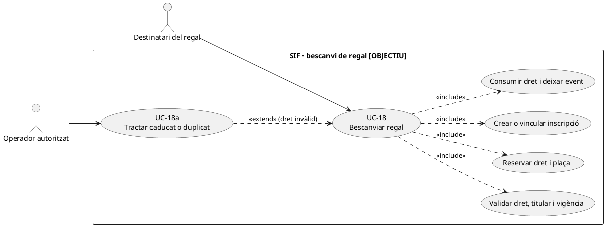
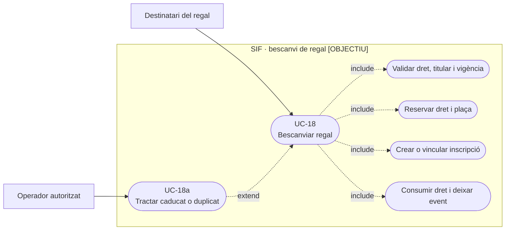
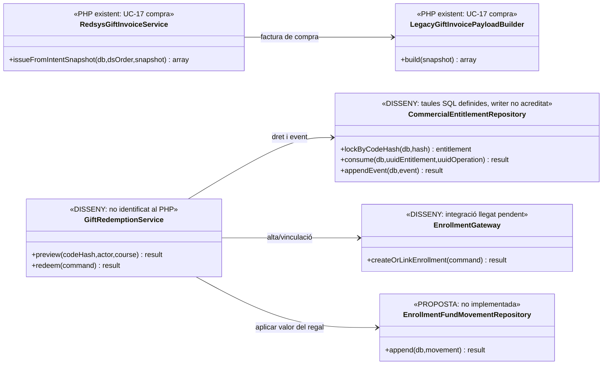
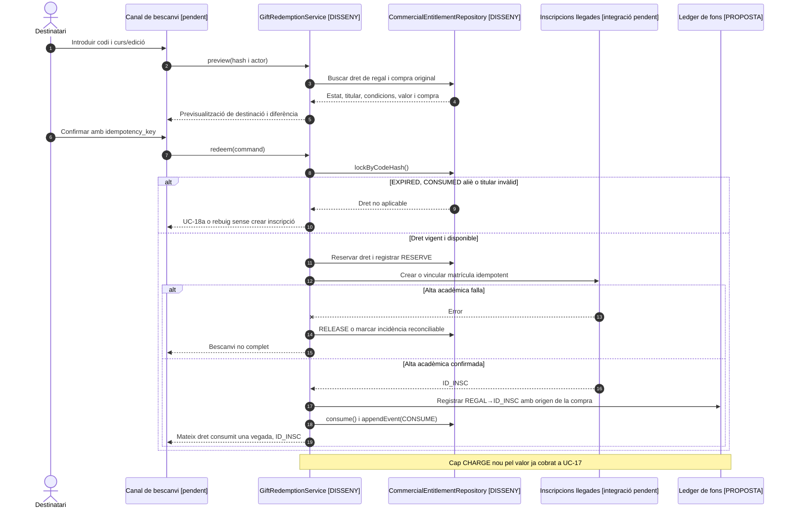
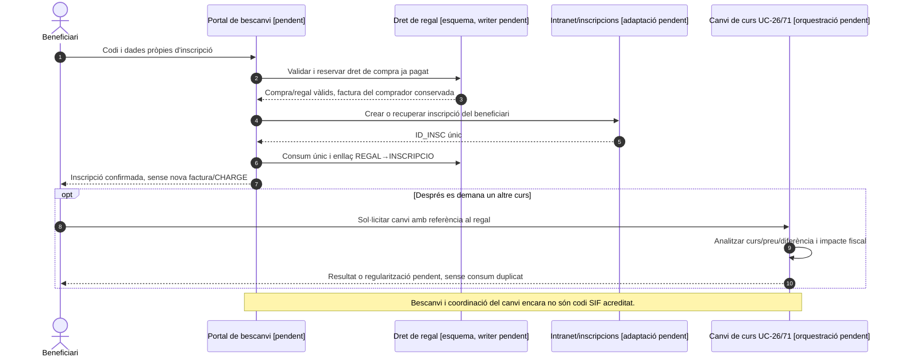

# UC-18 · Bescanviar un regal — fitxa i UML integrats

**Finalitat documentada al catàleg:** el destinatari bescanvia un regal per una inscripció, **sense una factura nova per defecte**. UC-17 és la compra/factura/cobrament del regal; UC-18a tracta codis caducats, duplicats o disputats; UC-119 coordina el cicle complet del dret comercial.

**Estat de codi:** existeix el circuit PHP de **compra** `RedsysGiftInvoiceService`, `LegacyGiftInvoicePayloadBuilder` i el snapshot del regal. La migració defineix `commercial_entitlement` i `commercial_entitlement_event`, però **no s'ha identificat al `sif/src` revisat un servei de bescanvi executable** que validi un codi, bloquegi el dret, el consumeixi i creï/vinculi la inscripció amb el llegat. **Tot el flux de bescanvi següent és contracte objectiu**; les taules SQL definides no són una prova d'execució.

## 1. Fitxa funcional del bescanvi

| Camp | Regla i responsabilitat |
| --- | --- |
| Actor | Persona destinatària del regal; operador autoritzat si el bescanvi requereix suport. Qui el compra, qui el rep i qui està inscrit **poden ser persones diferents**. |
| Identitat del dret | Codi del regal validat de manera segura i vinculat a la compra original `REGAL`; el catàleg preveu el dret a `commercial_entitlement` amb `ENTITLEMENT_TYPE=GIFT`, `CODE_HASH`, `HOLDER_PARTY_KEY`, import o condició, regla/versionat i estat. |
| Estat i concurrència | El dret pot ser `ISSUED`, `ACTIVE`, `RESERVED`, `CONSUMED`, `EXPIRED`, `CANCELLED`, `REVERSED` o `INCIDENT` segons el diccionari. El bescanvi ha de comprovar **estat real**, vigència, identitat i no-consum amb bloqueig/idempotència. |
| Entrada de destinació | Inscripció o proposta de curs/edició i import de servei al qual s'aplicarà el dret. La disponibilitat, els descomptes compatibles i les condicions de substitució **no** es dedueixen del codi de compra del regal. |
| Resultat administratiu | Inscripció de la persona beneficiària vinculada al dret comercial **consumit una sola vegada**, conservant el vincle a compra original i correlació de l'operació. |
| Resultat fiscal | Per defecte el catàleg diu «inscripció vinculada sense factura nova». Canvi real de servei, import o receptor després de la compra exigeix classificació fiscal explícita (UC-74 i, segons decisió, UC-05/30/31); el simple bescanvi no és justificació automàtica d'una altra factura. |
| Resultat econòmic | **No crear `payment_transaction CHARGE` pel valor d'un regal ja cobrat.** Si cal una diferència real, tramitar un cobrament addicional independent sobre factura/obligació que correspongui; si sobra valor, decidir tractament de dret/saldo sense retorn fictici. |

### 1.1. Flux principal OBJECTIU, no implementat al SIF consultat

1. El destinatari introdueix el codi en un canal segur; el servidor obté `CODE_HASH`, identifica el dret de regal **sense exposar-lo** en logs, URLs públiques o factures accessibles a tercers.
2. Es consulta el dret actual amb bloqueig i s'identifiquen compra original, import/dret, beneficiari, curs/edició elegibles i data de caducitat. El servidor comprova que no sigui consumit, cancel·lat, vençut o assignat a una altra persona sense autorització.
3. Es previsualitza la destinació i el resultat: inscripció i curs, valor del dret, part aplicada, diferència pendent/possible, efecte acadèmic i fiscal. **No** reconstrueix el preu de la compra original des de dades vives.
4. El sistema reserva dret/plaça amb un identificador d'operació idempotent, crea o vincula inscripció i confirma consum **una sola vegada**. La migració preveu `commercial_entitlement.CONSUMED_UUID_OPERATION`/`CONSUMED_AT` i events `RESERVE`, `CONSUME` i `RELEASE`, però falta el writer i la coordinació amb la BD llegada.
5. Conserva traça **`REGAL → INSCRIPCIÓ` per la part de valor utilitzada** en el model de fons/entitlement proposat, referenciada al pagament real de la compra UC-17. **És reassignació d'un dret o valor ja ingressat, no entrada de caixa nova.**
6. Si hi ha import addicional pagat realment, l'operació econòmica es registra separadament després de confirmació del TPV/transferència; si hi ha valor no aplicat, cal decidir-ne vigència, saldo o devolució segons titularitat i condicions.
7. Es deixa constància `commercial_entitlement_event` amb estat anterior/nou, acció, resultat, actor, correlació i operació; els errors parcials no han de deixar un dret `CONSUMED` sense inscripció reconciliable.

### 1.2. Variants que s'han de provar abans de tancar-lo

| Cas | Resposta objectiu |
| --- | --- |
| Codi desconegut, alterat o robat | No revelar si existeix ni exposar dades del comprador. Registrar intent denegat quan pertoqui. |
| Codi ja `CONSUMED` | No permetre segona matrícula ni nova factura; si és el mateix reintent, retornar inscripció existent per idempotència. |
| Codi `EXPIRED` | Derivar a UC-18a; cap reactivació automàtica del dret ni de preu. |
| Destinatari diferent del titular del dret | Exigir legitimació o autorització; no transmetre dades del comprador per un codi sense verificació. |
| Mateix dret, dues peticions concurrents | Un únic consum i una única inscripció resultant; si l'efecte acadèmic falla després de consumir, expedient de conciliació i no «consum doble». |
| Curs de destí sense plaça | Alliberar `RESERVED` si la reserva no es materialitza i conservar traça; no consumir per una matrícula impossible. |
| Bescanvi amb import inferior/superior | Classificar diferencial, persona titular i fiscalitat; no generar automàticament un `CHARGE` addicional ni lliurar saldo sense decisió. |
| Regal ja cobrat amb pagament parcial o retorn previ | Consultar diners disponibles/estat de la compra abans de reservar tot el valor nominal del codi. |

**Evidència i buit:** `LegacyGiftInvoicePayloadBuilder` registra `REGAL` a la factura de compra i no una inscripció de bescanvi. `commercial_entitlement` és **estructura de BD definida**. No s'han executat proves de bescanvi ni s'ha acreditat cap `GiftRedemptionService` al SIF.

### 1.3. Alta acadèmica diferida i canvi de curs d'un regal — contrast amb el xat original

**B-ALTA — moment d'identificació:** en el circuit declarat, el comprador paga i rep un codi; només quan la persona beneficiària el bescanvia completa les seves dades i es registra a `inscripcions`. El servidor ha de vincular el codi/dret de compra a la inscripció creada o confirmada, conservant comprador/receptor fiscal original i identificador de regal, sense crear una segona factura per la mera matrícula. L'operació de bescanvi no pot assumir que a UC-17 existia una inscripció definitiva o NIF fiscal del beneficiari.

**B-CURS — regal que s'aplica a un altre curs:** el xat indica que, en el procediment de gestió habitual, un regal no utilitza la baixa ordinària per escollir un altre curs, sinó el **canvi de curs**. Aquest és un escenari per UC-26/71 amb l'entitlement de regal com a origen; cal comprovar elegibilitat, preu nou, diferència si n'hi ha i qui està autoritzat a decidir el canvi. **No** consumir dues vegades el codi ni registrar una nova entrada CHARGE pel preu ja pagat; si es cobra una diferència real, fer una operació de cobrament diferenciada i classificar l'event fiscal que correspongui. El xat no estableix una regla universal de retorn o caducitat de tots els regals: consultar condicions vigents i UC-18a.

**B-CODI — col·lisió amb l'estat acadèmic:** un mateix codi vàlid no pot obrir dues inscripcions per un doble clic, recàrrega o petició concurrent. Una inscripció ja creada però consum pendent és un estat incomplet a reconciliar, no autorització per crear una segona inscripció. No usar el text de dedicatòria o el NIF del comprador com a identificadors únics del beneficiari. L'accés de la persona destinatària a la inscripció pròpia és separat de l'accés a la factura fiscal del comprador.

### 1.4. Proves addicionals del bescanvi (no executades)

| ID | Escenari | Resultat exigible |
| --- | --- | --- |
| BS-01 | Comprar un regal sense ID_INSC definitiu i bescanviar-lo després | Crear/vincular una única inscripció quan el beneficiari aporta les seves dades, sense nova factura. |
| BS-02 | Doble clic de bescanvi del mateix codi | Reutilitzar mateixa inscripció/operació i cap segon consum. |
| BS-03 | Regalar i canviar de curs després del bescanvi | Nou event de canvi amb dret original i diferència explícita si existeix; cap segon CHARGE pel valor ja cobrat. |
| BS-04 | Codi reservat però falla alta de l'alumne | Incident/reconciliació o alliberament segur; cap inscripció duplicada. |
| BS-05 | Beneficiari consulta factura original del comprador | Permís denegat si no és receptor autoritzat; visibilitat de la seva inscripció separat. |
## 2. Diagrama UML de casos d'ús

### Vista de casos d’ús per a GitHub (Mermaid)

## 3. Classes — compra existent vs bescanvi proposat

**No** es dibuixa una crida de compra a bescanvi: són operacions i moments diferents.

## 4. Seqüència — dret vàlid i matrícula (OBJECTIU)

### 4.1. Seqüència — bescanvi i eventual canvi de curs (OBJECTIU)

## 5. Traçabilitat

[UC-18 original](../06-fitxes-funcionals/uc-018.md) · [UC-18a original](../06-fitxes-funcionals/uc-018a.md) · [UC-17 compra](uc-017-comprar-regal.md) · [UC-119 complet original](../06-fitxes-funcionals/uc-119.md) · [Diccionari d'estats de dret comercial](../05-governanca-operacio/24-diccionari-camps-i-valors.md) · [Migració entitlement i events](../../sif/database/migrations/2026_09_16_000005_add_operation_lifecycle_tables.sql) · [LegacyGiftInvoicePayloadBuilder](../../sif/src/Service/LegacyGiftInvoicePayloadBuilder.php) · [Revisió de fons](00-revisio-moviments-inscripcions.md).
