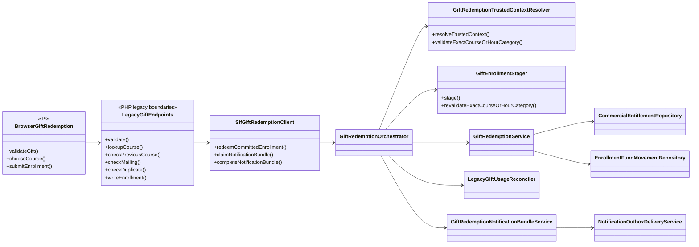
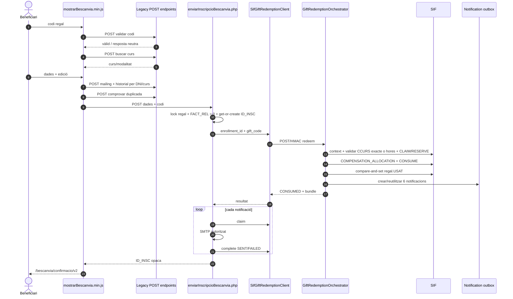
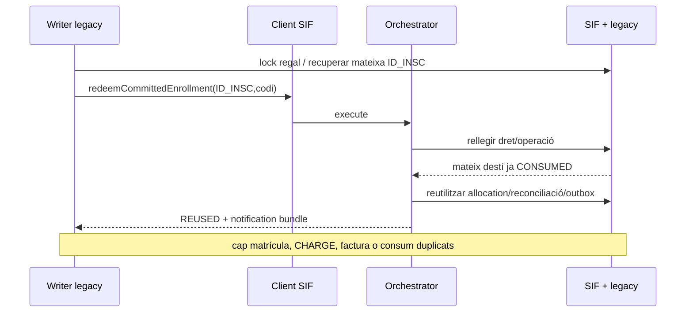
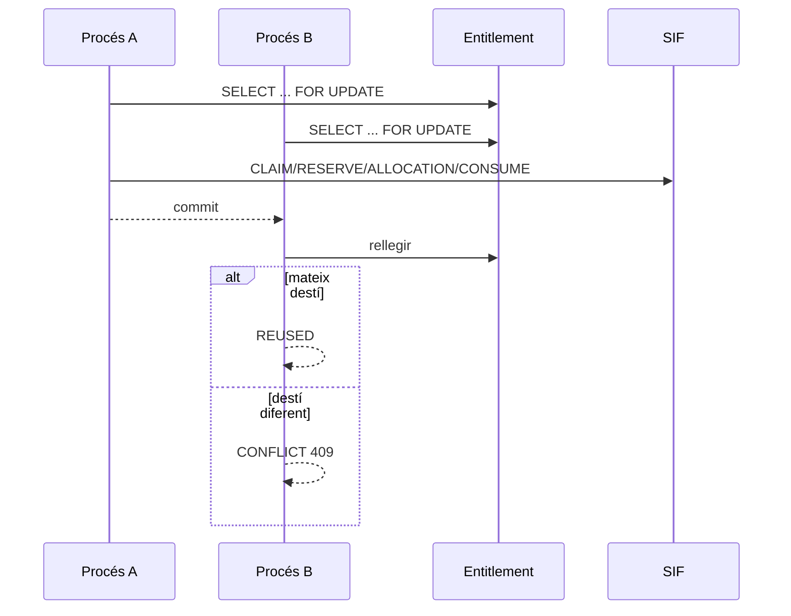

# UC-018 · Bescanviar regal — Fitxa/UML integrada

**Tall revalidat:** 2026-10-04  
**Base de la branca neta:** `main@6c8137ff1652ac89a1a81ad18cf79fc4689b1757`  
**Estat:** `IMPLEMENTAT · BASELINE CI VERIFICAT 02/10 · REVALIDACIÓ 04/10 CI PENDENT · ENVIRONMENT GO PENDENT`

## 1. Objectiu i frontera funcional

UC-018 converteix un dret comercial `GIFT` ja pagat a UC-017 en una única inscripció del beneficiari, sense crear una segona factura ni un segon `CHARGE` pel valor ja ingressat.

L'abast base és l'**aplicació exacta del valor facial del regal** a una inscripció elegible. Això no equival, per si sol, a demostrar que el preu de catàleg del curs triat sigui sempre idèntic al valor facial:

```text
1 compra pagada
1 dret GIFT
1 inscripció
1 COMPENSATION_ALLOCATION
1 consum
0 CHARGE addicionals
0 factures addicionals
replay idempotent
```

El SIF garanteix que no apareix cap import nou: l'operació de destí usa `GROSS=FACE_VALUE`, `DISCOUNT=FACE_VALUE`, `NET=0`. Tanmateix, el legacy selecciona cursos per compatibilitat d'hores i aquesta auditoria no ha localitzat una prova autoritativa que **tots els cursos de les mateixes hores tinguin sempre el mateix preu de catàleg**. Aquesta equivalència és [POLICY/DATA] pendent; si no és invariant de negoci, cal congelar i contrastar el preu real del curs abans del bescanvi.

## 2. Estat ACTUAL revalidat

### 2.1. Navegador i legacy

El flux real està format per:

0. `.htaccess` → `/bescanvia-regal` resol a `pagina_bescanvia.php`;
1. `pagina_bescanvia.php`;
2. `mostrarBescanvia.min.js`;
3. `mostrar_pagina_bescanvia.php`;
4. `codiRegalValid.php`;
5. `buscarCursRegalat.php`;
6. `bescanviaUnCurs.php`;
7. `inscripcioDuplicada.php`;
8. `buscarSiHaRealitzatElCurs.php`;
9. `enviamentPubli.php`;
10. `enviarInscripcioBescanvia.php`;
11. `SifGiftRedemptionClient.php`;
12. `GiftRedemptionConfirmationToken.php` + pàgina/JS/endpoint de confirmació amb token AEAD al fragment URL.

La revalidació 03–04/10 ha corregit la frontera pública perquè codi regal i PII no viatgin en query string. Tota crida UC-018 que transporta codi regal, DNI o correu usa POST. Els tres endpoints exclusius UC-018 són POST-only; `inscripcioDuplicada.php`, `buscarSiHaRealitzatElCurs.php` i `enviamentPubli.php` són compartits i conserven compatibilitat GET per altres casos, però aquest UC no els invoca així.

### 2.2. SIF

Existeixen i estan integrats:

- `GiftEntitlementIssuerService`;
- `CommercialEntitlementRepository`;
- `GiftRedemptionTrustedContextResolver`;
- `GiftEnrollmentStager`;
- `GiftRedemptionService`;
- `EnrollmentFundMovementRepository`;
- `LegacyGiftUsageReconciler`;
- `GiftRedemptionOrchestrator`;
- `GiftRedemptionNotificationBundleService`;
- `NotificationOutboxDeliveryService`;
- endpoints interns redeem/notifications POST/HMAC.

Per tant, les antigues etiquetes «DISSENY», «writer pendent» i «NO-GO perquè no existeix el flux executable» queden **SUPERADES**.

## 3. Cas d'ús ACTUAL


```mermaid
flowchart LR
  B["Beneficiari"] --> UI["pagina_bescanvia + mostrarBescanvia.min.js"]
  UI --> V["Validar codi<br/>POST"]
  V --> C["Resoldre curs/modalitat<br/>POST"]
  C --> F["Formulari inscripció"]
  F --> H["Històric curs + mailing<br/>POST"]
  H --> D["Comprovar duplicada<br/>POST"]
  D --> W["Writer legacy<br/>POST"]
  W --> SIF["SIF redeem<br/>POST/HMAC"]
  SIF --> R["Reconciliació + outbox"]
  R --> M["Claim/SMTP/complete"]
  M --> T["Token confirmació AEAD<br/>fragment URL"]
  T --> OK["Confirmació POST-only"]
```

## 4. Classes/components ACTUAL


```mermaid
classDiagram
direction LR
class BrowserGiftRedemption {
  <<JS>>
  +validateGift()
  +chooseCourse()
  +submitEnrollment()
}
class LegacyGiftEndpoints {
  <<PHP legacy boundaries>>
  +validate()
  +lookupCourse()
  +checkPreviousCourse()
  +checkMailing()
  +checkDuplicate()
  +writeEnrollment()
}
class SifGiftRedemptionClient {
  +redeemCommittedEnrollment()
  +claimNotificationBundle()
  +completeNotificationBundle()
}
class GiftRedemptionOrchestrator
class GiftRedemptionTrustedContextResolver {
  +resolveTrustedContext()
  +validateExactCourseOrHourCategory()
}
class GiftEnrollmentStager {
  +stage()
  +revalidateExactCourseOrHourCategory()
}
class GiftRedemptionService
class CommercialEntitlementRepository
class EnrollmentFundMovementRepository
class LegacyGiftUsageReconciler
class GiftRedemptionNotificationBundleService
class NotificationOutboxDeliveryService

BrowserGiftRedemption --> LegacyGiftEndpoints
LegacyGiftEndpoints --> SifGiftRedemptionClient
SifGiftRedemptionClient --> GiftRedemptionOrchestrator
GiftRedemptionOrchestrator --> GiftRedemptionTrustedContextResolver
GiftRedemptionOrchestrator --> GiftEnrollmentStager
GiftRedemptionOrchestrator --> GiftRedemptionService
GiftRedemptionService --> CommercialEntitlementRepository
GiftRedemptionService --> EnrollmentFundMovementRepository
GiftRedemptionOrchestrator --> LegacyGiftUsageReconciler
GiftRedemptionOrchestrator --> GiftRedemptionNotificationBundleService
GiftRedemptionNotificationBundleService --> NotificationOutboxDeliveryService
```

## 5. Seqüència ACTUAL — bescanvi nominal


```mermaid
sequenceDiagram
autonumber
actor B as Beneficiari
participant JS as mostrarBescanvia.min.js
participant L as Legacy POST endpoints
participant W as enviarInscripcioBescanvia.php
participant C as SifGiftRedemptionClient
participant O as GiftRedemptionOrchestrator
participant S as SIF
participant N as Notification outbox

B->>JS: codi regal
JS->>L: POST validar codi
L-->>JS: vàlid / resposta neutra
JS->>L: POST buscar curs
L-->>JS: curs/modalitat
B->>JS: dades + edició
JS->>L: POST mailing + historial per DNI/curs
JS->>L: POST comprovar duplicada
JS->>W: POST dades + codi
W->>W: lock regal + FACT_REL > 0 + get-or-create ID_INSC
W->>C: enrollment_id + gift_code
C->>O: POST/HMAC redeem
O->>S: context + validar CCURS exacte o hores + CLAIM/RESERVE
O->>S: COMPENSATION_ALLOCATION + CONSUME
O->>S: compare-and-set regal.USAT
O->>N: crear/reutilitzar 6 notificacions
O-->>C: CONSUMED + bundle
C-->>W: resultat
loop cada notificació
 W->>C: claim
 W->>W: SMTP autoritzat
 W->>C: complete SENT/FAILED
end
W-->>JS: ID_INSC opaca
JS-->>B: /bescanvia/confirmacio/v2#token
```

## 6. Replay/recovery ACTUAL

El replay vigent no fa early-return abans del SIF.


```mermaid
sequenceDiagram
participant W as Writer legacy
participant C as Client SIF
participant O as Orchestrator
participant DB as SIF + legacy
W->>DB: lock regal / recuperar mateixa ID_INSC
W->>C: redeemCommittedEnrollment(ID_INSC,codi)
C->>O: execute
O->>DB: rellegir dret/operació
DB-->>O: mateix destí ja CONSUMED
O->>DB: reutilitzar allocation/reconciliació/outbox
O-->>W: REUSED + notification bundle
Note over W,DB: cap matrícula, CHARGE, factura o consum duplicats
```

Aquest comportament és necessari per recuperar una resposta perduda després del consum però abans de completar els correus.

## 7. Concurrència ACTUAL


```mermaid
sequenceDiagram
participant A as Procés A
participant B as Procés B
participant E as Entitlement
participant DB as SIF
A->>E: SELECT ... FOR UPDATE
B->>E: SELECT ... FOR UPDATE
A->>DB: CLAIM/RESERVE/ALLOCATION/CONSUME
A-->>B: commit
B->>E: rellegir
alt mateix destí
 B-->>B: REUSED
else destí diferent
 B-->>B: CONFLICT 409
end
```

## 8. ACTUAL vs FINAL

Per al flux base d'aplicació exacta del `FACE_VALUE`, ACTUAL i FINAL coincideixen en arquitectura. El FINAL pendent és operatiu/polític, no una classe de domini absent.

| Aspecte | ACTUAL | FINAL |
| --- | --- | --- |
| Codi/PII navegador→legacy | POST incloent endpoints compartits | POST, sense secrets/PII a URL |
| Elegibilitat per hores | `CCURS=N` o curs concret; si es canvia el concret, només a un curs de mateixes hores | Igual; amb resolució fail-closed si les hores històriques del curs original són ambigües |
| Intern legacy→SIF | POST/HMAC | Igual |
| Dret GIFT | Repository + events | Igual |
| Aplicació econòmica | COMPENSATION_ALLOCATION | Igual |
| Consum | Idempotent | Igual |
| Replay | Reentra al SIF | Igual |
| Correus | Outbox + claim/complete; incidència SMTP no converteix la matrícula en error | Igual + via OPS de reconciliació pendent |
| Preu del curs triat vs FACE_VALUE | El moviment aplica exactament FACE_VALUE; equivalència de preu de catàleg no acreditada | [POLICY/DATA] congelar preu autoritatiu o declarar invariant de negoci |
| Preproducció | Scripts implementats | Execució real + evidència |

## 9. Seguretat revalidada

- El navegador ja no posa `codiRegal`, DNI ni correu a les URLs UC-018 sensibles.
- Validació, lookup i writer UC-018 són POST-only. Duplicat, historial de curs i estat de mailing són compartits amb altres fluxos: UC-018 els usa per POST, mantenint compatibilitat legacy fora d'aquest cas.
- El lookup de curs revalida server-side la bescanviabilitat.
- El writer bloqueja `FACT_REL <= 0` i valida la compatibilitat curs/hores **abans** de materialitzar o commitar la inscripció.
- La resposta pública de codi invàlid/no disponible és neutra.
- Validació i lookup legacy comparen el codi amb `CODI = ?`, no amb `LIKE`, per impedir comodins.
- L'origen UC-017 genera els nous codis bearer amb CSPRNG (`random_int`) i manté 10 caràcters compatibles amb UC-018.
- No s'ha localitzat un rate-limit específic al repo; és un gate [ENV/SECURITY] a acreditar a WAF/web server o implementar abans del GO públic.
- El client servidor→SIF continua amb POST/HMAC, HTTPS i anti-replay.
- La ruta pública `/bescanvia-regal` apunta a la pàgina existent `pagina_bescanvia.php`; no queda cap dependència executable de `pagina_bescanvia_prova.php` absent.
- La confirmació usa AES-256-GCM versionat; el token viatja al fragment (`#`), l'endpoint és POST-only, les respostes són `no-store/no-referrer` i el correu es mostra emmascarat.
- Holder i snapshot econòmic es resolen dins del SIF. Si `regal.CCURS` és numèric, es tracta com a categoria d'hores. Si és alfanumèric, es pot usar el mateix curs o canviar-lo per un altre de les mateixes hores; quan hi ha canvi, les hores històriques del curs original han de ser unívoques o el flux falla tancat.
- Els correus només s'autoritzen després del redeem/reconciliació. Si un missatge queda `FAILED/SENDING`, la matrícula continua sent correcta i es mostra confirmació; l'outbox conserva la incidència per reconciliació operativa.

## 10. Proves

La base anterior va acreditar al PR #115:

- 858 passed / 0 failed;
- 49 PASS GIFT/UC-018;
- E2E, concurrència, recovery, notificacions i boundaries SIF.

La revalidació 03–04/10 amplia `GiftRedemptionWebClientBoundaryTest`, corregeix els fixtures del snapshot immutable i afegeix casos de `CCURS` numèric, swap d'un regal concret per un altre curs de mateixes hores, incompatibilitat d'hores i manipulació de `regal.CCURS`. `GiftRedemptionConfirmationBoundaryTest` cobreix routing real, token AEAD, tampering, fragment URL i POST de confirmació. **El CI d'aquest head és pendent fins que el PR l'acrediti.**

## 11. Traçabilitat

- [Fitxa funcional](../06-fitxes-funcionals/uc-018.md)
- [Classes ACTUAL/FINAL](uc-018-classes-actual-final.md)
- [Seqüències ACTUAL/FINAL](uc-018-sequencies-actual-final.md)
- [Activitats per pàgina](uc-018-activitats-pagines-bescanvi-regal-actual-final.md)
- [Auditoria detallada](04-auditoria-detallada-uc-018-bescanviar-regal-2026-09-30.md)
- [Matriu de proves](05-proves-pendents-uc-018-implementacio.md)
- [Tancament 02/10](10-tancament-auditoria-uc-018-2026-10-02.md)
- [Revalidació 03/10](11-revalidacio-auditoria-uc-018-2026-10-03.md)
- [Inventari PHP/JS 03/10](12-inventari-codi-php-js-uc-018-2026-10-03.md)
- [Revalidació 04/10](13-revalidacio-auditoria-uc-018-2026-10-04.md)
- [Execució selectiva / sif_test / preproducció](14-execucio-selectiva-uc-018-sif-test-preproduccio.md)

## 12. Estat

```text
DOCUMENTAT: SÍ, re-reconciliat 04/10
IMPLEMENTAT: SÍ per al flux base, incloent routing públic real, elegibilitat per hores, guard pre-commit i confirmació AEAD
VERIFICAT: baseline PR #115 SÍ (02/10); head 04/10 CI PENDENT
PENDENT: CI del head actual + preproducció real + throttle/rate-limit ENV/SECURITY + equivalència preu-catàleg/hores POLICY-DATA + variants POLICY
```
