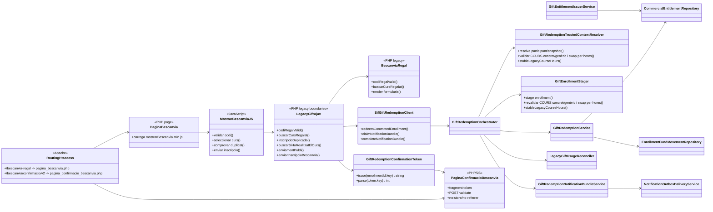

# UC-018 · Classes ACTUAL/FINAL — Bescanviar regal

## 1. Tall revalidat — 2026-10-04

El flux base d'**aplicació exacta del `FACE_VALUE` del regal** està implementat. El PR #115 conserva l'evidència baseline del 02/10, però la revalidació 03/10 modifica tant la frontera navegador→legacy com `GiftRedemptionTrustedContextResolver` i `GiftEnrollmentStager` per a regals genèrics per hores i canvi d'un regal concret per un altre curs de mateixes hores; aquests canvis requereixen CI nou.

## 2. ACTUAL — components executables



## 3. Responsabilitats verificades

- **Routing:** `/bescanvia-regal` resol a `pagina_bescanvia.php`; s'ha eliminat la referència executable al fitxer absent `pagina_bescanvia_prova.php`.
- **Pàgina:** `pagina_bescanvia.php` referencia el bundle rastrejable `mostrarBescanvia.min.js?ver=6.0`.
- **Browser:** totes les crides que transporten codi regal, DNI o correu són POST amb cos de petició; `buscarSiHaRealitzatElCurs.php` pot executar-se dues vegades però mai posa el DNI a URL.
- **Legacy guard:** els tres endpoints exclusius UC-018 són POST-only; `inscripcioDuplicada.php`, `buscarSiHaRealitzatElCurs.php` i `enviamentPubli.php` són compartits i UC-018 els invoca per POST. El lookup revalida el codi i el writer exigeix `FACT_REL > 0` i compatibilitat curs/hores abans del commit.
- **Resposta pública:** `BescanviaRegal::codiRegalValid()` no diferencia públicament inexistent/pendent/consumit.
- **UC-017 / origen monetari:** `RedsysGiftInvoiceService` + `GiftEntitlementIssuerService` conserven factura/`CHARGE` i creen/reutilitzen GIFT.
- **Dret:** `CommercialEntitlementRepository` governa holder, lock, `CLAIM`, `RESERVE`, `CONSUME`, `RELEASE` i events append-only.
- **Context:** `GiftRedemptionTrustedContextResolver` deriva participant i snapshot des de dades persistides i interpreta `regal.CCURS`: categoria numèrica d'hores o curs concret; el concret pot mantenir-se o canviar-se per un altre curs de les mateixes hores amb resolució històrica unívoca.
- **Alta:** `GiftEnrollmentStager` revalida el contracte de curs/hores i crea/reutilitza l'operació `ENROLLMENT/INSCRIPCIO`.
- **Economia:** `GiftRedemptionService` registra un únic `COMPENSATION_ALLOCATION` sobre el `UUID_PAYMENT` original.
- **Reconciliació:** `LegacyGiftUsageReconciler` fa compare-and-set de `regal.USAT`.
- **Recovery:** `GiftRedemptionOrchestrator` convergeix sobre el mateix resultat després de timeout/resposta perduda.
- **Notificacions:** bundle de sis outbox + claim/complete independent.
- **Frontera interna:** `SifGiftRedemptionClient` usa POST/HMAC i no posa el codi a URL.
- **Confirmació:** `GiftRedemptionConfirmationToken` usa AES-256-GCM/base64url; el navegador conserva el token al fragment i el valida per POST, amb `no-store/no-referrer`.

## 4. ACTUAL vs FINAL

| Component | Documentat | Implementat | Verificació |
| --- | --- | --- | --- |
| Routing + pàgina + bundle real | Sí | Sí, `.htaccess` + `pagina_bescanvia.php` + bundle | Boundary; CI pendent |
| Browser→legacy POST | Sí | Sí, patch 03/10 incloent DNI/correu en endpoints compartits | Boundary ampliat; CI pendent |
| Elegibilitat `CCURS` / swap per hores | Sí | Sí, writer + resolver + stager | Tests genèric + concret same/different hours; CI pendent |
| Resposta neutra / no enumeració | Sí | Sí, patch 03/10 | Boundary afegit; CI pendent |
| Regal pagat i curs elegible abans del writer | Sí | Sí, `FACT_REL > 0` + guard hores pre-commit | Boundary afegit; CI pendent |
| Compra pagada UC-017 | Sí | Sí | CI 02/10 |
| Emissió dret GIFT | Sí | Sí | Integració |
| Repository entitlement | Sí | Sí | Integració |
| Context autoritatiu | Sí | Sí | Integració |
| Staging inscripció | Sí | Sí | Integració |
| Bescanvi idempotent | Sí | Sí | Integració/replay |
| Aplicació de fons | Sí | Sí | 1 allocation, 0 CHARGE nous |
| Reconciliació `regal.USAT` | Sí | Sí | Integració |
| Recovery resposta perduda | Sí | Sí | Integració |
| Concurrència multiprocés | Sí | Sí | Test 02/10 |
| Govern SMTP/outbox | Sí | Sí | Tests 02/10 |
| Confirmació segura | Sí | AES-256-GCM + fragment + POST + no-store/no-referrer | Boundary; CI pendent |
| Preflight/preproducció | Sí | Codi sí | Execució real [ENV] |
| Preu catàleg curs vs FACE_VALUE | Gap documentat | No hi ha comparació autoritativa al redeem; font legacy disponible via `curs.ID_PREU → preu.IMPORT` | [POLICY/DATA] |

## 5. Invariant de tancament

```text
1 compra pagada
1 dret GIFT
1 inscripció
1 COMPENSATION_ALLOCATION
1 consum
0 CHARGE addicionals
0 factures addicionals
replay idempotent
secret/PII fora de query string
CCURS concret/genèric i qualsevol canvi de curs validats autoritativament per hores
```

El FINAL de codi coincideix amb l'ACTUAL de la branca per al flux base **si el CI del head actual acredita tant la frontera pública com el contracte `CCURS` concret/genèric**; separadament resta l'acceptació real de preproducció.
