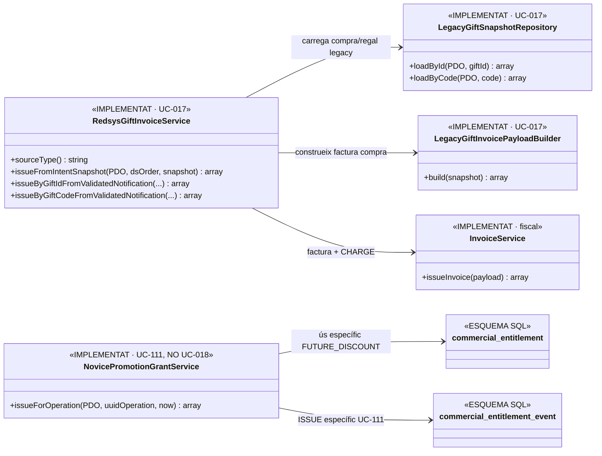
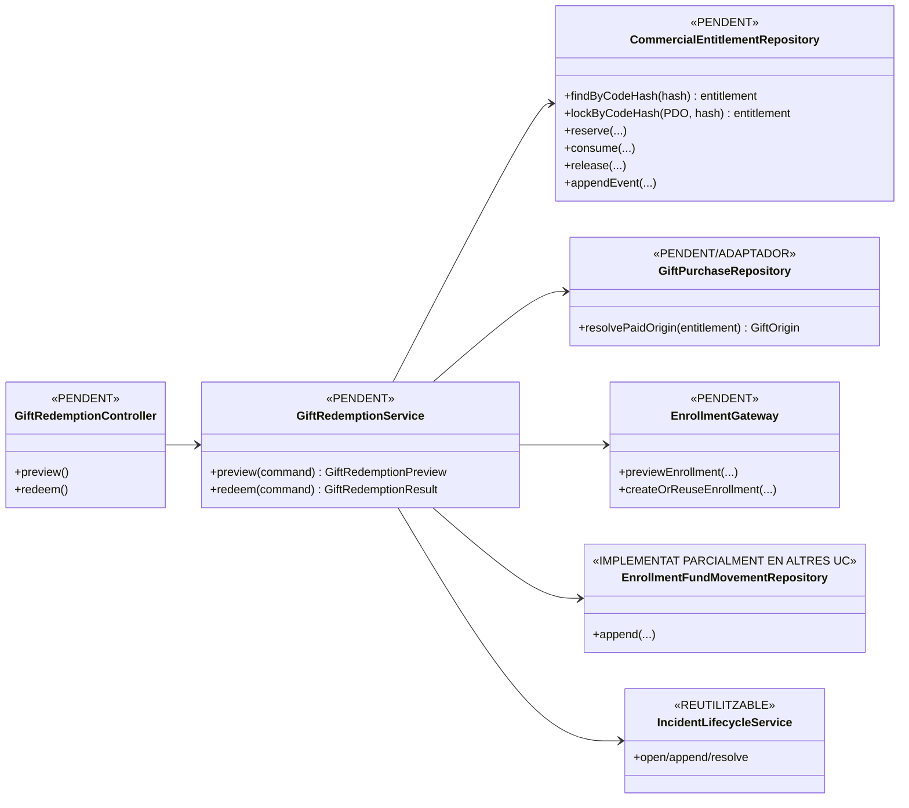

# UC-018 · Classes ACTUAL/FINAL — Bescanviar regal

## 1. Objectiu de l'auditoria

Aquest document separa estrictament les classes i responsabilitats **existents al codi** de les necessàries per completar UC-018. No es considera implementació el fet que una taula SQL o una classe de disseny aparegui en un UML.

## 2. ACTUAL — codi acreditat a `main`



### 2.1. Lectura funcional

- `RedsysGiftInvoiceService`, `LegacyGiftSnapshotRepository` i `LegacyGiftInvoicePayloadBuilder` cobreixen **la compra del regal (UC-017)**.
- `commercial_entitlement` i `commercial_entitlement_event` existeixen com a **estructura de persistència**, però no tenen un repository genèric acreditat.
- `NovicePromotionGrantService` demostra que l'esquema d'entitlements s'utilitza, però només per **UC-111/FUTURE_DISCOUNT**. No valida, reserva ni consumeix drets `GIFT`.
- No s'ha localitzat cap classe executable equivalent a `GiftRedemptionService`, cap adapter d'inscripció i cap API/UI de bescanvi.

## 3. FINAL — arquitectura mínima necessària



## 4. Contractes obligatoris

### 4.1. `GiftRedemptionService`

Ha de:

1. acceptar un codi només per canal protegit i convertir-lo a hash abans de consultar persistència;
2. resoldre el dret `ENTITLEMENT_TYPE=GIFT`;
3. validar estat, vigència, titular/beneficiari i origen pagat;
4. separar `preview` de `redeem`;
5. usar idempotència i lock per evitar doble consum;
6. crear o reutilitzar una única inscripció;
7. registrar l'aplicació del valor del regal sense crear un `CHARGE` fictici;
8. consumir o alliberar el dret amb event append-only;
9. obrir incidència si l'alta acadèmica i el consum queden inconsistents.

### 4.2. `CommercialEntitlementRepository`

No pot ser un CRUD lliure. Les transicions permeses per UC-018 són, com a mínim:

```text
ACTIVE/ISSUED -> RESERVED -> CONSUMED
                     \-> ACTIVE/ISSUED (RELEASE)
EXPIRED/CANCELLED/CONSUMED -> cap segon consum
```

Cada transició ha de generar `commercial_entitlement_event`.

### 4.3. `EnrollmentGateway`

Ha d'aïllar l'escriptura al llegat. UC-018 no queda complet fins que existeixi una frontera única que:

- creï o recuperi la mateixa inscripció per reintent equivalent;
- no escrigui `PAGAMENT` ni inventi `IDPAG`;
- retorni un identificador estable de matrícula;
- permeti reconciliar una alta parcial.

## 5. Estat de completitud

| Component | Documentat | Implementat | Verificat | Pendent |
| --- | --- | --- | --- | --- |
| Compra/factura regal UC-017 | Sí | Sí | Tests UC-017 | — |
| Taules entitlement | Sí | Sí (schema) | Migració present | Aplicació a entorn |
| Repository generic entitlement | Sí (disseny) | No | No | Sí |
| Servei bescanvi | Sí (disseny) | No | No | Sí |
| Gateway inscripció | Sí (disseny) | No | No | Sí |
| Ledger aplicació valor regal→inscripció | Sí | Parcial en altres UC | No UC-018 | Sí |
| API/UI bescanvi | Sí (disseny) | No | No | Sí |
| Incidència/reconciliació | Sí | Infra genèrica existent | No UC-018 | Integració |

## 6. Criteri de tancament

UC-018 no es pot marcar `IMPLEMENTED` fins que les classes FINAL deixin de ser només disseny i existeixi una prova d'integració que demostri **un únic consum, una única inscripció i cap segon cobrament pel valor ja pagat del regal**.
