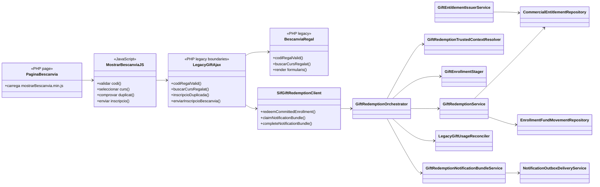

# UC-018 · Classes ACTUAL/FINAL — Bescanviar regal

## 1. Tall revalidat — 2026-10-03

El flux base de **bescanvi a valor exacte** està implementat. El nucli SIF conserva l'evidència CI del 02/10; la revalidació 03/10 ha afegit hardening a la frontera navegador→legacy i una prova boundary nova, pendent del CI d'aquesta branca.

## 2. ACTUAL — components executables



## 3. Responsabilitats verificades

- **Pàgina:** `pagina_bescanvia.php` referencia el bundle rastrejable `mostrarBescanvia.min.js?ver=6.0`.
- **Browser:** les quatre crides que transporten codi regal o identitat personal són POST amb cos de petició.
- **Legacy guard:** els tres endpoints exclusius UC-018 són POST-only; `inscripcioDuplicada.php` és compartit i UC-018 l'invoca per POST. El lookup revalida el codi i el writer exigeix `FACT_REL > 0`.
- **Resposta pública:** `BescanviaRegal::codiRegalValid()` no diferencia públicament inexistent/pendent/consumit.
- **UC-017 / origen monetari:** `RedsysGiftInvoiceService` + `GiftEntitlementIssuerService` conserven factura/`CHARGE` i creen/reutilitzen GIFT.
- **Dret:** `CommercialEntitlementRepository` governa holder, lock, `CLAIM`, `RESERVE`, `CONSUME`, `RELEASE` i events append-only.
- **Context:** `GiftRedemptionTrustedContextResolver` deriva participant i snapshot des de dades persistides.
- **Alta:** `GiftEnrollmentStager` crea/reutilitza l'operació `ENROLLMENT/INSCRIPCIO`.
- **Economia:** `GiftRedemptionService` registra un únic `COMPENSATION_ALLOCATION` sobre el `UUID_PAYMENT` original.
- **Reconciliació:** `LegacyGiftUsageReconciler` fa compare-and-set de `regal.USAT`.
- **Recovery:** `GiftRedemptionOrchestrator` convergeix sobre el mateix resultat després de timeout/resposta perduda.
- **Notificacions:** bundle de sis outbox + claim/complete independent.
- **Frontera interna:** `SifGiftRedemptionClient` usa POST/HMAC i no posa el codi a URL.

## 4. ACTUAL vs FINAL

| Component | Documentat | Implementat | Verificació |
| --- | --- | --- | --- |
| Pàgina + bundle real | Sí | Sí, patch 03/10 | CI patch pendent |
| Browser→legacy POST | Sí | Sí, patch 03/10 | Boundary afegit; CI pendent |
| Resposta neutra / no enumeració | Sí | Sí, patch 03/10 | Boundary afegit; CI pendent |
| Regal pagat abans del writer | Sí | Sí, `FACT_REL > 0` | Boundary afegit; CI pendent |
| Compra pagada UC-017 | Sí | Sí | CI 02/10 |
| Emissió dret GIFT | Sí | Sí | Integració |
| Repository entitlement | Sí | Sí | Integració |
| Context autoritatiu | Sí | Sí | Integració |
| Staging inscripció | Sí | Sí | Integració |
| Bescanvi idempotent | Sí | Sí | Integració/replay |
| Aplicació de fons | Sí | Sí | 1 allocation, 0 CHARGE nous |
| Reconciliació `regal.USAT` | Sí | Sí | Integració |
| Recovery resposta perduda | Sí | Sí | Integració |
| Concurrència multiprocés | Sí | Sí | Test 02/10 |
| Govern SMTP/outbox | Sí | Sí | Tests 02/10 |
| Preflight/preproducció | Sí | Codi sí | Execució real [ENV] |
| Diferències de preu | Sí | Bloqueig explícit | [POLICY] |

## 5. Invariant de tancament

```text
1 compra pagada
1 dret GIFT
1 inscripció
1 COMPENSATION_ALLOCATION
1 consum
0 CHARGE addicionals
0 factures addicionals
replay idempotent
secret/PII fora de query string
```

El FINAL de codi coincideix amb l'ACTUAL de la branca per al flux base; falta que el CI nou ho acrediti i, separadament, l'acceptació real de preproducció.
