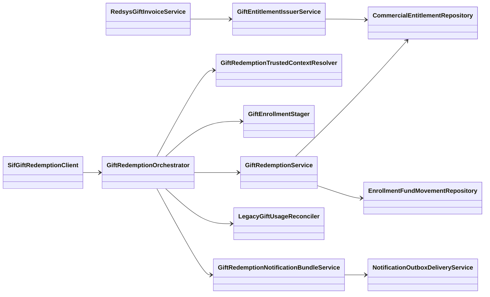

# UC-018 · Classes ACTUAL/FINAL — Bescanviar regal

## 1. Estat auditat — 2026-10-02

L'arquitectura FINAL definida durant l'auditoria ja té implementació executable per al flux aprovat de **bescanvi a valor exacte**. Les variants amb diferència de preu continuen bloquejades de manera fail-closed fins que existeixi una decisió funcional específica.

## 2. ACTUAL — codi executable



## 3. Responsabilitats verificades

- **UC-017 / origen monetari:** `RedsysGiftInvoiceService` conserva factura i `CHARGE` originals i materialitza el dret GIFT.
- **Dret:** `CommercialEntitlementRepository` governa holder, lock, `CLAIM`, `RESERVE`, `CONSUME`, `RELEASE` i events append-only.
- **Context autoritatiu:** `GiftRedemptionTrustedContextResolver` deriva participant i snapshot des de dades persistides; el caller no declara `holder_party_key` ni `trusted_price_snapshot`.
- **Alta acadèmica:** `GiftEnrollmentStager` crea/reutilitza l'operació `INSCRIPCIO` contra una inscripció legacy ja compromesa.
- **Economia:** `GiftRedemptionService` registra una única `COMPENSATION_ALLOCATION` contra el `UUID_PAYMENT` original i no crea un segon `CHARGE`.
- **Reconciliació:** `LegacyGiftUsageReconciler` fa compare-and-set de `regal.USAT`.
- **Orquestració/replay:** `GiftRedemptionOrchestrator` convergeix sobre el mateix resultat després de timeout o resposta perduda.
- **Notificacions:** sis efectes SMTP legacy es representen com sis outbox idempotents, reclamables individualment després del redeem/reconciliació.
- **Frontera web→SIF:** `SifGiftRedemptionClient` usa POST/HMAC i no posa el codi regal a URL.

## 4. ACTUAL vs FINAL

| Component | Documentat | Implementat | Verificació |
| --- | --- | --- | --- |
| Compra pagada UC-017 | Sí | Sí | CI UC-017 |
| Emissió dret GIFT | Sí | Sí | Integració |
| Repository entitlement | Sí | Sí | Integració |
| Context autoritatiu | Sí | Sí | Integració |
| Staging inscripció | Sí | Sí | Integració |
| Bescanvi idempotent | Sí | Sí | Integració/replay |
| Aplicació de fons | Sí | Sí | 1 `COMPENSATION_ALLOCATION`, 0 `CHARGE` nous |
| Reconciliació `regal.USAT` | Sí | Sí | Integració |
| Recovery resposta perduda | Sí | Sí | Test integrat al PR de tancament |
| Concurrència multiprocés | Sí | Sí | Test integrat al PR de tancament |
| Govern SMTP/outbox | Sí | Sí | Tests bundle/boundary al PR de tancament |
| Preflight/preproducció | Sí | Sí | Boundary automatitzat; execució real és gate d'entorn |
| Diferències de preu | Sí | Bloqueig explícit | Fora abast UC-018 base fins decisió |

## 5. Invariant de tancament

```text
1 compra pagada
1 dret GIFT
1 inscripció
1 COMPENSATION_ALLOCATION
1 consum
0 CHARGE addicionals
0 factures addicionals
replay idempotent
```

La prova de preproducció real continua sent un **gate d'execució d'entorn**, no una absència de codi o documentació.