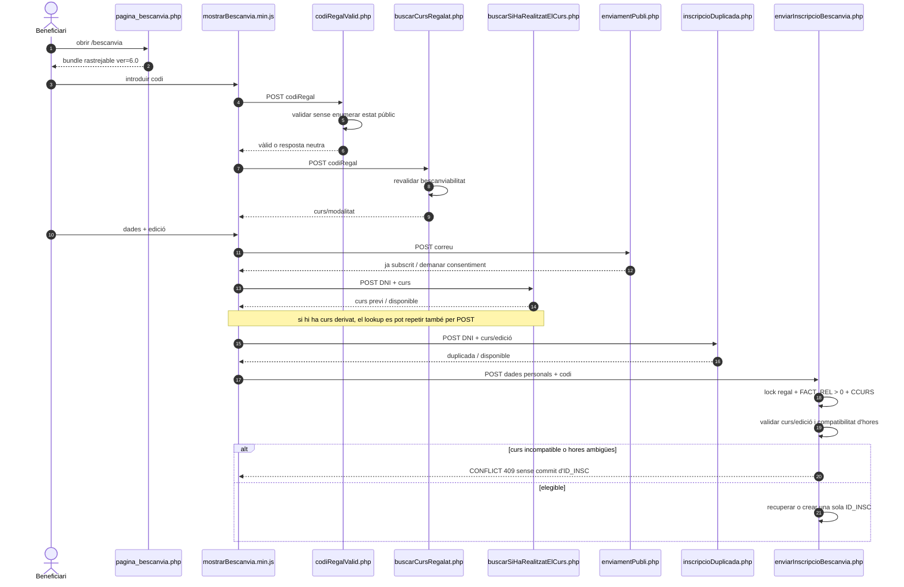
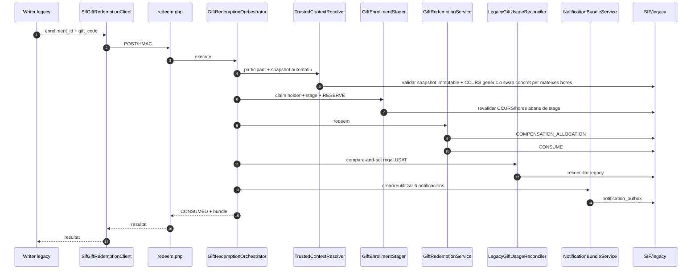
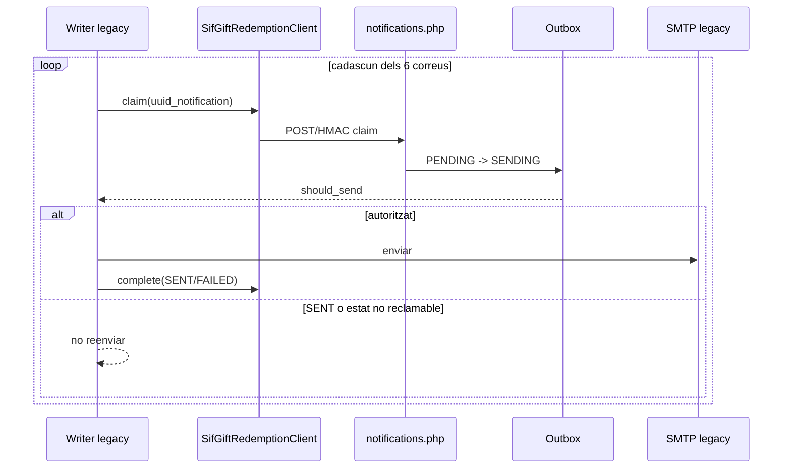
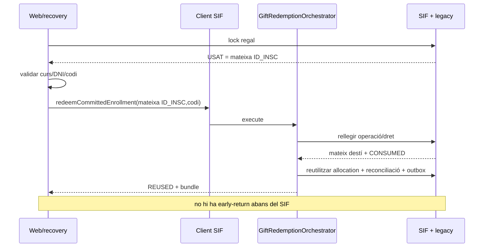
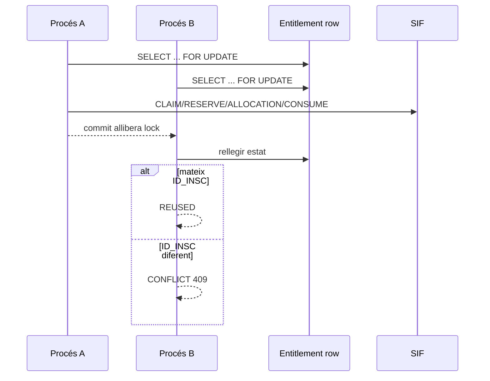
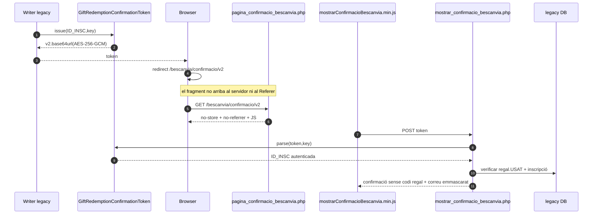

# UC-018 · Seqüències ACTUAL/FINAL — Bescanviar regal

## 1. Tall revalidat — 2026-10-04

Aquest document mostra l'ACTUAL de la branca de revalidació. El canvi principal respecte del tall 02/10 és que també es governa la frontera **navegador→legacy**, no només la frontera interna legacy→SIF.

## 2. ACTUAL — entrada web, validació i alta

Cap petició UC-018 que transporta `codiRegal`, DNI o correu els posa a la query string.

## 3. ACTUAL — SIF i consum nominal

## 4. ACTUAL — correus post-SIF

## 5. Replay / resposta perduda

## 6. Concurrència multiprocés

## 7. ACTUAL — confirmació segura

Els tokens antics CBC no són acceptats pel nou parser: es prioritza fail-closed davant mantenir un format amb IV no autenticat.

## 8. FINAL

Per al flux base, FINAL = ACTUAL de la branca un cop el CI nou sigui verd. El FINAL admet regal genèric de N hores i regal d'un curs concret. El concret pot usar el curs original o un altre de les mateixes hores; si la història del curs original no permet obtenir una única durada, el canvi falla tancat. Resten fora:

- [ENV] execució real de preproducció/SMTP;
- [POLICY/DATA] equivalència entre preu de catàleg del curs i `FACE_VALUE`; cal definir snapshot/data/descomptes abans de calcular diferencials;
- [POLICY] romanent, cobrament complementari, devolució o consum parcial.

## 9. Verificació

El nucli/SIF conserva el tall verificat del PR #115: 858/0, 49 PASS GIFT/UC-018. El 03–04/10 s'han ampliat la prova boundary pública i les proves de `GiftRedemptionTrustedContextResolver`/`GiftEnrollmentStager` per a snapshot immutable, `CCURS` numèric, swap concret per mateixes hores i rebuig d'incompatibilitats. `GiftRedemptionConfirmationBoundaryTest` afegeix token AEAD, tampering, routing, fragment i POST de confirmació. El CI del nou head ha d'acreditar aquestes regressions.
