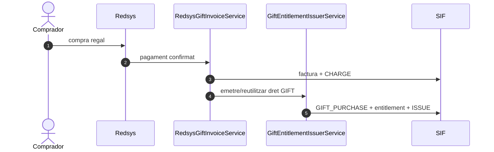
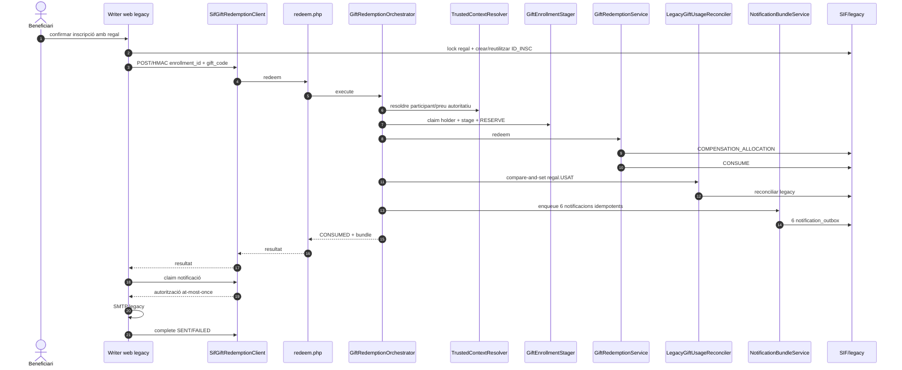
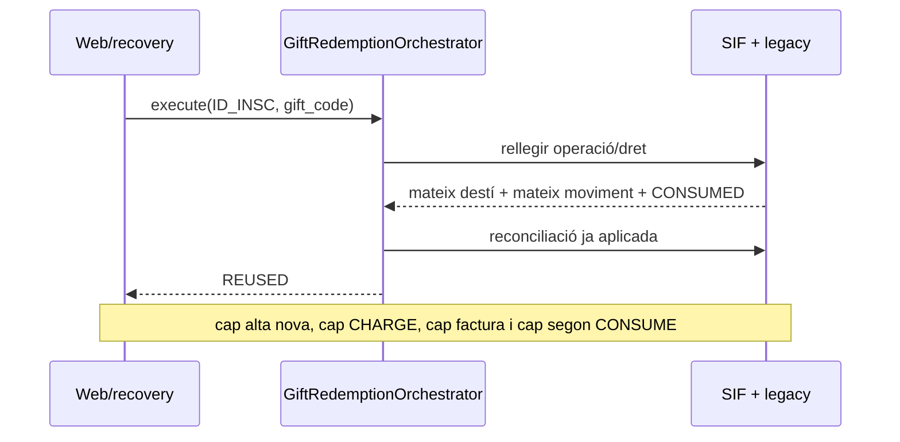
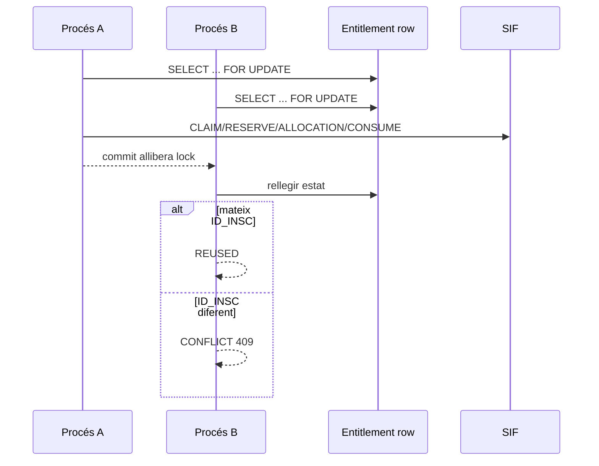

# UC-018 · Seqüències ACTUAL/FINAL — Bescanviar regal

## 1. ACTUAL — compra i emissió del dret

## 2. ACTUAL — bescanvi nominal

## 3. Replay / resposta perduda

## 4. Concurrència multiprocés

## 5. Notificació i fallada SMTP

- Cap `MailSMTPComvive` s'executa abans d'un redeem/reconciliació SIF correcte.
- Cada un dels sis correus té outbox i claim propis.
- `PENDING → SENDING` és el punt d'autorització d'enviament.
- `SENDING` ambigu no es reclama automàticament una segona vegada.
- `SENT` és idempotent.
- `FAILED` queda per revisió; no hi ha retry automàtic que pugui duplicar un enviament ja acceptat pel proveïdor.

## 6. Diferències de preu

El flux executable auditat exigeix valor exacte. Un curs de valor diferent **no** genera automàticament cobrament, saldo, devolució ni consum parcial. Es rebutja/falla tancat fins a una decisió funcional específica.