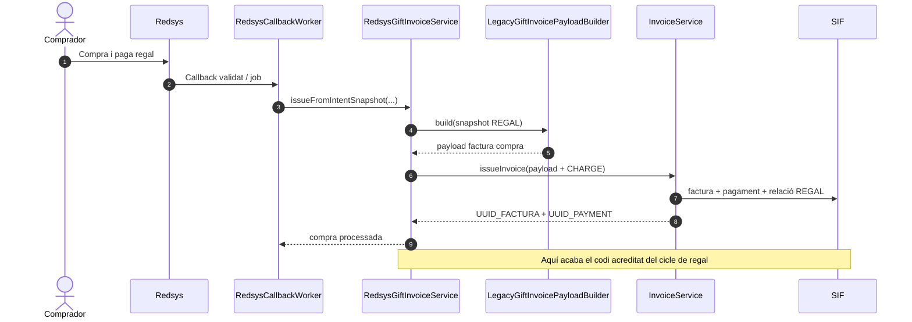
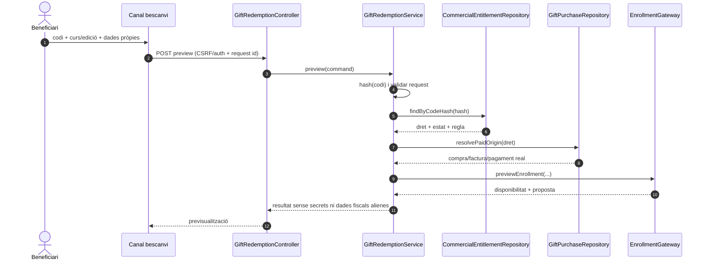
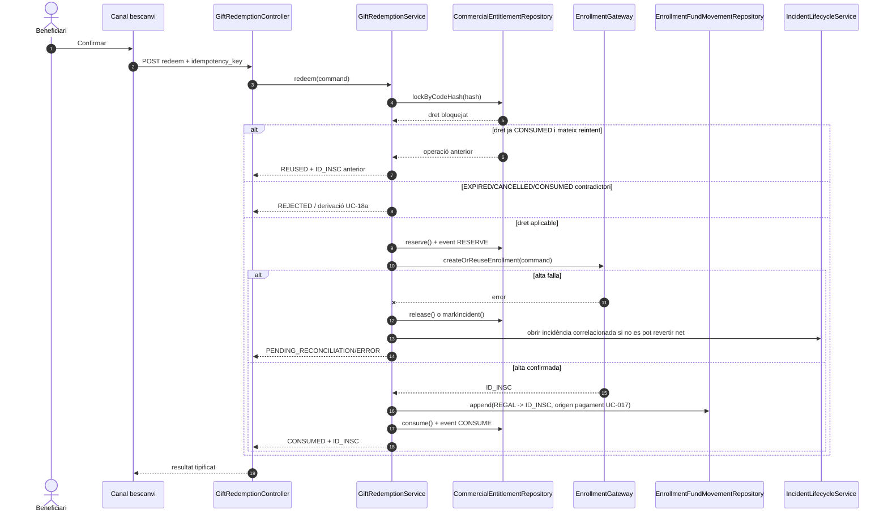
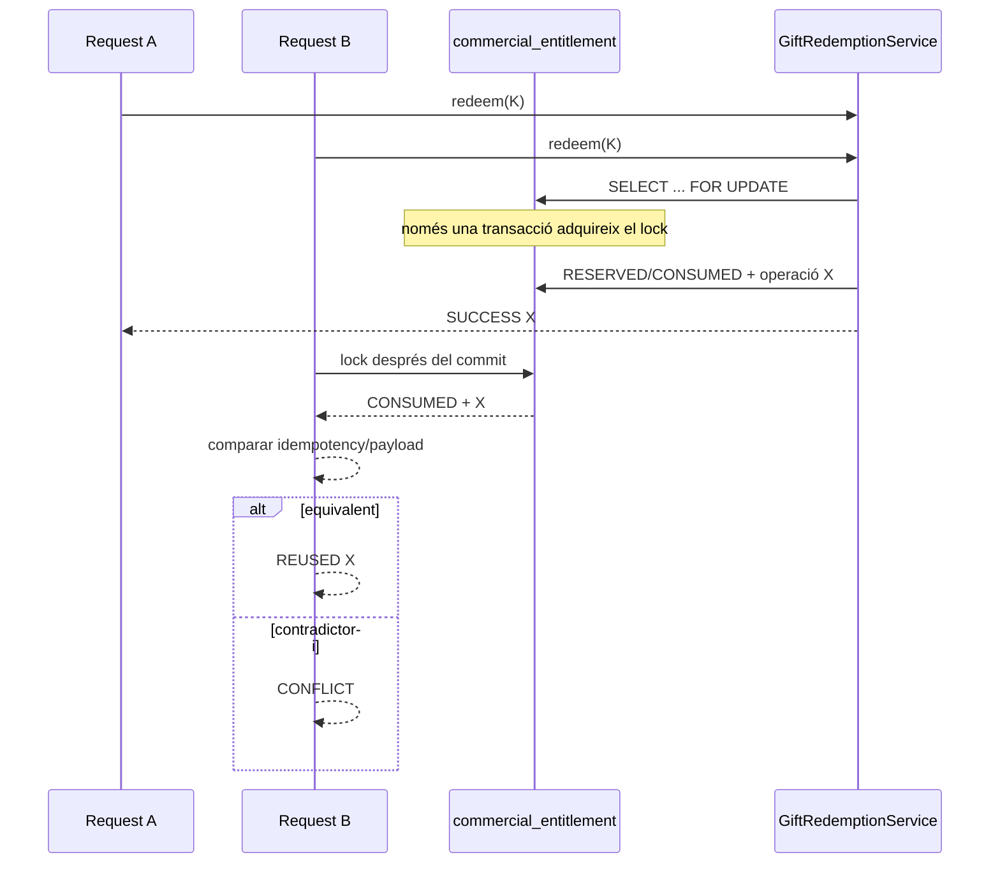

# UC-018 · Seqüències ACTUAL/FINAL — Bescanviar regal

## 1. ACTUAL — què passa avui

El repositori acredita la **compra** del regal, però no el bescanvi.

No hi ha una seqüència executable posterior que rebi el codi i creï la inscripció.

## 2. FINAL — preview del bescanvi

### Invariants del preview

- cap mutació;
- no exposar si un codi desconegut pertany a una persona concreta;
- no retornar factura/PDF del comprador;
- no reconstruir l'import original des del preu viu del curs;
- diferència econòmica explicitada però no cobrada encara.

## 3. FINAL — confirmació nominal

## 4. FINAL — concurrència

## 5. FINAL — diferència de preu

Per un regal ja cobrat de 100 € aplicat a un curs de 120 €:

1. reservar el dret de 100 €;
2. no crear cap `CHARGE` nou pels 100 €;
3. generar una obligació/intenció separada de 20 €;
4. només completar el consum quan la regla aprovada ho permeti;
5. mantenir dues procedències de fons diferenciades.

La política exacta de regal de valor superior al curs i del romanent continua essent una decisió de negoci/fiscal pendent; no s'ha d'inventar en codi.

## 6. Estat

| Seqüència | ACTUAL | FINAL documentat | Testada |
| --- | --- | --- | --- |
| Compra UC-017 | Sí | Sí | Sí, proves existents UC-017 |
| Preview UC-018 | No | Sí | No |
| Redeem UC-018 | No | Sí | No |
| Idempotència/concurrència | No | Sí | No |
| Error alta / release | No | Sí | No |
| Diferència addicional | No | Parcial (regla pendent) | No |
