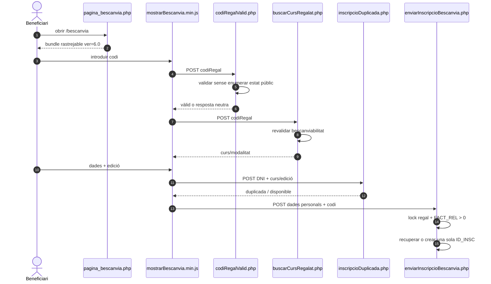
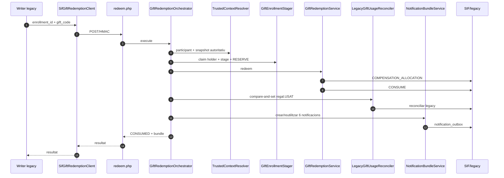
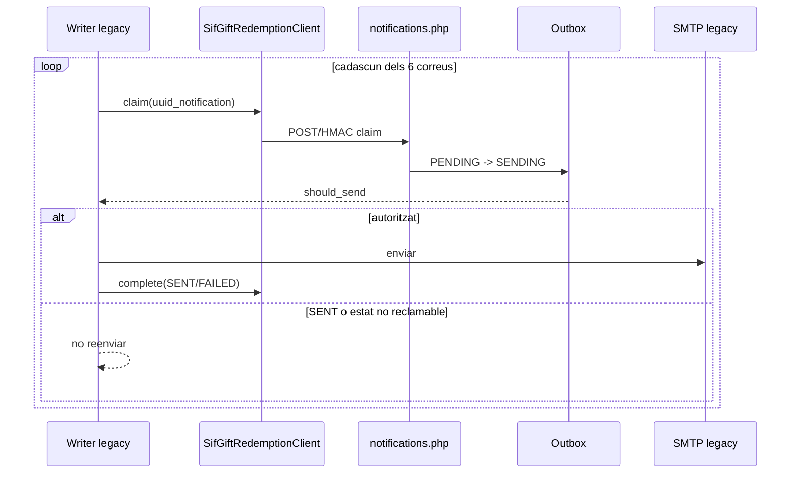
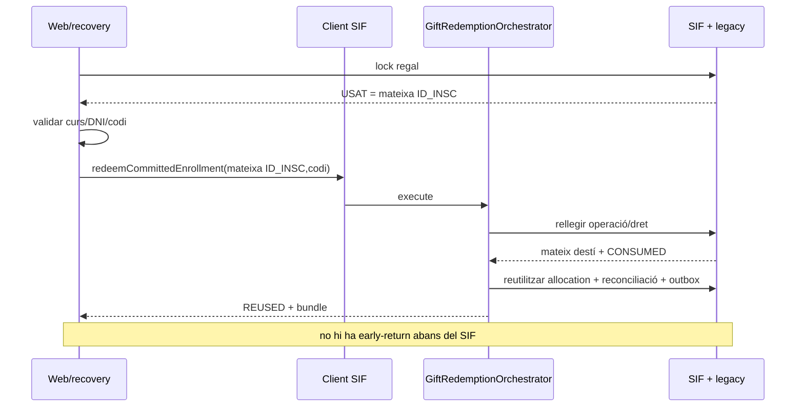
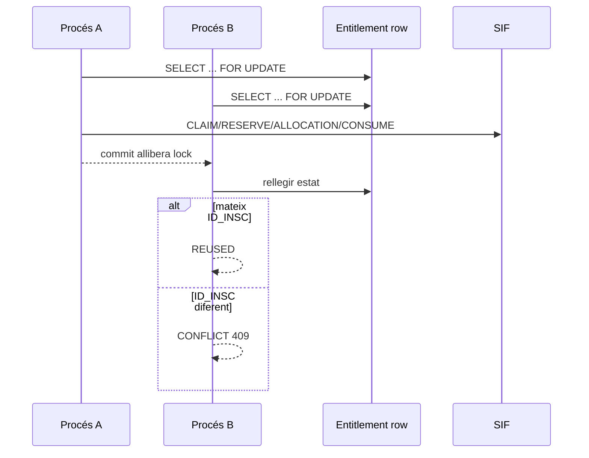

# UC-018 · Seqüències ACTUAL/FINAL — Bescanviar regal

## 1. Tall revalidat — 2026-10-03

Aquest document mostra l'ACTUAL de la branca de revalidació. El canvi principal respecte del tall 02/10 és que també es governa la frontera **navegador→legacy**, no només la frontera interna legacy→SIF.

## 2. ACTUAL — entrada web, validació i alta

Cap d'aquestes quatre peticions sensibles posa `codiRegal` ni DNI a la query string.

## 3. ACTUAL — SIF i consum nominal

## 4. ACTUAL — correus post-SIF

## 5. Replay / resposta perduda

## 6. Concurrència multiprocés

## 7. FINAL

Per al flux base, FINAL = ACTUAL de la branca un cop el CI nou sigui verd. Resten fora:

- [ENV] execució real de preproducció/SMTP;
- [POLICY] diferències de valor, romanent, cobrament complementari, devolució o consum parcial.

## 8. Verificació

El nucli/SIF conserva el tall verificat del PR #115: 858/0, 49 PASS GIFT/UC-018. La prova boundary ampliada del 03/10 és la que ha d'acreditar la nova frontera pública.
