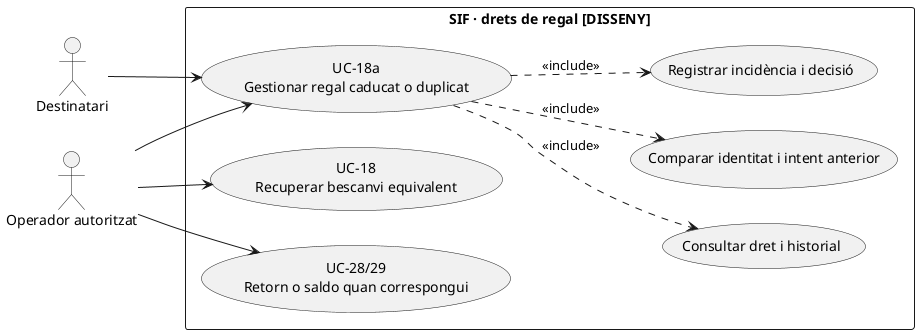
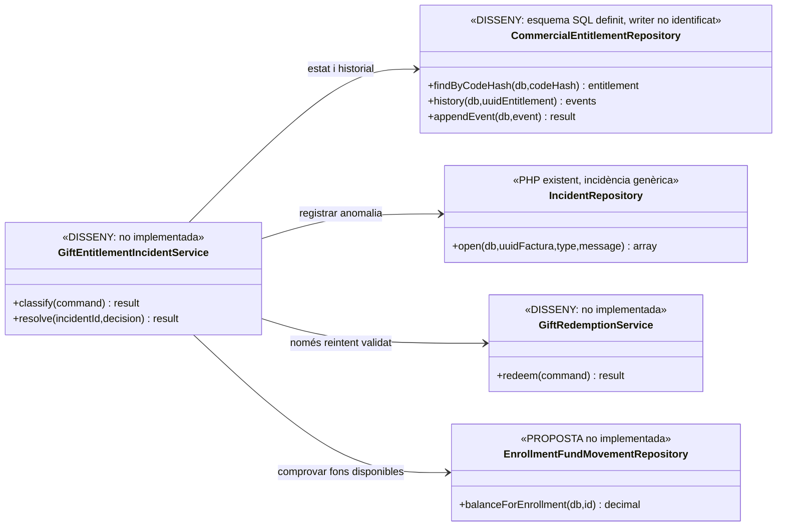

# UC-18a · Gestionar regal caducat, duplicat o disputat

**Objectiu del catàleg:** gestionar una **incidència operativa**, no crear automàticament una altra factura. És la ruta d'excepció d'UC-18 (bescanvi); la compra i el cobrament originals són UC-17. El tractament complet d'un regal, canvi o devolució posterior forma part de UC-119 i, si escau, UC-28/29/71/72.

**Estat contrastat:** `commercial_entitlement` i `commercial_entitlement_event` existeixen **com a definicions SQL** i enumeren, segons el diccionari, `EXPIRED`, `CONSUMED`, `CANCELLED` i `INCIDENT`; `IncidentRepository::open()` existeix com a mètode genèric per obrir incidències. **No s'ha identificat un servei de validació/expiració o un workflow de resolució de regals implementat a `sif/src`.** Els passos de gestió detallats aquí són **disseny**, no una funcionalitat desplegada acreditada.

## 1. Fitxa funcional de l'excepció

| Aspecte | Regla objectiu |
| --- | --- |
| Actors | Persona destinatària que rep un rebuig segur; operador de gestió que investiga; persona titular de la compra quan el resultat econòmic l'afecta. |
| Identificació | Hash del codi de regal/dret, compra i factura originals, identificació de titular/beneficiari i eventual `CONSUMED_UUID_OPERATION` i inscripció destí. No publicar el codi en clar o dades del comprador durant una consulta fallida. |
| Caducitat | Comparar `EXPIRES_AT` amb data efectiva i condicions de la versió de regla `RULE_VERSION`; **la mera existència d'`EXPIRES_AT` a SQL no prova una expiració automàtica ja programada.** |
| Duplicat equivalent | Mateixa petició ja confirmada per un únic dret/operació/inscripció: reutilitzar el resultat preexistent si és el mateix titular i destí i no concedir un segon regal. |
| Duplicat contradictori | Dret ja `CONSUMED` per **una altra operació o inscripció**: bloquejar i obrir incidència de titularitat/concurrència; no marcar la nova petició com a èxit. |
| Incidència | `commercial_entitlement_event` amb `ACTION` i `RESULT`, des de/vers estat, actor, causa i correlació; el servei genèric `IncidentRepository::open()` només desa factura opcional, tipus, missatge i estat `OPEN`, i **no** enllaça per si mateix el dret comercial. |
| Resultat fiscal i monetari | **Cap emissió, `CHARGE`, `REFUND` o saldo automàtics** pel fet d'introduir un codi caducat o duplicat. Qualsevol reactivació, substitució, devolució o correcció exigeix decisió motivada, permisos i cas d'ús concret. |

### 1.1. Flux objectiu de diagnosi i resolució

1. UC-18 denega l'intent quan el dret és desconegut, vençut, consumit, cancel·lat o no pertany a la persona que el vol aplicar. La resposta pública és acotada i no revela la identitat del comprador.
2. El canal de suport recull identificador de consulta i correlació; la persona autoritzada resol de forma protegida el dret `GIFT`, l'estat actual i els events de `commercial_entitlement_event`, factura de compra UC-17 i eventual inscripció de bescanvi.
3. Es distingeixen quatre causes **sense equiparar-les**: caducat abans de consumir, duplicat idempotent d'un bescanvi correcte, doble consum impossible o contradictori, i codi alterat/titular incorrecte. Una petició tardana no ressuscita el dret automàticament.
4. Si el bescanvi anterior està **realment complet**, una petició equivalent retorna l'operació/inscripció ja creada després de validar titular; no crea cap matrícula, document fiscal ni cobrament nou.
5. Si el dret és caducat o hi ha disputa, l'operador revisa les condicions comercials i la titularitat. Les possibles sortides —rebutjar amb justificació, nova proposta comercial, pròrroga autoritzada, devolució real, saldo o canvi de curs— **no són automàtiques ni equivalents fiscalment**.
6. Les decisions autoritzades han de generar un event d'entitlement i un event operatiu amb actor/motiu, estats abans/després i referència a l'acció executada. Quan hi hagi pagament previ, s'ha de consultar `UUID_PAYMENT` real i origen/destí de fons per inscripció abans de qualsevol retorn o traspàs.
7. UC-08 ha de conservar la incidència oberta quan manca prova d'un bescanvi, hi ha doble assignació del dret, el pagament de compra és incert o el tractament fiscal queda pendent.

### 1.2. Exemples que s'han de distingir en proves

| Entrada | Resultat esperat del disseny |
| --- | --- |
| Codi expirat, no consumit i compra cobrada | No aplicar regal; revisar condicions i titular abans de decidir si existeix dret a reactivació, saldo o retorn. |
| Mateix codi reintroduït després de bescanvi complet per mateixa persona i curs | Recuperar `UUID_OPERATION` i `ID_INSC` de l'operació antiga, sense efectes duplicats. |
| Mateix codi sobre una altra inscripció mentre figura `CONSUMED` | Denegar segon consum i obrir investigació; si es vol canviar curs, UC-71, no consumir un segon cop el mateix dret. |
| Dos workers validen el mateix codi simultàniament | Un únic lock/versió i un únic `CONSUMED_UUID_OPERATION`; el segon rep resultat preexistent o conflicte, mai duplica l'inscrit. |
| Codi comunicat a un tercer | Verificar titular/autorització i minimitzar informació de compra; cap lliurament de factura del comprador per conèixer només el codi. |
| Regal comprat però pagament després retornat | No aplicar valor ja retornat; comparar `payment_transaction` i situació del dret abans de qualsevol bescanvi. |
| Regal «reservat» i alta acadèmica fallida | Traçar `RELEASE` o mantenir `INCIDENT` reconciliable; no donar `CONSUMED` per correcte sense inscripció efectiva. |

**Limitació principal:** la migració i el diccionari defineixen estats i events **objectiu**. No hi ha una prova d'integració de UC-18a executada ni un workflow PHP del regal identificat a aquesta revisió.

### 1.3. Codi visible al llegat i verificació de drets abans d'una reactivació

**El codi no és una credencial de titularitat econòmica.** `LegacyGiftSnapshotRepository::loadByCode()` busca `regal.CODI` i recupera `regal.FACT_REL`, `ORIGEN` i `DESTI`. El constructor `LegacyGiftInvoicePayloadBuilder::line()` inclou avui `'Codi regal ' . $code` al **detall de la factura del comprador**, i `giftMetadata()` incorpora també el codi en clar. Una persona pot haver rebut o vist aquest codi sense ser el pagador, el receptor fiscal de la factura ni el beneficiari autoritzat del reemborsament. En consultes de codi invàlid/ja consumit no retornar ni aquestes dades ni el PDF del comprador; limitar el missatge públic i preservar la causa completa a una incidència amb accés restringit.

**Caducitat del codi i conservació de la compra.** La compra real pot tenir factura/ingrés confirmats mentre el codi està `EXPIRED`, `CONSUMED` o té una incidència de titularitat. Aquest estat **no anul·la automàticament** la factura de compra ni crea un `REFUND` bancari: contrastar `regal.ID`, `UUID_FACTURA`, `UUID_PAYMENT` i el dret `commercial_entitlement` **si s'ha creat realment**. La sola presència de `FACT_REL` no prova que el codi hagi estat consumit o que hi hagi una inscripció destinatària.

**Peticions simultànies i lliurament repetit.** Si dues persones reclamen el mateix codi, bloquejar per dret/versió i distingir **repetició equivalent** de **destinació diferent** abans de crear la matrícula. Una nova impressió o reenvio de la targeta regal després d'un email fallit és un reintent del **lliurament comercial**, no l'emissió d'una altra factura, una segona activació del dret o un altre cobrament. El servei de consum atòmic i la coordinació amb el llegat continuen **pendents**: el `loadByCode()` actual és una lectura i no acredita el bloqueig.

### 1.4. Proves d'exposició i consulta de dret (no executades)

| ID | Escenari | Resultat exigible |
| --- | --- | --- |
| RG-18A-01 | Un tercer coneix el codi perquè apareix al detall fiscal | No obtenir PDF/dades del comprador ni dret de reemborsament sense autorització independent. |
| RG-18A-02 | `regal.FACT_REL` existeix però no consta inscripció de destí | No inferir consum del dret; revisar estat i evidència de bescanvi. |
| RG-18A-03 | Codi caducat d'una compra ja cobrada | Compra/factura originals conservats; decisió econòmica específica, sense `REFUND` automàtic. |
| RG-18A-04 | Dos bescanvis concurrents amb destinacions diferents | Només un consum acreditat i l'altre en conflicte, sense dues matrícules. |
| RG-18A-05 | Reenviar targeta regal per fallada d'email | Només fase de comunicació reintentada, sense segon codi, factura ni `CHARGE`. |

## 2. UML de casos d'ús



## 3. Classes: repositori actual vs orquestració proposada



`IncidentRepository` no disposa d'una operació de resolució específica de regals; les dependències des de `GiftEntitlementIncidentService` representen **disseny objectiu**.

## 4. Seqüència — diferenciar duplicat equivalent i dret caducat

```mermaid
sequenceDiagram
autonumber
actor O as Destinatari/operador
participant UI as Canal segur [pendent]
participant S as GiftEntitlementIncidentService [DISSENY]
participant E as CommercialEntitlementRepository [DISSENY]
participant Inc as IncidentRepository [PHP d'obertura genèrica]
participant G as GiftRedemptionService [DISSENY]
O->>UI: Codi rebutjat a UC-18
UI->>S: classify(codi_hash,actor,requestId)
S->>E: Consultar estat, vigència, events i operació consumidora
alt Consum anterior equivalent i titular verificat
 E-->>S: UUID_OPERATION i ID_INSC antics
 S-->>UI: Reutilitzar resultat; cap nou consum o CHARGE
else Dret caducat, desconegut o titular incoherent
 E-->>S: Causa d'anomalia, sense dades alienes
 S->>Inc: open(factura?,GIFT_REDEMPTION,detalls protegits)
 Inc-->>S: ok=true [no retorna ID]
 S-->>UI: Revisió pendent o accés denegat
else Consum ja fet per operació diferent
 E-->>S: CONSUMED per una altra operació
 S->>Inc: open(...,GIFT_DUPLICATE,...)
 S-->>UI: Bloqueig; no generar altra inscripció
end
opt Pròrroga o altra decisió aprovada després de revisar el cas
 UI->>S: resolve(decision,actor,reason)
 S->>E: appendEvent(autorització,estat anterior/nou)
 opt Nou bescanvi permès expressament
  S->>G: redeem(command idempotent)
 end
end
Note over S,E: Flux de diagnosi i resolució OBJECTIU; només IncidentRepository::open és codi PHP acreditat aquí
```

## 5. Traçabilitat

[Fitxa base UC-18a](../06-fitxes-funcionals/uc-018a.md) · [UC-18 bescanvi](uc-018-bescanviar-regal.md) · [UC-17 compra](uc-017-comprar-regal.md) · [UC-119 cicle complet original](../06-fitxes-funcionals/uc-119.md) · [UC-08 incidències](uc-008-gestionar-incidencia-sif.md) · [Migració de drets i events](../../sif/database/migrations/2026_09_16_000005_add_operation_lifecycle_tables.sql) · [Diccionari](../05-governanca-operacio/24-diccionari-camps-i-valors.md) · [IncidentRepository](../../sif/src/Repository/IncidentRepository.php) · [Revisió de fons](00-revisio-moviments-inscripcions.md).
