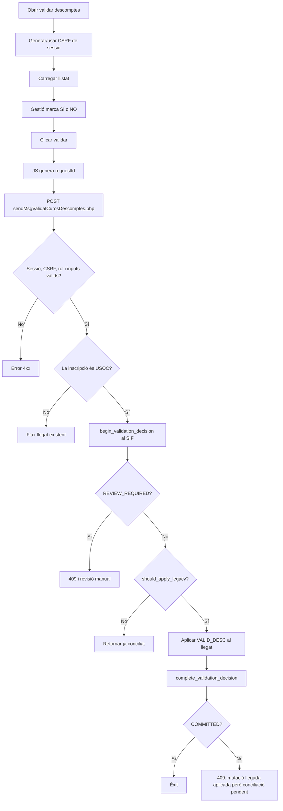

# UC-019 — Activitats per pàgina ACTUAL / FINAL

Data d'auditoria: 2026-10-03.

## 1. Pàgina `/alumnes/validar-descomptes/`

### ACTUAL

### FINAL

Afegir a la mateixa experiència una identificació explícita de la font/evidència utilitzada per la persona validadora, la seva data de vigència i un motiu estructurat, sense exposar documents sensibles a llistats ni logs.

## 2. Endpoint `ajax/alumnes/sendMsgValidatCurosDescomptes.php`

### ACTUAL

Responsabilitats observades:
- només POST;
- sessió deserialitzada i validada;
- CSRF;
- permís sobre `/alumnes/validar-descomptes/`;
- validació de `idInsc`, decisió i `requestId`;
- memoització de request a sessió;
- detecció específica USOC;
- crides begin/complete al SIF;
- fail-closed en `REVIEW_REQUIRED`.

### FINAL

Mantenir-lo com a adaptador prim. La lògica de decisió i evidència ha de residir al SIF/aplicació, i la mutació directa del llegat ha de quedar encapsulada en un adaptador explícit.

## 3. API SIF `/api/usoc/manage.php`

### ACTUAL

Accions rellevants:
- `begin_validation_decision`
- `complete_validation_decision`
- autenticació de petició interna;
- autorització per rols USOC;
- servei de decisió i persistència.

### FINAL

Conservar contracte versionat, afegir metadades mínimes d'evidència/motiu i un event operatiu append-only correlacionat.

## 4. Recuperació

### ACTUAL

Existeix `reconcile-usoc-validation-decisions.php`, que permet reprendre decisions `REQUESTED` després d'una interrupció entre la mutació llegada i la fase final del SIF.

### FINAL

Executar-lo amb política de retry, mètrica d'estats pendents i alerta quan una decisió roman massa temps en `REQUESTED`.

## 5. Estat per pàgina/apartat

| Superfície | Documentat | Implementat | Verificat | Pendent |
| --- | --- | --- | --- | --- |
| UI validar descomptes | Sí | Sí | test de contracte | UX d'evidència externa |
| JS validació | Sí | Sí | test de contracte | cap bloqueig funcional conegut |
| Endpoint intranet | Sí | Sí | tests de seguretat/frontera | prova desplegada |
| Client SIF intern | Sí | Sí | tests de contracte | prova desplegada/HMAC real |
| API SIF USOC | Sí | Sí | tests de contracte | prova preprod |
| Servei/repositori decisió | Sí | Sí | tests de servei | prova MySQL/preprod |
| Reconciliació | Sí | Sí | contracte present | prova operativa i alerta |

## Activitat específica — denegació i reintent incert

1. Generar o recuperar `requestId` persistent de `sessionStorage`.
2. Validar sessió, CSRF, rol, `idInsc`, decisió i format del `requestId`.
3. Si el `requestId` ja té resultat, validar que el payload coincideix i retornar-lo.
4. Recordar que el request era USOC abans de la mutació.
5. Crear/reutilitzar decisió `REQUESTED` al SIF.
6. Executar mutació llegada.
7. En denegació, el llegat pot convertir `TIPUS_DESC=4` a 0/1 i `VALID_DESC=2`.
8. Completar la decisió SIF: aquesta reclassificació és vàlida només per `desired=2`.
9. En èxit, memoritzar resultat i eliminar el `requestId` persistent del navegador.
10. En error/incertesa, conservar el `requestId` per al reintent.
