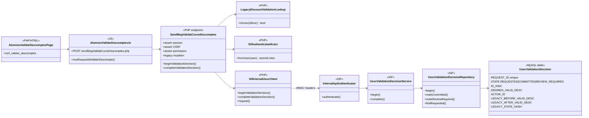
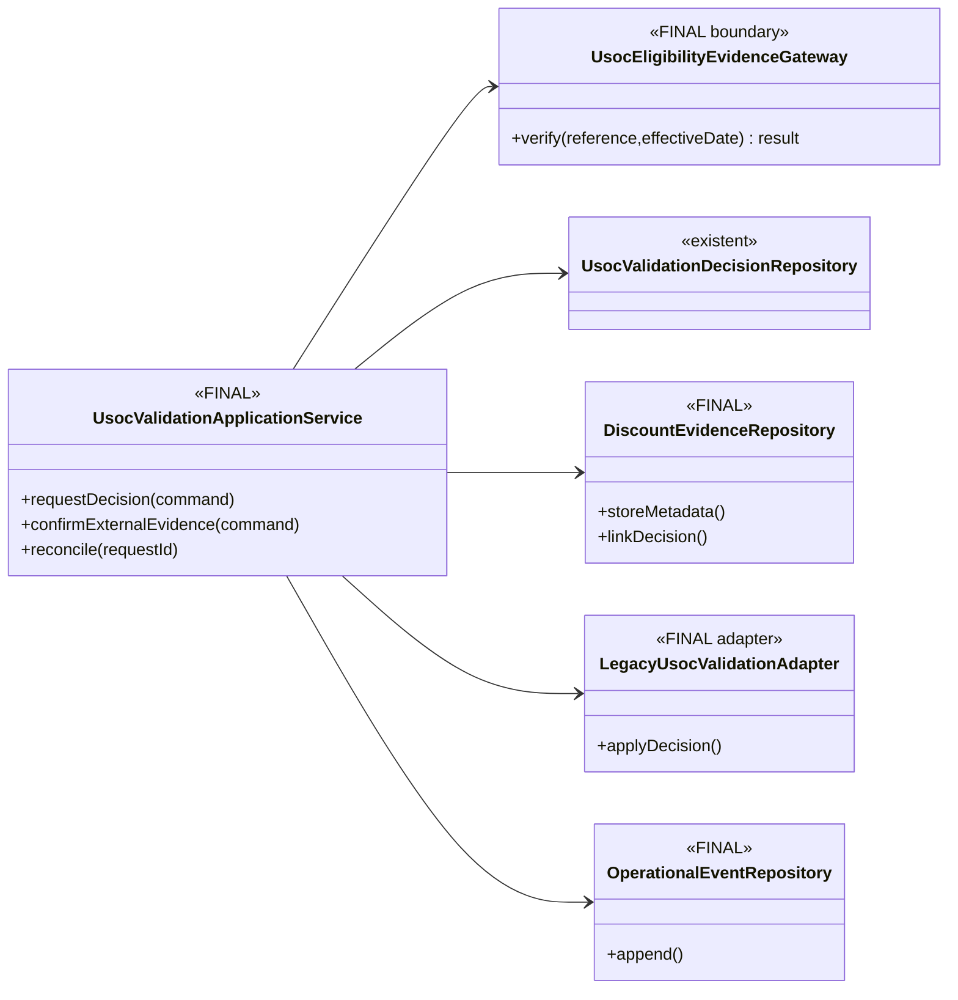
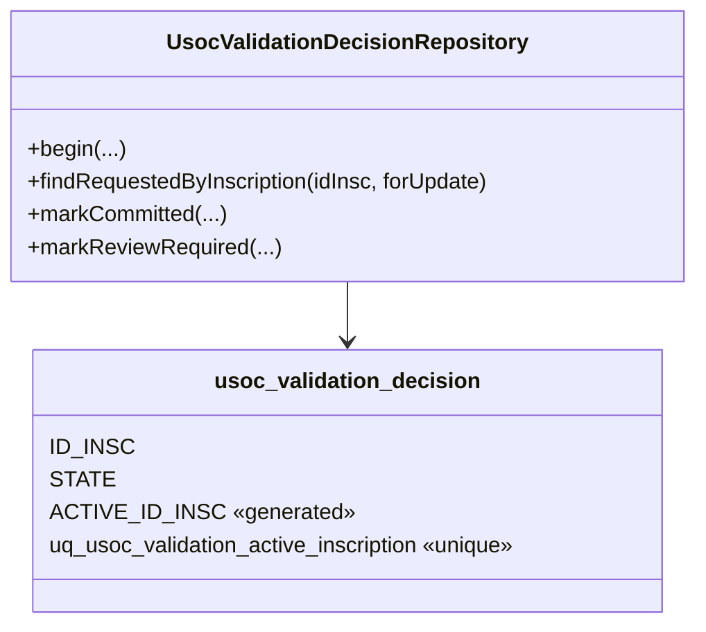

# UC-019 — Classes ACTUAL / FINAL

Data d'auditoria: 2026-10-03.

## ACTUAL — implementat

### Lectura

L'ACTUAL ja no és només disseny. El SIF disposa d'un registre propi de decisió, una frontera de dues fases i idempotència per `REQUEST_ID`. La mutació de `VALID_DESC` continua al llegat, però queda encapsulada entre `beginValidationDecision()` i `completeValidationDecision()`.

## FINAL — objectiu de tancament

El FINAL no exigeix automatitzar necessàriament la consulta amb USOC. Exigeix separar explícitament la **prova d'afiliació** de la **persistència de la decisió**, custodiar només l'evidència necessària, deixar traça append-only i disposar d'un adaptador llegat substituïble.

## Estat

- DOCUMENTAT: sí.
- IMPLEMENTAT: classes ACTUAL indicades.
- VERIFICAT: hi ha tests de servei i de contracte al repositori; no s'ha executat preproducció en aquesta auditoria.
- PENDENT: evidència real de preproducció i definició/custòdia de la font de verificació d'afiliació.

## Invariant de concurrència afegit 2026-10-04

La classe de persistència queda reforçada amb una restricció de BD:

`ACTIVE_ID_INSC = ID_INSC` únicament per `STATE=REQUESTED`; en estats terminals és `NULL`. Això permet conservar l'històric i, simultàniament, impedir dues decisions actives sobre la mateixa inscripció.
