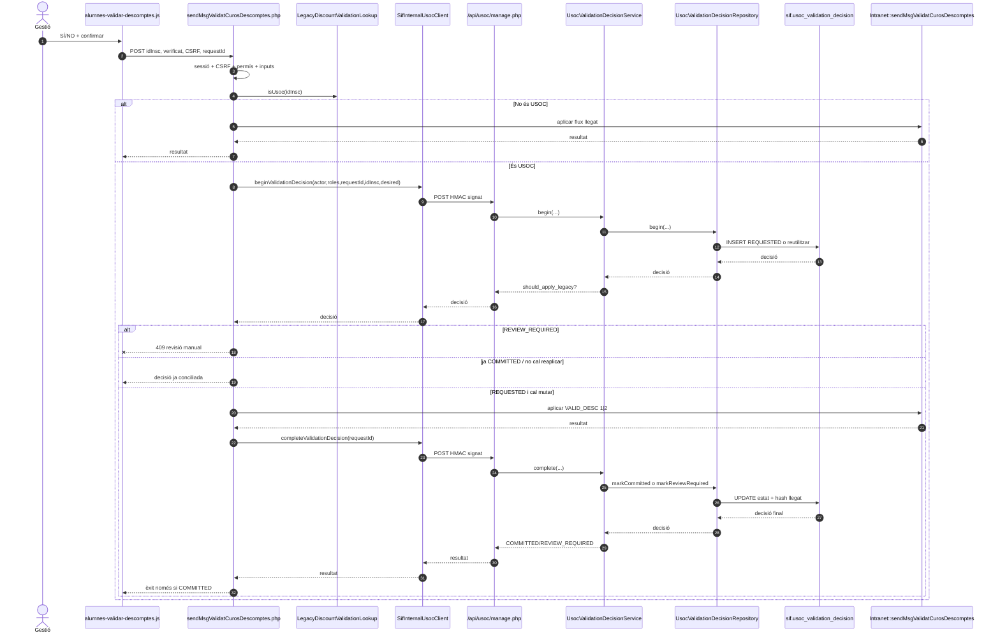
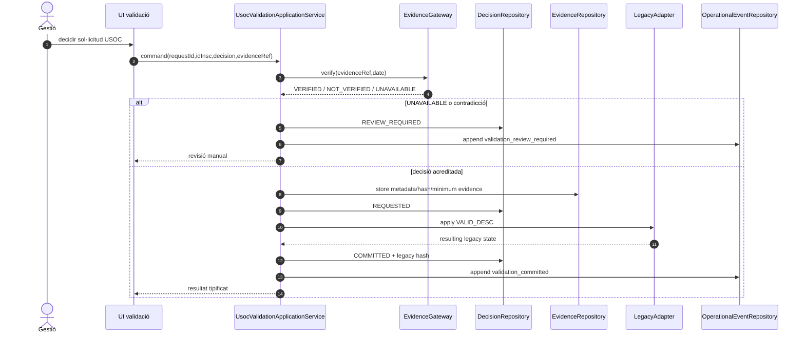

# UC-019 — Seqüències ACTUAL / FINAL

Data d'auditoria: 2026-10-03.

## ACTUAL — aprovació o denegació USOC

### Propietats verificables al codi

- La mutació llegat queda estrictament entre les fases REQUESTED i COMMITTED.
- `REQUEST_ID` és únic i un reús amb payload divergent produeix conflicte.
- Un estat llegat incompatible deriva a `REVIEW_REQUIRED`.
- El client web no coneix el secret HMAC.
- El backend de la intranet exigeix POST, CSRF, sessió i permís.

## FINAL — amb evidència explícita

## Estat

ACTUAL implementat al repositori. FINAL és una evolució per completar la prova d'afiliació i la traça de negoci sense convertir una simple marca `TIPUS_DESC/VALID_DESC` en prova suficient.
