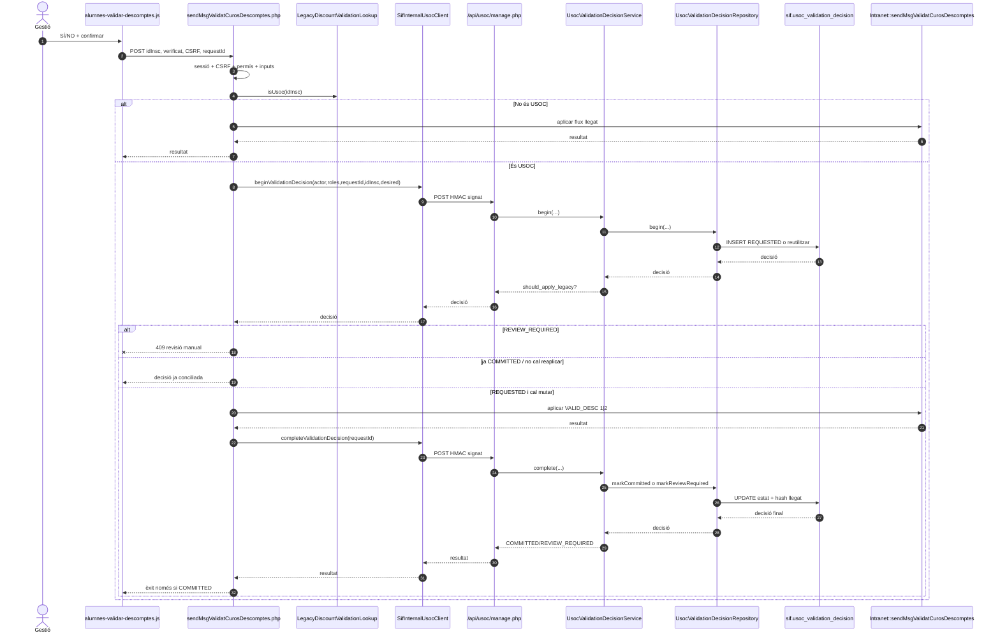
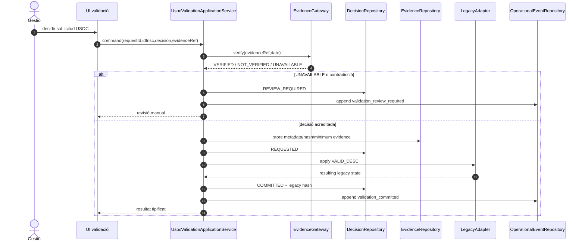
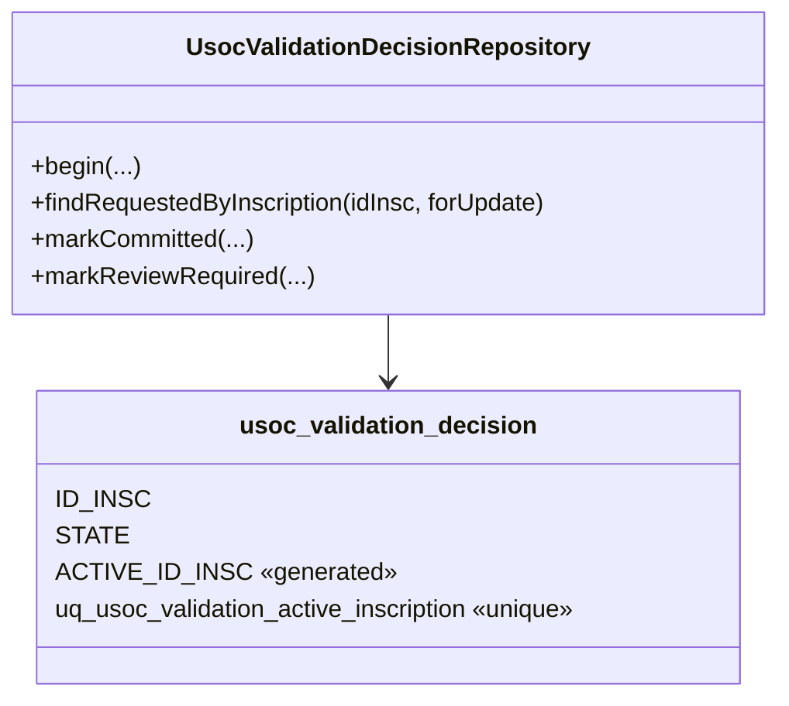
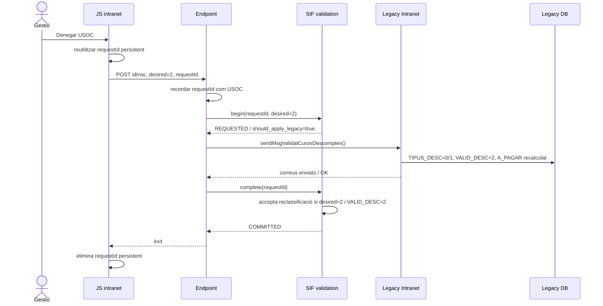

# UC-019 — Seqüències ACTUAL / FINAL

Data d'auditoria: 2026-10-03.

## ACTUAL — aprovació o denegació USOC

### Propietats verificables al codi

- La mutació llegat queda estrictament entre les fases REQUESTED i COMMITTED.
- `REQUEST_ID` és únic i un reús amb payload divergent produeix conflicte.
- Un estat llegat incompatible deriva a `REVIEW_REQUIRED`.
- El client web no coneix el secret HMAC.
- El backend de la intranet exigeix POST, CSRF, sessió i permís.

## FINAL — amb evidència explícita

## Estat

ACTUAL implementat al repositori. FINAL és una evolució per completar la prova d'afiliació i la traça de negoci sense convertir una simple marca `TIPUS_DESC/VALID_DESC` en prova suficient.

## Invariant de concurrència afegit 2026-10-04

La classe de persistència queda reforçada amb una restricció de BD:

`ACTIVE_ID_INSC = ID_INSC` únicament per `STATE=REQUESTED`; en estats terminals és `NULL`. Això permet conservar l'històric i, simultàniament, impedir dues decisions actives sobre la mateixa inscripció.

## Denegació USOC — flux ACTUAL reconciliat

Una aprovació continua exigint `TIPUS_DESC=4`; només la denegació admet la reclassificació llegada 4 → 0/1.
