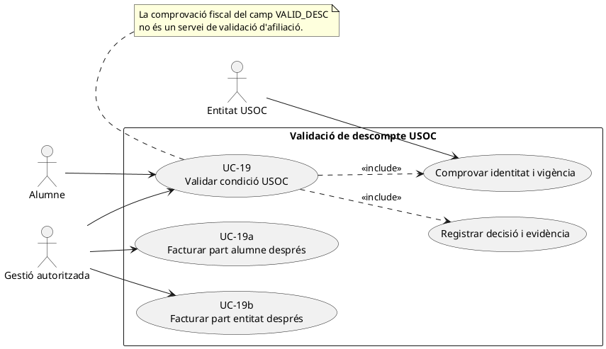
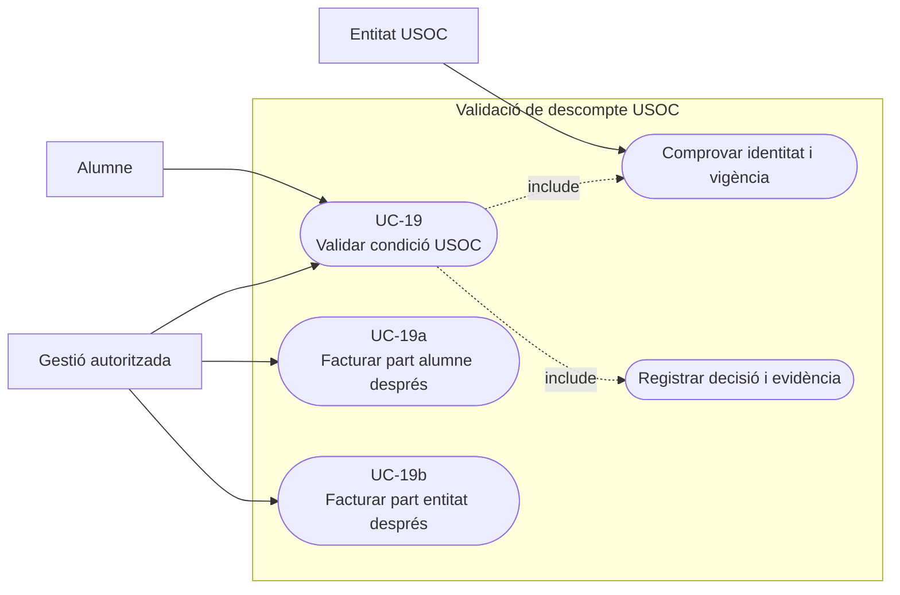
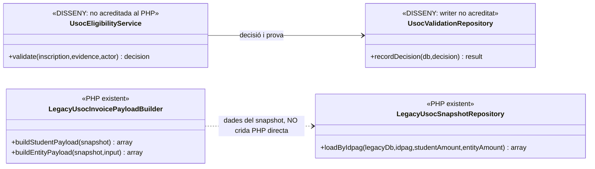
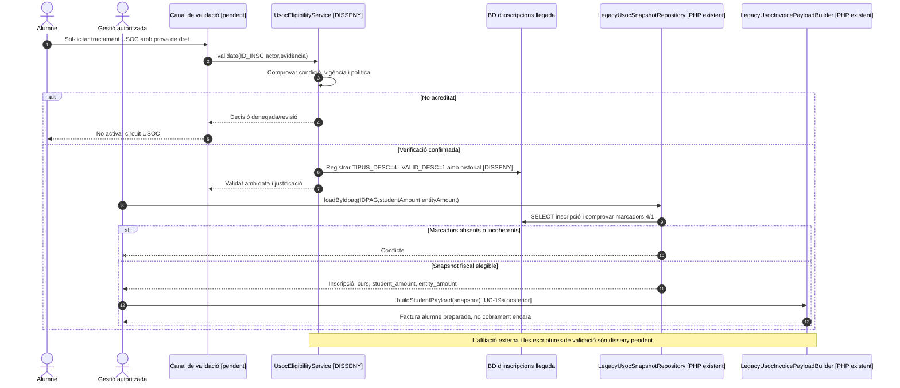
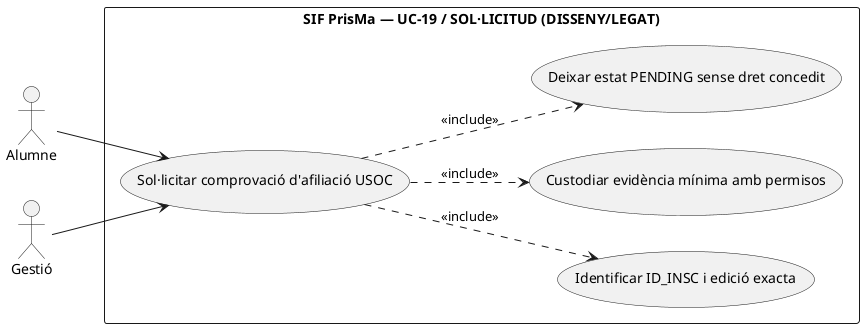
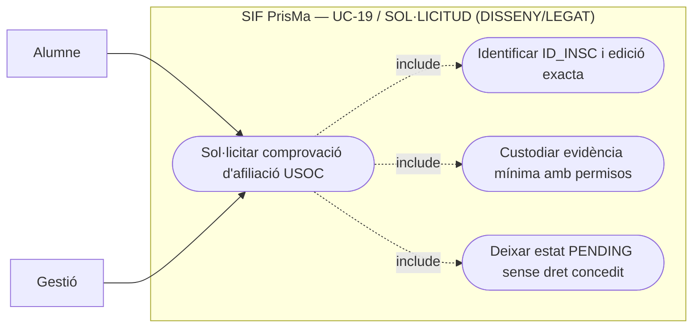
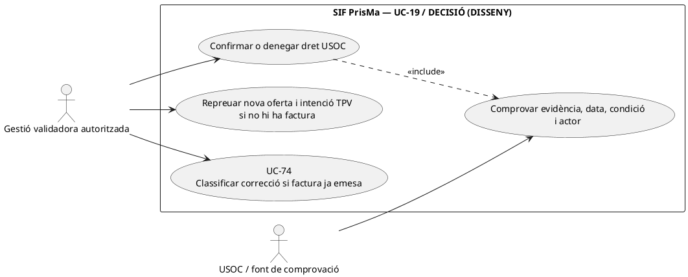
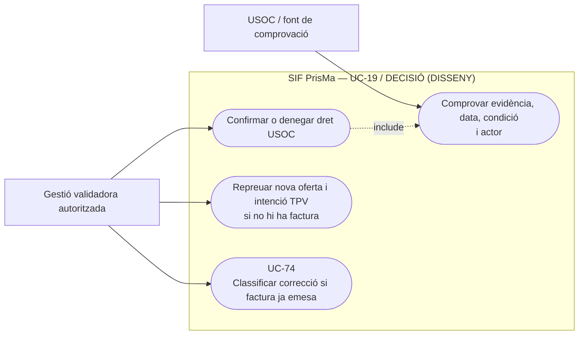

# UC-19 · Validar afiliació USOC abans de la doble facturació

**Finalitat:** decidir si una inscripció pot utilitzar el circuit de finançament USOC abans de preparar les factures a l'alumne (UC-19a) i a l'entitat (UC-19b). El catàleg original identifica `TIPUS_DESC=4` i `VALID_DESC` i indica que la **pantalla final és pendent**. **No** s'ha acreditat un servei PHP que verifiqui automàticament afiliació vigent, documentació aportada, consentiments ni autorització de l'entitat: les comprovacions del repositori fiscal llegat només llegeixen camps ja marcats.

## 1. Fitxa específica i evidència

| Element | Regla |
| --- | --- |
| Actors | Persona inscrita que al·lega la condició; operador autoritzat que comprova el document; entitat USOC quan cal confirmar una condició de finançament. |
| Identitat del cas | `ID_INSC`, `IDPAG`, curs i edició, titular de la condició, import part alumne i part entitat. **No deduir la vigència de l'afiliació només del valor `TIPUS_DESC`.** |
| Dades llegades observades | `LegacyUsocSnapshotRepository::loadByIdpag()` selecciona `inscripcions` per `IDPAG`, amb `TIPUS_DESC` i `VALID_DESC`, i comprova que siguin exactament **4** i **1** respectivament. Si no coincideixen, llança conflicte. |
| Dades fiscals posteriors | `LegacyUsocInvoicePayloadBuilder::buildStudentPayload()` torna a exigir `TIPUS_DESC=4`/`VALID_DESC=1` i construeix la factura alumne. `buildEntityPayload()` rep les dades fiscals explícites de l'entitat; **els camps de validació no aporten per si sols aquestes dades fiscals**. |
| Font i protecció de l'evidència | Proposta de custòdia de justificants i dades de validació amb accés limitat. La simple fotografia fiscal no hauria d'incloure còpia de document privat si no és necessari; la migració pot definir `discount_evidence`, però el writer i els permisos s'han de verificar. |
| Resultat funcional objectiu | Decisió tipificada i datada, `ID_INSC`, actor, motiu, vigència i import/drets autoritzats. **Els estats exactes i l'origen de la verificació requereixen acord amb el negoci.** |
| Efecte fiscal/econòmic immediat | **Cap `CHARGE`, cap factura i cap aplicació de fons.** La validació és prerequisit de UC-13/19a/19b, no una entrada bancària ni una emissió per si mateixa. |

### 1.1. Flux funcional objectiu

1. L'usuari selecciona o demana el tractament USOC en una inscripció. El canal protegeix la identitat i recull el mínim necessari per verificar la condició, amb data, edició i responsable de la decisió.
2. La persona autoritzada verifica la condició i, quan correspongui, evidència, vigència i condicions de l'entitat. **Aquests passos són un contracte objectiu, no mètodes PHP identificats al SIF.**
3. La decisió s'associa a `ID_INSC` amb actor/motiu i es registra en el llegat o servei acordat; l'orquestració de BD llegat ↔ BD SIF és pendent. No marcar `VALID_DESC=1` per la simple selecció d'un descompte al formulari.
4. Quan `TIPUS_DESC=4` i `VALID_DESC=1` estan confirmats i la informació comercial és coherent, `LegacyUsocSnapshotRepository::loadByIdpag()` **sí que comprova aquests valors** en recuperar el snapshot per a facturació. Rebutja inscrits sense la marca.
5. La factura alumne UC-19a es prepara amb import alumne i import de l'entitat separats; la factura de l'entitat UC-19b s'emet amb dades fiscals específiques quan pertoqui. **No** inferir que l'entitat ja ha pagat perquè la condició estigui validada.
6. Si la condició perd vigència o es descobreix un error **després** d'emetre, cal classificar correcció fiscal/econòmica i relacionar-la amb UC-05/71/72; no reescriure retrospectivament `factura_linia`.

### 1.2. Alternatives i riscos

| Situació | Comportament |
| --- | --- |
| `TIPUS_DESC` diferent de 4 | El repositori de snapshot rebutja la ruta USOC. |
| `VALID_DESC` diferent de 1 | El repositori i el builder no emeten per la ruta USOC a partir d'aquest snapshot. |
| Marcadors correctes però justificació caducada o fraudulentament aportada | **Buit funcional:** els mètodes fiscals comproven camps, no identitat/validesa externa. Bloquejar o revisar per política final, registrar actor i prova. |
| Import de l'entitat no definit o no acceptat | No facturar suposant automàticament un pagador; UC-19a/19b requereixen imports i receptor separats. |
| Canvi de curs abans del cobrament | Revalidar si la condició i la política comercial s'apliquen a la nova edició; qualsevol import preexistent del llegat no és diner ingressat. |
| Canvi/baixa després de cobrar | Cal reconstruir les dues factures i **els dos orígens de pagament efectius**, no retornar a l'alumne la part d'entitat per defecte. |

**No s'ha acreditat una prova de validació d'afiliació real.** Les proves d'emissió USOC exerciten el control dels marcadors, no la comprovació externa del dret.

### 1.3. Pantalla i estats de validació USOC al llegat

La pantalla `/alumnes/validar-descomptes/` presenta les inscripcions pendents mitjançant `cnsAlumnDescNoValidat`; el mètode `__mostrarPage_Inici_ValidarDescomptes` informa que hi ha descomptes pendents i `__mostrarPage_Alumnes_ValidarDescomptes` mostra «Afiliat USOC». Els valors històrics són `TIPUS_DESC=4` per la sol·licitud USOC, i `VALID_DESC=0` pendent, `1` validat i vàlid, `2` validat i no vàlid. `updValidDescByInsc` actualitza la validació; `updValidDescByInscPreu` també pot canviar `TIPUS_DESC` i `A_PAGAR`. Són rutines llegades identificades, no una comprovació externa implementada al SIF.

Gestió confirma manualment l'afiliació amb USOC i comunica el resultat a l'alumne. En una denegació, el canal recalcula el preu sense descompte **abans** de facturar o cobrar i invalida l'oferta anterior incompatible. El cas normal descrit indica descompte del 25 % i pagament inicial de 10 € per l'alumne; són dades del circuit recuperat, no valors universals que el builder hagi d'imposar. La variant «Curs gratuït USOC» vinculada a `anticipi-preu-usoc` requereix classificació separada (UC-13).

### 1.4. Proves addicionals (no executades)

| ID | Escenari | Resultat |
| --- | --- | --- |
| UV-01 | TIPUS_DESC=4, VALID_DESC=0 | Pendent de comprovació; no emetre amb descompte. |
| UV-02 | Afiliació confirmada | VALID_DESC=1 i import acceptat congelat abans del TPV. |
| UV-03 | Afiliació denegada | VALID_DESC=2; preu ordinari i nova oferta si escau, sense factura USOC. |
| UV-04 | Validació posterior a una factura | Expedient de correcció, no UPDATE fiscal directe. |

## 2. Diagrama UML de casos d'ús



### Vista de casos d’ús per a GitHub (Mermaid)



## 3. Classes existents i classes de disseny separades



**Precisió:** la relació final del diagrama és **dependència funcional de dades, no una crida PHP directa**: el servei `RedsysUsocInvoiceService` o `UsocEntityInvoiceService` obté el snapshot abans d'invocar el builder. El validador d'afiliació i el seu writer **no estan acreditats**.

## 4. Seqüència — comprovació de la condició i ús posterior



### 4.1. Acció independent: sol·licitar la condició USOC sense concedir-la — DISSENY/LEGAT

**Actor/disparador:** persona inscrita o gestió registra una sol·licitud d'afiliació sobre un `ID_INSC` concret. **Precondició:** identitat i edició resoltes, evidència/canal legítims i absència d'una decisió recent incompatible. **Postcondició:** sol·licitud **pendent** (`VALID_DESC=0` al llegat quan correspongui) i prova/estat de revisió, **sense** passar a `VALID_DESC=1`, rebaixar l'import de la factura real o crear `CHARGE`. Una pantalla que permet triar «Afiliat USOC» no equival a verificar-ho amb l'entitat.



### Vista de casos d’ús per a GitHub (Mermaid)



```mermaid
sequenceDiagram
autonumber
actor A as Alumne
participant UI as Formulari de descompte [LEGAT; integració SIF PENDENT]
participant V as UsocEligibilityService [DISSENY]
participant DB as Inscripció llegada i evidència [LECTURA/WRITER A VALIDAR]
A->>UI: Demanar USOC per ID_INSC X, justificació
UI->>V: requestValidation(X,evidència,actor,requestId) [OBJECTIU]
V->>DB: Comprovar identitat, edició i decisió prèvia
alt Actor no legitimat o inscripció/justificant contradictoris
 DB-->>V: DENIED/CONFLICT
 V-->>UI: Rebuig o revisió sense modificar import fiscal
else Sol·licitud nova o reintent equivalent
 V->>DB: Registrar petició i evidència protegida [PENDENT]
 V-->>UI: PENDING, no VALID_DESC=1
end
UI-->>A: Estat de sol·licitud, no factura ni descompte confirmat
Note over UI,DB: La pantalla llegada i els camps són identificats, writer/auditoria completa d'evidències i identitat en SIF no acreditats.
```

### 4.2. Acció independent: confirmar o denegar afiliació i revisar el preu ofert — DISSENY/LEGAT

**Actor/disparador:** gestió ha contrastat l'afiliació amb la font acceptada i registra una decisió motivada. **Precondicions:** `ID_INSC`, proves vigents, data i actor, import acordat alumne/entitat i estat de la factura/intenció TPV. **Postcondicions separades:** si confirma, `VALID_DESC=1` i snapshot comercial USOC congelat quan pertoqui; si denega, `VALID_DESC=2` i preu nou **abans d'emissió**, sense corregir una factura fiscal ja emesa amb `UPDATE`. Les rutines llegades `updValidDescByInsc` i `updValidDescByInscPreu` són identificades; la seva disponibilitat **no** acredita connexió al control fiscal SIF ni una aprovació idempotent per versió.



### Vista de casos d’ús per a GitHub (Mermaid)



```mermaid
sequenceDiagram
autonumber
actor G as Gestió
participant UI as Panell descomptes [LEGAT]
participant V as UsocEligibilityService [DISSENY]
participant L as Validació/pricing llegat [WRITER EXISTENT; adaptació PENDENT]
participant F as factura i redsys_payment_intent SIF [LECTURA]
participant C as Classificació UC-74/94 [DISSENY]
G->>UI: Decidir sol·licitud X amb prova d'afiliació i motiu
UI->>V: decide(X,VALID/INVALID,evidència,actor,requestId)
V->>F: Comprovar factura ja emesa, import/snapshot i DS_ORDER
alt Evidència insuficient o actor no autoritzat
 V-->>UI: PENDING/REJECT sense concedir dret automàtic
else Validació positiva acreditada i no hi ha factura
 V->>L: Registrar VALID_DESC=1 i política comercial validada [integració PENDENT]
 L-->>V: Decisió confirmada, quanties alumne/entitat per snapshot nou
 V-->>UI: Aprovar oferta actualitzada, UC-63 crea intenció diferent si l'anterior és incompatible
else Validació denegada i no hi ha factura
 V->>L: Registrar VALID_DESC=2, documentar nou preu ofert [integració PENDENT]
 V-->>UI: No aplicar descompte USOC, no registrar CHARGE/REFUND per denegar
else Ja hi ha factura alumne o entitat emesa
 V->>C: Registrar discrepància i classificar possible correcció fiscal/econòmica
 C-->>UI: Expedient pendent de decisió, factura/CHARGE real anteriors intactes
end
UI-->>G: Decisió i efectes pendents sense reescriptura fiscal
Note over V,L: El PHP SIF comprova camps VALID_DESC/TIPUS_DESC, però no valida afiliació externa ni orquestra aquests canvis d'estat.
```

| Prova pendent | Escenari | Resultat exigible |
| --- | --- | --- |
| UV-07 | Alumne tria afiliació USOC i aporta document | Sol·licitud pendent; no `VALID_DESC=1` automàtic ni factura amb descompte abans de decisió. |
| UV-08 | Dos intents d'aprovar la mateixa sol·licitud amb proves/imports incompatibles | Una decisió per versió; conflicte explícit i cap canvi fiscal automàtic. |
| UV-09 | Afiliació denegada amb DS_ORDER antiga de preu rebaixat pendent | Nova oferta i intenció només després de revisar l'anterior; callback tardà de l'antiga es concilia, no es transforma en pagament de la nova. |
| UV-10 | Afiliació es denega després de factura alumne real | No editar factura anterior; incidència i decisió UC-74 sobre eventual correcció. |

## 5. Traçabilitat

[UC-19 original](../06-fitxes-funcionals/uc-019.md) · [UC-13 doble facturació](uc-013-orquestrar-doble-facturacio-usoc.md) · [UC-19a alumne](uc-019a-facturar-part-alumne-usoc.md) · [UC-19b entitat](uc-019b-facturar-part-entitat-usoc.md) · [LegacyUsocSnapshotRepository](../../sif/src/Repository/LegacyUsocSnapshotRepository.php) · [LegacyUsocInvoicePayloadBuilder](../../sif/src/Service/LegacyUsocInvoicePayloadBuilder.php) · [Diccionari](../05-governanca-operacio/24-diccionari-camps-i-valors.md) · [Revisió dels fons](00-revisio-moviments-inscripcions.md).
