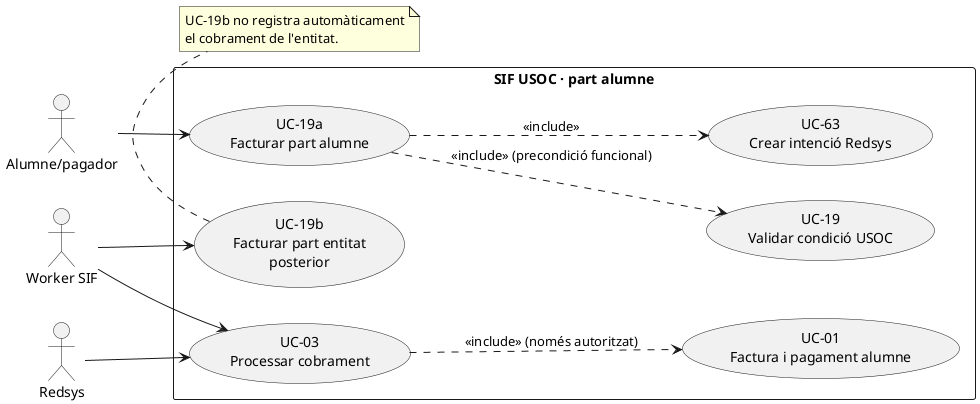
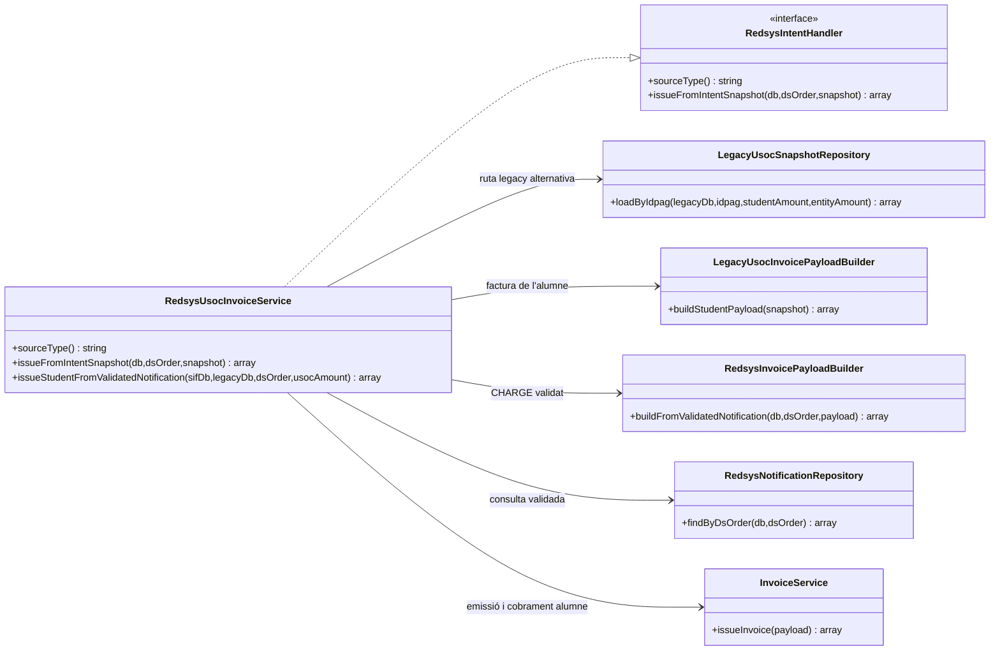
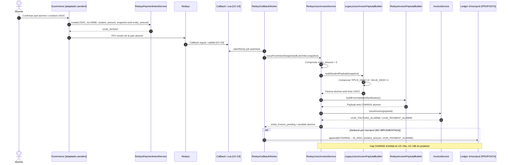

# UC-19a · Facturar la part de l'alumne USOC — fitxa i UML integrats

**Abast:** factura i cobrament **únicament de la part de l'alumne** d'una inscripció USOC validada. UC-19 és la validació de la condició USOC; UC-19b factura la part de l'entitat; UC-13 coordina l'expedient conjunt. **No es registra un cobrament fictici de la part de l'entitat** en UC-19a.

**Estat documental:** nucli PHP de l'emissió alumne existent; adaptador web final, permisos, validació externa de la condició USOC i atribució quantitativa per inscripció pendents de verificar. No consta prova executada en aquesta revisió.

## 1. Fitxa del cas d'ús

| Camp | Condició específica comprovada o contracte objectiu |
| --- | --- |
| Actor | Alumne/pagador via ecommerce; Redsys notifica i worker SIF processa l'operació autoritzada. |
| Precondició en el builder/repositori | Inscripció amb `TIPUS_DESC=4` i `VALID_DESC=1`. La verificació de la documentació acreditativa i de la condició amb l'entitat és UC-19, **no** un efecte implícit d'aquests camps. |
| Entrada comercial | `inscription.ID`, curs/edició, receptor fiscal alumne, `IDPAG`, `student_amount > 0` i `entity_amount > 0` congelats en snapshot. |
| Intenció TPV | `SOURCE_TYPE=USOC_ALUMNE`; import esperat del TPV = part alumne, no suma de la part de l'entitat; `DS_ORDER`, divisa i terminal validats per UC-63/03. |
| Factura alumne | `LegacyUsocInvoicePayloadBuilder::buildStudentPayload()`: línia `source_type=INSCRIPCIO` i `source_id` de la inscripció; `discount_origin=USOC` quan hi ha descompte, receptor fiscal de l'alumne; `visible_alumne=1` en la relació. |
| Pagament | Un `payment_transaction CHARGE` Redsys corresponent **només** a l'import alumne, inserit al nucli `InvoiceService::issueInvoice(payload amb payment)`. |
| Resultat del handler | `uuid_factura`, eventual `uuid_payment` i `entity_invoice_pending` amb `student_invoice_uuid`, import de l'entitat, `idpag` i `requires_explicit_billing=true`. **Aquest retorn no significa que s'hagi emès la factura de l'entitat.** |
| Destí econòmic | Una atribució de la part alumne a la inscripció quan s'ha confirmat el CHARGE; la futura part entitat exigeix **un altre** cobrament confirmat o tractament econòmic validat, no una duplicació d'aquest moviment. |

### 1.1. Flux principal del codi i canal objectiu

1. Ecommerce valida comercialment l'operació, dret USOC, receptor i imports de cada finançador; crea intenció de Redsys UC-63 amb `USOC_ALUMNE` i snapshot incloent `usoc.entity_amount`. **L'autorització real de la condició USOC i les regles comercials són passos del canal, no acreditats pel servei emissor.**
2. Redsys envia callback signat; UC-03 valida intenció, import/divisa/terminal i encua job autoritzat. La recepció HTTP no genera factura.
3. El worker selecciona `RedsysUsocInvoiceService::issueFromIntentSnapshot()`, que rebutja `entity_amount` absent/no positiu i delega el payload alumne a `LegacyUsocInvoicePayloadBuilder::buildStudentPayload()`.
4. El constructor verifica `TIPUS_DESC=4`, `VALID_DESC=1`, identifica inscripció i curs, i prepara la línia fiscal de la part alumne amb el descompte USOC congelat.
5. `RedsysInvoicePayloadBuilder::buildFromValidatedNotification()` exigeix notificació `VALIDATED`, incorpora import Redsys de l'alumne, `DS_ORDER`/`IDPAG`, clau idempotent pròpia del cobrament i relacions.
6. `InvoiceService::issueInvoice()` crea/reutilitza factura, registre fiscal, cua AEAT i **pagament inicial només de l'alumne**. `RedsysUsocInvoiceService` retorna la referència `entity_invoice_pending` que permet iniciar **UC-19b com una acció posterior**.
7. Quan s'implementi el registre monetari per inscripció, s'haurà de vincular el CHARGE de l'alumne a `ID_INSC` i a la part de finançament d'alumne. No s'hi han d'afegir diners de l'entitat fins al seu cobrament real.

### 1.2. Alternatives i riscos

| Escenari | Tractament |
| --- | --- |
| `TIPUS_DESC` o `VALID_DESC` no coincideixen | Constructor/repo USOC rebutgen la ruta. |
| Import alumne validat però import entitat absent | Handler rebutja la preparació del snapshot USOC; no improvisa la part entitat. |
| Denegació o callback contradictori | UC-03/51, cap factura ni CHARGE nou per aquesta petició denegada. |
| Callback duplicat o worker reexecutat | Idempotència de factura/pagament; les atribucions futures també han de ser idempotents, una per import/origen. |
| Alumne pagat i entitat encara no facturada | Expedient UC-13 parcial amb `entity_invoice_pending`; no marcar entitat com a cobrada. |
| Pagament de l'entitat parcial o posterior | No afecta la titularitat del CHARGE alumne; procés diferent sobre factura entitat. |
| Modificació de curs o baixa USOC | UC-71/72 ha de comparar **dos receptors i dues factures** abans de decidir retorn, saldo i rectificació. |
| Dades del receptor fiscal o descompte canvien després de l'emissió | No reescriure el payload fiscal emès; tramitar correcció classificada (UC-05/30/31 segons el cas). |

**Proves existents al repositori, no executades aquí:** `RedsysUsocInvoiceServiceTest`; la prova del handler no equival a la verificació de tot l'expedient alumne+entitat.

### 1.3. Validació d'afiliació i variants de preu de l'alumne — contrast amb el xat original

En el circuit descrit, seleccionar «Afiliat USOC» marca `TIPUS_DESC=4`, però l'afiliació queda **pendent de validació manual** (`VALID_DESC=0`) fins que gestió confirma la condició amb USOC. Només aleshores es pot aplicar el descompte i preparar aquesta factura amb `VALID_DESC=1`; si l'afiliació no consta, la compra s'ha de recalcular sense descompte **abans** d'emetre. El builder actual valida el flag d'entrada, però no consulta USOC ni acredita els justificants per si mateix.

En el cas habitual recuperat, l'alumne fa un pagament inicial de **10 €**; no deduir que totes les factures d'alumne USOC són de 10 €, ja que l'import, el descompte i la part d'entitat han de venir del snapshot de l'operació i de les regles vigents. La variant «Altres: Curs gratuït USOC» pot fer servir `anticipi-preu-usoc`: **la ruta actual exigeix import positiu de l'alumne i de l'entitat, de manera que no prova cap camí amb part d'alumne 0**. Si el cas especial implica 0 €, cal decidir el seu contracte propi abans d'emetre; no fabricar un moviment CHARGE per fer-lo encaixar a UC-19a.

**Proves addicionals, no executades:** alumne amb TIPUS_DESC=4 i VALID_DESC=0 bloquejat abans de facturar; afiliació denegada i recalculada abans de l'emissió; import habitual de 10 € llegit del snapshot, no imposat al builder; callback Redsys per una part alumne confirmada que no marca com a cobrada la part de l'entitat; circuit «curs gratuït USOC» explícitament desviat a revisió si l'import alumne és zero.
## 2. Diagrama UML de casos d'ús

## 3. Subdiagrama de classes executable

## 4. Seqüència UC-19a — pagament de l'alumne

## 5. Traçabilitat

[Fitxa anterior UC-19a](../06-fitxes-funcionals/uc-019a.md) · [UC-13 expedient USOC](uc-013-orquestrar-doble-facturacio-usoc.md) · [UC-19b entitat](../06-fitxes-funcionals/uc-019b.md) · [UC-03 callback](uc-003-processar-cobrament-redsys-asincron.md) · [UC-63 intenció](uc-063-crear-intencio-redsys.md) · [Revisió del ledger](00-revisio-moviments-inscripcions.md) · [RedsysUsocInvoiceService](../../sif/src/Service/RedsysUsocInvoiceService.php) · [LegacyUsocInvoicePayloadBuilder](../../sif/src/Service/LegacyUsocInvoicePayloadBuilder.php) · [RedsysUsocInvoiceServiceTest](../../sif/tests/Integration/RedsysUsocInvoiceServiceTest.php).
