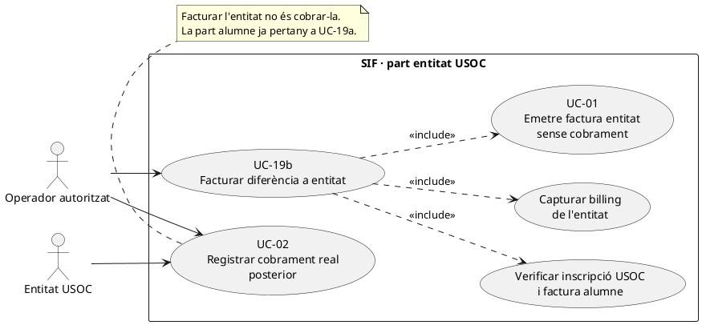
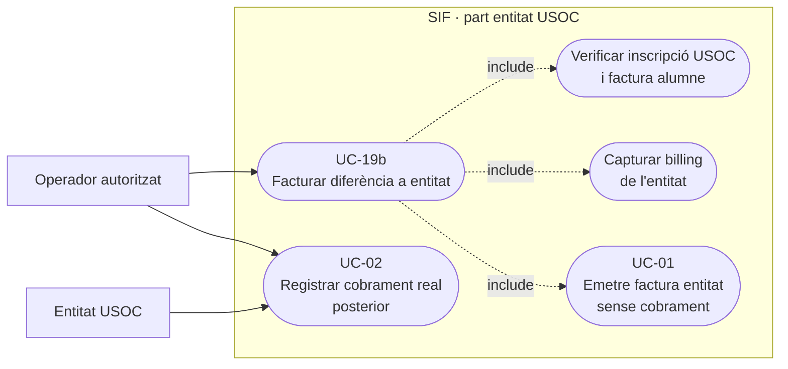
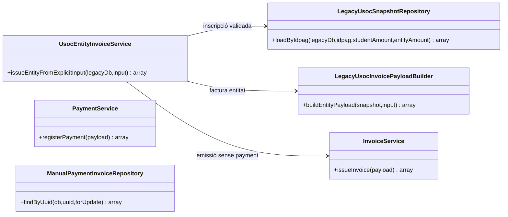
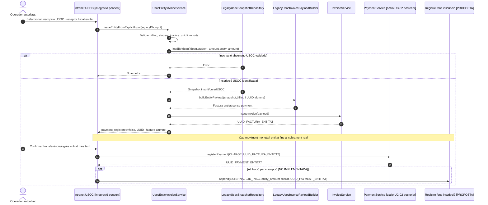
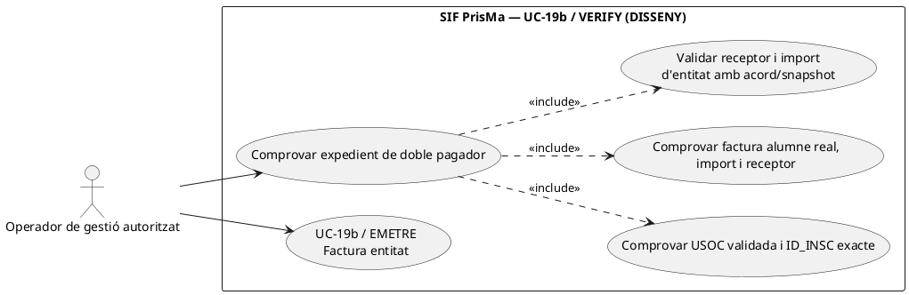
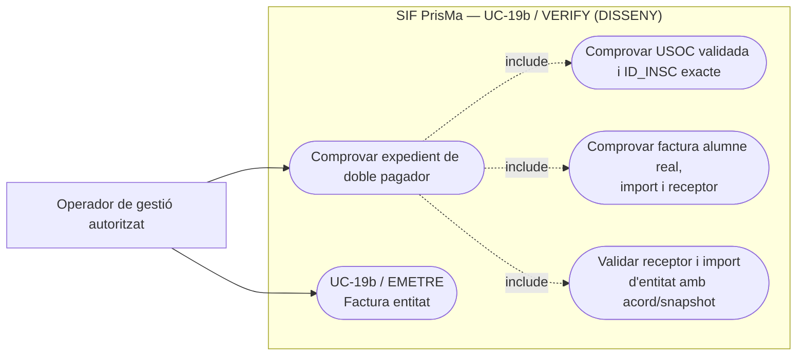
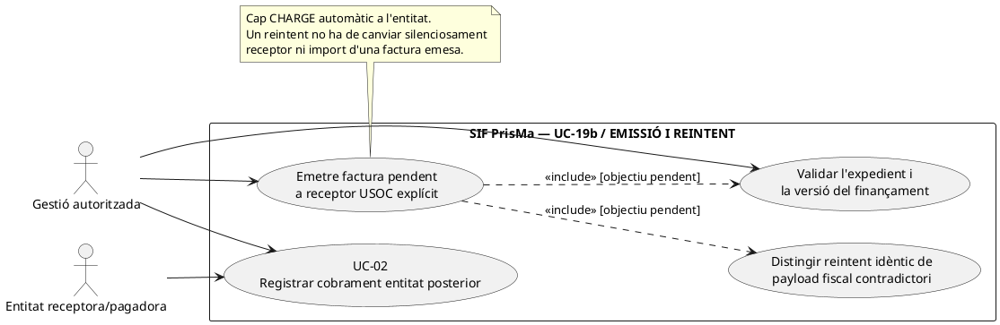
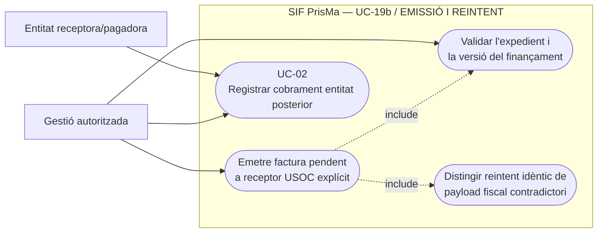
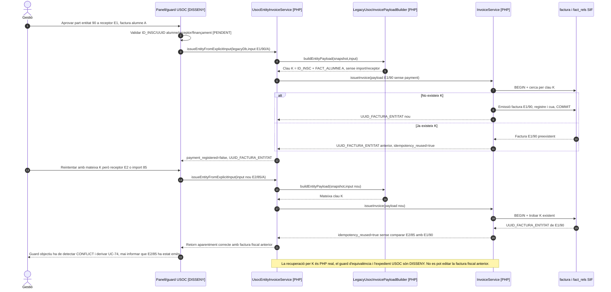

# UC-19b · Facturar la part corresponent a l'entitat USOC — fitxa i UML integrats

**Objectiu:** emetre **una factura diferenciada a l'entitat**, per la part de finançament que li correspon en una inscripció USOC. El nucli actual **no registra el cobrament de l'entitat en emetre-la**. Relacions: UC-19a (factura i CHARGE de l'alumne), UC-13 (expedient conjunt), UC-02/22 (cobrament posterior de la factura entitat), UC-71/72 (canvi o baixa que afecti les dues parts).

**Estat:** `UsocEntityInvoiceService::issueEntityFromExplicitInput()`, `LegacyUsocSnapshotRepository`, `LegacyUsocInvoicePayloadBuilder::buildEntityPayload()` i `InvoiceService` existeixen; la pantalla, els permisos, la decisió exacta del finançador, el document i l'assignació de diners per inscripció continuen pendents d'acreditar. No es declara cap prova executada en aquesta revisió.

## 1. Fitxa funcional específica

| Camp | Regla verificada o contracte pendent |
| --- | --- |
| Actors | Operador autoritzat prepara factura; entitat rep factura i paga posteriorment segons circuit acordat. |
| Disparador | Existeix l'import de l'entitat identificat en la compra USOC i es disposa de la factura de la part alumne, amb `student_invoice_uuid`. |
| Entrada del servei | `idpag` positiu, `student_amount > 0`, `amount > 0` de l'entitat, `student_invoice_uuid` no buit i objecte `billing` amb `name` i `nif` no buits. |
| Comprovació de l'inscrit | `LegacyUsocSnapshotRepository::loadByIdpag()` requereix inscripció USOC existent amb `TIPUS_DESC=4` i `VALID_DESC=1`; recupera curs i snapshot. |
| Construcció fiscal | `LegacyUsocInvoicePayloadBuilder::buildEntityPayload()` emet una línia «Diferencia USOC» vinculada a la mateixa inscripció `source_type=INSCRIPCIO`, amb receptor `billing` de l'entitat, `source_type=USOC_ENTITAT` i `source_channel=INTRANET`. |
| Idempotència base | Clau `INTRANET|USOC_ENTITAT|ID_INSC:<inscripció>|FACT_ALUMNE:<student_invoice_uuid>`. Reintents amb imports/receptor diferents però mateixa clau exigeixen **comparació del contingut i resolució d'incidència**, no una reutilització silenciosa. |
| Visibilitat | La relació entitat és `visible_alumne=0`; el control d'accés real al document encara ha de ser validat pel canal UC-07. |
| Efecte monetari inicial | **Cap:** el payload entitat no porta bloc `payment`; el servei retorna `payment_registered=false`. La factura entitat és una obligació pendent, no fons ja atribuïts a la inscripció. |
| Resultat | UUID i número de factura entitat, `student_invoice_uuid` associat; el seu estat fiscal/cobrament és independent de la factura alumne. |

### 1.1. Flux principal del servei

1. L'operador revisa l'expedient de l'alumne, el receptor i l'import de la part USOC. Abans de facturar cal **identificació fiscal explícita de l'entitat**: no es pot recuperar automàticament de les dades de l'alumne.
2. `UsocEntityInvoiceService::issueEntityFromExplicitInput($legacyDb,$input)` valida `idpag`, `student_amount`, `amount`, `student_invoice_uuid` i `billing.name/nif`.
3. `LegacyUsocSnapshotRepository::loadByIdpag()` recupera inscripció/curs, comprova `TIPUS_DESC=4` i `VALID_DESC=1` i normalitza els imports diferenciats.
4. `LegacyUsocInvoicePayloadBuilder::buildEntityPayload()` construeix factura amb línia `INSCRIPCIO`, import entitat, dades fiscals explícites i identificador de factura alumne en les metadades `usoc`; usa clau idempotent per inscripció + factura alumne.
5. `InvoiceService::issueInvoice()` crea o reutilitza **una factura nova de l'entitat**, amb número, registre fiscal, cadena i cua. El resultat de `UsocEntityInvoiceService` marca `payment_registered=false`. **El servei no ha cobrat la part de l'entitat.**
6. Quan arriba un pagament real d'entitat, el canal inicia UC-02/22/24 contra **la factura entitat**, i registra `payment_transaction CHARGE` únic i `payment_allocation` corresponent. Cap cobrament real no s'infereix de `student_amount` ni de `amount` en el payload fiscal.
7. Quan s'implementi el registre de fons per inscripció, el pagament entitat confirmat generarà una atribució específica a la mateixa inscripció amb **`UUID_PAYMENT` d'entitat**, independent de la de l'alumne. El deute pendent no crea una entrada fictícia.

### 1.2. Alternatives, errors i decisions pendents

| Cas | Comportament |
| --- | --- |
| Falten dades fiscals o `student_invoice_uuid` | Rebuig abans de generar factura entitat. |
| `amount` o `student_amount` zero/no positiu | Rebuig pel servei. |
| Inscripció no USOC validada o `IDPAG` no existent | El repositori/builder rebutgen. |
| Entitat encara no paga | Factura emesa i pendent; **no** `CHARGE`, `COMPENSATION` ni atribució de diner a inscripció. |
| Entitat paga parcialment | Cada fracció confirmada és un moviment econòmic independent sobre la factura entitat; cap nou `issueInvoice()` pel cobrament. |
| La factura alumne ja existeix, però es demana entitat amb import nou | La clau d'emissió pot coincidir; cal comparar payloads i evitar reaprofitar una factura anterior amb dades contradictòries. |
| Canvi de curs/baixa amb ambdues factures | Dues relacions fiscals a classificar; retorn/saldo separat per pagador i import, sense retornar la part entitat a l'alumne per defecte. |
| Doble facturació però un sol pagament d'alumne | **No** atribuir el total de les dues factures al cobrament de l'alumne; conciliar amb els dos moviments externs reals quan existeixin. |
| Relació entre factures | `student_invoice_uuid` consta en metadades/retorn del servei; **no** afirmar una FK o `fact_rels` específica entre factures sense confirmar la persistència efectiva d'aquest vincle al codi. |

**Proves localitzades, no executades:** `UsocEntityInvoiceServiceTest` comprova el servei amb entrada explícita; manca validar el cicle integral de dues factures, cobraments, titularitat i documents.

### 1.3. Diferència USOC: snapshot, receptor i cobrament posterior — contrast amb el xat original

En el cas habitual explicat, l'alumne ingressa inicialment **10 €** i USOC assumeix la diferència pactada. El valor de la factura d'entitat no s'ha de recalcular com a resta del camp viu `A_PAGAR - PAGAMENT`: abans de facturar es contrasta amb el snapshot de preu base, descompte, import d'alumne, import assumit per USOC, `TIPUS_DESC=4`, `VALID_DESC=1`, validació manual i dades fiscals explícites de l'entitat. El valor de 10 € és descriptiu del cas recuperat, **no** una constant universal de la facturació USOC.

Si USOC encara no ha abonat res, UC-19b emet només la seva factura **pendent**; el cobrament posterior contra el seu UUID és UC-02/22 i no torna a emetre la factura. Si una mateixa transferència real de l'entitat cobreix imports de diverses factures USOC, cal UC-105: un moviment bancari i assignacions diferenciades; `UsocEntityInvoiceService` no acredita aquest repartiment. La persona alumna no obté accés a la factura de l'entitat pel fet de compartir ID_INSC.

**Variant «Curs gratuït USOC»:** la documentació històrica cita `anticipi-preu-usoc`, però no estableix en aquesta fitxa l'import exacte que hi paga l'entitat ni quin document correspon si l'alumne paga zero. Si el circuit concret té `student_amount=0`, la ruta actual UC-19b exigeix `student_amount>0` i `student_invoice_uuid`, i no pot donar-se per compatible sense un disseny específic i una classificació fiscal aprovada. No simular una factura alumne o pagament inexistents.

**Proves addicionals, no executades:** factura entitat a receptor fiscal explícit i no al NIF alumne; diferència traçada al snapshot; dues factures de la mateixa inscripció amb estats de cobrament independents; dos pagaments parcials d'entitat sense nova factura; transferència multifactura concilada sense duplicar ingrés; import alumne zero desviat al circuit especial no resolt.
## 2. Diagrama UML de casos d'ús — factura entitat



### Vista de casos d’ús per a GitHub (Mermaid)



## 3. Diagrama de classes — implementació real



`PaymentService` és el servei de cobrament **posterior**, no una dependència directa del servei d'emissió de la part entitat.

## 4. Seqüència — emissió ara, cobrament quan s'acrediti



## 4.1. Acció independent: comprovar l'expedient de dos pagadors abans d'emetre la factura d'entitat — DISSENY

**Actor/disparador:** gestió vol facturar la diferència a l'entitat després de rebre `entity_invoice_pending` de la part alumne. **Precondicions:** `ID_INSC`/IDPAG unívocs, afiliació validada, `UUID_FACTURA_ALUMNE` **existent i associat** a aquella inscripció i a l'import de l'alumne confirmat, proposta d'import de l'entitat i `billing` explícit de l'entitat legitimada. **Postcondició:** expedient correlacionat o incidència; la verificació no emet factura, no registra `CHARGE` ni dóna per pagada la diferència.

**Límit del PHP real:** `UsocEntityInvoiceService::assertExplicitEntityInput()` només comprova la presència i el valor no buit de `student_invoice_uuid`, i que `billing.name/nif` siguin no buits. `LegacyUsocSnapshotRepository::loadByIdpag()` comprova marcadors de la inscripció llegada, però **no rep ni consulta** el UUID de factura alumne en el SIF. `LegacyUsocInvoicePayloadBuilder::buildEntityPayload()` incorpora el UUID rebut a la clau idempotent i a metadades `usoc`; no prova l'existència, receptor, línia, import o pagament de la factura referenciada. `LegacyUsocSnapshotRepository::findInscription()` fa `WHERE IDPAG=? ORDER BY ID LIMIT 1`; un IDPAG compartit necessita verificació explícita de l'`ID_INSC` real de l'expedient, no només el primer resultat.



### Vista de casos d’ús per a GitHub (Mermaid)



```mermaid
sequenceDiagram
autonumber
actor O as Gestió
participant UI as Panell USOC [PENDENT]
participant V as UsocFundingCaseValidator [DISSENY]
participant L as LegacyUsocSnapshotRepository [PHP; IDPAG i primer inscrit]
participant F as SIF factura + fact_rels + línies [LECTURA]
participant B as Dades receptor i acord USOC [LECTURA]
O->>UI: Comprovar facturació entitat per ID_INSC X i UUID_FACTURA_ALUMNE A
UI->>V: verify(X,idpag,A,studentAmount,entityAmount,billing)
V->>L: loadByIdpag(idpag,studentAmount,entityAmount) [PHP real]
L-->>V: Primer ID_INSC per IDPAG i flags TIPUS_DESC/VALID_DESC
alt ID_INSC retornat és diferent d'X o IDPAG ambigu
 V-->>UI: CONFLICT, no facturar una inscripció arbitrària
else Inscripció X USOC validada
 V->>F: Cercar UUID A real i verificar relacions/ID_INSC, receptor i imports
 alt UUID A inexistent, aliè o part alumne contradictòria
  F-->>V: CONFLICT
  V-->>UI: Rebutjar sense factura entitat
 else Factura alumne acreditada
  V->>B: Verificar import assumit, receptor entitat i versió d'acord
  alt Finançament o billing no justificats
   B-->>V: PENDING_REVIEW
   V-->>UI: Pendent de dades/autorització
  else Expedient coherent i autoritzat
   B-->>V: Validat per a l'operació concreta
   V-->>UI: Proposta d'emissió entitat preparada, encara no emesa
  end
 end
end
UI-->>O: Proposta validada, conflicte o incidència
Note over V,F: La validació del UUID d'alumne, ID_INSC exacte i acord d'entitat NO existeix a UsocEntityInvoiceService actual.
```

## 4.2. Acció independent: emetre la factura d'entitat o recuperar una emissió equivalent — PHP/PENDENT

**Actor/disparador:** operador autoritzat confirma les dades fiscals i l'import de l'entitat. El servei PHP existent construeix una factura **sense pagament** i delega `InvoiceService::issueInvoice()`. La seva clau actual és `INTRANET|USOC_ENTITAT|ID_INSC:<id>|FACT_ALUMNE:<uuid>` i **no incorpora import, receptor ni versió del finançament**. `InvoiceService::createOrReuseInvoice()` recupera per aquesta clau i, quan existeix, retorna `existingResultWithPaymentIfPresent()`, **sense comparar el payload rebut amb receptor/quantia originals**. Si s'ha emès a una entitat equivocada, un reintent amb `billing` rectificat no modifica la factura preexistent: cal obrir incidència/classificació fiscal, no fingir que l'ha corregida.



### Vista de casos d’ús per a GitHub (Mermaid)





**Cobrament com a altra acció:** després d'emetre, `payment_registered=false` ha de continuar sent visible fins que hi hagi un `UUID_PAYMENT` real d'entitat. Rebre una transferència de l'entitat per diverses factures és UC-02/105 (un únic ingrés extern i múltiples assignacions), no `issueInvoice()` de nou.

| Prova pendent | Escenari | Resultat exigible |
| --- | --- | --- |
| UE-19b-07 | `student_invoice_uuid` existent però d'una altra inscripció o d'un altre receptor | Verificador de l'expedient rebutja, sense emetre factura entitat. |
| UE-19b-08 | Mateix `IDPAG` compartit per dues inscripcions, la d'USOC no és la primera de la consulta llegada | Seleccionar la inscripció explícita o bloquejar amb conflicte; no facturar automàticament el primer ID. |
| UE-19b-09 | Factura entitat E1/90 confirmada i resposta perduda; reintent E1/90 | Reús de la mateixa factura sense altra numeració, registre fiscal o `CHARGE`. |
| UE-19b-10 | Mateixa clau d'emissió però receptor E2 o import 85 | `CONFLICT` abans de reús semàntic; factura E1/90 anterior intacta, classificar correcció si escau. |
| UE-19b-11 | Factura entitat emesa i transferència posterior no confirmada | `payment_registered=false`, cap `CHARGE` fictici ni matrícula marcada totalment pagada. |

## 5. Traçabilitat

[Fitxa original UC-19b](../06-fitxes-funcionals/uc-019b.md) · [UC-13 doble facturació](uc-013-orquestrar-doble-facturacio-usoc.md) · [UC-19a part alumne](uc-019a-facturar-part-alumne-usoc.md) · [UC-02 cobrament](uc-002-registrar-cobrament-factura.md) · [Revisió de fons](00-revisio-moviments-inscripcions.md) · [UsocEntityInvoiceService](../../sif/src/Service/UsocEntityInvoiceService.php) · [LegacyUsocInvoicePayloadBuilder](../../sif/src/Service/LegacyUsocInvoicePayloadBuilder.php) · [LegacyUsocSnapshotRepository](../../sif/src/Repository/LegacyUsocSnapshotRepository.php) · [UsocEntityInvoiceServiceTest](../../sif/tests/Integration/UsocEntityInvoiceServiceTest.php).
