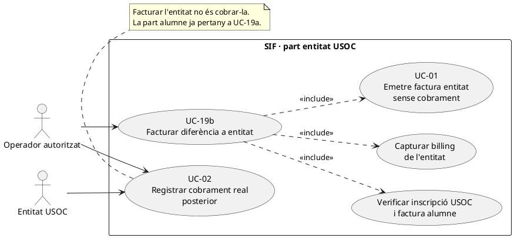
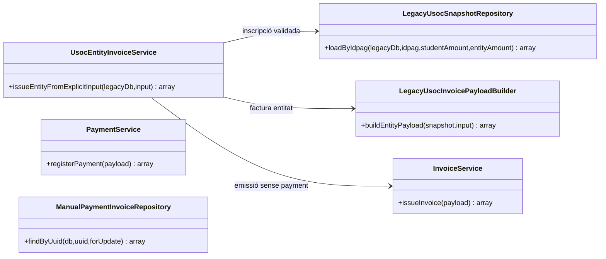
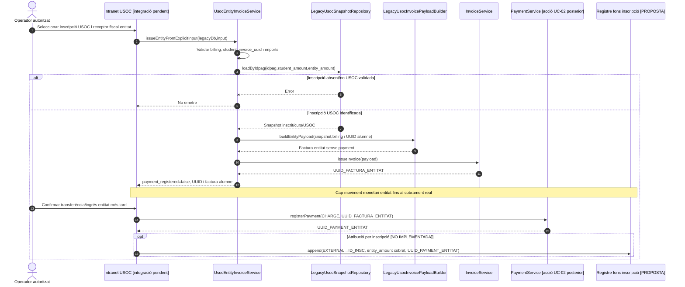

# UC-19b · Facturar la part corresponent a l'entitat USOC — fitxa i UML integrats

**Objectiu:** emetre **una factura diferenciada a l'entitat**, per la part de finançament que li correspon en una inscripció USOC. El nucli actual **no registra el cobrament de l'entitat en emetre-la**. Relacions: UC-19a (factura i CHARGE de l'alumne), UC-13 (expedient conjunt), UC-02/22 (cobrament posterior de la factura entitat), UC-71/72 (canvi o baixa que afecti les dues parts).

**Estat:** `UsocEntityInvoiceService::issueEntityFromExplicitInput()`, `LegacyUsocSnapshotRepository`, `LegacyUsocInvoicePayloadBuilder::buildEntityPayload()` i `InvoiceService` existeixen; la pantalla, els permisos, la decisió exacta del finançador, el document i l'assignació de diners per inscripció continuen pendents d'acreditar. No es declara cap prova executada en aquesta revisió.

## 1. Fitxa funcional específica

| Camp | Regla verificada o contracte pendent |
| --- | --- |
| Actors | Operador autoritzat prepara factura; entitat rep factura i paga posteriorment segons circuit acordat. |
| Disparador | Existeix l'import de l'entitat identificat en la compra USOC i es disposa de la factura de la part alumne, amb `student_invoice_uuid`. |
| Entrada del servei | `idpag` positiu, `student_amount > 0`, `amount > 0` de l'entitat, `student_invoice_uuid` no buit i objecte `billing` amb `name` i `nif` no buits. |
| Comprovació de l'inscrit | `LegacyUsocSnapshotRepository::loadByIdpag()` requereix inscripció USOC existent amb `TIPUS_DESC=4` i `VALID_DESC=1`; recupera curs i snapshot. |
| Construcció fiscal | `LegacyUsocInvoicePayloadBuilder::buildEntityPayload()` emet una línia «Diferencia USOC» vinculada a la mateixa inscripció `source_type=INSCRIPCIO`, amb receptor `billing` de l'entitat, `source_type=USOC_ENTITAT` i `source_channel=INTRANET`. |
| Idempotència base | Clau `INTRANET|USOC_ENTITAT|ID_INSC:<inscripció>|FACT_ALUMNE:<student_invoice_uuid>`. Reintents amb imports/receptor diferents però mateixa clau exigeixen **comparació del contingut i resolució d'incidència**, no una reutilització silenciosa. |
| Visibilitat | La relació entitat és `visible_alumne=0`; el control d'accés real al document encara ha de ser validat pel canal UC-07. |
| Efecte monetari inicial | **Cap:** el payload entitat no porta bloc `payment`; el servei retorna `payment_registered=false`. La factura entitat és una obligació pendent, no fons ja atribuïts a la inscripció. |
| Resultat | UUID i número de factura entitat, `student_invoice_uuid` associat; el seu estat fiscal/cobrament és independent de la factura alumne. |

### 1.1. Flux principal del servei

1. L'operador revisa l'expedient de l'alumne, el receptor i l'import de la part USOC. Abans de facturar cal **identificació fiscal explícita de l'entitat**: no es pot recuperar automàticament de les dades de l'alumne.
2. `UsocEntityInvoiceService::issueEntityFromExplicitInput($legacyDb,$input)` valida `idpag`, `student_amount`, `amount`, `student_invoice_uuid` i `billing.name/nif`.
3. `LegacyUsocSnapshotRepository::loadByIdpag()` recupera inscripció/curs, comprova `TIPUS_DESC=4` i `VALID_DESC=1` i normalitza els imports diferenciats.
4. `LegacyUsocInvoicePayloadBuilder::buildEntityPayload()` construeix factura amb línia `INSCRIPCIO`, import entitat, dades fiscals explícites i identificador de factura alumne en les metadades `usoc`; usa clau idempotent per inscripció + factura alumne.
5. `InvoiceService::issueInvoice()` crea o reutilitza **una factura nova de l'entitat**, amb número, registre fiscal, cadena i cua. El resultat de `UsocEntityInvoiceService` marca `payment_registered=false`. **El servei no ha cobrat la part de l'entitat.**
6. Quan arriba un pagament real d'entitat, el canal inicia UC-02/22/24 contra **la factura entitat**, i registra `payment_transaction CHARGE` únic i `payment_allocation` corresponent. Cap cobrament real no s'infereix de `student_amount` ni de `amount` en el payload fiscal.
7. Quan s'implementi el registre de fons per inscripció, el pagament entitat confirmat generarà una atribució específica a la mateixa inscripció amb **`UUID_PAYMENT` d'entitat**, independent de la de l'alumne. El deute pendent no crea una entrada fictícia.

### 1.2. Alternatives, errors i decisions pendents

| Cas | Comportament |
| --- | --- |
| Falten dades fiscals o `student_invoice_uuid` | Rebuig abans de generar factura entitat. |
| `amount` o `student_amount` zero/no positiu | Rebuig pel servei. |
| Inscripció no USOC validada o `IDPAG` no existent | El repositori/builder rebutgen. |
| Entitat encara no paga | Factura emesa i pendent; **no** `CHARGE`, `COMPENSATION` ni atribució de diner a inscripció. |
| Entitat paga parcialment | Cada fracció confirmada és un moviment econòmic independent sobre la factura entitat; cap nou `issueInvoice()` pel cobrament. |
| La factura alumne ja existeix, però es demana entitat amb import nou | La clau d'emissió pot coincidir; cal comparar payloads i evitar reaprofitar una factura anterior amb dades contradictòries. |
| Canvi de curs/baixa amb ambdues factures | Dues relacions fiscals a classificar; retorn/saldo separat per pagador i import, sense retornar la part entitat a l'alumne per defecte. |
| Doble facturació però un sol pagament d'alumne | **No** atribuir el total de les dues factures al cobrament de l'alumne; conciliar amb els dos moviments externs reals quan existeixin. |
| Relació entre factures | `student_invoice_uuid` consta en metadades/retorn del servei; **no** afirmar una FK o `fact_rels` específica entre factures sense confirmar la persistència efectiva d'aquest vincle al codi. |

**Proves localitzades, no executades:** `UsocEntityInvoiceServiceTest` comprova el servei amb entrada explícita; manca validar el cicle integral de dues factures, cobraments, titularitat i documents.

## 2. Diagrama UML de casos d'ús — factura entitat

## 3. Diagrama de classes — implementació real

`PaymentService` és el servei de cobrament **posterior**, no una dependència directa del servei d'emissió de la part entitat.

## 4. Seqüència — emissió ara, cobrament quan s'acrediti

## 5. Traçabilitat

[Fitxa original UC-19b](../06-fitxes-funcionals/uc-019b.md) · [UC-13 doble facturació](uc-013-orquestrar-doble-facturacio-usoc.md) · [UC-19a part alumne](uc-019a-facturar-part-alumne-usoc.md) · [UC-02 cobrament](uc-002-registrar-cobrament-factura.md) · [Revisió de fons](00-revisio-moviments-inscripcions.md) · [UsocEntityInvoiceService](../../sif/src/Service/UsocEntityInvoiceService.php) · [LegacyUsocInvoicePayloadBuilder](../../sif/src/Service/LegacyUsocInvoicePayloadBuilder.php) · [LegacyUsocSnapshotRepository](../../sif/src/Repository/LegacyUsocSnapshotRepository.php) · [UsocEntityInvoiceServiceTest](../../sif/tests/Integration/UsocEntityInvoiceServiceTest.php).
