# UC-020 — Diagrames d'activitat ACTUAL i FINAL per pàgina i apartat

**Revisió:** 03/10/2026  
**Cas:** UC-20 · Aplicar Alumne PrisMa  
**Objectiu:** cobrir totes les superfícies on la regla Alumne PrisMa es consulta, aplica, reutilitza o condiciona un pagament.  
**Etiqueta ACTUAL:** lectura estàtica del repositori; no prova de desplegament.  
**Etiqueta FINAL:** contracte objectiu; quan una peça ja és executable s'indica explícitament com a implementada/revalidada.

## 0. Índex de pàgines i apartats

| ID | Superfície | Apartats UC-020 |
| --- | --- | --- |
| P01 | Pàgina pública de descomptes | text Alumne PrisMa, taula orientativa, accés a inscripció |
| P02 | Formulari públic d'inscripció | document, checks/promocions, càlcul de preu, confirmació |
| P03 | Confirmació activa | token, estat de la inscripció, import/saldo, mètodes habilitats |
| P04 | Pàgina activa de pagament | token, saldo, targeta, transferència |
| P05 | Intranet «Validar descomptes» | consulta pendent, decisió, alternativa AP, notificació |
| P06 | Intranet «Canvi de curs» | antecedent històric, prioritat de descomptes, tarifa AP del nou curs |

## 1. P01 · Pàgina pública de descomptes

**Fonts ACTUALS:** `pagina_descomptes.php`, `ajax/mostrar_pagina_descomptes.php`, `PaginaDescomptes.php`.

### 1.1. P01-A — ACTUAL · text Alumne PrisMa

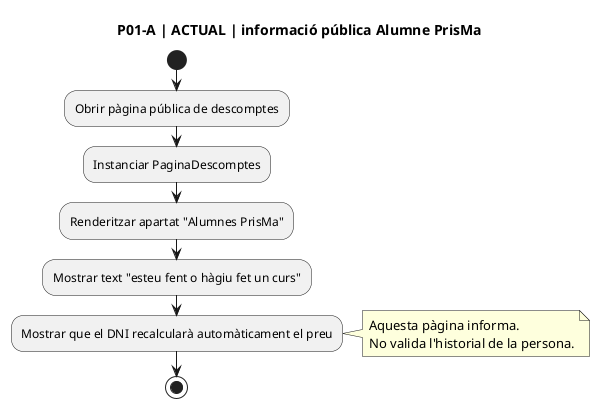

### 1.2. P01-B — ACTUAL · taula de preus orientativa

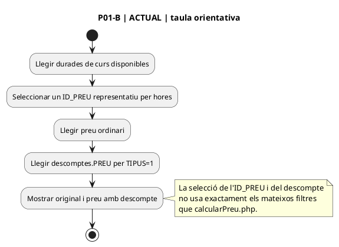

### 1.3. P01 — FINAL

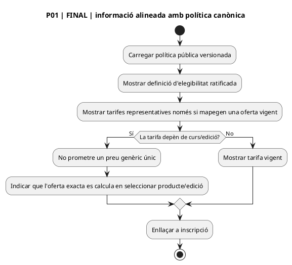

## 2. P02 · Formulari públic d'inscripció

**Fonts ACTUALS:** `InscripcioCurs.php`, `mostrarInscripcions.min.js`, `ajax/calcularPreu.php`, `inc/buscarAlumnePrisMa.php`, `ajax/enviarInscripcio.php`.

### 2.1. P02-A — ACTUAL · document i disparadors de recàlcul

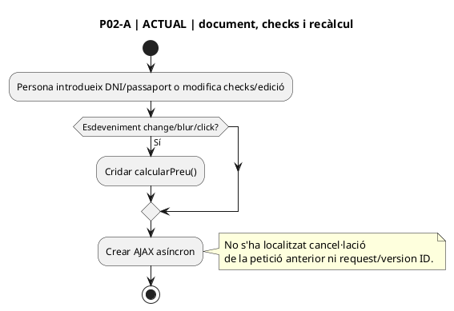

### 2.2. P02-B — ACTUAL · selecció del candidat

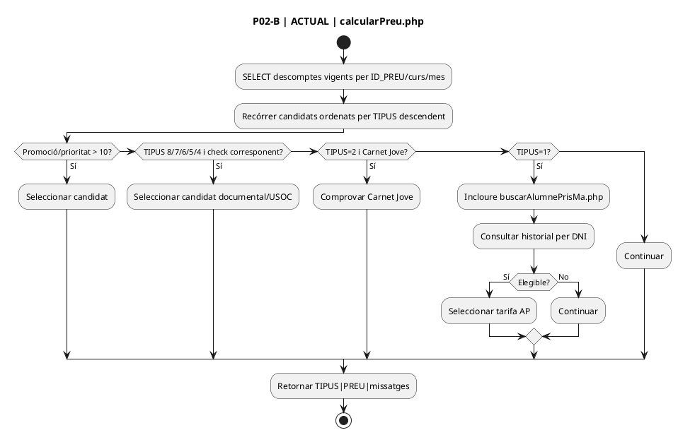

### 2.3. P02-C — ACTUAL · concurrència de respostes

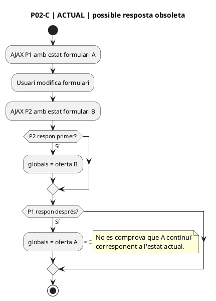

### 2.4. P02-D — ACTUAL · codi promocional vs Alumne PrisMa

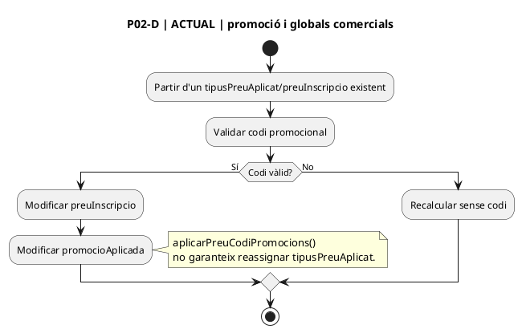

### 2.5. P02-E — ACTUAL · confirmació i inserció

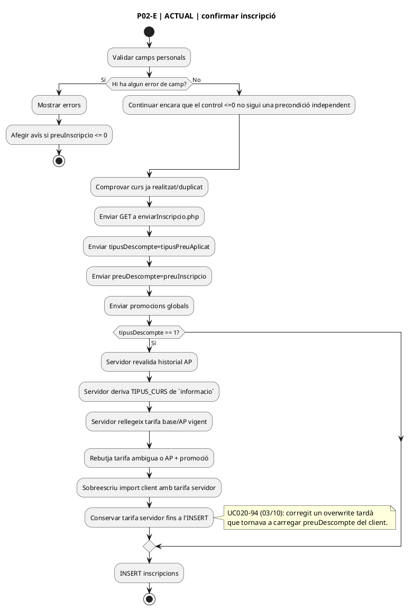

### 2.6. P02 — FINAL · oferta servidor immutable

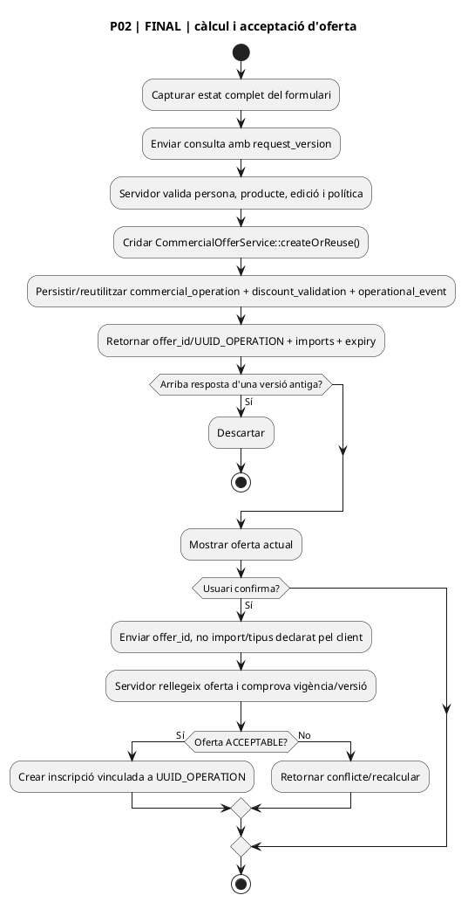

## 3. P03 · Confirmació activa

**Ruta activa:** `/confirmacio/...` → `pagina_confirmacio_inscripcio_automatic.php` → `PagamentCursAutomatic::mostrarPaginaConfirmacio()`.

### 3.1. P03-A — ACTUAL · token i càrrega

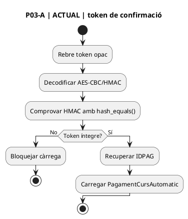

### 3.2. P03-B — ACTUAL · resum i pagament

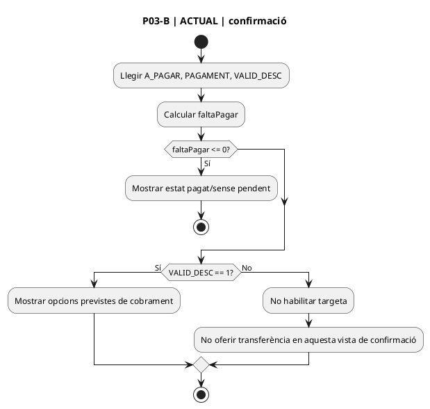

### 3.3. P03 — FINAL

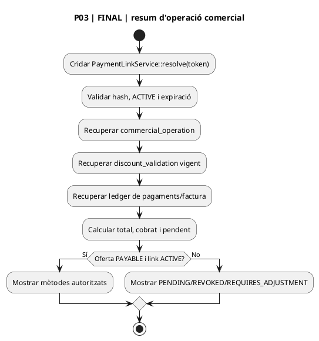

## 4. P04 · Pàgina activa de pagament

**Ruta activa:** `/pagament/...` → `pagina_pagament_automatic.php` → `PagamentCursAutomatic::mostrar()`.

### 4.1. P04-A — ACTUAL · targeta

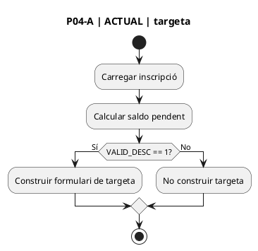

### 4.2. P04-B — ACTUAL · transferència

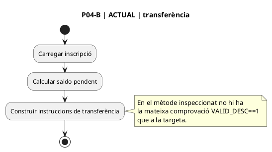

### 4.3. P04-C — ACTUAL · denegació + AP alternatiu

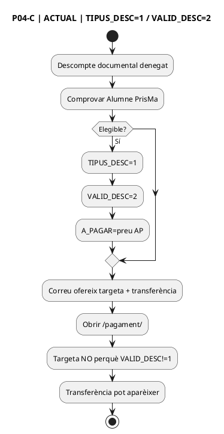

### 4.4. P04 — FINAL

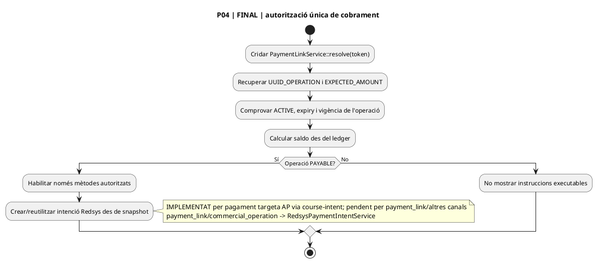

## 5. P05 · Intranet «Validar descomptes»

**Aquest flux comparteix pàgina i decisions amb UC-116.** UC-020 només desenvolupa la branca de tarifa alternativa Alumne PrisMa i les seves conseqüències. La comanda actual ha estat revalidada el 03/10/2026 com POST + sessió + permís + CSRF + `requestId`.

### 5.1. P05-A — ACTUAL · cua de pendents

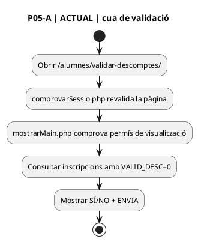

### 5.2. P05-B — ACTUAL · comanda reconciliada 02/10

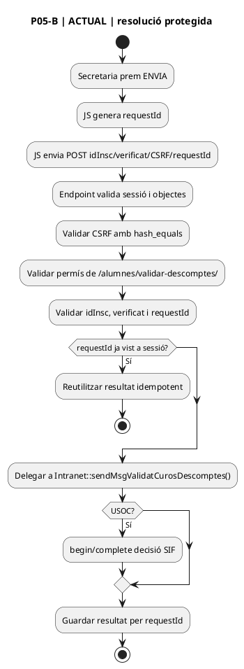

### 5.3. P05-C — ACTUAL · acceptació

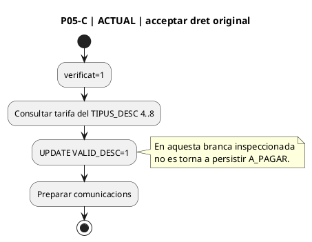

### 5.4. P05-D — ACTUAL · denegació i AP

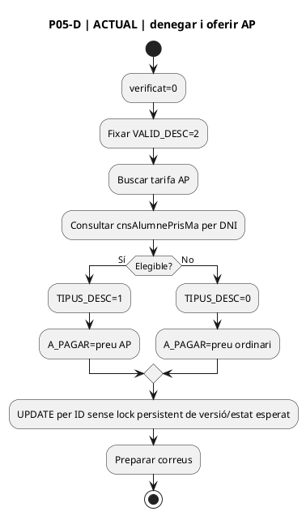

### 5.5. P05-E — ACTUAL · notificació

```plantuml
@startuml
title P05-E | ACTUAL | persistència i SMTP
start
:Persistir decisió/import;
:Construir correu Secretaria;
:Intentar send();
:Construir correu persona;
:Intentar send();
:Retornar OK;
:JS considera èxit si resposta no conté "error";
stop
@enduml
```

### 5.6. P05 — FINAL

```plantuml
@startuml
title P05 | FINAL | comanda versionada i alternativa AP
start
:POST/comanda autenticada;
:Validar CSRF, rol, permís específic, idempotency key;
:Rellegir sol·licitud amb versió esperada;
if (Continua PENDING?) then (No)
 :Retornar ALREADY_APPLIED o VERSION_CONFLICT;
 stop
endif
if (Secretaria accepta?) then (Sí)
 :Persistir discount_validation ACCEPTED;
 :Validar/conservar oferta autoritzada;
else (No)
 :Persistir decisió original REJECTED;
 :Executar PrismaStudentDiscountPolicy;
 if (AP elegible + tarifa?) then (Sí)
  :Persistir segona decisió AP ACCEPTED;
  :Crear/substituir oferta AP PAYABLE;
 else (No)
  :Crear/substituir oferta ordinària o incidència ELIGIBLE_NO_PRICE;
 endif
endif
:Registrar operational_event;
:Commit;
:Crear notificació posterior al commit;
stop
@enduml
```

## 6. P06 · Canvi de curs

**Font ACTUAL:** `Intranet::buscarPreuAPagar_modalCanviCurs()`.

### 6.1. P06-A — ACTUAL · antecedent

```plantuml
@startuml
title P06-A | ACTUAL | elegibilitat històrica
start
:Carregar ID, DNI i DATA_INSC originals;
if (Carnet Jove marcat?) then (Sí)
 :Marcar teCarnetJove;
else (No)
 :Buscar antecedent mateix DNI;
 :Exigir pagament>0 o curs regal;
 :Excloure D/M;
 :Excloure ID actual;
 :Exigir DATA_INSC <= data original;
 if (Existeix?) then (Sí)
  :esExalumne=true;
 endif
endif
stop
@enduml
```

### 6.2. P06-B — ACTUAL · prioritat de preu

```plantuml
@startuml
title P06-B | ACTUAL | preu del nou curs
start
:Recuperar ID_PREU del nou curs/edició;
if (Promoció >=10 que preserva l'import anterior?) then (Sí)
 :Conservar preu;
elseif (Descompte documental validat?) then (Sí)
 :Buscar tarifa per TIPUS_DESC/curs/mes/data original;
elseif (Carnet Jove?) then (Sí)
 :Buscar TIPUS=2 per ID_PREU;
elseif (esExalumne?) then (Sí)
 :Buscar TIPUS=1 per ID_PREU;
 note right
  Aquesta consulta no incorpora
  CURS ni MES.
 end note
else
 :Buscar preu ordinari;
endif
:Retornar preu;
stop
@enduml
```

### 6.3. P06 — FINAL

```plantuml
@startuml
title P06 | FINAL | reavaluació versionada en canvi de curs
start
:Carregar operació/inscripció origen;
:Definir evaluation_at segons regla ratificada;
:Executar la mateixa PrismaStudentDiscountPolicy;
:Identificar nova edició i tarifa exacta;
:Resoldre compatibilitat amb descompte preexistent;
if (Factura/cobrament ja existent?) then (Sí)
 :Classificar ajust i preservar històric;
else (No)
 :Crear nova versió/substitució de l'oferta;
endif
:Registrar before/after + correlation;
stop
@enduml
```

### 6.4. Estat d'implementació del FINAL

- `CommercialOfferService::createOrReuse()`: **implementat**; l'alta AP llegada encara no crea `offer_id`, però `enviarInscripcio.php` ja revalida AP al servidor abans de persistir.
- `PaymentLinkService::issue()/resolve()/revoke()`: **implementat**; encara no és la ruta canònica d'aquest checkout AP.
- Política `PrismaStudentDiscountPolicy`: **IMPLEMENTADA_COMPATIBILITAT** com `ALUMNE_PRISMA_WEB_LEGACY_V2`; decisions UC20-DEC-001…006 tancades a la fitxa v1.7.
- Connexió AP de pagament → `RedsysPaymentIntentService`: **IMPLEMENTADA** via `SifRedsysCourseIntentClient` / `course-intent` / `PrismaStudentCourseCheckoutService`. La coordinació específica amb `payment_link` continua pendent.

## 7. Matriu ACTUAL → FINAL

| Superfície | ACTUAL | FINAL |
| --- | --- | --- |
| P01 informació | text i taula calculats amb criteris propis | text i tarifa alineats amb política versionada |
| P02 càlcul | globals JS + AJAX textual | offer_id/UUID_OPERATION servidor |
| P02 confirmació | import/tipus enviats pel client | acceptació d'oferta rellegida al servidor |
| P03 confirmació | `VALID_DESC` + camps llegats | estat d'operació + ledger |
| P04 targeta | `VALID_DESC==1` | `PAYABLE` + link actiu |
| P04 transferència | comprovació diferent de targeta | mateixa autorització que qualsevol cobrament |
| P05 resolució | POST + sessió + permís + CSRF + requestId idempotent | control persistent d'estat/versió i outbox com a evolució |
| P05 alternativa AP | `TIPUS_DESC=1, VALID_DESC=2` | decisió original REJECTED + decisió AP ACCEPTED |
| P06 canvi curs | política històrica específica | mateixa política versionada amb `evaluation_at` explícit |

## 8. Decisions canòniques que afecten els diagrames FINAL

1. `GENERAT=1`: **sí**, compatibilitat executable.
2. Factura emesa sense cobrament: **no**, per si sola no acredita AP.
3. Inscripció actual: **no**, s'exclou de l'historial; tampoc compta historial posterior a `DATA_INSC`.
4. `evaluation_at`: en matrícula llegada és `DATA_INSC`; l'historial posterior no acredita retroactivament.
5. AP + promoció: no acumulable en aquest tall i falla tancat; altres famílies continuen com a migració transversal.
6. Snapshot AP: congelat mentre la matrícula sigui pagable; expiració de `payment_link` separada.

## 9. Relacions amb altres casos

- **UC-116**: justificants documentals, revisió manual i denegació.
- **UC-014**: compra de curs i factura posterior.
- **UC-071**: canvi de curs.
- **UC-003**: callback/worker Redsys.
- **UC-073/074**: ajust/impacte fiscal quan ja hi ha document emès, segons classificació definitiva.

## 10. Criteri de completitud documental

Aquest dossier cobreix totes les superfícies identificades del UC-020. Si apareix una nova ruta que:

- calcula TIPUS=1,
- canvia `A_PAGAR` per condició Alumne PrisMa,
- decideix `VALID_DESC`,
- crea una intenció/link de pagament,
- o reconstrueix el descompte per facturar,

s'ha d'afegir com a pàgina/apartat nou i vincular-lo a la matriu d'auditoria.


## 11. Reconciliació de tancament — 02/10/2026

Per UC-020, P02 continua sent llegat en transport i UX, però ja no és autoritatiu monetàriament quan aplica AP: la persistència torna a calcular elegibilitat i preu. P05 també queda reclassificat: les notes històriques de GET/sense CSRF són superades pel codi actual POST/CSRF/permís/requestId.


## 12. Revalidació transversal — 03/10/2026

- **P01:** documentació pública localitzada; continua existint diferència entre text comercial ampli i criteri executable versionat.
- **P02:** preview JS continua subjecte a concurrència, però l'alta AP revalida historial/tarifa al servidor i, després d'UC020-94, el preu servidor arriba intacte a `A_PAGAR`.
- **P03/P04:** el canal de targeta actiu obté la intenció SIF i usa l'import retornat pel servidor; `payment_link` i transferència continuen pendents d'unificació.
- **P05:** resolució revalidada com POST + sessió + permís + CSRF + `requestId`; queda deute de concurrència/idempotència persistent a BD.
- **P06:** la lògica llegada de canvi de curs continua sent una superfície diferent; la seva convergència completa a la policy/oferta SIF és migració transversal.
- **Callback/factura:** el `main` actual incorpora proves E2E simulades de callback → worker → pagament/factura/sync/outbox. No substitueixen el gate real de preproducció.
