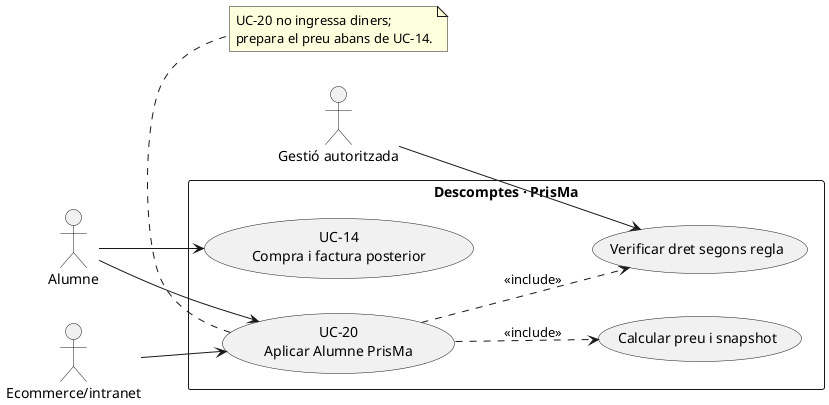
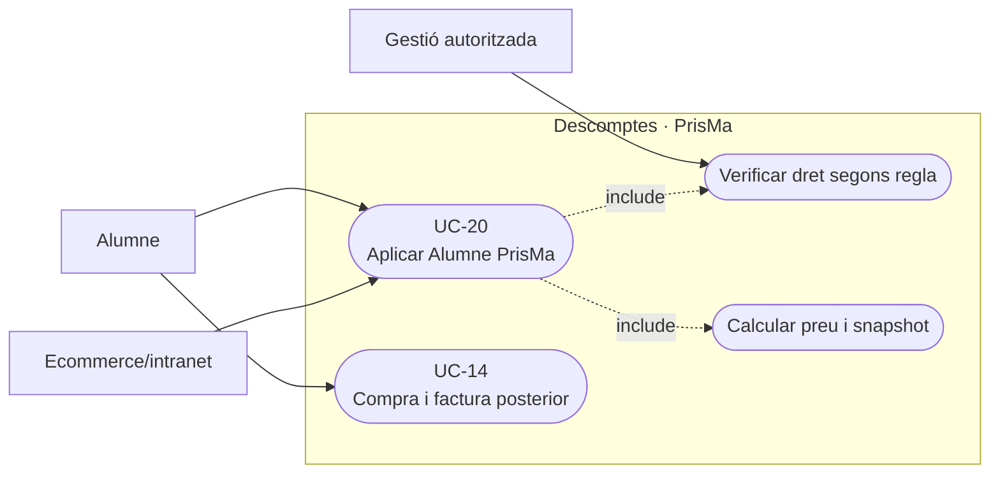
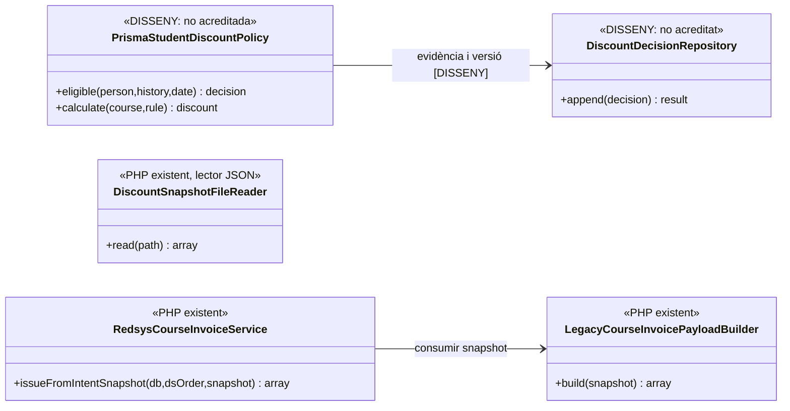
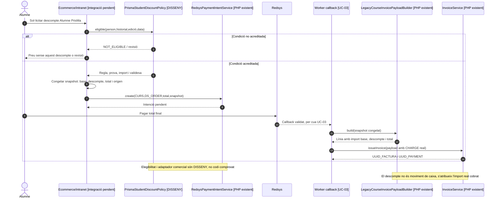

# UC-20 · Aplicar el descompte «Alumne PrisMa»

**Abast:** comprovar el dret al descompte d'«Alumne PrisMa», calcular l'import comercial i congelar l'origen, la regla i les quantitats abans de cobrar o facturar. **La validació del dret i la persistència del descompte a la línia fiscal són dos passos diferents**. El catàleg qualifica UC-20 com a `[PARCIAL]` i en destaca el snapshot fiscal.

**Evidència de codi:** `LegacyCourseInvoicePayloadBuilder::build()` consumeix un bloc `snapshot['discount']` o dades de descompte de la inscripció i pot transportar-ne origen, mode, codi, ID, percentatge, base, import, text visible i motiu intern fins a la línia fiscal. `DiscountSnapshotFileReader::read()` només llegeix JSON d'un fitxer local i el valida estructuralment. **No s'ha identificat en aquestes peces un servei que consulti l'historial d'alumnat, decideixi que la persona té dret a «Alumne PrisMa», apliqui la política comercial vigent i en registri una prova.**

## 1. Fitxa funcional específica

| Element | Regla |
| --- | --- |
| Actors | Persona que es vol inscriure, ecommerce/intranet i gestió autoritzada quan la condició no es pot validar automàticament. |
| Identitat | Alumne/titular de la condició, inscripció, curs/edició, data de compra i identificador de regla/versionat. «Alumne PrisMa» no equival simplement a qualsevol participant actual d'un grup. |
| Precondició comercial pendent | Definir en la política vigent què vol dir «Alumne PrisMa» (inscripció prèvia, edició completada, antelació, exclusions i compatibilitat amb altres descomptes). **El catàleg resumit no fixa aquests llindars ni el percentatge; no se n'inventa cap.** |
| Camps fiscals que el builder pot conservar | `discount_origin`, `discount_mode`, `discount_id`, `discount_code`, `discount_pct`, `discount_amount`, `discount_text`, `discount_internal_reason` i import base/total, si s'aporten en el snapshot. |
| Comprovació monetària del builder | Si hi ha descompte calcula `BASE - DESCOMPTE = TOTAL` i valida imports segons les rutines del constructor. **Això comprova aritmètica del snapshot, no que la persona compleixi la condició de descompte.** |
| Resultat de UC-20 | Decisió comercial datada, elegibilitat, regla, preu abans/després i snapshot de descompte per a la futura factura; per si sol **no** emet factura, `CHARGE`, `REFUND`, crèdit o moviment de fons d'inscripció. |

### 1.1. Flux funcional objectiu

1. El canal identifica la persona i la inscripció, preu de curs/edició i data de la compra; consulta l'historial admissible segons el criteri comercial aprovat. No es confia només en un «check» del navegador.
2. Un servei de validació de descomptes **pendent** classifica `ELIGIBLE` o `NOT_ELIGIBLE` i conserva la prova mínima i la versió de la regla. Quan el dret no es pot acreditar, es bloqueja l'aplicació automàtica o es deriva a gestió.
3. S'aplica percentatge o import **segons política comprovada** i compatibilitats; el resultat inclou import base, descompte real i total. El registre proposat no ha d'exposar indiscriminadament dades d'altres cursos/persones en el text visible de la factura.
4. El canal congela la decisió i el bloc `discount` en la intenció/snapshot abans del TPV. **`DiscountSnapshotFileReader` és només un lector de fitxer JSON**; no substitueix el registre d'elegibilitat ni la captura segura del snapshot a ecommerce.
5. Quan hi ha cobrament real, el builder fiscal `LegacyCourseInvoicePayloadBuilder` genera la línia d'inscripció amb base, descompte, total i camps de procedència que li hagin estat aportats. El servei d'emissió conserva el document fiscal a partir d'aquest snapshot.
6. La quantitat monetària ingressada i atribuïda a la inscripció és **el pagament real**, no el preu abans de descompte. Un descompte comercial **no** és una sortida de diners de l'inscripció ni un `REFUND`.

### 1.2. Variants i punts pendents

| Cas | Tractament |
| --- | --- |
| Historial no verificable | No aplicar descompte automàticament; registrar revisió i evidència si l'operador l'autoritza. |
| La regla ha canviat entre previsualització i TPV | Usar el preu/snapshot acceptat i la política definida per a l'operació, amb vigència explícita; no recalcular en un callback posterior com si fos una venda nova. |
| Altres descomptes (pack, promoció, codi) | Validar acumulació/exclusions amb les regles vigents; aquest builder no acredita per si sol una política completa de compatibilitat. |
| Pagament denegat | Es pot conservar una decisió comercial pendent però **no** s'ha produït una entrada de caixa ni una factura pagada. |
| Canvi de curs o baixa després d'emetre | Revalidar condicions del nou servei i classificar efecte fiscal; no modificar retrospectivament el snapshot de la factura inicial. |
| Descompte amb import o base contradictoris | Bloquejar l'emissió i deixar incidència; l'origen «Alumne PrisMa» no s'ha de deduir arbitràriament d'un codi promocional genèric. |

**Pendent crític:** valors exactes d'elegibilitat, percentatge/import, dates, compatibilitat, format del text visible i el servei d'autorització. No es declaren implementats ni provats per l'existència del builder fiscal.

### 1.3. Historial d'alumnat, autorització del preu i aplicació única

**Què està acreditat i què no.** El catàleg enumera el descompte «Alumne PrisMa» i el builder pot conservar-ne un snapshot fiscal, però les fonts examinades **no fixen** percentatge, antiguitat, nombre de cursos requerits, data de vigència o incompatibilitats. No establir per inferència que qualsevol registre antic a `inscripcions` converteix la persona en exalumna beneficiària: l'historial pot contenir reserves, baixes, inscripcions no pagades i grups de pagament per tercer. El canal comercial ha d'identificar la regla real i la seva versió i indicar amb quina inscripció/document es justifica el dret, si així ho exigeix la política aprovada.

**Situació de compra.** El descompte d'«Alumne PrisMa» afecta el **preu de l'operació**, no el titular del cobrament. En una factura de grup o d'empresa, una persona pot complir el criteri però la factura té el receptor fiscal del responsable, i cal definir a quina **línia d'inscripció** correspon la reducció i si el grup admet acumular-la. En un pack, no extrapolar automàticament la regla del segon curs al descompte per historial; el càlcul combinat ha de ser una decisió comercial explícita.

**Validació tardana.** Si es constata el dret abans de facturar o cobrar, el canal recalcula oferta i congela base/descompte/total a la intenció actual. Si s'aprova **després** d'emetre, el fet és un ajust UC-73/74 amb possible correcció de document; una devolució UC-28 només es registra després d'una **sortida monetària real**. No deduir un `REFUND` de la diferència entre el preu antic i el nou.

### 1.4. Proves addicionals (no executades)

| ID | Escenari | Resultat esperat |
| --- | --- | --- |
| AP-01 | Historial amb inscripció antiga però dret comercial no verificat | Pendent de validació; no percentatge inventat ni descompte per mera presència a BD. |
| AP-02 | Alumne beneficiari d'una factura de grup | Descompte, si correspon, a la seva línia; receptor fiscal de grup preservat. |
| AP-03 | Pack amb reducció pròpia i petició Alumne PrisMa | Compatibilitat i ordre de càlcul explícits, sense doble descompte implícit. |
| AP-04 | Dret acreditat després de factura emesa | Event d'ajust i classificació fiscal; original immutable i cap retorn bancari fictici. |
| AP-05 | Intent Redsys denegat i nou intent amb el mateix IDPAG | Una decisió/preu coherent per operació, sense doble aplicació del descompte. |

## 2. Diagrama UML de casos d'ús

### Vista de casos d’ús per a GitHub (Mermaid)

## 3. Diagrama de classes — codi present i validació pendent

El lector de fitxer i el builder **no** consulten directament un `PrismaStudentDiscountPolicy` real; el diagrama no inventa aquesta crida.

## 4. Seqüència — decisió comercial i futura factura (mixt: DISSENY/PHP)

## 5. Traçabilitat

[UC-20 original](../06-fitxes-funcionals/uc-020.md) · [UC-14 compra curs](uc-014-comprar-curs-redsys.md) · [UC-71 canvi curs](uc-071-registrar-canvi-curs-complet.md) · [LegacyCourseInvoicePayloadBuilder](../../sif/src/Service/LegacyCourseInvoicePayloadBuilder.php) · [DiscountSnapshotFileReader](../../sif/src/Service/DiscountSnapshotFileReader.php) · [Revisió econòmica per inscripció](00-revisio-moviments-inscripcions.md).

**No s'ha executat una prova d'elegibilitat ni s'ha acreditat la política comercial real de «Alumne PrisMa».**
