# UC-20 · Aplicar el descompte «Alumne PrisMa» — UML integrat ACTUAL / FINAL

**Revisió específica:** 03/10/2026  
**Estat:** `AUDIT_CLOSED_REVALIDATED`; tall AP implementat i integrat al checkout de targeta, amb migracions transversals pendents.  
**Abast:** elegibilitat, selecció de tarifa, alta web, alternativa després de denegació d'un altre descompte, canvi de curs, confirmació/pagament actiu i transport posterior del snapshot al SIF.  
**No acredita:** desplegament productiu ni E2E real de navegador/preproducció. Les proves automatitzades només es consideren verificades quan hi ha execució CI/evidència citada.

## 0. Llegenda

- **ACTUAL**: component o comportament identificat al codi llegat/SIF actual.
- **IMPLEMENTAT SIF**: classe/taula existent al SIF, però no implica integració UC-20.
- **DDL**: estructura definida per migració, sense servei runtime acreditat.
- **DISSENY / FINAL**: responsabilitat objectiu encara no acreditada en runtime.
- **HISTÒRIC / SUPERAT**: fotografia anterior conservada per traçabilitat però que no descriu el runtime vigent.
- **PENDENT MIGRACIÓ/ROLLOUT**: integració transversal o verificació d'entorn encara no completada.

## 1. Resum funcional

UC-20 no és «calcular un percentatge». El codi ACTUAL tracta Alumne PrisMa com una **tarifa final configurada** a `descomptes.PREU` per `TIPUS=1`.

La política llegada no és única:

1. **Web d'inscripció**: historial per DNI amb pagament, curs regal, `GENERAT=1` i una branca de factura relacionada; exclou D/M.
2. **Denegació d'un altre descompte a intranet**: semblant però sense `GENERAT=1` i sense excloure la inscripció actual.
3. **Canvi de curs**: pagament/regal, exclou la mateixa inscripció i limita antecedents a la data de la inscripció original.

El tall AP vigent encapsula la compatibilitat pública en `ALUMNE_PRISMA_WEB_LEGACY_V2`, exclou la matrícula actual i l'historial posterior a `DATA_INSC`, persisteix la decisió comercial abans de crear la intenció Redsys i manté el callback independent de la reavaluació d'elegibilitat. La unificació completa d'alta/preview/intranet sobre oferta SIF nativa continua com a migració.

## 2. Decisions compartides ja acordades amb UC-116

- La revisió dels justificants documentals és **manual de Secretaria**.
- Mentre la revisió documental és pendent, **no s'ha d'habilitar el pagament**.
- Si el dret original es denega, **es conserva la mateixa inscripció**.
- Després de la denegació:
  - si la persona és elegible a Alumne PrisMa → nova oferta AP;
  - si no → tarifa ordinària.
- La denegació no genera per si sola un cobrament.
- Una factura ja emesa no es reescriu: qualsevol ajust es classifica en el cas fiscal/econòmic corresponent.

## 3. Cas d'ús — ACTUAL i FINAL

```plantuml
@startuml
left to right direction
actor "Persona" as P
actor "Secretaria" as S
actor "Gestió" as G

rectangle "UC-20 · ACTUAL" {
  usecase "Consultar preu
al formulari" as A1
  usecase "Comprovar historial
per DNI" as A2
  usecase "Registrar TIPUS_DESC,
VALID_DESC i A_PAGAR" as A3
  usecase "Aplicar AP després
d'una denegació" as A4
  usecase "Recalcular AP en
canvi de curs" as A5
}
P --> A1
A1 ..> A2 : include
P --> A3
S --> A4
G --> A5

rectangle "UC-20 · FINAL" {
  usecase "Avaluar política AP
versionada" as F1
  usecase "Persistir decisió
de descompte" as F2
  usecase "Congelar operació
comercial" as F3
  usecase "Habilitar oferta
pagable" as F4
}
P --> F1
S --> F1
G --> F1
F1 ..> F2 : include
F2 ..> F3 : include
F3 ..> F4 : si és pagable
@enduml
```

### Vista de casos d’ús per a GitHub (Mermaid)

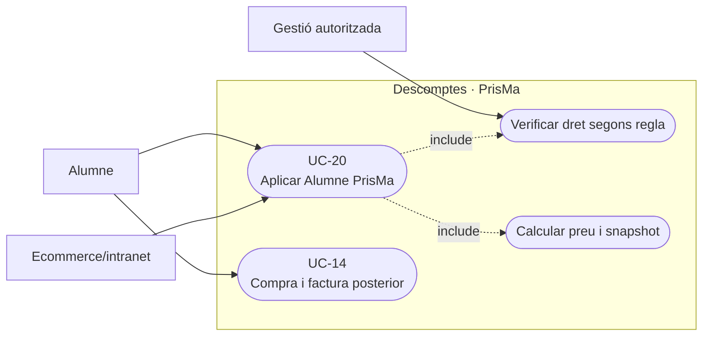
```mermaid
flowchart LR
  actor_0["Alumne"]
  actor_1["Ecommerce/intranet"]
  actor_2["Gestió autoritzada"]
  subgraph SIF_BOX["Descomptes · PrisMa"]
    uc_0(["UC-20<br/>Aplicar Alumne PrisMa"])
    uc_1(["Verificar dret segons regla"])
    uc_2(["Calcular preu i snapshot"])
    uc_3(["UC-14<br/>Compra i factura posterior"])
  end
  actor_0 --> uc_0
  actor_1 --> uc_0
  actor_2 --> uc_1
  uc_0 -.->|include| uc_1
  uc_0 -.->|include| uc_2
  actor_0 --> uc_3
```

## 4. Diagrama de components ACTUAL

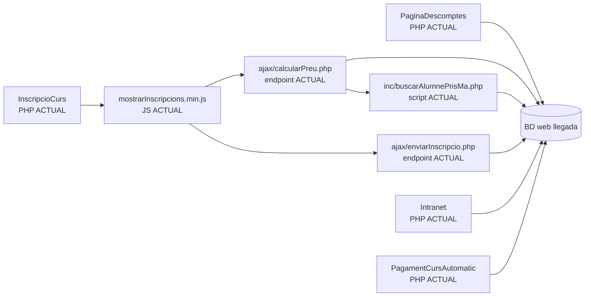
```mermaid
flowchart LR
    PD[PaginaDescomptes<br/>PHP ACTUAL]
    IC[InscripcioCurs<br/>PHP ACTUAL]
    JS[mostrarInscripcions.min.js<br/>JS ACTUAL]
    CP[ajax/calcularPreu.php<br/>endpoint ACTUAL]
    AP[inc/buscarAlumnePrisMa.php<br/>script ACTUAL]
    EI[ajax/enviarInscripcio.php<br/>endpoint ACTUAL]
    IN[Intranet<br/>PHP ACTUAL]
    PA[PagamentCursAutomatic<br/>PHP ACTUAL]
    DB[(BD web llegada)]

    PD --> DB
    IC --> JS
    JS --> CP
    CP --> AP
    CP --> DB
    AP --> DB
    JS --> EI
    EI --> DB
    IN --> DB
    PA --> DB
```

### 4.1. Responsabilitats ACTUALS

| Peça | Responsabilitat observada |
| --- | --- |
| `PaginaDescomptes` | Text públic i taula orientativa de preus/descomptes. |
| `mostrarInscripcions.min.js` | Estat de formulari, múltiples AJAX, `preuInscripcio`, `tipusPreuAplicat`, promocions i confirmació. |
| `calcularPreu.php` | Selecció de descompte candidat per tarifa/curs/mes/checks. |
| `buscarAlumnePrisMa.php` | Consulta historial AP per DNI al flux web. |
| `enviarInscripcio.php` | Inserció llegada amb `TIPUS_DESC`, `VALID_DESC`, `A_PAGAR`; rep import/tipus del navegador. |
| `Intranet` | Validació manual, alternativa AP després de denegació i càlcul en canvi de curs. |
| `PagamentCursAutomatic` | Confirmació/pagament de les rutes actives; interpreta `VALID_DESC`. |

## 5. Diagrama de classes ACTUAL

Els endpoints/scripts procedimentals no es representen com classes inventades.

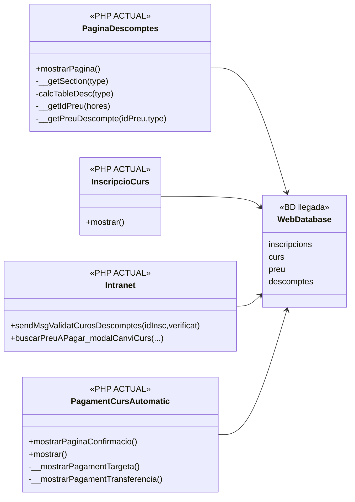
```mermaid
classDiagram
direction LR

class PaginaDescomptes {
  <<PHP ACTUAL>>
  +mostrarPagina()
  -__getSection(type)
  -calcTableDesc(type)
  -__getIdPreu(hores)
  -__getPreuDescompte(idPreu,type)
}

class InscripcioCurs {
  <<PHP ACTUAL>>
  +mostrar()
}

class Intranet {
  <<PHP ACTUAL>>
  +sendMsgValidatCurosDescomptes(idInsc,verificat)
  +buscarPreuAPagar_modalCanviCurs(...)
}

class PagamentCursAutomatic {
  <<PHP ACTUAL>>
  +mostrarPaginaConfirmacio()
  +mostrar()
  -__mostrarPagamentTargeta()
  -__mostrarPagamentTransferencia()
}

class WebDatabase {
  <<BD llegada>>
  inscripcions
  curs
  preu
  descomptes
}

PaginaDescomptes --> WebDatabase
InscripcioCurs --> WebDatabase
Intranet --> WebDatabase
PagamentCursAutomatic --> WebDatabase
```

## 6. Diagrama de classes FINAL / SIF

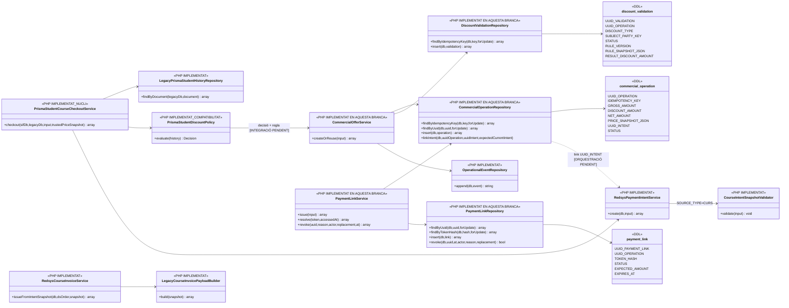
```mermaid
classDiagram
direction LR

class PrismaStudentDiscountPolicy {
  <<PHP IMPLEMENTAT_COMPATIBILITAT>>
  +evaluate(history) Decision
}

class LegacyPrismaStudentHistoryRepository {
  <<PHP IMPLEMENTAT>>
  +findByDocument(legacyDb,document) array
}

class CourseIntentSnapshotValidator {
  <<PHP IMPLEMENTAT>>
  +validate(input) void
}

class PrismaStudentCourseCheckoutService {
  <<PHP IMPLEMENTAT_NUCLI>>
  +checkout(sifDb,legacyDb,input,trustedPriceSnapshot) array
}

class CommercialOfferService {
  <<PHP IMPLEMENTAT EN AQUESTA BRANCA>>
  +createOrReuse(input) array
}

class CommercialOperationRepository {
  <<PHP IMPLEMENTAT EN AQUESTA BRANCA>>
  +findByIdempotencyKey(db,key,forUpdate) array
  +findByUuid(db,uuid,forUpdate) array
  +insert(db,operation) array
  +linkIntent(db,uuidOperation,uuidIntent,expectedCurrentIntent)
}

class DiscountValidationRepository {
  <<PHP IMPLEMENTAT EN AQUESTA BRANCA>>
  +findByIdempotencyKey(db,key,forUpdate) array
  +insert(db,validation) array
}

class PaymentLinkService {
  <<PHP IMPLEMENTAT EN AQUESTA BRANCA>>
  +issue(input) array
  +resolve(token,accessedAt) array
  +revoke(uuid,reason,actor,replacement,at) array
}

class PaymentLinkRepository {
  <<PHP IMPLEMENTAT EN AQUESTA BRANCA>>
  +findByUuid(db,uuid,forUpdate) array
  +findByTokenHash(db,hash,forUpdate) array
  +insert(db,link) array
  +revoke(db,uuid,at,actor,reason,replacement) bool
}

class OperationalEventRepository {
  <<PHP IMPLEMENTAT>>
  +append(db,event) string
}

class RedsysPaymentIntentService {
  <<PHP IMPLEMENTAT>>
  +create(db,input) array
}

class RedsysCourseInvoiceService {
  <<PHP IMPLEMENTAT>>
  +issueFromIntentSnapshot(db,dsOrder,snapshot) array
}

class LegacyCourseInvoicePayloadBuilder {
  <<PHP IMPLEMENTAT>>
  +build(snapshot) array
}

class commercial_operation {
  <<DDL>>
  UUID_OPERATION
  IDEMPOTENCY_KEY
  GROSS_AMOUNT
  DISCOUNT_AMOUNT
  NET_AMOUNT
  PRICE_SNAPSHOT_JSON
  UUID_INTENT
  STATUS
}

class discount_validation {
  <<DDL>>
  UUID_VALIDATION
  UUID_OPERATION
  DISCOUNT_TYPE
  SUBJECT_PARTY_KEY
  STATUS
  RULE_VERSION
  RULE_SNAPSHOT_JSON
  RESULT_DISCOUNT_AMOUNT
}

class payment_link {
  <<DDL>>
  UUID_PAYMENT_LINK
  UUID_OPERATION
  TOKEN_HASH
  STATUS
  EXPECTED_AMOUNT
  EXPIRES_AT
}

PrismaStudentDiscountPolicy --> CommercialOfferService : decisió + regla [INTEGRACIÓ PENDENT]
CommercialOfferService --> CommercialOperationRepository
CommercialOfferService --> DiscountValidationRepository
CommercialOfferService --> OperationalEventRepository
CommercialOperationRepository --> commercial_operation
DiscountValidationRepository --> discount_validation
PaymentLinkService --> CommercialOperationRepository
PaymentLinkService --> PaymentLinkRepository
PaymentLinkRepository --> payment_link
CommercialOperationRepository ..> RedsysPaymentIntentService : link UUID_INTENT [ORQUESTRACIÓ PENDENT]
RedsysCourseInvoiceService --> LegacyCourseInvoicePayloadBuilder
PrismaStudentCourseCheckoutService --> LegacyPrismaStudentHistoryRepository
PrismaStudentCourseCheckoutService --> PrismaStudentDiscountPolicy
PrismaStudentCourseCheckoutService --> RedsysPaymentIntentService
RedsysPaymentIntentService --> CourseIntentSnapshotValidator : SOURCE_TYPE=CURS
```

**Estat actual de runtime (03/10/2026):** el checkout de targeta actiu de `pay.prisma.cat` crida `SifRedsysCourseIntentClient` → `/api/redsys/course-intent.php`; si `TIPUS_DESC=1`, `RedsysCoursePaymentIntentService` deriva a `PrismaStudentCourseCheckoutService`, que crea/reutilitza operació i validació, congela el snapshot, crea la intenció i vincula `UUID_OPERATION ↔ UUID_INTENT`. L'alta AP llegada també revalida historial i tarifa al servidor i, després d'UC020-94, conserva aquest import fins a l'INSERT. **Continuen pendents** l'oferta SIF nativa a totes les superfícies, `payment_link` com a ruta canònica, la unificació de transferència i l'E2E real/preproducció.

## 7. Seqüència ACTUAL — web d'inscripció

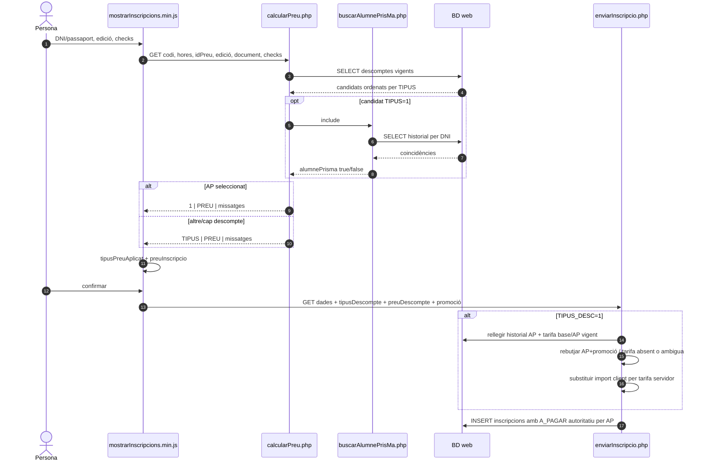
```mermaid
sequenceDiagram
    autonumber
    actor P as Persona
    participant JS as mostrarInscripcions.min.js
    participant CP as calcularPreu.php
    participant AP as buscarAlumnePrisMa.php
    participant DB as BD web
    participant EI as enviarInscripcio.php

    P->>JS: DNI/passaport, edició, checks
    JS->>CP: GET codi, hores, idPreu, edició, document, checks
    CP->>DB: SELECT descomptes vigents
    DB-->>CP: candidats ordenats per TIPUS

    opt candidat TIPUS=1
        CP->>AP: include
        AP->>DB: SELECT historial per DNI
        DB-->>AP: coincidències
        AP-->>CP: alumnePrisma true/false
    end

    alt AP seleccionat
        CP-->>JS: 1 | PREU | missatges
    else altre/cap descompte
        CP-->>JS: TIPUS | PREU | missatges
    end

    JS->>JS: tipusPreuAplicat + preuInscripcio
    P->>JS: confirmar
    JS->>EI: GET dades + tipusDescompte + preuDescompte + promoció
    alt TIPUS_DESC=1
        EI->>DB: rellegir historial AP + tarifa base/AP vigent
        EI->>EI: rebutjar AP+promoció / tarifa absent o ambigua
        EI->>EI: substituir import client per tarifa servidor
    end
    EI->>DB: INSERT inscripcions amb A_PAGAR autoritatiu per AP
```

### 7.1. Mancances ACTUALS d'aquest flux

- Import i tipus candidats arriben des del navegador; **per AP, l'import persistit ja no és autoritatiu del client** perquè `enviarInscripcio.php` rellegeix i conserva la tarifa servidor fins a l'INSERT.
- No hi ha encara una identitat d'oferta SIF persistent entre càlcul i confirmació.
- Peticions AJAX de preu poden quedar en vol simultàniament.
- Una resposta antiga pot sobreescriure globals nous.
- Codis promocionals modifiquen `preuInscripcio` sense garantir que `tipusPreuAplicat` canviï al mateix origen.
- La confirmació no espera explícitament l'últim càlcul comercial.

## 8. Seqüència ACTUAL — denegació d'un altre descompte → Alumne PrisMa

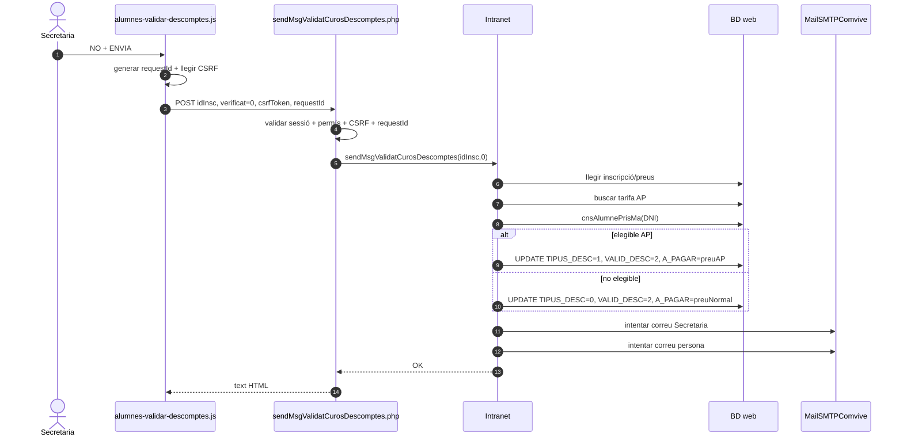
```mermaid
sequenceDiagram
    autonumber
    actor S as Secretaria
    participant JS as alumnes-validar-descomptes.js
    participant EP as sendMsgValidatCurosDescomptes.php
    participant I as Intranet
    participant DB as BD web
    participant Mail as MailSMTPComvive

    S->>JS: NO + ENVIA
    JS->>JS: generar requestId + llegir CSRF
    JS->>EP: POST idInsc, verificat=0, csrfToken, requestId
    EP->>EP: validar sessió + permís + CSRF + requestId
    EP->>I: sendMsgValidatCurosDescomptes(idInsc,0)
    I->>DB: llegir inscripció/preus
    I->>DB: buscar tarifa AP
    I->>DB: cnsAlumnePrisMa(DNI)

    alt elegible AP
        I->>DB: UPDATE TIPUS_DESC=1, VALID_DESC=2, A_PAGAR=preuAP
    else no elegible
        I->>DB: UPDATE TIPUS_DESC=0, VALID_DESC=2, A_PAGAR=preuNormal
    end

    I->>Mail: intentar correu Secretaria
    I->>Mail: intentar correu persona
    I-->>EP: OK
    EP-->>JS: text HTML
```

### 8.1. Interpretació

`VALID_DESC=2` descriu la denegació original, però queda reutilitzat després que la nova oferta AP ja s'ha calculat. Això provoca comportaments diferents en pagament/confirmació.

## 9. Seqüència ACTUAL — canvi de curs

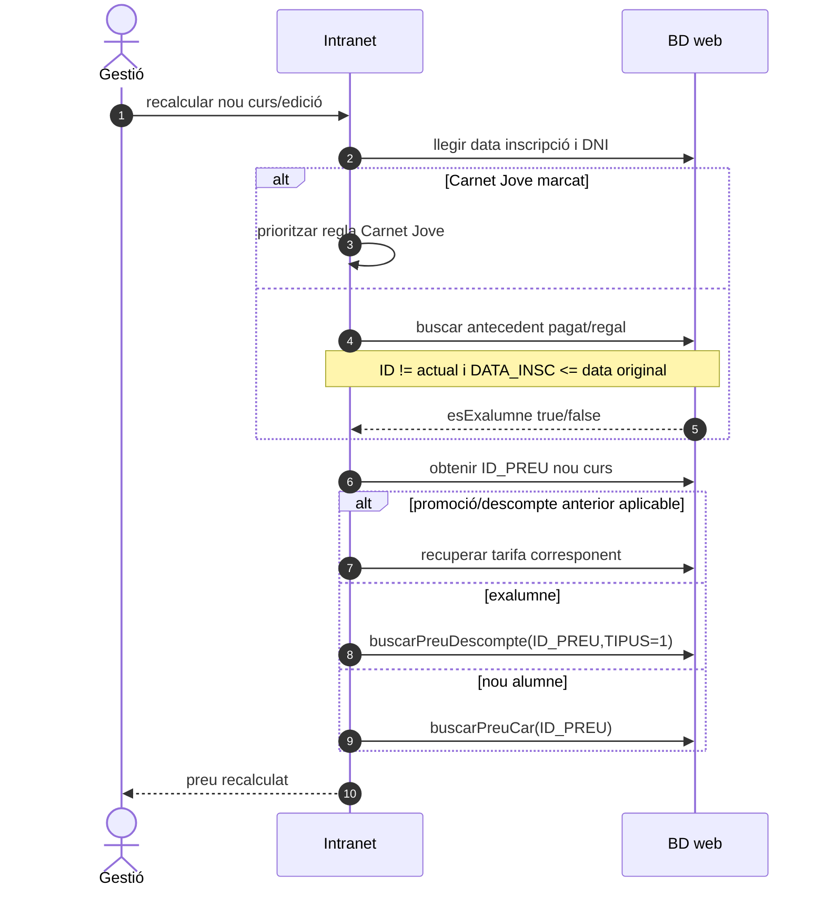
```mermaid
sequenceDiagram
    autonumber
    actor G as Gestió
    participant I as Intranet
    participant DB as BD web

    G->>I: recalcular nou curs/edició
    I->>DB: llegir data inscripció i DNI

    alt Carnet Jove marcat
        I->>I: prioritzar regla Carnet Jove
    else
        I->>DB: buscar antecedent pagat/regal
        Note over I,DB: ID != actual i DATA_INSC <= data original
        DB-->>I: esExalumne true/false
    end

    I->>DB: obtenir ID_PREU nou curs

    alt promoció/descompte anterior aplicable
        I->>DB: recuperar tarifa corresponent
    else exalumne
        I->>DB: buscarPreuDescompte(ID_PREU,TIPUS=1)
    else nou alumne
        I->>DB: buscarPreuCar(ID_PREU)
    end

    I-->>G: preu recalculat
```

## 10. Seqüència FINAL — oferta comercial fins a intenció Redsys

```mermaid
sequenceDiagram
    autonumber
    actor P as Persona
    participant UI as Web/Intranet
    participant Policy as PrismaStudentDiscountPolicy
    participant Offer as CommercialOfferService
    participant CO as commercial_operation
    participant DV as discount_validation
    participant OE as operational_event
    participant Link as PaymentLinkService
    participant PL as payment_link
    participant RI as RedsysPaymentIntentService

    P->>UI: sol·licitar/confirmar oferta
    UI->>Policy: evaluate(subject,product,evaluationAt,currentEnrollment)
    Policy-->>UI: decisió + regla + imports

    Note over UI,Policy: Policy AP v2 IMPLEMENTADA; oferta SIF nativa a totes les superfícies encara PENDENT MIGRACIÓ

    UI->>Offer: createOrReuse(imports,snapshots,discount,actor,correlation)
    Offer->>CO: INSERT o reutilitzar per IDEMPOTENCY_KEY
    Offer->>DV: INSERT validació si existeix bloc discount
    Offer->>OE: append(COMMERCIAL_OFFER_CREATED)
    Offer-->>UI: UUID_OPERATION + UUID_VALIDATION

    alt oferta pagable
        UI->>Link: issue(UUID_OPERATION,expectedAmount,expiry)
        Link->>CO: comprovar operació/import/vigència
        Link->>PL: guardar només TOKEN_HASH
        Link-->>UI: token opac + UUID_PAYMENT_LINK
        P->>UI: obrir/acceptar link
        UI->>Link: resolve(token)
        Link->>PL: validar ACTIVE/expiry
        Link->>CO: validar vigència de l'operació
        Link-->>UI: operació + import esperat

        Note over UI,RI: Checkout AP de targeta IMPLEMENTAT via course-intent; payment_link canònic PENDENT MIGRACIÓ
        UI->>RI: create(CURS,DS_ORDER,expectedAmount,snapshot)
        RI-->>UI: UUID_INTENT
        UI->>CO: linkIntent(UUID_OPERATION,UUID_INTENT,expected)
    else pendent/no disponible
        UI-->>P: estat tipificat sense cobrament
    end
```

**Tall d'implementació vigent:** el checkout AP de targeta ja crea la intenció des del mateix snapshot autoritatiu i enllaça `UUID_OPERATION ↔ UUID_INTENT`. El que continua faltant és fer de `payment_link` l'entrada canònica del canal i reutilitzar la mateixa autorització comercial per transferència i la resta de superfícies.

## 11. Seqüència FINAL — factura posterior

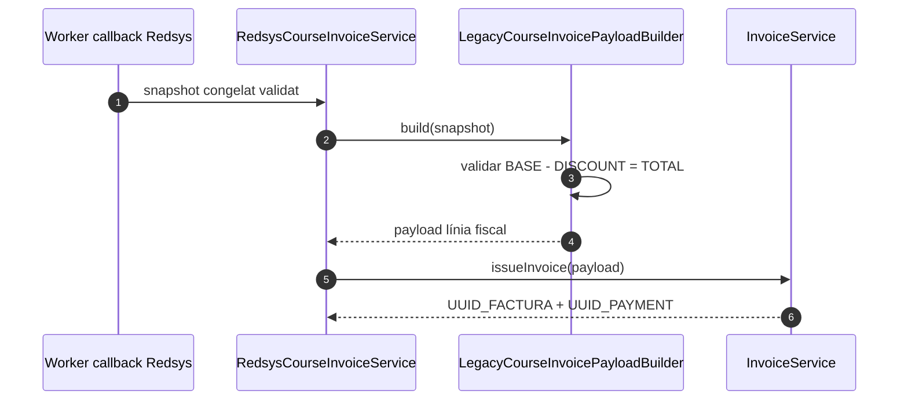
```mermaid
sequenceDiagram
    autonumber
    participant W as Worker callback Redsys
    participant S as RedsysCourseInvoiceService
    participant B as LegacyCourseInvoicePayloadBuilder
    participant I as InvoiceService

    W->>S: snapshot congelat validat
    S->>B: build(snapshot)
    B->>B: validar BASE - DISCOUNT = TOTAL
    B-->>S: payload línia fiscal
    S->>I: issueInvoice(payload)
    I-->>S: UUID_FACTURA + UUID_PAYMENT
```

**Límit:** el builder valida aritmètica i transport de camps; no substitueix la política d'elegibilitat AP.

## 12. Model d'estats FINAL

No reutilitzar un únic `VALID_DESC` per tres conceptes.

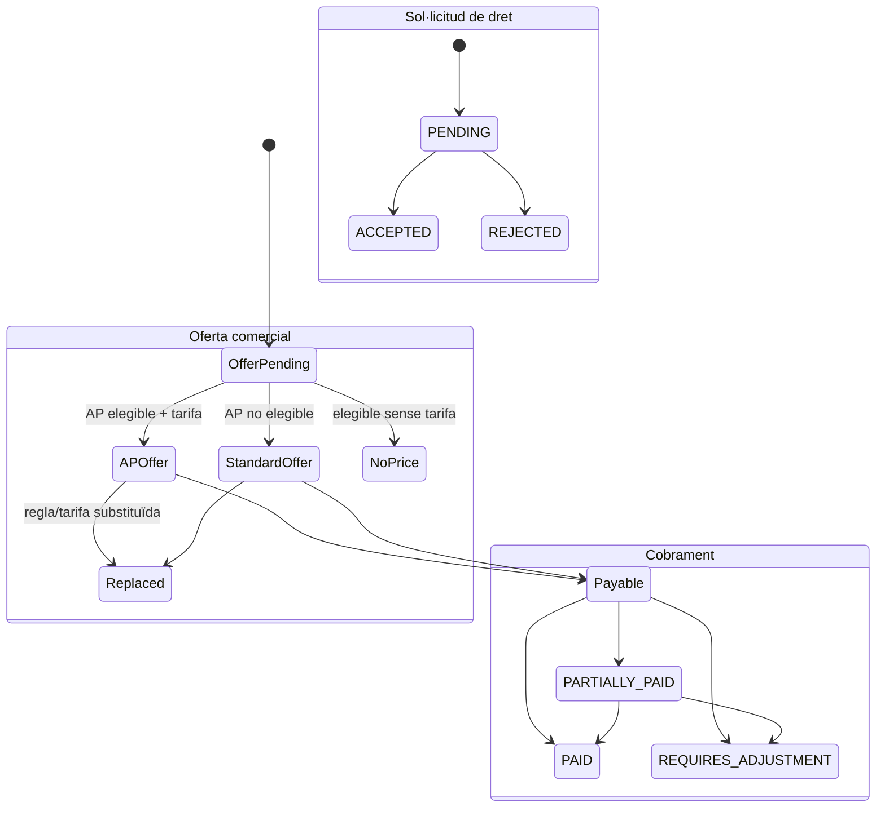
```mermaid
stateDiagram-v2
    [*] --> OfferPending

    state "Sol·licitud de dret" as DiscountState {
        [*] --> PENDING
        PENDING --> ACCEPTED
        PENDING --> REJECTED
    }

    state "Oferta comercial" as OfferState {
        OfferPending --> APOffer: AP elegible + tarifa
        OfferPending --> StandardOffer: AP no elegible
        OfferPending --> NoPrice: elegible sense tarifa
        APOffer --> Payable
        StandardOffer --> Payable
        APOffer --> Replaced: regla/tarifa substituïda
        StandardOffer --> Replaced
    }

    state "Cobrament" as PayState {
        Payable --> PARTIALLY_PAID
        Payable --> PAID
        PARTIALLY_PAID --> PAID
        Payable --> REQUIRES_ADJUSTMENT
        PARTIALLY_PAID --> REQUIRES_ADJUSTMENT
    }
```

Una denegació documental + AP ha de quedar conceptualment com:

- sol·licitud original = `REJECTED`
- oferta actual = `ALUMNE_PRISMA`
- oferta pagable = sí, si no hi ha bloqueig econòmic/fiscal

## 13. Confirmació i pagament actius

Les regles de `.htaccess` actives dirigeixen:

- `/confirmacio/...` → `pagina_confirmacio_inscripcio_automatic.php`
- `/pagament/...` → `pagina_pagament_automatic.php`

Totes dues acaben en `PagamentCursAutomatic`.

### ACTUAL observat

| Estat | Confirmació activa | /pagament/ targeta | /pagament/ transferència |
| --- | --- | --- | --- |
| `VALID_DESC=0` pendent | no ofereix pagament | no | pot mostrar instruccions |
| `VALID_DESC=1` | pagable segons saldo | sí | sí |
| `VALID_DESC=2` + AP alternatiu | no targeta | no | pot mostrar instruccions |

Això justifica separar «estat de la sol·licitud original» d'«oferta actual pagable».

## 14. Traçabilitat DDL → runtime

| Responsabilitat | DDL | Runtime localitzat | Estat UC-20 |
| --- | --- | --- | --- |
| Operació comercial | `commercial_operation` | `CommercialOperationRepository` + `CommercialOfferService` + `PrismaStudentCourseCheckoutService` | IMPLEMENTAT_NUCLI |
| Parts de l'operació | `commercial_operation_party` | `PrismaStudentCourseCheckoutService` | IMPLEMENTAT_UC020 |
| Decisió de descompte | `discount_validation` | `DiscountValidationRepository` + `CommercialOfferService` + `PrismaStudentCourseCheckoutService` | IMPLEMENTAT_NUCLI |
| Link pagament | `payment_link` | `PaymentLinkRepository` + `PaymentLinkService` | IMPLEMENTAT_INFRAESTRUCTURA · NO_INTEGRAT_CANAL_AP |
| Event operatiu | `operational_event` | `OperationalEventRepository` + `PrismaStudentCourseCheckoutService` | IMPLEMENTAT_UC020 per creació d'oferta/intenció |
| Intenció Redsys | `redsys_payment_intent` | repositori + servei | IMPLEMENTAT |
| Snapshot factura curs | factura/línia | builder + servei | IMPLEMENTAT |

`redsys_payment_intent` no conté `UUID_OPERATION`, però `PrismaStudentCourseCheckoutService` enllaça explícitament la relació inversa mitjançant `commercial_operation.UUID_INTENT`; els reintents amb una intenció diferent fallen amb conflicte.

## 15. Concurrència i seguretat

### Web

- múltiples AJAX simultanis;
- `change` + `blur` poden duplicar càlculs;
- sense request/version ID;
- sense oferta servidor immutable;
- confirmació pot començar mentre l'últim càlcul és pendent.

### Intranet

- resolució actual per POST;
- CSRF de sessió validat amb `hash_equals`;
- comprovació explícita de sessió/objectes i permís de `/alumnes/validar-descomptes/`;
- `requestId` amb reutilització de resultat a sessió;
- continua pendent un lock/idempotència persistent de versió sobre la mutació llegada;
- la UI continua interpretant una resposta textual i aquest contracte és candidat a JSON estructurat.

## 16. Decisions de negoci tancades per UC-020 v2

1. `GENERAT=1` **sí** acredita AP per compatibilitat amb el comportament executable.
2. Una factura emesa sense cobrament **no** acredita AP per si sola.
3. La pròpia inscripció **no** pot autoacreditar el dret.
4. En matrícula llegada, l'instant canònic és `DATA_INSC`; l'historial posterior queda exclòs.
5. AP és **no acumulable amb promocions** en aquest tall; AP + promoció falla tancada.
6. El snapshot AP queda congelat mentre la matrícula sigui pagable; la caducitat de `payment_link` és separada.

Qualsevol canvi futur d'aquests criteris requereix una nova `RULE_VERSION`, no una mutació silenciosa de `ALUMNE_PRISMA_WEB_LEGACY_V2`.

## 17. Documents complementaris obligatoris

- [Fitxa funcional UC-020](../06-fitxes-funcionals/uc-020.md)
- [Classes ACTUAL/FINAL](uc-020-classes-actual-final.md)
- [Seqüències ACTUAL/FINAL](uc-020-sequencies-actual-final.md)
- [Activitats per pàgina i apartat ACTUAL/FINAL](uc-020-activitats-pagines-actual-final.md)
- [Auditoria i matriu de traçabilitat](uc-020-auditoria-tracabilitat-2026-09-29.md)
- [Matriu canònica de proves AP-01…AP-84](uc-020-matriu-proves-ap-01-84.md)
- [UC-116 · activitats de justificants compartides](uc-116-activitats-pagines-justificants-actual-final.md)
- [UC-014 · compra curs Redsys](uc-014-comprar-curs-redsys.md)
- [UC-071 · canvi de curs](uc-071-registrar-canvi-curs-complet.md)

## 18. Criteri de tancament

UC-20 no es pot marcar com a COMPLET fins que:

- la política AP canònica estigui ratificada;
- alta, denegació i canvi de curs consumeixin la mateixa política/versionat;
- la decisió es persisteixi a `discount_validation`;
- l'oferta es persisteixi a `commercial_operation`;
- links/intencions derivin de l'oferta servidor i no d'imports del navegador;
- existeixi relació explícita `UUID_OPERATION ↔ UUID_INTENT`;
- pagament/factura consumeixin el mateix snapshot;
- s'executin els tests AP E2E i es conservi evidència.

## 19. Tall executable integrat — 30/09/2026

El model FINAL ja té dues peces complementàries implementades:

- **infraestructura comercial general:** repositoris de `commercial_operation`, `discount_validation`, `payment_link`, `CommercialOfferService` i `PaymentLinkService`;
- **flux específic Alumne PrisMa:** `PrismaStudentDiscountPolicy`, `LegacyPrismaStudentHistoryRepository`, `CourseIntentSnapshotValidator`, `LegacyPrismaStudentPriceSnapshotResolver` i `PrismaStudentCourseCheckoutService`.

La policy és deliberadament una regla de **compatibilitat legacy versionada** (`ALUMNE_PRISMA_WEB_LEGACY_V2`). No converteix les decisions pendents de negoci en decisions tancades.

## 20. Seqüència implementada del nucli UC-020

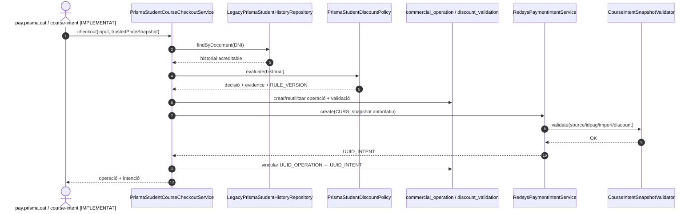
```mermaid
sequenceDiagram
autonumber
actor UI as pay.prisma.cat / course-intent [IMPLEMENTAT]
participant C as PrismaStudentCourseCheckoutService
participant H as LegacyPrismaStudentHistoryRepository
participant P as PrismaStudentDiscountPolicy
participant CO as commercial_operation / discount_validation
participant RI as RedsysPaymentIntentService
participant V as CourseIntentSnapshotValidator

UI->>C: checkout(input, trustedPriceSnapshot)
C->>H: findByDocument(DNI)
H-->>C: historial acreditable
C->>P: evaluate(historial)
P-->>C: decisió + evidence + RULE_VERSION
C->>CO: crear/reutilitzar operació + validació
C->>RI: create(CURS, snapshot autoritatiu)
RI->>V: validate(source/idpag/import/discount)
V-->>RI: OK
RI-->>C: UUID_INTENT
C->>CO: vincular UUID_OPERATION ↔ UUID_INTENT
C-->>UI: operació + intenció
```

**Pendent de tancament:** l'alta/preview web i la resolució intranet encara no comparteixen l'oferta servidor canònica; `payment_link` no governa encara aquest canal; falten decisions de negoci, E2E navegador → Redsys → factura i validació de preproducció. El checkout de targeta actiu sí que invoca aquest nucli via `course-intent`.

## 21. Reconciliació del canal de pagament actiu — 02/10/2026

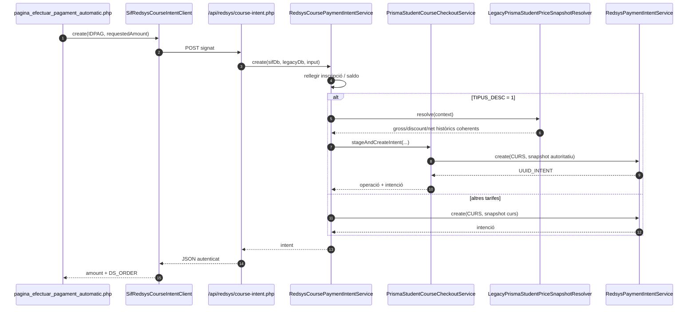
```mermaid
sequenceDiagram
autonumber
participant Pay as pagina_efectuar_pagament_automatic.php
participant Client as SifRedsysCourseIntentClient
participant API as /api/redsys/course-intent.php
participant C as RedsysCoursePaymentIntentService
participant AP as PrismaStudentCourseCheckoutService
participant Price as LegacyPrismaStudentPriceSnapshotResolver
participant Intent as RedsysPaymentIntentService

Pay->>Client: create(IDPAG, requestedAmount)
Client->>API: POST signat
API->>C: create(sifDb, legacyDb, input)
C->>C: rellegir inscripció / saldo
alt TIPUS_DESC = 1
    C->>Price: resolve(context)
    Price-->>C: gross/discount/net històrics coherents
    C->>AP: stageAndCreateIntent(...)
    AP->>Intent: create(CURS, snapshot autoritatiu)
    Intent-->>AP: UUID_INTENT
    AP-->>C: operació + intenció
else altres tarifes
    C->>Intent: create(CURS, snapshot curs)
    Intent-->>C: intenció
end
C-->>API: intent
API-->>Client: JSON autenticat
Client-->>Pay: amount + DS_ORDER
```

La pantalla de pagament utilitza l'import retornat per SIF per construir `DS_MERCHANT_AMOUNT`; per tant el **pagament AP actiu** ja no depèn de l'import POST com a font de veritat. Això no tanca encara el problema anterior d'alta/preview: `enviarInscripcio.php` continua sent un front llegat a migrar cap a una oferta servidor immutable.

## Reconciliació de tancament — 02/10/2026

L'auditoria UC-020 queda **tancada**. El runtime AP de targeta és server-authoritative, l'alta llegada revalida AP abans de persistir, la policy v2 exclou autoacreditació i historial futur, i la resolució d'intranet s'ha reconciliat amb el codi actual POST/CSRF/permís/requestId. `payment_link`, transferència i E2E/preproducció es mantenen com a backlog/gates de migració, no com a preguntes obertes sobre el comportament AP actual.

## 18. Revalidació 03/10/2026

- **UC020-94 — tancat:** eliminat l'overwrite tardà de `preuDescompte` des del navegador després de la revalidació AP; prova de frontera afegida.
- **UC020-95 — compatible amb main:** els canvis nous de Redsys CURS/cutover/callback/worker/factura no reobren la policy AP ni l'autoritat del snapshot; el callback continua consumint la intenció congelada.
- **Cobertura documental:** aquest UML integrat es complementa amb fitxa v1.6, classes, seqüències, activitats P01…P06, traçabilitat i matriu AP-01…AP-84.
- **Pendent de rollout:** E2E real/controlat navegador → Redsys/callback → worker → factura, `payment_link` canònic i transferència sota la mateixa autorització comercial.
