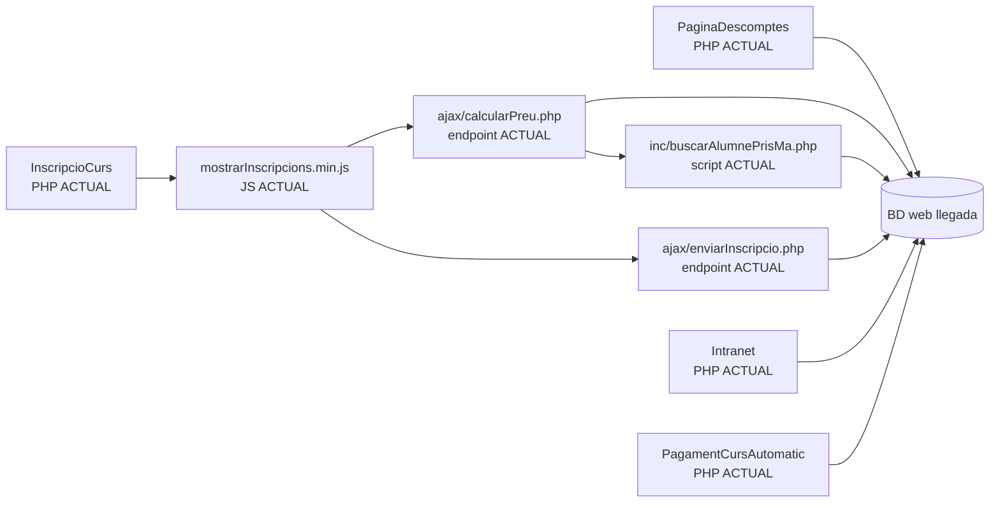
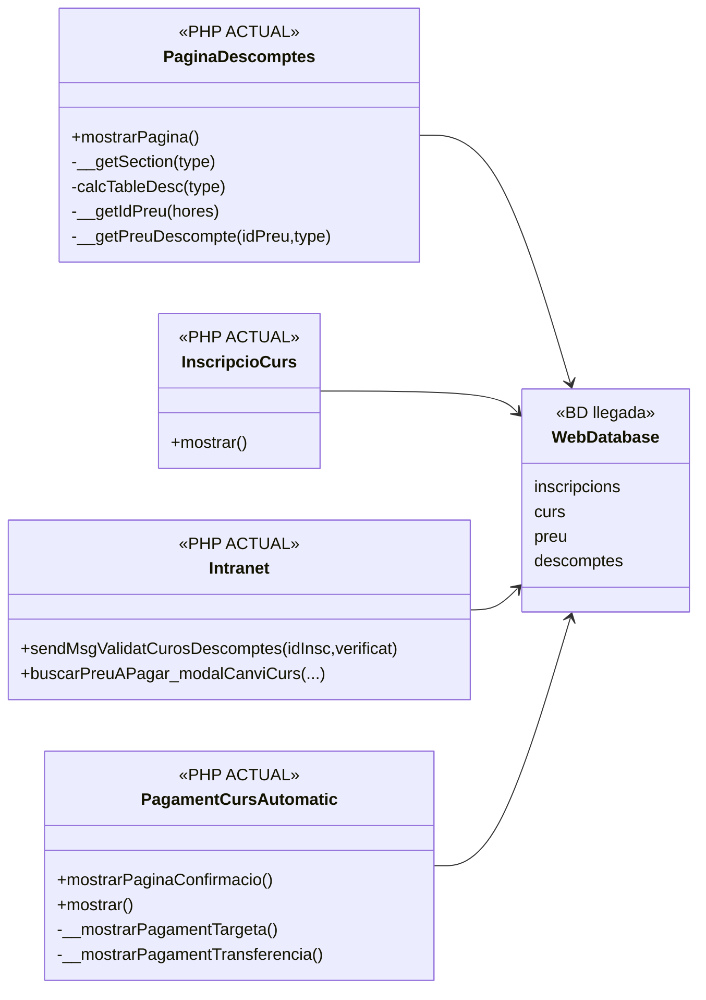
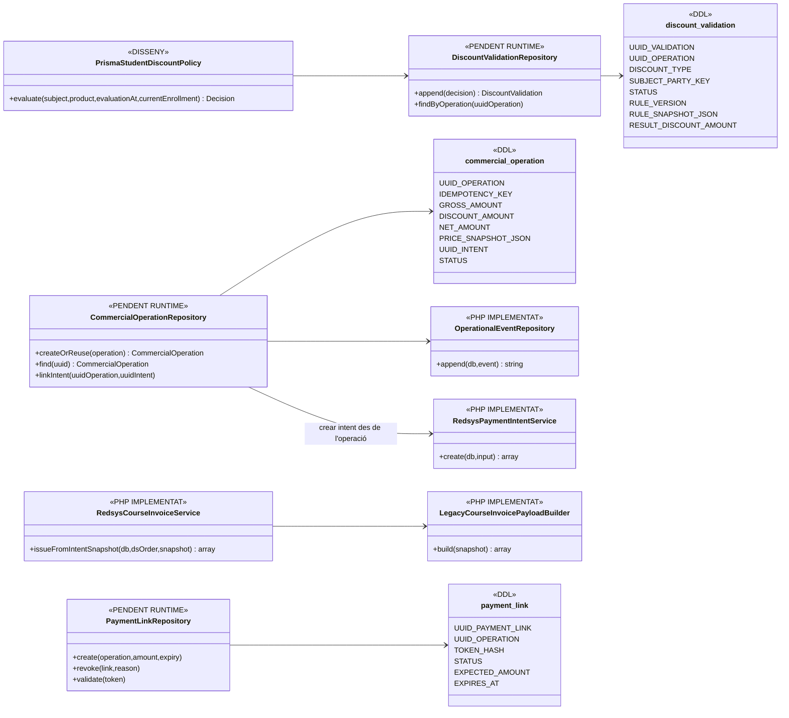
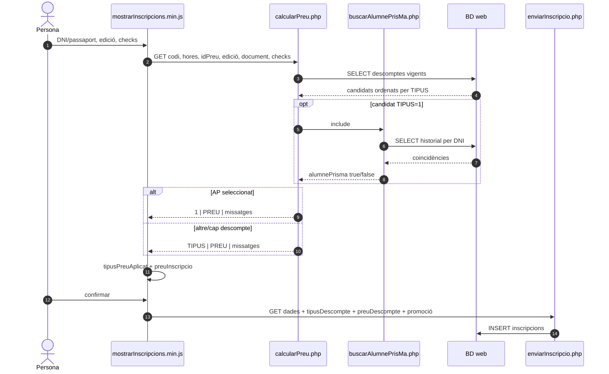
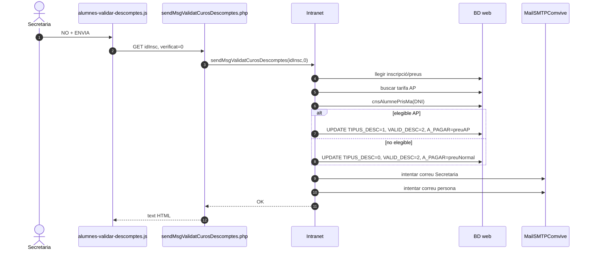
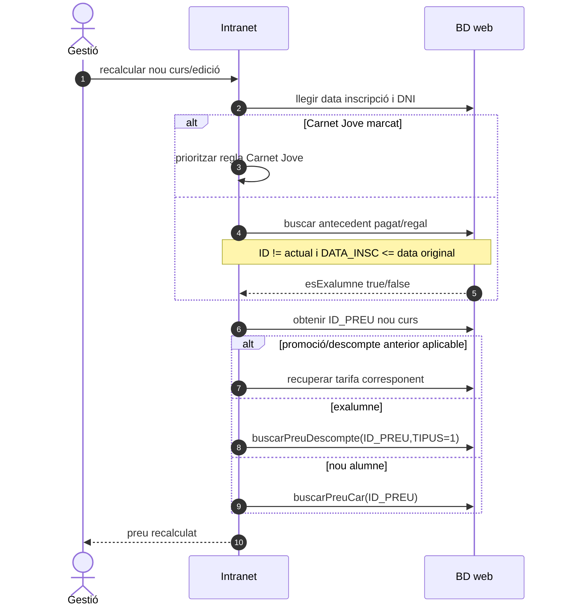
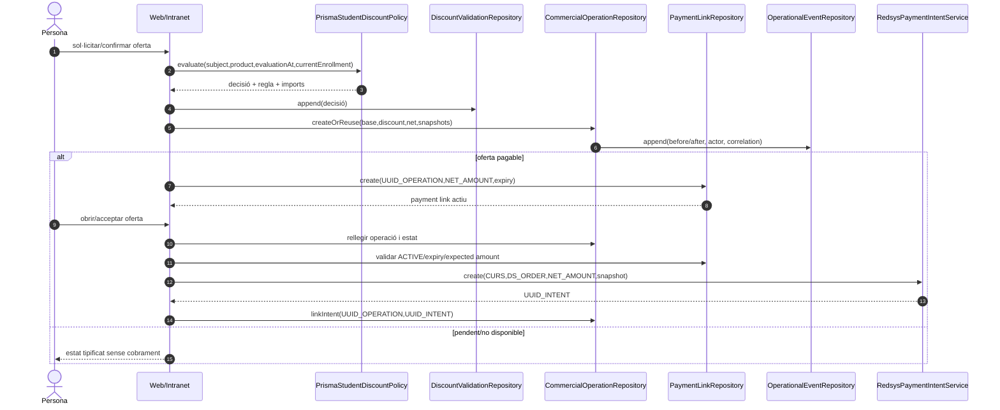
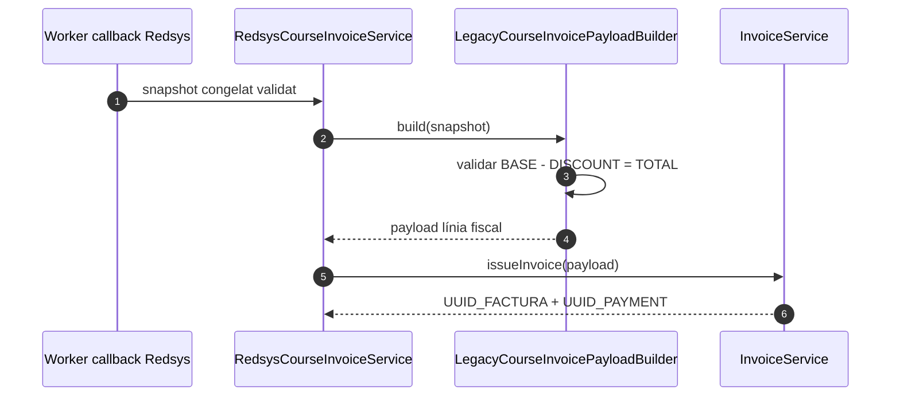
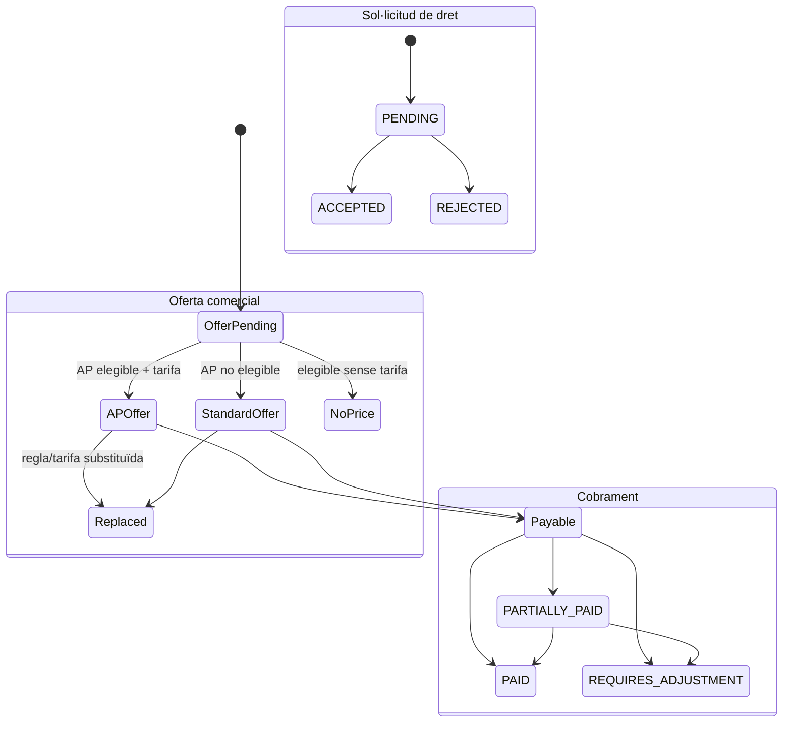

# UC-20 · Aplicar el descompte «Alumne PrisMa» — UML integrat ACTUAL / FINAL

**Revisió específica:** 30/09/2026  
**Estat:** auditoria estàtica completada; implementació FINAL parcial/no integrada.  
**Abast:** elegibilitat, selecció de tarifa, alta web, alternativa després de denegació d'un altre descompte, canvi de curs, confirmació/pagament actiu i transport posterior del snapshot al SIF.  
**No acredita:** desplegament productiu, dades reals, execució de proves o decisions de negoci pendents.

## 0. Llegenda

- **ACTUAL**: component o comportament identificat al codi llegat/SIF actual.
- **IMPLEMENTAT SIF**: classe/taula existent al SIF, però no implica integració UC-20.
- **DDL**: estructura definida per migració, sense servei runtime acreditat.
- **DISSENY / FINAL**: responsabilitat objectiu encara no acreditada en runtime.
- **PENDENT NEGOCI**: regla que el codi actual resol de manera inconsistent i necessita ratificació.

## 1. Resum funcional

UC-20 no és «calcular un percentatge». El codi ACTUAL tracta Alumne PrisMa com una **tarifa final configurada** a `descomptes.PREU` per `TIPUS=1`.

La política llegada no és única:

1. **Web d'inscripció**: historial per DNI amb pagament, curs regal, `GENERAT=1` i una branca de factura relacionada; exclou D/M.
2. **Denegació d'un altre descompte a intranet**: semblant però sense `GENERAT=1` i sense excloure la inscripció actual.
3. **Canvi de curs**: pagament/regal, exclou la mateixa inscripció i limita antecedents a la data de la inscripció original.

El FINAL ha de convertir aquestes variants en una política versionada comuna i persistir la decisió comercial abans del cobrament/factura.

## 2. Decisions compartides ja acordades amb UC-116

- La revisió dels justificants documentals és **manual de Secretaria**.
- Mentre la revisió documental és pendent, **no s'ha d'habilitar el pagament**.
- Si el dret original es denega, **es conserva la mateixa inscripció**.
- Després de la denegació:
  - si la persona és elegible a Alumne PrisMa → nova oferta AP;
  - si no → tarifa ordinària.
- La denegació no genera per si sola un cobrament.
- Una factura ja emesa no es reescriu: qualsevol ajust es classifica en el cas fiscal/econòmic corresponent.

## 3. Cas d'ús — ACTUAL i FINAL

```plantuml
@startuml
left to right direction
actor "Persona" as P
actor "Secretaria" as S
actor "Gestió" as G

rectangle "UC-20 · ACTUAL" {
  usecase "Consultar preu
al formulari" as A1
  usecase "Comprovar historial
per DNI" as A2
  usecase "Registrar TIPUS_DESC,
VALID_DESC i A_PAGAR" as A3
  usecase "Aplicar AP després
d'una denegació" as A4
  usecase "Recalcular AP en
canvi de curs" as A5
}
P --> A1
A1 ..> A2 : include
P --> A3
S --> A4
G --> A5

rectangle "UC-20 · FINAL" {
  usecase "Avaluar política AP
versionada" as F1
  usecase "Persistir decisió
de descompte" as F2
  usecase "Congelar operació
comercial" as F3
  usecase "Habilitar oferta
pagable" as F4
}
P --> F1
S --> F1
G --> F1
F1 ..> F2 : include
F2 ..> F3 : include
F3 ..> F4 : si és pagable
@enduml
```

## 4. Diagrama de components ACTUAL

```mermaid
flowchart LR
    PD[PaginaDescomptes<br/>PHP ACTUAL]
    IC[InscripcioCurs<br/>PHP ACTUAL]
    JS[mostrarInscripcions.min.js<br/>JS ACTUAL]
    CP[ajax/calcularPreu.php<br/>endpoint ACTUAL]
    AP[inc/buscarAlumnePrisMa.php<br/>script ACTUAL]
    EI[ajax/enviarInscripcio.php<br/>endpoint ACTUAL]
    IN[Intranet<br/>PHP ACTUAL]
    PA[PagamentCursAutomatic<br/>PHP ACTUAL]
    DB[(BD web llegada)]

    PD --> DB
    IC --> JS
    JS --> CP
    CP --> AP
    CP --> DB
    AP --> DB
    JS --> EI
    EI --> DB
    IN --> DB
    PA --> DB
```

### 4.1. Responsabilitats ACTUALS

| Peça | Responsabilitat observada |
| --- | --- |
| `PaginaDescomptes` | Text públic i taula orientativa de preus/descomptes. |
| `mostrarInscripcions.min.js` | Estat de formulari, múltiples AJAX, `preuInscripcio`, `tipusPreuAplicat`, promocions i confirmació. |
| `calcularPreu.php` | Selecció de descompte candidat per tarifa/curs/mes/checks. |
| `buscarAlumnePrisMa.php` | Consulta historial AP per DNI al flux web. |
| `enviarInscripcio.php` | Inserció llegada amb `TIPUS_DESC`, `VALID_DESC`, `A_PAGAR`; rep import/tipus del navegador. |
| `Intranet` | Validació manual, alternativa AP després de denegació i càlcul en canvi de curs. |
| `PagamentCursAutomatic` | Confirmació/pagament de les rutes actives; interpreta `VALID_DESC`. |

## 5. Diagrama de classes ACTUAL

Els endpoints/scripts procedimentals no es representen com classes inventades.

```mermaid
classDiagram
direction LR

class PaginaDescomptes {
  <<PHP ACTUAL>>
  +mostrarPagina()
  -__getSection(type)
  -calcTableDesc(type)
  -__getIdPreu(hores)
  -__getPreuDescompte(idPreu,type)
}

class InscripcioCurs {
  <<PHP ACTUAL>>
  +mostrar()
}

class Intranet {
  <<PHP ACTUAL>>
  +sendMsgValidatCurosDescomptes(idInsc,verificat)
  +buscarPreuAPagar_modalCanviCurs(...)
}

class PagamentCursAutomatic {
  <<PHP ACTUAL>>
  +mostrarPaginaConfirmacio()
  +mostrar()
  -__mostrarPagamentTargeta()
  -__mostrarPagamentTransferencia()
}

class WebDatabase {
  <<BD llegada>>
  inscripcions
  curs
  preu
  descomptes
}

PaginaDescomptes --> WebDatabase
InscripcioCurs --> WebDatabase
Intranet --> WebDatabase
PagamentCursAutomatic --> WebDatabase
```

## 6. Diagrama de classes FINAL / SIF

```mermaid
classDiagram
direction LR

class PrismaStudentDiscountPolicy {
  <<DISSENY>>
  +evaluate(subject,product,evaluationAt,currentEnrollment) Decision
}

class CommercialOperationRepository {
  <<PENDENT RUNTIME>>
  +createOrReuse(operation) CommercialOperation
  +find(uuid) CommercialOperation
  +linkIntent(uuidOperation,uuidIntent)
}

class DiscountValidationRepository {
  <<PENDENT RUNTIME>>
  +append(decision) DiscountValidation
  +findByOperation(uuidOperation)
}

class PaymentLinkRepository {
  <<PENDENT RUNTIME>>
  +create(operation,amount,expiry)
  +revoke(link,reason)
  +validate(token)
}

class OperationalEventRepository {
  <<PHP IMPLEMENTAT>>
  +append(db,event) string
}

class RedsysPaymentIntentService {
  <<PHP IMPLEMENTAT>>
  +create(db,input) array
}

class RedsysCourseInvoiceService {
  <<PHP IMPLEMENTAT>>
  +issueFromIntentSnapshot(db,dsOrder,snapshot) array
}

class LegacyCourseInvoicePayloadBuilder {
  <<PHP IMPLEMENTAT>>
  +build(snapshot) array
}

class commercial_operation {
  <<DDL>>
  UUID_OPERATION
  IDEMPOTENCY_KEY
  GROSS_AMOUNT
  DISCOUNT_AMOUNT
  NET_AMOUNT
  PRICE_SNAPSHOT_JSON
  UUID_INTENT
  STATUS
}

class discount_validation {
  <<DDL>>
  UUID_VALIDATION
  UUID_OPERATION
  DISCOUNT_TYPE
  SUBJECT_PARTY_KEY
  STATUS
  RULE_VERSION
  RULE_SNAPSHOT_JSON
  RESULT_DISCOUNT_AMOUNT
}

class payment_link {
  <<DDL>>
  UUID_PAYMENT_LINK
  UUID_OPERATION
  TOKEN_HASH
  STATUS
  EXPECTED_AMOUNT
  EXPIRES_AT
}

PrismaStudentDiscountPolicy --> DiscountValidationRepository
DiscountValidationRepository --> discount_validation
CommercialOperationRepository --> commercial_operation
PaymentLinkRepository --> payment_link
CommercialOperationRepository --> OperationalEventRepository
CommercialOperationRepository --> RedsysPaymentIntentService : crear intent des de l'operació
RedsysCourseInvoiceService --> LegacyCourseInvoicePayloadBuilder
```

**Important:** no s'ha identificat una implementació runtime de `CommercialOperationRepository`, `DiscountValidationRepository` ni `PaymentLinkRepository`. Les taules existeixen al DDL, però no s'han de marcar com a servei implementat.

## 7. Seqüència ACTUAL — web d'inscripció

```mermaid
sequenceDiagram
    autonumber
    actor P as Persona
    participant JS as mostrarInscripcions.min.js
    participant CP as calcularPreu.php
    participant AP as buscarAlumnePrisMa.php
    participant DB as BD web
    participant EI as enviarInscripcio.php

    P->>JS: DNI/passaport, edició, checks
    JS->>CP: GET codi, hores, idPreu, edició, document, checks
    CP->>DB: SELECT descomptes vigents
    DB-->>CP: candidats ordenats per TIPUS

    opt candidat TIPUS=1
        CP->>AP: include
        AP->>DB: SELECT historial per DNI
        DB-->>AP: coincidències
        AP-->>CP: alumnePrisma true/false
    end

    alt AP seleccionat
        CP-->>JS: 1 | PREU | missatges
    else altre/cap descompte
        CP-->>JS: TIPUS | PREU | missatges
    end

    JS->>JS: tipusPreuAplicat + preuInscripcio
    P->>JS: confirmar
    JS->>EI: GET dades + tipusDescompte + preuDescompte + promoció
    EI->>DB: INSERT inscripcions
```

### 7.1. Mancances ACTUALS d'aquest flux

- Import i tipus final arriben des del navegador.
- No hi ha una identitat d'oferta persistent entre càlcul i confirmació.
- Peticions AJAX de preu poden quedar en vol simultàniament.
- Una resposta antiga pot sobreescriure globals nous.
- Codis promocionals modifiquen `preuInscripcio` sense garantir que `tipusPreuAplicat` canviï al mateix origen.
- La confirmació no espera explícitament l'últim càlcul comercial.

## 8. Seqüència ACTUAL — denegació d'un altre descompte → Alumne PrisMa

```mermaid
sequenceDiagram
    autonumber
    actor S as Secretaria
    participant JS as alumnes-validar-descomptes.js
    participant EP as sendMsgValidatCurosDescomptes.php
    participant I as Intranet
    participant DB as BD web
    participant Mail as MailSMTPComvive

    S->>JS: NO + ENVIA
    JS->>EP: GET idInsc, verificat=0
    EP->>I: sendMsgValidatCurosDescomptes(idInsc,0)
    I->>DB: llegir inscripció/preus
    I->>DB: buscar tarifa AP
    I->>DB: cnsAlumnePrisMa(DNI)

    alt elegible AP
        I->>DB: UPDATE TIPUS_DESC=1, VALID_DESC=2, A_PAGAR=preuAP
    else no elegible
        I->>DB: UPDATE TIPUS_DESC=0, VALID_DESC=2, A_PAGAR=preuNormal
    end

    I->>Mail: intentar correu Secretaria
    I->>Mail: intentar correu persona
    I-->>EP: OK
    EP-->>JS: text HTML
```

### 8.1. Interpretació

`VALID_DESC=2` descriu la denegació original, però queda reutilitzat després que la nova oferta AP ja s'ha calculat. Això provoca comportaments diferents en pagament/confirmació.

## 9. Seqüència ACTUAL — canvi de curs

```mermaid
sequenceDiagram
    autonumber
    actor G as Gestió
    participant I as Intranet
    participant DB as BD web

    G->>I: recalcular nou curs/edició
    I->>DB: llegir data inscripció i DNI

    alt Carnet Jove marcat
        I->>I: prioritzar regla Carnet Jove
    else
        I->>DB: buscar antecedent pagat/regal
        Note over I,DB: ID != actual i DATA_INSC <= data original
        DB-->>I: esExalumne true/false
    end

    I->>DB: obtenir ID_PREU nou curs

    alt promoció/descompte anterior aplicable
        I->>DB: recuperar tarifa corresponent
    else exalumne
        I->>DB: buscarPreuDescompte(ID_PREU,TIPUS=1)
    else nou alumne
        I->>DB: buscarPreuCar(ID_PREU)
    end

    I-->>G: preu recalculat
```

## 10. Seqüència FINAL — oferta comercial fins a intenció Redsys

```mermaid
sequenceDiagram
    autonumber
    actor P as Persona
    participant UI as Web/Intranet
    participant Policy as PrismaStudentDiscountPolicy
    participant DV as DiscountValidationRepository
    participant CO as CommercialOperationRepository
    participant PL as PaymentLinkRepository
    participant OE as OperationalEventRepository
    participant RI as RedsysPaymentIntentService

    P->>UI: sol·licitar/confirmar oferta
    UI->>Policy: evaluate(subject,product,evaluationAt,currentEnrollment)
    Policy-->>UI: decisió + regla + imports

    UI->>DV: append(decisió)
    UI->>CO: createOrReuse(base,discount,net,snapshots)
    CO->>OE: append(before/after, actor, correlation)

    alt oferta pagable
        UI->>PL: create(UUID_OPERATION,NET_AMOUNT,expiry)
        PL-->>UI: payment link actiu
        P->>UI: obrir/acceptar oferta
        UI->>CO: rellegir operació i estat
        UI->>PL: validar ACTIVE/expiry/expected amount
        UI->>RI: create(CURS,DS_ORDER,NET_AMOUNT,snapshot)
        RI-->>UI: UUID_INTENT
        UI->>CO: linkIntent(UUID_OPERATION,UUID_INTENT)
    else pendent/no disponible
        UI-->>P: estat tipificat sense cobrament
    end
```

## 11. Seqüència FINAL — factura posterior

```mermaid
sequenceDiagram
    autonumber
    participant W as Worker callback Redsys
    participant S as RedsysCourseInvoiceService
    participant B as LegacyCourseInvoicePayloadBuilder
    participant I as InvoiceService

    W->>S: snapshot congelat validat
    S->>B: build(snapshot)
    B->>B: validar BASE - DISCOUNT = TOTAL
    B-->>S: payload línia fiscal
    S->>I: issueInvoice(payload)
    I-->>S: UUID_FACTURA + UUID_PAYMENT
```

**Límit:** el builder valida aritmètica i transport de camps; no substitueix la política d'elegibilitat AP.

## 12. Model d'estats FINAL

No reutilitzar un únic `VALID_DESC` per tres conceptes.

```mermaid
stateDiagram-v2
    [*] --> OfferPending

    state "Sol·licitud de dret" as DiscountState {
        [*] --> PENDING
        PENDING --> ACCEPTED
        PENDING --> REJECTED
    }

    state "Oferta comercial" as OfferState {
        OfferPending --> APOffer: AP elegible + tarifa
        OfferPending --> StandardOffer: AP no elegible
        OfferPending --> NoPrice: elegible sense tarifa
        APOffer --> Payable
        StandardOffer --> Payable
        APOffer --> Replaced: regla/tarifa substituïda
        StandardOffer --> Replaced
    }

    state "Cobrament" as PayState {
        Payable --> PARTIALLY_PAID
        Payable --> PAID
        PARTIALLY_PAID --> PAID
        Payable --> REQUIRES_ADJUSTMENT
        PARTIALLY_PAID --> REQUIRES_ADJUSTMENT
    }
```

Una denegació documental + AP ha de quedar conceptualment com:

- sol·licitud original = `REJECTED`
- oferta actual = `ALUMNE_PRISMA`
- oferta pagable = sí, si no hi ha bloqueig econòmic/fiscal

## 13. Confirmació i pagament actius

Les regles de `.htaccess` actives dirigeixen:

- `/confirmacio/...` → `pagina_confirmacio_inscripcio_automatic.php`
- `/pagament/...` → `pagina_pagament_automatic.php`

Totes dues acaben en `PagamentCursAutomatic`.

### ACTUAL observat

| Estat | Confirmació activa | /pagament/ targeta | /pagament/ transferència |
| --- | --- | --- | --- |
| `VALID_DESC=0` pendent | no ofereix pagament | no | pot mostrar instruccions |
| `VALID_DESC=1` | pagable segons saldo | sí | sí |
| `VALID_DESC=2` + AP alternatiu | no targeta | no | pot mostrar instruccions |

Això justifica separar «estat de la sol·licitud original» d'«oferta actual pagable».

## 14. Traçabilitat DDL → runtime

| Responsabilitat | DDL | Runtime localitzat | Estat UC-20 |
| --- | --- | --- | --- |
| Operació comercial | `commercial_operation` | `PrismaStudentCourseCheckoutService` | IMPLEMENTAT UC-020 |
| Parts de l'operació | `commercial_operation_party` | `PrismaStudentCourseCheckoutService` | IMPLEMENTAT UC-020 |
| Decisió de descompte | `discount_validation` | `PrismaStudentCourseCheckoutService` | IMPLEMENTAT UC-020 |
| Link pagament | `payment_link` | No | PENDENT |
| Event operatiu | `operational_event` | `OperationalEventRepository` | IMPLEMENTAT, integració UC-20 pendent |
| Intenció Redsys | `redsys_payment_intent` | repositori + servei | IMPLEMENTAT |
| Snapshot factura curs | factura/línia | builder + servei | IMPLEMENTAT |

`redsys_payment_intent` no conté `UUID_OPERATION`. `commercial_operation.UUID_INTENT` existeix al DDL, però no s'ha identificat el codi que en faci l'enllaç.

## 15. Concurrència i seguretat

### Web

- múltiples AJAX simultanis;
- `change` + `blur` poden duplicar càlculs;
- sense request/version ID;
- sense oferta servidor immutable;
- confirmació pot començar mentre l'últim càlcul és pendent.

### Intranet

- resolució per GET amb efectes;
- no s'ha localitzat CSRF explícit;
- endpoint no reexecuta `comprovarSessio.php`;
- no s'ha localitzat permís específic de comanda;
- no hi ha clau idempotent ni versió esperada;
- UI considera èxit l'absència de la paraula «error».

## 16. Decisions pendents de negoci

1. `GENERAT=1` acredita AP?
2. Una factura emesa sense cobrament acredita AP?
3. La pròpia inscripció pot acreditar el dret?
4. Quin instant d'avaluació és canònic?
5. Quina compatibilitat/prioritat té AP amb promocions i altres descomptes?
6. Quant dura una oferta AP abans de ser revalidada?

## 17. Documents complementaris obligatoris

- [Fitxa funcional UC-020](../06-fitxes-funcionals/uc-020.md)
- [Classes ACTUAL/FINAL](uc-020-classes-actual-final.md)
- [Seqüències ACTUAL/FINAL](uc-020-sequencies-actual-final.md)
- [Activitats per pàgina i apartat ACTUAL/FINAL](uc-020-activitats-pagines-actual-final.md)
- [Auditoria i matriu de traçabilitat](uc-020-auditoria-tracabilitat-2026-09-29.md)
- [UC-116 · activitats de justificants compartides](uc-116-activitats-pagines-justificants-actual-final.md)
- [UC-014 · compra curs Redsys](uc-014-comprar-curs-redsys.md)
- [UC-071 · canvi de curs](uc-071-registrar-canvi-curs-complet.md)

## 18. Criteri de tancament

UC-20 no es pot marcar com a COMPLET fins que:

- la política AP canònica estigui ratificada;
- alta, denegació i canvi de curs consumeixin la mateixa política/versionat;
- la decisió es persisteixi a `discount_validation`;
- l'oferta es persisteixi a `commercial_operation`;
- links/intencions derivin de l'oferta servidor i no d'imports del navegador;
- existeixi relació explícita `UUID_OPERATION ↔ UUID_INTENT`;
- pagament/factura consumeixin el mateix snapshot;
- s'executin els tests AP E2E i es conservi evidència.

## 19. Tall d'implementació — 30/09/2026

A la branca d'auditoria UC-020 s'han afegit peces executables sense declarar tancades les decisions de negoci pendents:

- `PrismaStudentDiscountPolicy`: política de **compatibilitat legacy versionada** `ALUMNE_PRISMA_LEGACY_V1`; conserva la inscripció-evidència i corregeix semànticament el cas de factura relacionada no nul·la sense afirmar que aquest criteri sigui la política futura.
- `LegacyPrismaStudentHistoryRepository`: lectura de fets d'historial per document, separada de la decisió.
- `CourseIntentSnapshotValidator`: valida el contracte `CURS` abans de crear una intenció Redsys.
- `RedsysPaymentIntentService`: invoca el validador de `CURS` i rebutja incoherències de source, IDPAG, import o snapshot de descompte.
- tests unitaris de la policy i tests d'integració de la intenció CURS/Alumne PrisMa.

Continuen **PENDENTS** l'orquestrador del checkout, els writers runtime de `discount_validation`/`commercial_operation`, el vincle `UUID_OPERATION ↔ UUID_INTENT` i la substitució completa del flux que confia en imports del navegador.

## 20. Orquestrador server-side UC-020

S'ha afegit `PrismaStudentCourseCheckoutService`, que executa en servidor el tall comercial pre-TPV:

1. rellegeix la matrícula real;
2. consulta historial per DNI amb `LegacyPrismaStudentHistoryRepository`;
3. avalua `PrismaStudentDiscountPolicy`;
4. valida que el snapshot de preu autoritatiu coincideixi amb `A_PAGAR`;
5. crea/reutilitza `commercial_operation`;
6. crea/reutilitza `discount_validation`;
7. construeix el snapshot CURS amb `origin=ALUMNE_PRISMA`;
8. crea/reutilitza `redsys_payment_intent`;
9. vincula `commercial_operation.UUID_INTENT`.

El servei **sobreescriu** `source_type`, `source_id`, `idpag`, `expected_amount`, moneda i snapshot de qualsevol request externa. Per tant, els imports/tipus del navegador no poden esdevenir autoritatius dins d'aquest tall.

També bloqueja que una operació ja vinculada a un `UUID_INTENT` sigui reassociada silenciosament a un DS_ORDER diferent.

Continua pendent integrar aquest servei amb l'endpoint/pàgina legacy real de checkout i eliminar el camí antic basat en `preuCar/preuDescompte/tipusDescompte`.
