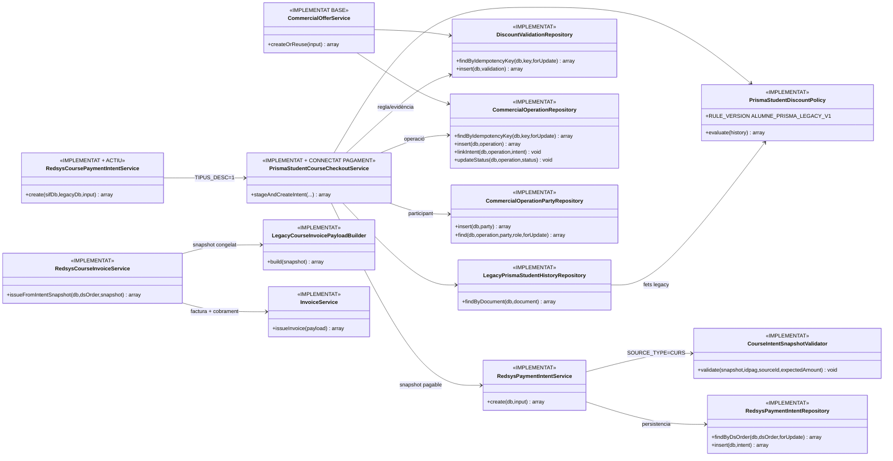

# UC-020 — Diagrames de classes ACTUAL i FINAL

**Data d'auditoria:** 30/09/2026 · reconciliació runtime 02/10/2026  
**Abast:** aplicació del descompte «Alumne PrisMa» en alta web, preparació de pagament i futura facturació SIF.  
**Regla d'evidència:** ACTUAL = executable llegat inspeccionat. FINAL = codi existent a `main`/branca de reconciliació quan s'indica `IMPLEMENTAT`; `PENDENT` quan encara falta integració runtime.

## 1. Classes/components ACTUALS

### Riscos ACTUALS

- el navegador manté import i tipus de descompte com a globals;
- la confirmació envia aquests imports al backend;
- la consulta antiga conté la branca SQL `FACTURA_RELACIONADA != NULL`;
- la consulta redueix l'evidència a un booleà i perd la inscripció que acredita el dret;
- preview i confirmació no comparteixen una oferta servidor immutable.

## 2. Classes FINAL — estat runtime reconciliat

## 3. Responsabilitats

| Component | Responsabilitat | Estat |
| --- | --- | --- |
| `LegacyPrismaStudentHistoryRepository` | Recuperar fets d'historial sense decidir la política | IMPLEMENTAT |
| `PrismaStudentDiscountPolicy` | Reproduir explícitament la regla web legacy sota versió `ALUMNE_PRISMA_LEGACY_V1` | IMPLEMENTAT |
| `CommercialOfferService` | Servei genèric d'oferta comercial per altres canals/casos | IMPLEMENTAT BASE |
| `DiscountValidationRepository` | Persistència idempotent de regla/evidència | IMPLEMENTAT |
| `CommercialOperationRepository` | Persistència i vincle d'intent de l'operació | IMPLEMENTAT |
| `CommercialOperationPartyRepository` | Persistència del participant de l'operació | IMPLEMENTAT EN AQUESTA RECONCILIACIÓ |
| `PrismaStudentCourseCheckoutService` | Orquestració AP atòmica fins intenció | IMPLEMENTAT I CONNECTAT AL PAGAMENT CURS |
| `RedsysCoursePaymentIntentService` | Entrada autoritativa del checkout de curs | IMPLEMENTAT I ACTIU |
| `CourseIntentSnapshotValidator` | Blindar coherència CURS abans del TPV | IMPLEMENTAT |
| `RedsysPaymentIntentService` | Crear/reutilitzar intenció | IMPLEMENTAT |
| `LegacyCourseInvoicePayloadBuilder` | Transformar snapshot en payload fiscal | IMPLEMENTAT |

## 4. Límits de la policy legacy

La policy implementada **no declara resoltes** les decisions de negoci sobre pagament parcial, `GENERAT=1`, factura abans de cobrar o autoacreditació de la mateixa inscripció. Les reprodueix sota una versió explícita de compatibilitat. Quan negoci ratifiqui una regla diferent s'ha de publicar una nova `RULE_VERSION`.

## 5. Traçabilitat

- [Fitxa UC-020](../06-fitxes-funcionals/uc-020.md)
- [UML integrat](uc-020-aplicar-alumne-prisma.md)
- [Seqüències ACTUAL/FINAL](uc-020-sequencies-actual-final.md)
- [Activitats ACTUAL/FINAL](uc-020-activitats-pagines-actual-final.md)
- [Auditoria i traçabilitat](uc-020-auditoria-tracabilitat-2026-09-29.md)
