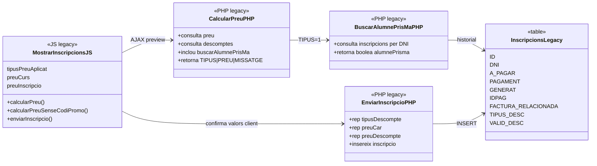

# UC-020 — Diagrames de classes ACTUAL i FINAL

**Data d'auditoria:** 30/09/2026  
**Abast:** aplicació del descompte «Alumne PrisMa» en alta web, preparació de pagament i futura facturació SIF.  
**Regla d'evidència:** ACTUAL = executable llegat inspeccionat. FINAL = codi existent a la branca quan s'indica `IMPLEMENTAT`; `PENDENT` quan encara falta integració runtime.

## 1. Classes/components ACTUALS

### Riscos ACTUALS

- el navegador manté import i tipus de descompte com a globals;
- la confirmació envia aquests imports al backend;
- la consulta antiga conté la branca SQL `FACTURA_RELACIONADA != NULL`;
- la consulta redueix l'evidència a un booleà i perd la inscripció que acredita el dret;
- preview i confirmació no comparteixen una oferta servidor immutable.

## 2. Classes FINAL — estat integrat al `main`

```mermaid
classDiagram
direction LR

class PrismaStudentDiscountPolicy {
  <<IMPLEMENTAT>>
  +RULE_VERSION ALUMNE_PRISMA_WEB_LEGACY_V2
  +evaluate(history) array
}

class LegacyPrismaStudentHistoryRepository {
  <<IMPLEMENTAT>>
  +findByDocument(db,document) array
}

class DiscountDecisionService {
  <<PENDENT TRANSVERSAL>>
  +evaluate(type,context) DiscountDecision
}

class DiscountValidationRepository {
  <<IMPLEMENTAT>>
  +append(decision) uuid
}

class CommercialOperationRepository {
  <<IMPLEMENTAT>>
  +stage(operation) uuid
  +attachIntent(operation,intent)
}

class CourseIntentSnapshotValidator {
  <<IMPLEMENTAT>>
  +validate(snapshot,idpag,sourceId,expectedAmount) void
}

class RedsysPaymentIntentService {
  <<IMPLEMENTAT>>
  +create(db,input) array
}

class RedsysPaymentIntentRepository {
  <<IMPLEMENTAT>>
  +findByDsOrder(db,dsOrder,forUpdate) array
  +insert(db,intent) array
}

class RedsysCourseInvoiceService {
  <<IMPLEMENTAT>>
  +issueFromIntentSnapshot(db,dsOrder,snapshot) array
}

class LegacyCourseInvoicePayloadBuilder {
  <<IMPLEMENTAT>>
  +build(snapshot) array
}

class InvoiceService {
  <<IMPLEMENTAT>>
  +issueInvoice(payload) array
}

LegacyPrismaStudentHistoryRepository --> PrismaStudentDiscountPolicy : fets legacy
PrismaStudentDiscountPolicy --> DiscountDecisionService : decisio normalitzada
DiscountDecisionService --> DiscountValidationRepository : regla/evidencia
DiscountDecisionService --> CommercialOperationRepository : oferta comercial
CommercialOperationRepository --> RedsysPaymentIntentService : snapshot pagable
RedsysPaymentIntentService --> CourseIntentSnapshotValidator : SOURCE_TYPE=CURS
RedsysPaymentIntentService --> RedsysPaymentIntentRepository : persistencia
RedsysCourseInvoiceService --> LegacyCourseInvoicePayloadBuilder : snapshot congelat
RedsysCourseInvoiceService --> InvoiceService : factura + cobrament
```

## 3. Responsabilitats

| Component | Responsabilitat | Estat |
| --- | --- | --- |
| `LegacyPrismaStudentHistoryRepository` | Recuperar fets d'historial sense decidir la política | IMPLEMENTAT |
| `PrismaStudentDiscountPolicy` | Reproduir explícitament la regla web legacy sota versió `ALUMNE_PRISMA_WEB_LEGACY_V2` | IMPLEMENTAT |
| `DiscountDecisionService` | Motor comú transversal per UC-020/020a/020b/020c/020d | PENDENT TRANSVERSAL; UC-020 ja usa `PrismaStudentDiscountPolicy` |
| `discount_validation` | Persistència de regla/evidència | IMPLEMENTAT via `DiscountValidationRepository` / `CommercialOfferService` / checkout AP |
| `commercial_operation` | Oferta comercial immutable | IMPLEMENTAT via `CommercialOperationRepository` / `CommercialOfferService` / checkout AP |
| `CourseIntentSnapshotValidator` | Blindar coherència CURS abans del TPV | IMPLEMENTAT |
| `RedsysPaymentIntentService` | Crear/reutilitzar intenció | IMPLEMENTAT |
| `LegacyCourseInvoicePayloadBuilder` | Transformar snapshot en payload fiscal | IMPLEMENTAT |

## 4. Límits de la policy legacy

La policy implementada **no declara resoltes** les decisions de negoci sobre pagament parcial, `GENERAT=1`, factura abans de cobrar o autoacreditació de la mateixa inscripció. Les reprodueix sota una versió explícita de compatibilitat. Quan negoci ratifiqui una regla diferent s'ha de publicar una nova `RULE_VERSION`.

## 5. Traçabilitat

- [Fitxa UC-020](../06-fitxes-funcionals/uc-020.md)
- [UML integrat](uc-020-aplicar-alumne-prisma.md)
- [Seqüències ACTUAL/FINAL](uc-020-sequencies-actual-final.md)
- [Activitats ACTUAL/FINAL](uc-020-activitats-pagines-actual-final.md)
- [Auditoria i traçabilitat](uc-020-auditoria-tracabilitat-2026-09-29.md)

## 6. Reconciliació 02/10/2026

- `PrismaStudentCourseCheckoutService` ja no es considera només disseny/nucli: forma part del pagament AP actiu via `course-intent`.
- Aquesta revisió fa que l'orquestrador reutilitzi `CommercialOperationRepository` i `DiscountValidationRepository` dins de la seva transacció.
- `DiscountDecisionService` continua sent una abstracció transversal possible; no bloqueja UC-020 perquè la policy específica ja existeix i està versionada.
- `PaymentLinkService` és infraestructura implementada però encara no és la ruta canònica del pagament AP actiu.

## 11. Reconciliació final de classes — 02/10/2026

- `CommercialOperationPartyRepository` torna a formar part del checkout UC-020.
- `CommercialOperationRepository` concentra també l'actualització d'estat.
- `RedsysPaymentIntentRepository` resol intencions per UUID per validar reintents.
- `LegacyPrismaStudentHistoryRepository` aplica exclusió de matrícula actual i tall temporal.
- `PrismaStudentCourseCheckoutService` conserva `OperationalEventRepository` de #112 i elimina SQL directe que ja havia estat encapsulat a #110.
